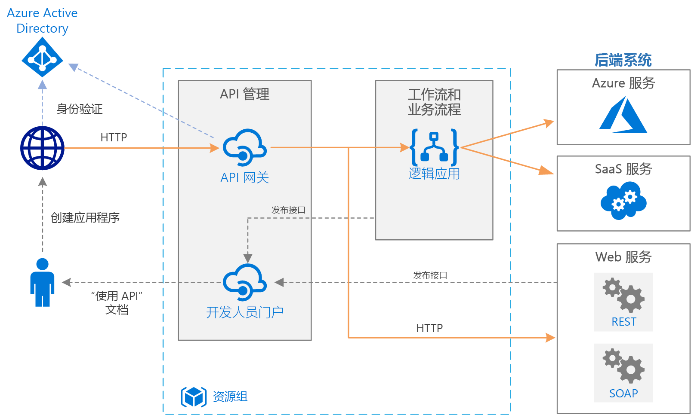

# Azure 上的基本企业集成Basic enterprise integration on Azure

本引用体系结构使用 [Azure Integration Services][integration-services] 来协调对企业后端系统的调用。This reference architecture uses [Azure Integration Services][integration-services] to orchestrate calls to enterprise backend systems. 后端系统可能包括软件即服务 (SaaS) 系统、Azure 服务以及企业中现有的 Web 服务。The backend systems may include software as a service (SaaS) systems, Azure services, and existing web services in your enterprise.

Azure Integration Services 是用于集成应用程序和数据的服务的集合。Azure Integration Services is a collection of services for integrating applications and data. 此体系结构使用下述服务中的两种：用于协调工作流的[逻辑应用][logic-apps]和用于创建 API 目录的 [API 管理][apim]。This architecture uses two of those services: [Logic Apps][logic-apps] to orchestrate workflows, and [API Management][apim] to create catalogs of APIs. 本体系结构足以处理基本的集成方案，即对后端服务进行同步调用时触发工作流的情况。This architecture is sufficient for basic integration scenarios where the workflow is triggered by synchronous calls to backend services. 使用[队列和事件](./queues-events.md)的更复杂体系结构基于这个基本的体系结构而构建。A more sophisticated architecture using [queues and events](./queues-events.md) builds on this basic architecture.

## 体系结构Architecture

此体系结构具有以下组件：The architecture has the following components:

- **后端系统**。**Backend systems**. 上图的右侧显示企业部署的或依赖的各种后端系统。The right-hand side of the diagram shows the various backend systems that the enterprise has deployed or relies on. 其中可能包括 SaaS 系统、其他 Azure 服务或公开 REST 或 SOAP 终结点的 Web 服务。These might include SaaS systems, other Azure services, or web services that expose REST or SOAP endpoints.

- **Azure 逻辑应用**。**Azure Logic Apps**. [逻辑应用][logic-apps]是一种用于生成企业工作流的无服务器平台，企业工作流可集成应用程序、数据和服务。[Logic Apps][logic-apps] is a serverless platform for building enterprise workflows that integrate applications, data, and services. 在本体系结构中，逻辑应用由 HTTP 请求触发。In this architecture, the logic apps are triggered by HTTP requests. 也可嵌套工作流，以便实现更复杂的业务流程。You can also nest workflows for more complex orchestration. 逻辑应用使用[连接器][logic-apps-connectors]与常用的服务集成。Logic Apps uses [connectors][logic-apps-connectors] to integrate with commonly used services. 逻辑应用提供数百个连接器，但你可以创建自定义连接器。Logic Apps offers hundreds of connectors, and you can create custom connectors.

- **Azure API 管理**。**Azure API Management**. [API 管理][apim]是用于发布 HTTP API 目录的托管服务，可以促进重复使用和可发现性。[API Management][apim] is a managed service for publishing catalogs of HTTP APIs, to promote reuse and discoverability. API 管理包含两个相关的组件：API Management consists of two related components:

  - **API 网关**。**API gateway**. API 网关接受 HTTP 调用并将其路由到后端。The API gateway accepts HTTP calls and routes them to the backend.

  - **开发人员门户**。**Developer portal**. Azure API 管理的每个实例都可以访问[开发人员门户][apim-dev-portal]。Each instance of Azure API Management provides access to a [developer portal][apim-dev-portal]. 开发人员可以通过此门户访问有关 API 调用的文档和代码示例。This portal gives your developers access to documentation and code samples for calling the APIs. 还可以在开发人员门户中测试 API。You can also test APIs in the developer portal.

  在本体系结构中，可以通过[导入逻辑应用][apim-logic-app]作为 API 来生成复合 API。In this architecture, composite APIs are built by [importing logic apps][apim-logic-app] as APIs. 也可导入现有的 Web 服务，方法是[导入 OpenAPI][apim-openapi] (Swagger) 规范或从 WSDL 规范[导入 SOAP API][apim-soap]。You can also import existing web services by [importing OpenAPI][apim-openapi] (Swagger) specifications or [importing SOAP APIs][apim-soap] from WSDL specifications.

  API 网关用于将前端客户端与后端分离。The API gateway helps to decouple front-end clients from the back end. 例如，它可以重新编写 URL 或在请求抵达后端之前转换请求。For example, it can rewrite URLs, or transform requests before they reach the backend. 它还处理许多跨领域问题，例如身份验证、跨域资源共享 (CORS) 支持以及响应缓存。It also handles many cross-cutting concerns such as authentication, cross-origin resource sharing (CORS) support, and response caching.

- **Azure DNS**。**Azure DNS**. [Azure DNS][dns] 是 DNS 域的托管服务。[Azure DNS][dns] is a hosting service for DNS domains. Azure DNS 使用 Microsoft Azure 基础结构提供名称解析。Azure DNS provides name resolution by using the Microsoft Azure infrastructure. 通过在 Azure 中托管域，可以使用与其他 Azure 服务相同的凭据、API、工具和计费来管理 DNS 记录。By hosting your domains in Azure, you can manage your DNS records by using the same credentials, APIs, tools, and billing that you use for your other Azure services. 若要使用自定义域名（例如 contoso.com），请创建可将自定义域名映射到 IP 地址的 DNS 记录。To use a custom domain name, such as contoso.com, create DNS records that map the custom domain name to the IP address. 有关详细信息，请参阅[在 API 管理中配置自定义域名][apim-domain]。For more information, see [Configure a custom domain name in API Management][apim-domain].

- **Azure Active Directory (Azure AD)**。**Azure Active Directory (Azure AD)**. 使用 [Azure AD][aad] 对调用 API 网关的客户端进行身份验证。Use [Azure AD][aad] to authenticate clients that call the API gateway. Azure AD 支持 OpenID Connect (OIDC) 协议。Azure AD supports the OpenID Connect (OIDC) protocol. 客户端从 Azure AD 获取访问令牌，API 网关在[验证令牌][apim-jwt]后对请求授权。Clients obtain an access token from Azure AD, and API Gateway [validates the token][apim-jwt] to authorize the request. 使用标准层或高级层 API 管理时，Azure AD 也可确保开发人员门户的访问安全性。When using the Standard or Premium tier of API Management, Azure AD can also secure access to the developer portal.

## 建议Recommendations

你的具体要求可能与此处显示的通用体系结构不同。Your specific requirements might differ from the generic architecture shown here. 请使用本部分中的建议作为入手点。Use the recommendations in this section as a starting point.

### API 管理API Management

使用 API 管理基本层、标准层或高级层。Use the API Management Basic, Standard, or Premium tiers. 这些层提供生产服务级别协议 (SLA)，并支持 Azure 区域中的横向扩展。These tiers offer a production service level agreement (SLA) and support scale out within the Azure region. API 管理的吞吐量容量以单位来度量。Throughput capacity for API Management is measured in *units*. 每个定价层的横向扩展存在上限。高级层还支持跨多个 Azure 区域横向扩展。Each pricing tier has a maximum scale-out. The Premium tier also supports scale out across multiple Azure regions. 请根据功能集和所需的吞吐量级别选择层。Choose your tier based on your feature set and the level of required throughput. 有关详细信息，请参阅 [API 管理定价][apim-pricing]和 [Azure API 管理实例的容量][apim-capacity]。For more information, see [API Management pricing][apim-pricing] and [Capacity of an Azure API Management instance][apim-capacity].

每个 Azure API 管理实例都有一个默认的域名，它是 `azure-api.net` 的子域，例如 `contoso.azure-api.net`。Each Azure API Management instance has a default domain name, which is a subdomain of `azure-api.net` &mdash, for example, `contoso.azure-api.net`. 考虑为组织配置[自定义域][apim-domain]。Consider configuring a [custom domain][apim-domain] for your organization.

### 逻辑应用Logic Apps

如果不需要保证较低的延迟进行响应，则非常适合使用逻辑应用，例如执行异步操作，或者运行时间适中的 API 调用。Logic Apps works best in scenarios that don't require low latency for a response, such as asynchronous or semi long-running API calls. 如果需要保证低延迟（例如，在调用会导致用户界面停滞的情况下），请使用其他技术。If low latency is required, for example in a call that blocks a user interface, use a different technology. 例如，使用 Azure Functions 或部署到 Azure 应用服务的 Web API。For example, use Azure Functions or a web API deployed to Azure App Service. 对于 API 使用者，请优先 API 管理而不是 API。Use API Management to front the API to your API consumers.

### 区域Region

若要尽量降低网络延迟，可将 API 管理和逻辑应用置于同一区域。To minimize network latency, put API Management and Logic Apps in the same region. 一般情况下，请选择离用户最近（或离后端服务最近）的区域。In general, choose the region that's closest to your users (or closest to your backend services).

资源组也有一个区域。The resource group also has a region. 此区域指定了部署元数据的存储位置，以及执行部署模板的位置。This region specifies where to store deployment metadata and where to execute the deployment template. 为了提高部署期间的可用性，请将资源组和资源放在同一区域。To improve availability during deployment, put the resource group and resources in the same region.

## 可伸缩性注意事项Scalability considerations

为了提高 API 管理的可伸缩性，请添加[缓存策略][apim-caching]（如果适用）。To increase the scalability of API Management, add [caching policies][apim-caching] where appropriate. 缓存还有助于减少后端服务的负载。Caching also helps reduce the load on back-end services.

若要提高容量，可在 Azure 区域中横向扩展 Azure API 管理基本层、标准层和高级层。To offer greater capacity, you can scale out Azure API Management Basic, Standard, and Premium tiers in an Azure region. 若要分析服务的使用情况，请在“指标”菜单中选择“容量指标”选项，然后相应地纵向扩展或缩减。To analyze the usage for your service, on the **Metrics** menu, select the **Capacity Metric** option and then scale up or scale down as appropriate. 升级或缩放过程可能需要 15 到 45 分钟才能完成。The upgrade or scale process can take from 15 to 45 minutes to apply.

有关缩放 API 管理服务的建议：Recommendations for scaling an API Management service:

- 缩放时请考虑流量模式。Consider traffic patterns when scaling. 采用较高易失性流量模式的客户需要更多的容量。Customers with more volatile traffic patterns need more capacity.

- 如果容量一贯超过 66%，则可能表示需要纵向扩展。Consistent capacity that's greater than 66% might indicate a need to scale up.

- 如果容量一贯低于 20%，则可能表示能够缩减。Consistent capacity that's under 20% might indicate an opportunity to scale down.

- 在生产环境中启用负载之前，请始终使用有代表性的负载对 API 管理服务进行负载测试。Before you enable the load in production, always load-test your API Management service with a representative load.

使用高级层时，可以跨多个 Azure 区域缩放 API 管理实例。With the Premium tier, you can scale an API Management instance across multiple Azure regions. 这样可以让 API 管理有资格获得更高的 SLA，让你可以在多个区域靠近用户的位置预配服务。This makes API Management eligible for a higher SLA, and lets you provision services near users in multiple regions.

逻辑应用的无服务器模型意味着管理员无需规划服务可伸缩性。The Logic Apps serverless model means administrators don't have to plan for service scalability. 服务会根据需求自动缩放。The service automatically scales to meet demand.

## 可用性注意事项Availability considerations

查看每个服务的 SLA：Review the SLA for each service:

- [API 管理 SLA][apim-sla][API Management SLA][apim-sla]
- [逻辑应用 SLA][logic-apps-sla][Logic Apps SLA][logic-apps-sla]

如果在使用高级层时跨至少两个区域来部署 API 管理，则有资格获得更高的 SLA。If you deploy API Management across two or more regions with Premium tier, it is eligible for a higher SLA. 请参阅 [API 管理定价][apim-pricing]。See [API Management pricing][apim-pricing].

### 备份Backups

定期[备份][apim-backup] API 管理配置。Regularly [back up][apim-backup] your API Management configuration. 将备份文件存储在不同于服务部署区域的某个位置或 Azure 区域。Store your backup files in a location or Azure region that differs from the region where the service is deployed. 根据 [RTO][rto] 选择灾难恢复策略：Based on your [RTO][rto], choose a disaster recovery strategy:

- 在灾难恢复事件中，预配新的 API 管理实例，将备份还原到新实例，并重新指向 DNS 记录。In a disaster recovery event, provision a new API Management instance, restore the backup to the new instance, and repoint the DNS records.

- 在另一 Azure 区域中保留 API 管理服务的被动实例。Keep a passive instance of the API Management service in another Azure region. 定期将备份还原到该实例，使之与主动服务同步。Regularly restore backups to that instance, to keep it in sync with the active service. 若要在发生灾难恢复事件期间还原服务，只需重新指向 DNS 记录。To restore the service during a disaster recovery event, you need only repoint the DNS records. 此方法会产生额外的成本，因为需为被动实例付费，但会缩短恢复时间。This approach incurs additional cost because you pay for the passive instance, but reduces the time to recover.

对于逻辑应用，建议使用配置即代码方法进行备份和还原。For logic apps, we recommend a configuration-as-code approach to backing up and restoring. 由于逻辑应用无服务器，因此可以通过 Azure 资源管理器模板快速地重新创建它们。Because logic apps are serverless, you can quickly recreate them from Azure Resource Manager templates. 请将模板保存在源代码管理中，并将模板与持续集成/持续部署 (CI/CD) 过程相集成。Save the templates in source control, integrate the templates with your continuous integration/continuous deployment (CI/CD) process. 在灾难恢复事件中，请将模板部署到新区域。In a disaster recovery event, deploy the template to a new region.

如果将逻辑应用部署到另一区域，请在 API 管理中更新配置。If you deploy a logic app to a different region, update the configuration in API Management. 可以使用一个基本的 PowerShell 脚本来更新 API 的**后端**属性。You can update the API's **Backend** property by using a basic PowerShell script.

## 可管理性注意事项Manageability considerations

为生产、开发和测试环境创建单独的资源组。Create separate resource groups for production, development, and test environments. 使用单独的资源组可以更方便地管理部署、删除测试部署，以及分配访问权限。Separate resource groups make it easier to manage deployments, delete test deployments, and assign access rights.

将资源分配到资源组时，请考虑以下因素：When you assign resources to resource groups, consider these factors:

- **生命周期**。**Lifecycle**. 一般情况下，应将具有相同生命周期的资源放入同一个资源组。In general, put resources that have the same lifecycle in the same resource group.

- **访问**。**Access**. 若要对组中的资源应用访问策略，可以使用[基于角色的访问控制][rbac] (RBAC)。To apply access policies to the resources in a group, you can use [role-based access control][rbac] (RBAC).

- **计费**。**Billing**. 可以查看资源组的累计成本。You can view rollup costs for the resource group.

- **API 管理的定价层**。**Pricing tier for API Management**. 对开发和测试环境使用开发人员层。Use the Developer tier for development and test environments. 为了尽量降低预生产期间的成本，请部署生产环境的副本、运行测试，然后关闭。To minimize costs during preproduction, deploy a replica of your production environment, run your tests, and then shut down.

### 部署Deployment

使用 [Azure 资源管理器模板][arm]部署 Azure 资源。Use [Azure Resource Manager templates][arm] to deploy the Azure resources. 使用模板可以通过 PowerShell 或 Azure CLI 更轻松地自动完成部署。Templates make it easier to automate deployments using PowerShell or the Azure CLI.

将 API 管理和任何单个逻辑应用放在其自身独立的资源管理器模板中。Put API Management and any individual logic apps in their own separate Resource Manager templates. 使用独立的模板可将资源存储在源代码管理系统中。By using separate templates, you can store the resources in source control systems. 可以在 CI/CD 过程中统一或者逐个部署这些模板。You can deploy the templates together or individually as part of a CI/CD process.

### 版本Versions

每当更改逻辑应用的配置或者通过资源管理器模板部署更新时，Azure 都会保留该版本的副本，并保留具有运行历史记录的所有版本。Each time you change a logic app's configuration or deploy an update through a Resource Manager template, Azure keeps a copy of that version and keeps all versions that have a run history. 可以使用这些版本来跟踪历史更改，或者将某个版本提升为逻辑应用的当前配置。You can use these versions to track historical changes or promote a version as the logic app's current configuration. 例如，可以将逻辑应用回退到以前的版本。For example, you can roll back a logic app to a previous version.

API 管理支持两个不同但互补的版本控制概念：API Management supports two distinct but complementary versioning concepts:

- 版本：API 使用者可以根据需要选择 API 版本（例如 v1、v2、beta 或 production）。*Versions* allow API consumers to choose an API version based on their needs, for example, v1, v2, beta, or production.

- 修订版：API 管理员可以在 API 中进行非重大更改并部署这些更改。另外还可以提供更改日志，将所做的更改告知 API 使用者。*Revisions* allow API administrators to make non-breaking changes in an API and deploy those changes, along with a change log to inform API consumers about the changes.

可在开发环境中创建修订版，并使用资源管理器模板在其他环境中部署此项更改。You can make a revision in a development environment and deploy that change in other environments by using Resource Manager templates. 有关详细信息，请参阅[发布 API 的多个版本][apim-versions]For more information, see [Publish multiple versions of your API][apim-versions]

也可在将某个 API 指定为“当前”版本并提供给用户访问之前，使用修订版来测试该 API。You can also use revisions to test an API before making the changes current and accessible to users. 但是，建议不要使用此方法进行负载测试或集成测试。However, this method isn't recommended for load testing or integration testing. 请改用独立的测试环境或预生产环境。Use separate test or preproduction environments instead.

## 诊断和监控Diagnostics and monitoring

在 API 管理和逻辑应用中使用 [Azure Monitor][monitor] 进行操作监视。Use [Azure Monitor][monitor] for operational monitoring in both API Management and Logic Apps. Azure Monitor 根据为每个服务配置的指标提供信息，默认已启用。Azure Monitor provides information based on the metrics configured for each service and is enabled by default. 有关详细信息，请参阅：For more information, see:

- [监视已发布的 API][apim-monitor][Monitor published APIs][apim-monitor]
- [针对 Azure 逻辑应用监视状态、设置诊断日志记录，并启用警报][logic-apps-monitor][Monitor status, set up diagnostics logging, and turn on alerts for Azure Logic Apps][logic-apps-monitor]

每个服务还提供以下选项：Each service also has these options:

- 若要进行更深入的分析和仪表板显示，请将逻辑应用日志发送到 [Azure Log Analytics][logic-apps-log-analytics]。For deeper analysis and dashboarding, send Logic Apps logs to [Azure Log Analytics][logic-apps-log-analytics].

- 若要进行 DevOps 监视，请为 API 管理配置 Azure Application Insights。For DevOps monitoring, configure Azure Application Insights for API Management.

- API 管理支持[使用 Power BI 解决方案模板进行自定义 API 分析][apim-pbi]。API Management supports the [Power BI solution template for custom API analytics][apim-pbi]. 可以使用此解决方案模板来创建自己的分析解决方案。You can use this solution template for creating your own analytics solution. 业务用户可在 Power BI 中查看报表。For business users, Power BI makes reports available.

## 安全注意事项Security considerations

下面是一些针对本体系结构的安全注意事项，虽然此列表并未完整描述所有的安全最佳做法：Although this list doesn't completely describe all security best practices, here are some security considerations that apply specifically to this architecture:

- Azure API 管理服务具有固定的公共 IP 地址。The Azure API Management service has a fixed public IP address. 只有 API 管理的 IP 地址能调用逻辑应用终结点。Restrict access for calling Logic Apps endpoints to only the IP address of API Management. 有关详细信息，请参阅[限制传入 IP 地址][logic-apps-restrict-ip]。For more information, see [Restrict incoming IP addresses][logic-apps-restrict-ip].

- 为确保用户拥有适当的访问级别，请使用基于角色的访问控制 (RBAC)。To make sure users have appropriate access levels, use role-based access control (RBAC).

- 使用 OAuth 或 OpenID Connect 保护 API 管理中的公共 API 终结点。Secure public API endpoints in API Management by using OAuth or OpenID Connect. 若要保护公共 API 终结点，请配置标识提供者并添加 JSON Web 令牌 (JWT) 验证策略。To secure public API endpoints, configure an identity provider, and add a JSON Web Token (JWT) validation policy. 有关详细信息，请参阅[结合 Azure Active Directory 和 API 管理使用 OAuth 2.0 保护 API][apim-oauth]。For more information, see [Protect an API by using OAuth 2.0 with Azure Active Directory and API Management][apim-oauth].

- 使用相互身份验证证书从 API 管理连接到后端服务。Connect to back-end services from API Management by using mutual certificates.

- 在 API 管理 API 上强制实施 HTTPS。Enforce HTTPS on the API Management APIs.

### 存储机密Storing secrets

切勿将密码、访问密钥或连接字符串签入源代码管理。Never check passwords, access keys, or connection strings into source control. 如果需要这些值，请使用适当的技术保护和部署这些值。If these values are required, secure and deploy these values by using the appropriate techniques.

如果逻辑应用所需的任何敏感值不能在连接器中创建，请将这些值存储在 Azure Key Vault 中，并从资源管理器模板引用它们。If a logic app requires any sensitive values that you can't create within a connector, store those values in Azure Key Vault and reference them from a Resource Manager template. 请为每个环境使用部署模板参数和参数文件。Use deployment template parameters and parameter files for each environment. 有关详细信息，请参阅[保护工作流中的参数和输入][logic-apps-secure]。For more information, see [Secure parameters and inputs within a workflow][logic-apps-secure].

API 管理使用称作“命名值”或“属性”的对象管理机密。API Management manages secrets by using objects called *named values* or *properties*. 这些对象安全地存储可通过 API 管理策略访问的值。These objects securely store values that you can access through API Management policies. 有关详细信息，请参阅[如何在 Azure API 管理策略中使用命名值][apim-properties]。For more information, see [How to use Named Values in Azure API Management policies][apim-properties].

## 成本注意事项Cost considerations

需要对所有运行的 API 管理实例付费。You are charged for all API Management instances when they are running. 如果已纵向扩展，但始终不需要该性能级别，请手动进行纵向缩减，或者配置[自动缩放][apim-autoscale]。If you have scaled up and don't need that level of performance all the time, manually scale down or configure [autoscaling][apim-autoscale].

逻辑应用使用[无服务器](/azure/logic-apps/logic-apps-serverless-overview)模型。Logic Apps uses a [serverless](/azure/logic-apps/logic-apps-serverless-overview) model. 根据操作和连接器执行计算费用。Billing is calculated based on action and connector execution. 有关详细信息，请参阅[逻辑应用定价](https://azure.microsoft.com/pricing/details/logic-apps/)。For more information, see [Logic Apps pricing](https://azure.microsoft.com/pricing/details/logic-apps/). 目前，逻辑应用没有层方面的注意事项。Currently, there are no tier considerations for Logic Apps.

## 后续步骤Next steps

若要提高可靠性和可伸缩性，请使用消息队列和事件将后端系统分离。For greater reliability and scalability, use message queues and events to decouple the backend systems. 此模式在下一参考体系结构中进行了介绍，详见以下系列：[使用消息队列和事件的企业集成](./queues-events.md)。This pattern is shown in the next reference architecture in this series: [Enterprise integration using message queues and events](./queues-events.md).

<!-- links -->

[aad]: /azure/active-directory
[apim]: /azure/api-management
[apim-autoscale]: /azure/api-management/api-management-howto-autoscale
[apim-backup]: /azure/api-management/api-management-howto-disaster-recovery-backup-restore
[apim-caching]: /azure/api-management/api-management-howto-cache
[apim-capacity]: /azure/api-management/api-management-capacity
[apim-dev-portal]: /azure/api-management/api-management-key-concepts#a-namedeveloper-portal-a-developer-portal
[apim-domain]: /azure/api-management/configure-custom-domain
[apim-jwt]: /azure/api-management/policies/authorize-request-based-on-jwt-claims
[apim-logic-app]: /azure/api-management/import-logic-app-as-api
[apim-monitor]: /azure/api-management/api-management-howto-use-azure-monitor
[apim-oauth]: /azure/api-management/api-management-howto-protect-backend-with-aad
[apim-openapi]: /azure/api-management/import-api-from-oas
[apim-pbi]: https://aka.ms/apimpbi
[apim-pricing]: https://azure.microsoft.com/pricing/details/api-management/
[apim-properties]: /azure/api-management/api-management-howto-properties
[apim-sla]: https://azure.microsoft.com/support/legal/sla/api-management/
[apim-soap]: /azure/api-management/import-soap-api
[apim-versions]: /azure/api-management/api-management-get-started-publish-versions
[arm]: /azure/azure-resource-manager/resource-group-authoring-templates
[dns]: /azure/dns/
[integration-services]: https://azure.microsoft.com/product-categories/integration/
[logic-apps]: /azure/logic-apps/logic-apps-overview
[logic-apps-connectors]: /azure/connectors/apis-list
[logic-apps-log-analytics]: /azure/logic-apps/logic-apps-monitor-your-logic-apps-oms
[logic-apps-monitor]: /azure/logic-apps/logic-apps-monitor-your-logic-apps
[logic-apps-restrict-ip]: /azure/logic-apps/logic-apps-securing-a-logic-app#restrict-incoming-ip-addresses
[logic-apps-secure]: /azure/logic-apps/logic-apps-securing-a-logic-app#secure-parameters-and-inputs-within-a-workflow
[logic-apps-sla]: https://azure.microsoft.com/support/legal/sla/logic-apps
[monitor]: /azure/azure-monitor/overview
[rbac]: /azure/role-based-access-control/overview
[rto]: ../../resiliency/index.md#rto-and-rpo