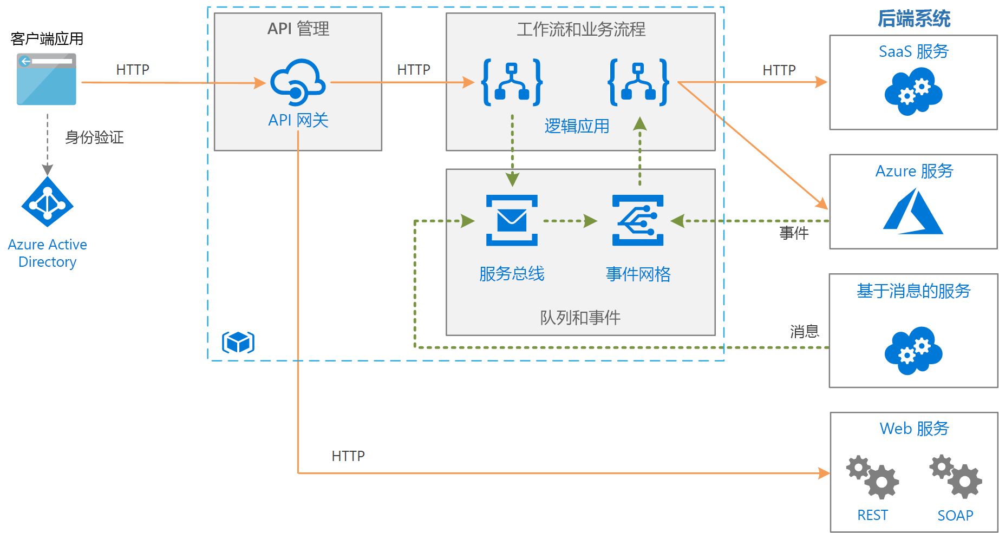

# Azure 上使用消息队列和事件的企业集成Enterprise integration on Azure using message queues and events

此参考体系结构集成企业后端系统，使用消息队列和事件将服务分离，以提高可伸缩性和可靠性。This reference architecture integrates enterprise backend systems, using message queues and events to decouple services for greater scalability and reliability. 后端系统可能包括软件即服务 (SaaS) 系统、Azure 服务以及企业中现有的 Web 服务。The backend systems may include software as a service (SaaS) systems, Azure services, and existing web services in your enterprise.

## 体系结构Architecture

此处显示的体系结构在更简单的体系结构上构建，后者显示在[基本企业集成][basic-enterprise-integration]中。The architecture shown here builds on a simpler architecture that is shown in [Basic enterprise integration][basic-enterprise-integration]. 该体系结构使用用于协调工作流的[逻辑应用][logic-apps]和用于创建 API 目录的 [API 管理][apim]。That architecture uses [Logic Apps][logic-apps] to orchestrate workflows and [API Management][apim] to create catalogs of APIs.

此版体系结构添加了两个组件，使系统的可靠性和可伸缩性更高：This version of the architecture adds two components that help make the system more reliable and scalable:

- **[Azure 服务总线][service-bus]**。**[Azure Service Bus][service-bus]**. 服务总线是安全且可靠的消息代理。Service Bus is a secure, reliable message broker.

- **[Azure 事件网格][event-grid]**。**[Azure Event Grid][event-grid]**. 事件网格是事件路由服务。Event Grid is an event routing service. 它使用[发布/订阅](../../patterns/publisher-subscriber.md) (pub/sub) 事件模型。It uses a [publish/subscribe](../../patterns/publisher-subscriber.md) (pub/sub) eventing model.

与对后端服务进行直接的同步调用相比，使用消息代理的异步通信具有许多优势：Asynchronous communication using a message broker provides a number of advantages over making direct, synchronous calls to backend services:

- 通过[基于队列的负载均衡模式](../../patterns/queue-based-load-leveling.md)提供负载均衡，以便处理工作负荷突增的情况。Provides load-leveling to handle bursts in workloads, using the [Queue-Based Load Leveling pattern](../../patterns/queue-based-load-leveling.md).
- 可靠地跟踪长时间运行的工作流的进度，此类工作流涉及多个步骤或多个应用程序。Reliably tracks the progress of long-running workflows that involve multiple steps or multiple applications.
- 有助于分离应用程序。Helps to decouple applications.
- 与现有的基于消息的系统集成。Integrates with existing message-based systems.
- 当后端系统不可用时，允许将工作排队。Allows work to be queued when a backend system is not available.

有了事件网格，系统中的各种组件就可以在事件发生时做出反应，不必依赖轮询或计划的任务。Event Grid enables the various components in the system to react to events as they happen, rather than relying on polling or scheduled tasks. 与消息队列一样，它有助于分离应用程序和服务。As with a message queue, it helps decouple applications and services. 应用程序或服务可以发布事件，任何相关的订阅方都会获得通知。An application or service can publish events, and any interested subscribers will be notified. 可以在不更新发送方的情况下添加新的订阅方。New subscribers can be added without updating the sender.

许多 Azure 服务支持将事件发送到事件网格。Many Azure services support sending events to Event Grid. 例如，将新文件添加到 Blob 存储时，逻辑应用可以侦听事件。For example, a logic app can listen for an event when new files are added to a blob store. 此模式可启用反应式工作流，即上传某个文件或将消息置于队列中会启动一系列过程。This pattern enables reactive workflows, where uploading a file or putting a message on a queue kicks off a series of processes. 这些过程可能并行执行，也可能按特定顺序执行。The processes might be executed in parallel or in a specific sequence.

## 建议Recommendations

[基本企业集成][basic-enterprise-integration]中描述的建议适用于此体系结构。The recommendations described in [Basic enterprise integration][basic-enterprise-integration] apply to this architecture. 以下建议也适用：The following recommendations also apply:

### 服务总线Service Bus

服务总线有两种传递模式：拉取或推送。Service Bus has two delivery modes, *pull* or *push*. 在拉取模型中，接收方会持续轮询新消息。In the pull model, the receiver continuously polls for new messages. 轮询可能效率不高，尤其是在有许多队列且每个队列都收到一些消息的情况下，或者是在两个消息的时间间隔很长的情况下。Polling can be inefficient, especially if you have many queues that each receive a few messages, or if there a lot of time between messages. 在推送模型中，服务总线会在有新消息时通过事件网格发送事件。In the push model, Service Bus sends an event through Event Grid when there are new messages. 接收方可订阅事件。The receiver subscribes to the event. 触发事件时，接收方可从服务总线拉取下一批消息。When the event is triggered, the receiver pulls the next batch of messages from Service Bus.

创建逻辑应用来使用服务总线消息时，建议将推送模型与事件网格集成配合使用。When you create a logic app to consume Service Bus messages, we recommend using the push model with Event Grid integration. 它通常更经济有效，因为逻辑应用不需轮询服务总线。It's often more cost efficient, because the logic app doesn't need to poll Service Bus. 有关详细信息，请参阅 [Azure 服务总线到事件网格的集成概述](/azure/service-bus-messaging/service-bus-to-event-grid-integration-concept)。For more information, see [Azure Service Bus to Event Grid integration overview](/azure/service-bus-messaging/service-bus-to-event-grid-integration-concept). 目前，服务总线[高级层](https://azure.microsoft.com/pricing/details/service-bus/)是事件网格通知所需的。Currently, Service Bus [Premium tier](https://azure.microsoft.com/pricing/details/service-bus/) is required for Event Grid notifications.

请使用 [PeekLock](/azure/service-bus-messaging/service-bus-messaging-overview#queues) 来访问一组消息。Use [PeekLock](/azure/service-bus-messaging/service-bus-messaging-overview#queues) for accessing a group of messages. 使用 PeekLock 时，逻辑应用可以执行步骤来验证每条消息，然后完成或放弃该消息。When you use PeekLock, the logic app can perform steps to validate each message before completing or abandoning the message. 此方法可以防范意外的消息丢失。This approach protects against accidental message loss.

### 事件网格Event Grid

事件网格触发器的触发意味着发生了“至少 1 个”事件。When an Event Grid trigger fires, it means *at least one* event happened. 例如，逻辑应用在获取服务总线消息的事件网格触发器时，应假定可能需要处理多个消息。For example, when a logic app gets an Event Grid triggers for a Service Bus message, it should assume that several messages might be available to process.

事件网格使用无服务器模型。Event Grid uses a serverless model. 根据操作（事件执行）数目计算费用。Billing is calculated based on the number of operations (event executions). 有关详细信息，请参阅[事件网格定价](https://azure.microsoft.com/pricing/details/event-grid/)。For more information, see [Event Grid pricing](https://azure.microsoft.com/pricing/details/event-grid/). 目前，事件网格没有层方面的注意事项。Currently, there are no tier considerations for Event Grid.

## 可伸缩性注意事项Scalability considerations

若要提高可伸缩性，服务总线高级层可以扩展消息传送单元数。To achieve higher scalability, the Service Bus Premium tier can scale out the number of messaging units. 高级层配置可以包含 1 个、2 个或 4 个消息传递单位。Premium tier configurations can have one, two, or four messaging units. 有关缩放服务总线的详细信息，请参阅[使用服务总线消息传递改进性能的最佳实践](/azure/service-bus-messaging/service-bus-performance-improvements)。For more information about scaling Service Bus, see [Best practices for performance improvements by using Service Bus Messaging](/azure/service-bus-messaging/service-bus-performance-improvements).

## 可用性注意事项Availability considerations

查看每个服务的 SLA：Review the SLA for each service:

- [API 管理 SLA][apim-sla][API Management SLA][apim-sla]
- [事件网格 SLA][event-grid-sla][Event Grid SLA][event-grid-sla]
- [逻辑应用 SLA][logic-apps-sla][Logic Apps SLA][logic-apps-sla]
- [服务总线 SLA][sb-sla][Service Bus SLA][sb-sla]

为了在发生严重的服务中断时实现故障转移，请考虑在服务总线高级层中实施异地灾难恢复。To enable failover if a serious outage occurs, consider implementing geo-disaster recovery in Service Bus Premium. 有关详细信息，请参阅 [Azure 服务总线异地灾难恢复](/azure/service-bus-messaging/service-bus-geo-dr)。For more information, see [Azure Service Bus geo-disaster recovery](/azure/service-bus-messaging/service-bus-geo-dr).

## 安全注意事项Security considerations

若要保护服务总线，请使用共享访问签名 (SAS)。To secure Service Bus, use shared access signature (SAS). 可以使用 [SAS 身份验证](/azure/service-bus-messaging/service-bus-sas)向具有特定权限的用户授予对服务总线资源的访问权限。You can grant a user access to Service Bus resources with specific rights by using [SAS authentication](/azure/service-bus-messaging/service-bus-sas). 有关详细信息，请参阅[服务总线身份验证和授权](/azure/service-bus-messaging/service-bus-authentication-and-authorization)。For more information, see [Service Bus authentication and authorization](/azure/service-bus-messaging/service-bus-authentication-and-authorization).

如果需要将服务总线队列公开为 HTTP 终结点（例如，以便发布新消息），请使用 API 管理将此终结点前置，以对其提供保护。If you need to expose a Service Bus queue as an HTTP endpoint, for example, to post new messages, use API Management to secure the queue by fronting the endpoint. 然后，可以适当地使用证书或 OAuth 身份验证来保护终结点。You can then secure the endpoint with certificates or OAuth authentication as appropriate. 保护终结点的最简单方法是使用包含 HTTP 请求/响应触发器的逻辑应用作为中介。The easiest way to secure an endpoint is using a logic app with an HTTP request/response trigger as an intermediary.

事件网格服务通过验证代码保护事件传送。The Event Grid service secures event delivery through a validation code. 如果通过逻辑应用来使用事件，则会自动执行验证。If you use Logic Apps to consume the event, validation is automatically performed. 有关详细信息，请参阅[事件网格安全性和身份验证](/azure/event-grid/security-authentication)。For more information, see [Event Grid security and authentication](/azure/event-grid/security-authentication).

[apim]: /azure/api-management
[apim-sla]: https://azure.microsoft.com/support/legal/sla/api-management/
[event-grid]: /azure/event-grid/
[event-grid-sla]: https://azure.microsoft.com/support/legal/sla/event-grid
[logic-apps]: /azure/logic-apps/logic-apps-overview
[logic-apps-sla]: https://azure.microsoft.com/support/legal/sla/logic-apps
[sb-sla]: https://azure.microsoft.com/support/legal/sla/service-bus/
[service-bus]: /azure/service-bus-messaging/
[basic-enterprise-integration]: ./basic-enterprise-integration.md
