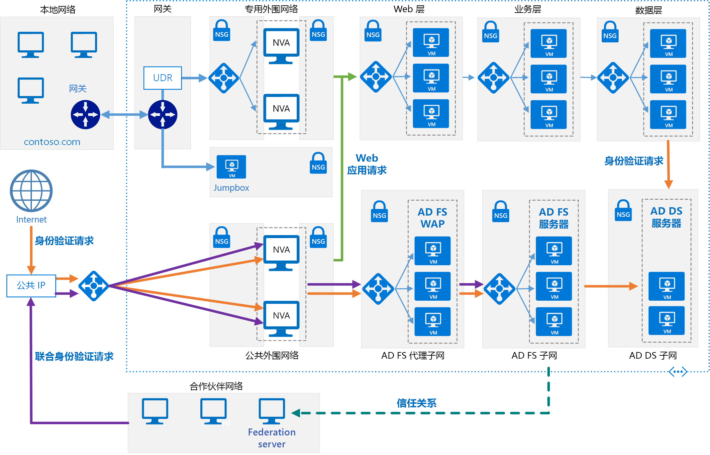

# <a name="extend-active-directory-federation-services-ad-fs-to-azure"></a><span data-ttu-id="9eaae-103">将 Active Directory 联合身份验证服务 (AD FS) 扩展到 Azure</span><span class="sxs-lookup"><span data-stu-id="9eaae-103">Extend Active Directory Federation Services (AD FS) to Azure</span></span>

<span data-ttu-id="9eaae-104">此参考体系结构实现一个安全混合网络，该网络将本地网络扩展到 Azure，并使用 [Active Directory 联合身份验证服务 (AD FS)][active-directory-federation-services] 为 Azure 中运行的组件执行联合身份验证和授权。</span><span class="sxs-lookup"><span data-stu-id="9eaae-104">This reference architecture implements a secure hybrid network that extends your on-premises network to Azure and uses [Active Directory Federation Services (AD FS)][active-directory-federation-services] to perform federated authentication and authorization for components running in Azure.</span></span> <span data-ttu-id="9eaae-105">[**部署此解决方案**](#deploy-the-solution)。</span><span class="sxs-lookup"><span data-stu-id="9eaae-105">[**Deploy this solution**](#deploy-the-solution).</span></span>



<span data-ttu-id="9eaae-107">下载此体系结构的 [Visio 文件][visio-download]。</span><span class="sxs-lookup"><span data-stu-id="9eaae-107">*Download a [Visio file][visio-download] of this architecture.*</span></span>

<span data-ttu-id="9eaae-108">AD FS 可以在本地进行承载，但是如果应用程序是其中某些部分在 Azure 中实现的混合体，则在云中复制 AD FS 可能会更加高效。</span><span class="sxs-lookup"><span data-stu-id="9eaae-108">AD FS can be hosted on-premises, but if your application is a hybrid in which some parts are implemented in Azure, it may be more efficient to replicate AD FS in the cloud.</span></span>

<span data-ttu-id="9eaae-109">该图显示以下方案：</span><span class="sxs-lookup"><span data-stu-id="9eaae-109">The diagram shows the following scenarios:</span></span>

- <span data-ttu-id="9eaae-110">来自合作伙伴组织的应用程序代码访问在 Azure VNet 中承载的 Web 应用程序。</span><span class="sxs-lookup"><span data-stu-id="9eaae-110">Application code from a partner organization accesses a web application hosted inside your Azure VNet.</span></span>
- <span data-ttu-id="9eaae-111">凭据存储在 Active Directory 域服务 (DS) 中的外部已注册用户访问在 Azure VNet 中承载的 Web 应用程序。</span><span class="sxs-lookup"><span data-stu-id="9eaae-111">An external, registered user with credentials stored inside Active Directory Domain Services (DS) accesses a web application hosted inside your Azure VNet.</span></span>
- <span data-ttu-id="9eaae-112">使用授权设备连接到 VNet 的用户执行在 Azure VNet 中承载的 Web 应用程序。</span><span class="sxs-lookup"><span data-stu-id="9eaae-112">A user connected to your VNet using an authorized device executes a web application hosted inside your Azure VNet.</span></span>

<span data-ttu-id="9eaae-113">此体系结构的典型用途包括：</span><span class="sxs-lookup"><span data-stu-id="9eaae-113">Typical uses for this architecture include:</span></span>

- <span data-ttu-id="9eaae-114">在本地运行一部分工作负荷，在 Azure 中运行一部分工作负荷的混合应用程序。</span><span class="sxs-lookup"><span data-stu-id="9eaae-114">Hybrid applications where workloads run partly on-premises and partly in Azure.</span></span>
- <span data-ttu-id="9eaae-115">使用联合授权向合作伙伴组织公开 Web 应用程序的解决方案。</span><span class="sxs-lookup"><span data-stu-id="9eaae-115">Solutions that use federated authorization to expose web applications to partner organizations.</span></span>
- <span data-ttu-id="9eaae-116">支持从组织防火墙外部运行的 Web 浏览器进行访问的系统。</span><span class="sxs-lookup"><span data-stu-id="9eaae-116">Systems that support access from web browsers running outside of the organizational firewall.</span></span>
- <span data-ttu-id="9eaae-117">使用户可以通过从授权外部设备（如远程计算机、笔记本电脑和其他移动设备）进行连接来访问 Web 应用程序的系统。</span><span class="sxs-lookup"><span data-stu-id="9eaae-117">Systems that enable users to access to web applications by connecting from authorized external devices such as remote computers, notebooks, and other mobile devices.</span></span>

<span data-ttu-id="9eaae-118">此参考体系结构侧重于被动联合，其中由联合服务器决定如何以及何时对用户进行身份验证。</span><span class="sxs-lookup"><span data-stu-id="9eaae-118">This reference architecture focuses on *passive federation*, in which the federation servers decide how and when to authenticate a user.</span></span> <span data-ttu-id="9eaae-119">用户在启动应用程序时提供登录信息。</span><span class="sxs-lookup"><span data-stu-id="9eaae-119">The user provides sign in information when the application is started.</span></span> <span data-ttu-id="9eaae-120">此机制最常由 Web 浏览器使用，涉及将浏览器重定向到对用户进行身份验证的站点的协议。</span><span class="sxs-lookup"><span data-stu-id="9eaae-120">This mechanism is most commonly used by web browsers and involves a protocol that redirects the browser to a site where the user authenticates.</span></span> <span data-ttu-id="9eaae-121">AD FS 还支持主动联合，其中应用程序负责提供凭据，无需进一步的用户交互，但是该方案不在此体系结构的范围内。</span><span class="sxs-lookup"><span data-stu-id="9eaae-121">AD FS also supports *active federation*, where an application takes on responsibility for supplying credentials without further user interaction, but that scenario is outside the scope of this architecture.</span></span>

<span data-ttu-id="9eaae-122">有关其他注意事项，请参阅[选择用于将本地 Active Directory 与 Azure 相集成的解决方案][considerations]。</span><span class="sxs-lookup"><span data-stu-id="9eaae-122">For additional considerations, see [Choose a solution for integrating on-premises Active Directory with Azure][considerations].</span></span>

## <a name="architecture"></a><span data-ttu-id="9eaae-123">体系结构</span><span class="sxs-lookup"><span data-stu-id="9eaae-123">Architecture</span></span>

<span data-ttu-id="9eaae-124">此体系结构扩展在[将 AD DS 扩展到 Azure][extending-ad-to-azure] 中介绍的实现。</span><span class="sxs-lookup"><span data-stu-id="9eaae-124">This architecture extends the implementation described in [Extending AD DS to Azure][extending-ad-to-azure].</span></span> <span data-ttu-id="9eaae-125">它包含以下组件。</span><span class="sxs-lookup"><span data-stu-id="9eaae-125">It contains the followign components.</span></span>

- <span data-ttu-id="9eaae-126">**AD DS 子网**。</span><span class="sxs-lookup"><span data-stu-id="9eaae-126">**AD DS subnet**.</span></span> <span data-ttu-id="9eaae-127">AD DS 服务器包含在其自己的子网中，具有充当防火墙的网络安全组 (NSG) 规则。</span><span class="sxs-lookup"><span data-stu-id="9eaae-127">The AD DS servers are contained in their own subnet with network security group (NSG) rules acting as a firewall.</span></span>

- <span data-ttu-id="9eaae-128">**AD DS 服务器**。</span><span class="sxs-lookup"><span data-stu-id="9eaae-128">**AD DS servers**.</span></span> <span data-ttu-id="9eaae-129">作为 VM 在 Azure 中运行的域控制器。</span><span class="sxs-lookup"><span data-stu-id="9eaae-129">Domain controllers running as VMs in Azure.</span></span> <span data-ttu-id="9eaae-130">这些服务器提供域中的本地标识的身份验证。</span><span class="sxs-lookup"><span data-stu-id="9eaae-130">These servers provide authentication of local identities within the domain.</span></span>

- <span data-ttu-id="9eaae-131">**AD FS 子网**。</span><span class="sxs-lookup"><span data-stu-id="9eaae-131">**AD FS subnet**.</span></span> <span data-ttu-id="9eaae-132">AD FS 服务器位于其自己的子网中，具有充当防火墙的 NSG 规则。</span><span class="sxs-lookup"><span data-stu-id="9eaae-132">The AD FS servers are located within their own subnet with NSG rules acting as a firewall.</span></span>

- <span data-ttu-id="9eaae-133">**AD FS 服务器**。</span><span class="sxs-lookup"><span data-stu-id="9eaae-133">**AD FS servers**.</span></span> <span data-ttu-id="9eaae-134">AD FS 服务器提供联合授权和身份验证。</span><span class="sxs-lookup"><span data-stu-id="9eaae-134">The AD FS servers provide federated authorization and authentication.</span></span> <span data-ttu-id="9eaae-135">在此体系结构中，它们执行以下任务：</span><span class="sxs-lookup"><span data-stu-id="9eaae-135">In this architecture, they perform the following tasks:</span></span>

  - <span data-ttu-id="9eaae-136">代表合作伙伴用户接收包含由合作伙伴联合服务器发出的声明的安全令牌。</span><span class="sxs-lookup"><span data-stu-id="9eaae-136">Receiving security tokens containing claims made by a partner federation server on behalf of a partner user.</span></span> <span data-ttu-id="9eaae-137">AD FS 先验证令牌是否有效，然后将声明传递给在 Azure 中运行的 Web 应用程序以对请求进行授权。</span><span class="sxs-lookup"><span data-stu-id="9eaae-137">AD FS verifies that the tokens are valid before passing the claims to the web application running in Azure to authorize requests.</span></span>

    <span data-ttu-id="9eaae-138">在 Azure 中运行的应用程序是信赖方。</span><span class="sxs-lookup"><span data-stu-id="9eaae-138">The application running in Azure is the *relying party*.</span></span> <span data-ttu-id="9eaae-139">合作伙伴联合服务器必须发出由 Web 应用程序理解的声明。</span><span class="sxs-lookup"><span data-stu-id="9eaae-139">The partner federation server must issue claims that are understood by the web application.</span></span> <span data-ttu-id="9eaae-140">合作伙伴联合服务器称为帐户伙伴，因为它们代表合作伙伴组织中经过身份验证的帐户提交访问请求。</span><span class="sxs-lookup"><span data-stu-id="9eaae-140">The partner federation servers are referred to as *account partners*, because they submit access requests on behalf of authenticated accounts in the partner organization.</span></span> <span data-ttu-id="9eaae-141">AD FS 服务器称为资源伙伴，因为它们提供对资源（Web 应用程序）的访问。</span><span class="sxs-lookup"><span data-stu-id="9eaae-141">The AD FS servers are called *resource partners* because they provide access to resources (the web application).</span></span>

  - <span data-ttu-id="9eaae-142">使用 AD DS 和 [Active Directory 设备注册服务][ADDRS]，对运行需要访问 Web 应用程序的 Web 浏览器或设备的外部用户发出的传入请求进行身份验证和授权。</span><span class="sxs-lookup"><span data-stu-id="9eaae-142">Authenticating and authorizing incoming requests from external users running a web browser or device that needs access to web applications, by using AD DS and the [Active Directory Device Registration Service][ADDRS].</span></span>

  <span data-ttu-id="9eaae-143">AD FS 服务器配置为通过 Azure 负载均衡器访问的场。</span><span class="sxs-lookup"><span data-stu-id="9eaae-143">The AD FS servers are configured as a farm accessed through an Azure load balancer.</span></span> <span data-ttu-id="9eaae-144">此实现可提高可用性和可伸缩性。</span><span class="sxs-lookup"><span data-stu-id="9eaae-144">This implementation improves availability and scalability.</span></span> <span data-ttu-id="9eaae-145">AD FS 服务器不直接向 Internet 公开。</span><span class="sxs-lookup"><span data-stu-id="9eaae-145">The AD FS servers are not exposed directly to the Internet.</span></span> <span data-ttu-id="9eaae-146">所有 Internet 流量都通过 AD FS Web 应用程序代理服务器和 DMZ（也称为外围网络）进行筛选。</span><span class="sxs-lookup"><span data-stu-id="9eaae-146">All Internet traffic is filtered through AD FS web application proxy servers and a DMZ (also referred to as a perimeter network).</span></span>

  <span data-ttu-id="9eaae-147">有关 AD FS 工作原理的详细信息，请参阅 [Active Directory 联合身份验证服务概述][active-directory-federation-services-overview]。</span><span class="sxs-lookup"><span data-stu-id="9eaae-147">For more information about how AD FS works, see [Active Directory Federation Services Overview][active-directory-federation-services-overview].</span></span> <span data-ttu-id="9eaae-148">此外，[Azure 中的 AD FS 部署][adfs-intro]一文包含实现的详细分步介绍。</span><span class="sxs-lookup"><span data-stu-id="9eaae-148">Also, the article [AD FS deployment in Azure][adfs-intro] contains a detailed step-by-step introduction to implementation.</span></span>

- <span data-ttu-id="9eaae-149">**AD FS 代理子网**。</span><span class="sxs-lookup"><span data-stu-id="9eaae-149">**AD FS proxy subnet**.</span></span> <span data-ttu-id="9eaae-150">AD FS 代理服务器可以包含在其自己的子网中，并具有提供保护的 NSG 规则。</span><span class="sxs-lookup"><span data-stu-id="9eaae-150">The AD FS proxy servers can be contained within their own subnet, with NSG rules providing protection.</span></span> <span data-ttu-id="9eaae-151">此子网中的服务器通过在 Azure 虚拟网络与 Internet 之间提供防火墙的一组网络虚拟设备向 Internet 公开。</span><span class="sxs-lookup"><span data-stu-id="9eaae-151">The servers in this subnet are exposed to the Internet through a set of network virtual appliances that provide a firewall between your Azure virtual network and the Internet.</span></span>

- <span data-ttu-id="9eaae-152">**AD FS Web 应用程序代理 (WAP) 服务器**。</span><span class="sxs-lookup"><span data-stu-id="9eaae-152">**AD FS web application proxy (WAP) servers**.</span></span> <span data-ttu-id="9eaae-153">这些 VM 充当用于来自合作伙伴组织和外部设备的传入请求的 AD FS 服务器。</span><span class="sxs-lookup"><span data-stu-id="9eaae-153">These VMs act as AD FS servers for incoming requests from partner organizations and external devices.</span></span> <span data-ttu-id="9eaae-154">WAP 服务器充当筛选器，使得无法从 Internet 直接访问 AD FS 服务器。</span><span class="sxs-lookup"><span data-stu-id="9eaae-154">The WAP servers act as a filter, shielding the AD FS servers from direct access from the Internet.</span></span> <span data-ttu-id="9eaae-155">与 AD FS 服务器一样，在具有负载均衡的场中部署 WAP 服务器可提供比部署独立服务器集合更高的可用性和可伸缩性。</span><span class="sxs-lookup"><span data-stu-id="9eaae-155">As with the AD FS servers, deploying the WAP servers in a farm with load balancing gives you greater availability and scalability than deploying a collection of stand-alone servers.</span></span>

  > [!NOTE]
  > <span data-ttu-id="9eaae-156">有关安装 WAP 服务器的详细信息，请参阅[安装和配置 Web 应用程序代理服务器][install_and_configure_the_web_application_proxy_server]</span><span class="sxs-lookup"><span data-stu-id="9eaae-156">For detailed information about installing WAP servers, see [Install and Configure the Web Application Proxy Server][install_and_configure_the_web_application_proxy_server]</span></span>
  >

- <span data-ttu-id="9eaae-157">**合作伙伴组织**。</span><span class="sxs-lookup"><span data-stu-id="9eaae-157">**Partner organization**.</span></span> <span data-ttu-id="9eaae-158">运行的 Web 应用程序请求访问在 Azure 中运行的 Web 应用程序的合作伙伴组织。</span><span class="sxs-lookup"><span data-stu-id="9eaae-158">A partner organization running a web application that requests access to a web application running in Azure.</span></span> <span data-ttu-id="9eaae-159">合作伙伴组织中的联合服务器在本地对请求进行身份验证，并将包含声明的安全令牌提交到在 Azure 中运行的 AD FS。</span><span class="sxs-lookup"><span data-stu-id="9eaae-159">The federation server at the partner organization authenticates requests locally, and submits security tokens containing claims to AD FS running in Azure.</span></span> <span data-ttu-id="9eaae-160">Azure 中的 AD FS 会验证安全令牌，如果有效，则可以将声明传递给在 Azure 中运行的 Web 应用程序以对它们进行授权。</span><span class="sxs-lookup"><span data-stu-id="9eaae-160">AD FS in Azure validates the security tokens, and if valid can pass the claims to the web application running in Azure to authorize them.</span></span>

  > [!NOTE]
  > <span data-ttu-id="9eaae-161">还可以使用 Azure 网关配置 VPN 隧道，以便为受信任合作伙伴提供对 AD FS 的直接访问。</span><span class="sxs-lookup"><span data-stu-id="9eaae-161">You can also configure a VPN tunnel using Azure gateway to provide direct access to AD FS for trusted partners.</span></span> <span data-ttu-id="9eaae-162">从这些合作伙伴接收的请求不会经过 WAP 服务器。</span><span class="sxs-lookup"><span data-stu-id="9eaae-162">Requests received from these partners do not pass through the WAP servers.</span></span>
  >

## <a name="recommendations"></a><span data-ttu-id="9eaae-163">建议</span><span class="sxs-lookup"><span data-stu-id="9eaae-163">Recommendations</span></span>

<span data-ttu-id="9eaae-164">以下建议适用于大多数方案。</span><span class="sxs-lookup"><span data-stu-id="9eaae-164">The following recommendations apply for most scenarios.</span></span> <span data-ttu-id="9eaae-165">除非有优先于这些建议的特定要求，否则请遵循这些建议。</span><span class="sxs-lookup"><span data-stu-id="9eaae-165">Follow these recommendations unless you have a specific requirement that overrides them.</span></span>

### <a name="networking-recommendations"></a><span data-ttu-id="9eaae-166">网络建议</span><span class="sxs-lookup"><span data-stu-id="9eaae-166">Networking recommendations</span></span>

<span data-ttu-id="9eaae-167">使用静态专用 IP 地址为承载 AD FS 和 WAP 服务器的每个 VM 配置网络接口。</span><span class="sxs-lookup"><span data-stu-id="9eaae-167">Configure the network interface for each of the VMs hosting AD FS and WAP servers with static private IP addresses.</span></span>

<span data-ttu-id="9eaae-168">请勿向 AD FS VM 提供公共 IP 地址。</span><span class="sxs-lookup"><span data-stu-id="9eaae-168">Do not give the AD FS VMs public IP addresses.</span></span> <span data-ttu-id="9eaae-169">有关详细信息，请参阅[安全注意事项](#security-considerations)部分。</span><span class="sxs-lookup"><span data-stu-id="9eaae-169">For more information, see the [Security considerations](#security-considerations) section.</span></span>

<span data-ttu-id="9eaae-170">为每个 AD FS 和 WAP VM 的网络接口设置首选和辅助域名服务 (DNS) 服务器的 IP 地址，以引用 Active Directory DS VM。</span><span class="sxs-lookup"><span data-stu-id="9eaae-170">Set the IP address of the preferred and secondary domain name service (DNS) servers for the network interfaces for each AD FS and WAP VM to reference the Active Directory DS VMs.</span></span> <span data-ttu-id="9eaae-171">Active Directory DS VM 应运行 DNS。</span><span class="sxs-lookup"><span data-stu-id="9eaae-171">The Active Directory DS VMs should be running DNS.</span></span> <span data-ttu-id="9eaae-172">使每个 VM 可以加入域需要此步骤。</span><span class="sxs-lookup"><span data-stu-id="9eaae-172">This step is necessary to enable each VM to join the domain.</span></span>

### <a name="ad-fs-installation"></a><span data-ttu-id="9eaae-173">AD FS 安装</span><span class="sxs-lookup"><span data-stu-id="9eaae-173">AD FS installation</span></span>

<span data-ttu-id="9eaae-174">文章[部署联合服务器场][Deploying_a_federation_server_farm]提供了有关安装和配置 AD FS 的详细说明。</span><span class="sxs-lookup"><span data-stu-id="9eaae-174">The article [Deploying a Federation Server Farm][Deploying_a_federation_server_farm] provides detailed instructions for installing and configuring AD FS.</span></span> <span data-ttu-id="9eaae-175">在场中配置第一台 AD FS 服务器之前执行以下任务：</span><span class="sxs-lookup"><span data-stu-id="9eaae-175">Perform the following tasks before configuring the first AD FS server in the farm:</span></span>

1. <span data-ttu-id="9eaae-176">获取用于执行服务器身份验证的公开受信任证书。</span><span class="sxs-lookup"><span data-stu-id="9eaae-176">Obtain a publicly trusted certificate for performing server authentication.</span></span> <span data-ttu-id="9eaae-177">使用者名称必须包含客户端用于访问联合身份验证服务的名称。</span><span class="sxs-lookup"><span data-stu-id="9eaae-177">The *subject name* must contain the name clients use to access the federation service.</span></span> <span data-ttu-id="9eaae-178">这可以是为负载均衡器注册的 DNS 名称，例如 adfs.contoso.com（出于安全原因，请避免使用通配符名称，如 \*.contoso.com）。</span><span class="sxs-lookup"><span data-stu-id="9eaae-178">This can be the DNS name registered for the load balancer, for example, *adfs.contoso.com* (avoid using wildcard names such as \**.contoso.com*, for security reasons).</span></span> <span data-ttu-id="9eaae-179">在所有 AD FS 服务器 VM 上使用相同证书。</span><span class="sxs-lookup"><span data-stu-id="9eaae-179">Use the same certificate on all AD FS server VMs.</span></span> <span data-ttu-id="9eaae-180">可以从受信任证书颁发机构购买证书，但如果组织使用 Active Directory 证书服务，则可以创建自己的证书。</span><span class="sxs-lookup"><span data-stu-id="9eaae-180">You can purchase a certificate from a trusted certification authority, but if your organization uses Active Directory Certificate Services you can create your own.</span></span>

    <span data-ttu-id="9eaae-181">使用者可选名称由设备注册服务 (DRS) 用于启用从外部设备进行的访问。</span><span class="sxs-lookup"><span data-stu-id="9eaae-181">The *subject alternative name* is used by the device registration service (DRS) to enable access from external devices.</span></span> <span data-ttu-id="9eaae-182">这应采用 enterpriseregistration.contoso.com 的形式。</span><span class="sxs-lookup"><span data-stu-id="9eaae-182">This should be of the form *enterpriseregistration.contoso.com*.</span></span>

    <span data-ttu-id="9eaae-183">有关详细信息，请参阅[为 AD FS 获取并配置安全套接字层 (SSL) 证书][adfs_certificates]。</span><span class="sxs-lookup"><span data-stu-id="9eaae-183">For more information, see [Obtain and Configure a Secure Sockets Layer (SSL) Certificate for AD FS][adfs_certificates].</span></span>

2. <span data-ttu-id="9eaae-184">在域控制器上，为密钥分发服务生成新的根密钥。</span><span class="sxs-lookup"><span data-stu-id="9eaae-184">On the domain controller, generate a new root key for the Key Distribution Service.</span></span> <span data-ttu-id="9eaae-185">将有效时间设置为当前时间减 10 小时（此配置会减少在域中分发和同步密钥时可能发生的延迟）。</span><span class="sxs-lookup"><span data-stu-id="9eaae-185">Set the effective time to the current time minus 10 hours (this configuration reduces the delay that can occur in distributing and synchronizing keys across the domain).</span></span> <span data-ttu-id="9eaae-186">支持创建用于运行 AD FS 服务的组服务帐户需要此步骤。</span><span class="sxs-lookup"><span data-stu-id="9eaae-186">This step is necessary to support creating the group service account that is used to run the AD FS service.</span></span> <span data-ttu-id="9eaae-187">以下 PowerShell 命令演示有关如何执行此操作的示例：</span><span class="sxs-lookup"><span data-stu-id="9eaae-187">The following PowerShell command shows an example of how to do this:</span></span>

    ```powershell
    Add-KdsRootKey -EffectiveTime (Get-Date).AddHours(-10)
    ```

3. <span data-ttu-id="9eaae-188">将每个 AD FS 服务器 VM 添加到域。</span><span class="sxs-lookup"><span data-stu-id="9eaae-188">Add each AD FS server VM to the domain.</span></span>

> [!NOTE]
> <span data-ttu-id="9eaae-189">若要安装 AD FS，为域运行主域控制器 (PDC) 仿真器灵活单主机操作 (FSMO) 角色的域控制器必须正在运行并且可从 AD FS VM 进行访问。</span><span class="sxs-lookup"><span data-stu-id="9eaae-189">To install AD FS, the domain controller running the primary domain controller (PDC) emulator flexible single master operation (FSMO) role for the domain must be running and accessible from the AD FS VMs.</span></span> <span data-ttu-id="9eaae-190"><<RBC：是否可通过某种方法减少此内容的重复性？>></span><span class="sxs-lookup"><span data-stu-id="9eaae-190"><<RBC: Is there a way to make this less repetitive?>></span></span>
>

### <a name="ad-fs-trust"></a><span data-ttu-id="9eaae-191">AD FS 信任</span><span class="sxs-lookup"><span data-stu-id="9eaae-191">AD FS trust</span></span>

<span data-ttu-id="9eaae-192">在 AD FS 安装与任何合作伙伴组织的联合服务器之间建立联合身份验证信任。</span><span class="sxs-lookup"><span data-stu-id="9eaae-192">Establish federation trust between your AD FS installation, and the federation servers of any partner organizations.</span></span> <span data-ttu-id="9eaae-193">配置所需的任何声明筛选和映射。</span><span class="sxs-lookup"><span data-stu-id="9eaae-193">Configure any claims filtering and mapping required.</span></span>

- <span data-ttu-id="9eaae-194">每个合作伙伴组织的 DevOps 员工必须添加信赖方信任，以便可通过 AD FS 服务器访问 Web 应用程序。</span><span class="sxs-lookup"><span data-stu-id="9eaae-194">DevOps staff at each partner organization must add a relying party trust for the web applications accessible through your AD FS servers.</span></span>
- <span data-ttu-id="9eaae-195">组织中的 DevOps 员工必须配置声明提供方信任，以便使 AD FS 服务器可以信任合作伙伴组织提供的声明。</span><span class="sxs-lookup"><span data-stu-id="9eaae-195">DevOps staff in your organization must configure claims-provider trust to enable your AD FS servers to trust the claims that partner organizations provide.</span></span>
- <span data-ttu-id="9eaae-196">组织中的 DevOps 员工还必须配置 AD FS 以将声明传递给组织的 Web 应用程序。</span><span class="sxs-lookup"><span data-stu-id="9eaae-196">DevOps staff in your organization must also configure AD FS to pass claims on to your organization's web applications.</span></span>

<span data-ttu-id="9eaae-197">有关详细信息，请参阅[建立联合身份验证信任][establishing-federation-trust]。</span><span class="sxs-lookup"><span data-stu-id="9eaae-197">For more information, see [Establishing Federation Trust][establishing-federation-trust].</span></span>

<span data-ttu-id="9eaae-198">通过 WAP 服务器使用预身份验证发布组织的 Web 应用程序并将它们提供给外部合作伙伴。</span><span class="sxs-lookup"><span data-stu-id="9eaae-198">Publish your organization's web applications and make them available to external partners by using preauthentication through the WAP servers.</span></span> <span data-ttu-id="9eaae-199">有关详细信息，请参阅[使用 AD FS 预身份验证发布应用程序][publish_applications_using_AD_FS_preauthentication]</span><span class="sxs-lookup"><span data-stu-id="9eaae-199">For more information, see [Publish Applications using AD FS Preauthentication][publish_applications_using_AD_FS_preauthentication]</span></span>

<span data-ttu-id="9eaae-200">AD FS 支持令牌转换和扩大。</span><span class="sxs-lookup"><span data-stu-id="9eaae-200">AD FS supports token transformation and augmentation.</span></span> <span data-ttu-id="9eaae-201">Azure Active Directory 不提供此功能。</span><span class="sxs-lookup"><span data-stu-id="9eaae-201">Azure Active Directory does not provide this feature.</span></span> <span data-ttu-id="9eaae-202">借助 AD FS，在设置信任关系时可以：</span><span class="sxs-lookup"><span data-stu-id="9eaae-202">With AD FS, when you set up the trust relationships, you can:</span></span>

- <span data-ttu-id="9eaae-203">为授权规则配置声明转换。</span><span class="sxs-lookup"><span data-stu-id="9eaae-203">Configure claim transformations for authorization rules.</span></span> <span data-ttu-id="9eaae-204">例如，可以将组安全性从非 Microsoft 合作伙伴组织使用的表示形式映射到 Active Directory DS 可以在组织中授权的某种内容。</span><span class="sxs-lookup"><span data-stu-id="9eaae-204">For example, you can map group security from a representation used by a non-Microsoft partner organization to something that that Active Directory DS can authorize in your organization.</span></span>
- <span data-ttu-id="9eaae-205">将声明从一种格式转换为另一种格式。</span><span class="sxs-lookup"><span data-stu-id="9eaae-205">Transform claims from one format to another.</span></span> <span data-ttu-id="9eaae-206">例如，如果应用程序仅支持 SAML 1.1 声明，则可以从 SAML 2.0 映射到 SAML 1.1。</span><span class="sxs-lookup"><span data-stu-id="9eaae-206">For example, you can map from SAML 2.0 to SAML 1.1 if your application only supports SAML 1.1 claims.</span></span>

### <a name="ad-fs-monitoring"></a><span data-ttu-id="9eaae-207">AD FS 监视</span><span class="sxs-lookup"><span data-stu-id="9eaae-207">AD FS monitoring</span></span>

<span data-ttu-id="9eaae-208">[适用于 Active Directory 联合身份验证服务 2012 R2 的 Microsoft System Center 管理包][oms-adfs-pack]为联合服务器提供 AD FS 部署的主动和被动监视。</span><span class="sxs-lookup"><span data-stu-id="9eaae-208">The [Microsoft System Center Management Pack for Active Directory Federation Services 2012 R2][oms-adfs-pack] provides both proactive and reactive monitoring of your AD FS deployment for the federation server.</span></span> <span data-ttu-id="9eaae-209">此管理包监视：</span><span class="sxs-lookup"><span data-stu-id="9eaae-209">This management pack monitors:</span></span>

- <span data-ttu-id="9eaae-210">AD FS 服务在其事件日志中记录的事件。</span><span class="sxs-lookup"><span data-stu-id="9eaae-210">Events that the AD FS service records in its event logs.</span></span>
- <span data-ttu-id="9eaae-211">AD FS 性能计数器收集的性能数据。</span><span class="sxs-lookup"><span data-stu-id="9eaae-211">The performance data that the AD FS performance counters collect.</span></span>
- <span data-ttu-id="9eaae-212">AD FS 系统和 Web 应用程序（信赖方）的总体运行状况，提供针对关键问题和警告的警报。</span><span class="sxs-lookup"><span data-stu-id="9eaae-212">The overall health of the AD FS system and web applications (relying parties), and provides alerts for critical issues and warnings.</span></span>

## <a name="scalability-considerations"></a><span data-ttu-id="9eaae-213">可伸缩性注意事项</span><span class="sxs-lookup"><span data-stu-id="9eaae-213">Scalability considerations</span></span>

<span data-ttu-id="9eaae-214">从文章[规划 AD FS 部署][plan-your-adfs-deployment]中汇总的以下注意事项为调整 AD FS 场规模提供了起点：</span><span class="sxs-lookup"><span data-stu-id="9eaae-214">The following considerations, summarized from the article [Plan your AD FS deployment][plan-your-adfs-deployment], give a starting point for sizing AD FS farms:</span></span>

- <span data-ttu-id="9eaae-215">如果用户数少于 1000，请勿创建专用服务器，而是改为在云中的每台 Active Directory DS 服务器上安装 AD FS。</span><span class="sxs-lookup"><span data-stu-id="9eaae-215">If you have fewer than 1000 users, do not create dedicated servers, but instead install AD FS on each of the Active Directory DS servers in the cloud.</span></span> <span data-ttu-id="9eaae-216">确保具有至少两台 Active Directory DS 服务器以保持可用性。</span><span class="sxs-lookup"><span data-stu-id="9eaae-216">Make sure that you have at least two Active Directory DS servers to maintain availability.</span></span> <span data-ttu-id="9eaae-217">创建单台 WAP 服务器。</span><span class="sxs-lookup"><span data-stu-id="9eaae-217">Create a single WAP server.</span></span>
- <span data-ttu-id="9eaae-218">如果用户数介于 1000 与 15000 之间，请创建两台专用 AD FS 服务器和两台专用 WAP 服务器。</span><span class="sxs-lookup"><span data-stu-id="9eaae-218">If you have between 1000 and 15000 users, create two dedicated AD FS servers and two dedicated WAP servers.</span></span>
- <span data-ttu-id="9eaae-219">如果用户数介于 15000 与 60000 之间，请创建三到五台专用 AD FS 服务器和至少两台专用 WAP 服务器。</span><span class="sxs-lookup"><span data-stu-id="9eaae-219">If you have between 15000 and 60000 users, create between three and five dedicated AD FS servers and at least two dedicated WAP servers.</span></span>

<span data-ttu-id="9eaae-220">这些注意事项假设在 Azure 中使用双四核 VM（标准 D4_v2 或更好）大小。</span><span class="sxs-lookup"><span data-stu-id="9eaae-220">These considerations assume that you are using dual quad-core VM (Standard D4_v2, or better) sizes in Azure.</span></span>

<span data-ttu-id="9eaae-221">如果使用 Windows 内部数据库存储 AD FS 配置数据，则场中仅限八台 AD FS 服务器。</span><span class="sxs-lookup"><span data-stu-id="9eaae-221">If you are using the Windows Internal Database to store AD FS configuration data, you are limited to eight AD FS servers in the farm.</span></span> <span data-ttu-id="9eaae-222">如果预计在将来需要更多服务器，请使用 SQL Server。</span><span class="sxs-lookup"><span data-stu-id="9eaae-222">If you anticipate that you will need more in the future, use SQL Server.</span></span> <span data-ttu-id="9eaae-223">有关详细信息，请参阅 [AD FS 配置数据库的角色][adfs-configuration-database]。</span><span class="sxs-lookup"><span data-stu-id="9eaae-223">For more information, see [The Role of the AD FS Configuration Database][adfs-configuration-database].</span></span>

## <a name="availability-considerations"></a><span data-ttu-id="9eaae-224">可用性注意事项</span><span class="sxs-lookup"><span data-stu-id="9eaae-224">Availability considerations</span></span>

<span data-ttu-id="9eaae-225">创建具有至少两台服务器的 AD FS 场以提高服务的可用性。</span><span class="sxs-lookup"><span data-stu-id="9eaae-225">Create an AD FS farm with at least two servers to increase availability of the service.</span></span> <span data-ttu-id="9eaae-226">为场中的每个 AD FS VM 使用不同的存储帐户。</span><span class="sxs-lookup"><span data-stu-id="9eaae-226">Use different storage accounts for each AD FS VM in the farm.</span></span> <span data-ttu-id="9eaae-227">此方法可帮助确保单个存储帐户中的故障不会使整个场不可访问。</span><span class="sxs-lookup"><span data-stu-id="9eaae-227">This approach helps to ensure that a failure in a single storage account does not make the entire farm inaccessible.</span></span>

<span data-ttu-id="9eaae-228">为 AD FS 和 WAP VM 创建单独的 Azure 可用性集。</span><span class="sxs-lookup"><span data-stu-id="9eaae-228">Create separate Azure availability sets for the AD FS and WAP VMs.</span></span> <span data-ttu-id="9eaae-229">确保每个集中至少有两个 VM。</span><span class="sxs-lookup"><span data-stu-id="9eaae-229">Ensure that there are at least two VMs in each set.</span></span> <span data-ttu-id="9eaae-230">每个可用性集必须具有至少两个更新域和两个容错域。</span><span class="sxs-lookup"><span data-stu-id="9eaae-230">Each availability set must have at least two update domains and two fault domains.</span></span>

<span data-ttu-id="9eaae-231">按如下所示为 AD FS VM 和 WAP VM 配置负载均衡器：</span><span class="sxs-lookup"><span data-stu-id="9eaae-231">Configure the load balancers for the AD FS VMs and WAP VMs as follows:</span></span>

- <span data-ttu-id="9eaae-232">使用 Azure 负载均衡器提供对 WAP VM 的外部访问，并使用内部负载均衡器在场中的 AD FS 服务器之间分布负载。</span><span class="sxs-lookup"><span data-stu-id="9eaae-232">Use an Azure load balancer to provide external access to the WAP VMs, and an internal load balancer to distribute the load across the AD FS servers in the farm.</span></span>
- <span data-ttu-id="9eaae-233">仅将在端口 443 (HTTPS) 上出现的流量传递给 AD FS/WAP 服务器。</span><span class="sxs-lookup"><span data-stu-id="9eaae-233">Only pass traffic appearing on port 443 (HTTPS) to the AD FS/WAP servers.</span></span>
- <span data-ttu-id="9eaae-234">为负载均衡器提供静态 IP 地址。</span><span class="sxs-lookup"><span data-stu-id="9eaae-234">Give the load balancer a static IP address.</span></span>
- <span data-ttu-id="9eaae-235">使用 HTTP 针对 `/adfs/probe` 创建运行状况探测。</span><span class="sxs-lookup"><span data-stu-id="9eaae-235">Create a health probe using HTTP against `/adfs/probe`.</span></span> <span data-ttu-id="9eaae-236">有关详细信息，请参阅[硬件负载均衡器运行状况检查和 Web 应用程序代理/AD FS 2012 R2](https://blogs.technet.microsoft.com/applicationproxyblog/2014/10/17/hardware-load-balancer-health-checks-and-web-application-proxy-ad-fs-2012-r2/)。</span><span class="sxs-lookup"><span data-stu-id="9eaae-236">For more information, see [Hardware Load Balancer Health Checks and Web Application Proxy / AD FS 2012 R2](https://blogs.technet.microsoft.com/applicationproxyblog/2014/10/17/hardware-load-balancer-health-checks-and-web-application-proxy-ad-fs-2012-r2/).</span></span>

  > [!NOTE]
  > <span data-ttu-id="9eaae-237">AD FS 服务器使用服务器名称指示 (SNI) 协议，因此尝试从负载均衡器使用 HTTPS 终结点进行探测会失败。</span><span class="sxs-lookup"><span data-stu-id="9eaae-237">AD FS servers use the Server Name Indication (SNI) protocol, so attempting to probe using an HTTPS endpoint from the load balancer fails.</span></span>
  >

- <span data-ttu-id="9eaae-238">将 DNS A 记录添加到 AD FS 负载均衡器的域。</span><span class="sxs-lookup"><span data-stu-id="9eaae-238">Add a DNS *A* record to the domain for the AD FS load balancer.</span></span> <span data-ttu-id="9eaae-239">指定负载均衡器的 IP 地址，并为它提供域中的名称（例如 adfs.contoso.com）。</span><span class="sxs-lookup"><span data-stu-id="9eaae-239">Specify the IP address of the load balancer, and give it a name in the domain (such as adfs.contoso.com).</span></span> <span data-ttu-id="9eaae-240">这是客户端和 WAP 服务器用于访问 AD FS 服务器场的名称。</span><span class="sxs-lookup"><span data-stu-id="9eaae-240">This is the name clients and the WAP servers use to access the AD FS server farm.</span></span>

<span data-ttu-id="9eaae-241">可以使用 SQL Server 或 Windows 内部数据库保存 AD FS 配置信息。</span><span class="sxs-lookup"><span data-stu-id="9eaae-241">You can use either SQL Server or the Windows Internal Database to hold AD FS configuration information.</span></span> <span data-ttu-id="9eaae-242">Windows 内部数据库提供基本冗余。</span><span class="sxs-lookup"><span data-stu-id="9eaae-242">The Windows Internal Database provides basic redundancy.</span></span> <span data-ttu-id="9eaae-243">更改仅仅直接写入 AD FS 群集中的一个 AD FS 数据库，而其他服务器使用请求复制使其数据库保持最新状态。</span><span class="sxs-lookup"><span data-stu-id="9eaae-243">Changes are written directly to only one of the AD FS databases in the AD FS cluster, while the other servers use pull replication to keep their databases up to date.</span></span> <span data-ttu-id="9eaae-244">使用 SQL Server 可以提供完整数据库冗余和高可用性（使用故障转移群集或镜像）。</span><span class="sxs-lookup"><span data-stu-id="9eaae-244">Using SQL Server can provide full database redundancy and high availability using failover clustering or mirroring.</span></span>

## <a name="manageability-considerations"></a><span data-ttu-id="9eaae-245">可管理性注意事项</span><span class="sxs-lookup"><span data-stu-id="9eaae-245">Manageability considerations</span></span>

<span data-ttu-id="9eaae-246">DevOps 员工应准备好执行以下任务：</span><span class="sxs-lookup"><span data-stu-id="9eaae-246">DevOps staff should be prepared to perform the following tasks:</span></span>

- <span data-ttu-id="9eaae-247">管理联合服务器，包括管理 AD FS 场、管理联合服务器上的信任策略以及管理联合身份验证服务使用的证书。</span><span class="sxs-lookup"><span data-stu-id="9eaae-247">Managing the federation servers, including managing the AD FS farm, managing trust policy on the federation servers, and managing the certificates used by the federation services.</span></span>
- <span data-ttu-id="9eaae-248">管理 WAP 服务器，包括管理 WAP 场和证书。</span><span class="sxs-lookup"><span data-stu-id="9eaae-248">Managing the WAP servers including managing the WAP farm and certificates.</span></span>
- <span data-ttu-id="9eaae-249">管理 Web 应用程序，包括配置信赖方、身份验证方法和声明映射。</span><span class="sxs-lookup"><span data-stu-id="9eaae-249">Managing web applications including configuring relying parties, authentication methods, and claims mappings.</span></span>
- <span data-ttu-id="9eaae-250">备份 AD FS 组件。</span><span class="sxs-lookup"><span data-stu-id="9eaae-250">Backing up AD FS components.</span></span>

## <a name="security-considerations"></a><span data-ttu-id="9eaae-251">安全注意事项</span><span class="sxs-lookup"><span data-stu-id="9eaae-251">Security considerations</span></span>

<span data-ttu-id="9eaae-252">AD FS 使用 HTTPS，因此请确保包含 Web 层 VM 的子网的 NSG 规则允许 HTTPS 请求。</span><span class="sxs-lookup"><span data-stu-id="9eaae-252">AD FS uses HTTPS, so make sure that the NSG rules for the subnet containing the web tier VMs permit HTTPS requests.</span></span> <span data-ttu-id="9eaae-253">这些请求可能源自本地网络、包含 Web 层、业务层、数据层、专用外围网络、公共外围网络的子网以及包含 AD FS 服务器的子网。</span><span class="sxs-lookup"><span data-stu-id="9eaae-253">These requests can originate from the on-premises network, the subnets containing the web tier, business tier, data tier, private DMZ, public DMZ, and the subnet containing the AD FS servers.</span></span>

<span data-ttu-id="9eaae-254">阻止向 Internet 直接公开 AD FS 服务器。</span><span class="sxs-lookup"><span data-stu-id="9eaae-254">Prevent direct exposure of the AD FS servers to the Internet.</span></span> <span data-ttu-id="9eaae-255">AD FS 服务器是具有完整授权，可授予安全令牌的已加入域的计算机。</span><span class="sxs-lookup"><span data-stu-id="9eaae-255">AD FS servers are domain-joined computers that have full authorization to grant security tokens.</span></span> <span data-ttu-id="9eaae-256">如果服务器受到损害，则恶意用户可以向所有 Web 应用程序并向 AD FS 保护的所有联合服务器颁发完全访问令牌。</span><span class="sxs-lookup"><span data-stu-id="9eaae-256">If a server is compromised, a malicious user can issue full access tokens to all web applications and to all federation servers that are protected by AD FS.</span></span> <span data-ttu-id="9eaae-257">如果系统必须处理不是从受信任合作伙伴站点连接的外部用户发出的请求，请使用 WAP 服务器处理这些请求。</span><span class="sxs-lookup"><span data-stu-id="9eaae-257">If your system must handle requests from external users not connecting from trusted partner sites, use WAP servers to handle these requests.</span></span> <span data-ttu-id="9eaae-258">有关详细信息，请参阅[放置联合服务器代理的位置][where-to-place-an-fs-proxy]。</span><span class="sxs-lookup"><span data-stu-id="9eaae-258">For more information, see [Where to Place a Federation Server Proxy][where-to-place-an-fs-proxy].</span></span>

<span data-ttu-id="9eaae-259">将 AD FS 服务器和 WAP 服务器放置在具有自己的防火墙的单独子网中。</span><span class="sxs-lookup"><span data-stu-id="9eaae-259">Place AD FS servers and WAP servers in separate subnets with their own firewalls.</span></span> <span data-ttu-id="9eaae-260">可以使用 NSG 规则定义防火墙规则。</span><span class="sxs-lookup"><span data-stu-id="9eaae-260">You can use NSG rules to define firewall rules.</span></span> <span data-ttu-id="9eaae-261">所有防火墙都应允许端口 443 (HTTPS) 上的流量。</span><span class="sxs-lookup"><span data-stu-id="9eaae-261">All firewalls should allow traffic on port 443 (HTTPS).</span></span>

<span data-ttu-id="9eaae-262">限制对 AD FS 和 WAP 服务器的直接登录访问。</span><span class="sxs-lookup"><span data-stu-id="9eaae-262">Restrict direct sign in access to the AD FS and WAP servers.</span></span> <span data-ttu-id="9eaae-263">只有 DevOps 员工才应能够连接。</span><span class="sxs-lookup"><span data-stu-id="9eaae-263">Only DevOps staff should be able to connect.</span></span> <span data-ttu-id="9eaae-264">请勿将 WAP 服务器加入域。</span><span class="sxs-lookup"><span data-stu-id="9eaae-264">Do not join the WAP servers to the domain.</span></span>

<span data-ttu-id="9eaae-265">请考虑使用一组网络虚拟设备，它们记录有关遍历虚拟网络边缘的流量的详细信息以用于审核。</span><span class="sxs-lookup"><span data-stu-id="9eaae-265">Consider using a set of network virtual appliances that logs detailed information on traffic traversing the edge of your virtual network for auditing purposes.</span></span>

## <a name="deploy-the-solution"></a><span data-ttu-id="9eaae-266">部署解决方案</span><span class="sxs-lookup"><span data-stu-id="9eaae-266">Deploy the solution</span></span>

<span data-ttu-id="9eaae-267">[GitHub][github] 上提供了此体系结构的部署。</span><span class="sxs-lookup"><span data-stu-id="9eaae-267">A deployment for this architecture is available on [GitHub][github].</span></span> <span data-ttu-id="9eaae-268">请注意，整个部署最长可能需要花费两个小时，包括创建 VPN 网关和运行配置 Active Directory 和 AD FS 的脚本。</span><span class="sxs-lookup"><span data-stu-id="9eaae-268">Note that the entire deployment can take up to two hours, which includes creating the VPN gateway and running the scripts that configure Active Directory and AD FS.</span></span>

### <a name="prerequisites"></a><span data-ttu-id="9eaae-269">先决条件</span><span class="sxs-lookup"><span data-stu-id="9eaae-269">Prerequisites</span></span>

1. <span data-ttu-id="9eaae-270">克隆、下载 [GitHub 存储库](https://github.com/mspnp/identity-reference-architectures)的 zip 文件或创建其分库。</span><span class="sxs-lookup"><span data-stu-id="9eaae-270">Clone, fork, or download the zip file for the [GitHub repository](https://github.com/mspnp/identity-reference-architectures).</span></span>

1. <span data-ttu-id="9eaae-271">安装 [Azure CLI 2.0](/cli/azure/install-azure-cli?view=azure-cli-latest)。</span><span class="sxs-lookup"><span data-stu-id="9eaae-271">Install [Azure CLI 2.0](/cli/azure/install-azure-cli?view=azure-cli-latest).</span></span>

1. <span data-ttu-id="9eaae-272">安装 [Azure 构建基块](https://github.com/mspnp/template-building-blocks/wiki/Install-Azure-Building-Blocks) npm 包。</span><span class="sxs-lookup"><span data-stu-id="9eaae-272">Install the [Azure building blocks](https://github.com/mspnp/template-building-blocks/wiki/Install-Azure-Building-Blocks) npm package.</span></span>

   ```bash
   npm install -g @mspnp/azure-building-blocks
   ```

1. <span data-ttu-id="9eaae-273">在命令提示符、bash 提示符或 PowerShell 提示符下，按如下所示登录到你的 Azure 帐户：</span><span class="sxs-lookup"><span data-stu-id="9eaae-273">From a command prompt, bash prompt, or PowerShell prompt, sign into your Azure account as follows:</span></span>

   ```bash
   az login
   ```

### <a name="deploy-the-simulated-on-premises-datacenter"></a><span data-ttu-id="9eaae-274">部署模拟的本地数据中心</span><span class="sxs-lookup"><span data-stu-id="9eaae-274">Deploy the simulated on-premises datacenter</span></span>

1. <span data-ttu-id="9eaae-275">导航到 GitHub 存储库的 `adfs` 文件夹。</span><span class="sxs-lookup"><span data-stu-id="9eaae-275">Navigate to the `adfs` folder of the GitHub repository.</span></span>

1. <span data-ttu-id="9eaae-276">打开 `onprem.json` 文件。</span><span class="sxs-lookup"><span data-stu-id="9eaae-276">Open the `onprem.json` file.</span></span> <span data-ttu-id="9eaae-277">搜索 `adminPassword`、`Password`、`SafeModeAdminPassword` 的实例并更新密码。</span><span class="sxs-lookup"><span data-stu-id="9eaae-277">Search for instances of `adminPassword`, `Password`, and `SafeModeAdminPassword` and update the passwords.</span></span>

1. <span data-ttu-id="9eaae-278">运行以下命令，并等待部署完成：</span><span class="sxs-lookup"><span data-stu-id="9eaae-278">Run the following command and wait for the deployment to finish:</span></span>

    ```bash
    azbb -s <subscription_id> -g <resource group> -l <location> -p onprem.json --deploy
    ```

### <a name="deploy-the-azure-infrastructure"></a><span data-ttu-id="9eaae-279">部署 Azure 基础结构</span><span class="sxs-lookup"><span data-stu-id="9eaae-279">Deploy the Azure infrastructure</span></span>

1. <span data-ttu-id="9eaae-280">打开 `azure.json` 文件。</span><span class="sxs-lookup"><span data-stu-id="9eaae-280">Open the `azure.json` file.</span></span>  <span data-ttu-id="9eaae-281">搜索 `adminPassword` 和 `Password` 的实例并添加密码值。</span><span class="sxs-lookup"><span data-stu-id="9eaae-281">Search for instances of `adminPassword` and `Password` and add values for the passwords.</span></span>

1. <span data-ttu-id="9eaae-282">运行以下命令，并等待部署完成：</span><span class="sxs-lookup"><span data-stu-id="9eaae-282">Run the following command and wait for the deployment to finish:</span></span>

    ```bash
    azbb -s <subscription_id> -g <resource group> -l <location> -p azure.json --deploy
    ```

### <a name="set-up-the-ad-fs-farm"></a><span data-ttu-id="9eaae-283">设置 AD FS 场</span><span class="sxs-lookup"><span data-stu-id="9eaae-283">Set up the AD FS farm</span></span>

1. <span data-ttu-id="9eaae-284">打开 `adfs-farm-first.json` 文件。</span><span class="sxs-lookup"><span data-stu-id="9eaae-284">Open the `adfs-farm-first.json` file.</span></span>  <span data-ttu-id="9eaae-285">搜索 `AdminPassword` 并替换默认密码。</span><span class="sxs-lookup"><span data-stu-id="9eaae-285">Search for `AdminPassword` and replace the default password.</span></span>

1. <span data-ttu-id="9eaae-286">运行以下命令：</span><span class="sxs-lookup"><span data-stu-id="9eaae-286">Run the following command:</span></span>

    ```bash
    azbb -s <subscription_id> -g <resource group> -l <location> -p adfs-farm-first.json --deploy
    ```

1. <span data-ttu-id="9eaae-287">打开 `adfs-farm-rest.json` 文件。</span><span class="sxs-lookup"><span data-stu-id="9eaae-287">Open the `adfs-farm-rest.json` file.</span></span>  <span data-ttu-id="9eaae-288">搜索 `AdminPassword` 并替换默认密码。</span><span class="sxs-lookup"><span data-stu-id="9eaae-288">Search for `AdminPassword` and replace the default password.</span></span>

1. <span data-ttu-id="9eaae-289">运行以下命令，并等待部署完成：</span><span class="sxs-lookup"><span data-stu-id="9eaae-289">Run the following command and wait for the deployment to finish:</span></span>

    ```bash
    azbb -s <subscription_id> -g <resource group> -l <location> -p adfs-farm-rest.json --deploy
    ```

### <a name="configure-ad-fs-part-1"></a><span data-ttu-id="9eaae-290">配置 AD FS（第 1 部分）</span><span class="sxs-lookup"><span data-stu-id="9eaae-290">Configure AD FS (part 1)</span></span>

1. <span data-ttu-id="9eaae-291">与名为 `ra-adfs-jb-vm1` 的 VM 建立远程桌面会话，该 VM 为 Jumpbox VM。</span><span class="sxs-lookup"><span data-stu-id="9eaae-291">Open a remote desktop session to the VM named `ra-adfs-jb-vm1`, which is the jumpbox VM.</span></span> <span data-ttu-id="9eaae-292">用户名为 `testuser`。</span><span class="sxs-lookup"><span data-stu-id="9eaae-292">The user name is `testuser`.</span></span>

1. <span data-ttu-id="9eaae-293">通过 Jumpbox 与名为 `ra-adfs-proxy-vm1` 的 VM 建立远程桌面会话。</span><span class="sxs-lookup"><span data-stu-id="9eaae-293">From the jumpbox, open a remote desktop session to the VM named `ra-adfs-proxy-vm1`.</span></span> <span data-ttu-id="9eaae-294">专用 IP 地址为 10.0.6.4。</span><span class="sxs-lookup"><span data-stu-id="9eaae-294">The private IP address is 10.0.6.4.</span></span>

1. <span data-ttu-id="9eaae-295">通过这个远程桌面会话运行 [PowerShell ISE](/powershell/scripting/components/ise/windows-powershell-integrated-scripting-environment--ise-)。</span><span class="sxs-lookup"><span data-stu-id="9eaae-295">From this remote desktop session, run the [PowerShell ISE](/powershell/scripting/components/ise/windows-powershell-integrated-scripting-environment--ise-).</span></span>

1. <span data-ttu-id="9eaae-296">在 PowerShell 中，导航到以下目录：</span><span class="sxs-lookup"><span data-stu-id="9eaae-296">In PowerShell, navigate to the following directory:</span></span>

    ```powershell
    C:\Packages\Plugins\Microsoft.Powershell.DSC\2.77.0.0\DSCWork\adfs-v2.0
    ```

1. <span data-ttu-id="9eaae-297">将以下代码粘贴到脚本窗格中并运行它：</span><span class="sxs-lookup"><span data-stu-id="9eaae-297">Paste the following code into a script pane and run it:</span></span>

    ```powershell
    . .\adfs-webproxy.ps1
    $cd = @{
        AllNodes = @(
            @{
                NodeName = 'localhost'
                PSDscAllowPlainTextPassword = $true
                PSDscAllowDomainUser = $true
            }
        )
    }

    $c1 = Get-Credential -UserName testuser -Message "Enter password"
    InstallWebProxyApp -DomainName contoso.com -FederationName adfs.contoso.com -WebApplicationProxyName "Contoso App" -AdminCreds $c1 -ConfigurationData $cd
    Start-DscConfiguration .\InstallWebProxyApp
    ```

    <span data-ttu-id="9eaae-298">出现 `Get-Credential` 提示时，输入在部署参数文件中指定的密码。</span><span class="sxs-lookup"><span data-stu-id="9eaae-298">At the `Get-Credential` prompt, enter the password that you specified in the deployment parameter file.</span></span>

1. <span data-ttu-id="9eaae-299">运行以下命令，监视 [DSC](/powershell/dsc/overview/overview) 配置的进度：</span><span class="sxs-lookup"><span data-stu-id="9eaae-299">Run the following command to monitor the progress of the [DSC](/powershell/dsc/overview/overview) configuration:</span></span>

    ```powershell
    Get-DscConfigurationStatus
    ```

    <span data-ttu-id="9eaae-300">实现一致性可能需要数分钟。</span><span class="sxs-lookup"><span data-stu-id="9eaae-300">It can take several minutes to reach consistency.</span></span> <span data-ttu-id="9eaae-301">在此期间，可能会看到命令中的错误。</span><span class="sxs-lookup"><span data-stu-id="9eaae-301">During this time, you may see errors from the command.</span></span> <span data-ttu-id="9eaae-302">如果配置成功，则输出应如下所示：</span><span class="sxs-lookup"><span data-stu-id="9eaae-302">When the configuration succeeds, the output should look similar to the following:</span></span>

    ```powershell
    PS C:\Packages\Plugins\Microsoft.Powershell.DSC\2.77.0.0\DSCWork\adfs-v2.0> Get-DscConfigurationStatus

    Status     StartDate                 Type            Mode  RebootRequested      NumberOfResources
    ------     ---------                 ----            ----  ---------------      -----------------
    Success    12/17/2018 8:21:09 PM     Consistency     PUSH  True                 4
    ```

### <a name="configure-ad-fs-part-2"></a><span data-ttu-id="9eaae-303">配置 AD FS（第 2 部分）</span><span class="sxs-lookup"><span data-stu-id="9eaae-303">Configure AD FS (part 2)</span></span>

1. <span data-ttu-id="9eaae-304">通过 Jumpbox 与名为 `ra-adfs-proxy-vm2` 的 VM 建立远程桌面会话。</span><span class="sxs-lookup"><span data-stu-id="9eaae-304">From the jumpbox, open a remote desktop session to the VM named `ra-adfs-proxy-vm2`.</span></span> <span data-ttu-id="9eaae-305">专用 IP 地址为 10.0.6.5。</span><span class="sxs-lookup"><span data-stu-id="9eaae-305">The private IP address is 10.0.6.5.</span></span>

1. <span data-ttu-id="9eaae-306">通过这个远程桌面会话运行 [PowerShell ISE](/powershell/scripting/components/ise/windows-powershell-integrated-scripting-environment--ise-)。</span><span class="sxs-lookup"><span data-stu-id="9eaae-306">From this remote desktop session, run the [PowerShell ISE](/powershell/scripting/components/ise/windows-powershell-integrated-scripting-environment--ise-).</span></span>

1. <span data-ttu-id="9eaae-307">导航到以下目录：</span><span class="sxs-lookup"><span data-stu-id="9eaae-307">Navigate to the following directory:</span></span>

    ```powershell
    C:\Packages\Plugins\Microsoft.Powershell.DSC\2.77.0.0\DSCWork\adfs-v2.0
    ```

1. <span data-ttu-id="9eaae-308">将以下内容粘贴到脚本窗格中并运行此脚本：</span><span class="sxs-lookup"><span data-stu-id="9eaae-308">Past the following in a script pane and run the script:</span></span>

    ```powershell
    . .\adfs-webproxy-rest.ps1
    $cd = @{
        AllNodes = @(
            @{
                NodeName = 'localhost'
                PSDscAllowPlainTextPassword = $true
                PSDscAllowDomainUser = $true
            }
        )
    }

    $c1 = Get-Credential -UserName testuser -Message "Enter password"
    InstallWebProxy -DomainName contoso.com -FederationName adfs.contoso.com -WebApplicationProxyName "Contoso App" -AdminCreds $c1 -ConfigurationData $cd
    Start-DscConfiguration .\InstallWebProxy
    ```

    <span data-ttu-id="9eaae-309">出现 `Get-Credential` 提示时，输入在部署参数文件中指定的密码。</span><span class="sxs-lookup"><span data-stu-id="9eaae-309">At the `Get-Credential` prompt, enter the password that you specified in the deployment parameter file.</span></span>

1. <span data-ttu-id="9eaae-310">运行以下命令，监视 DSC 配置的进度：</span><span class="sxs-lookup"><span data-stu-id="9eaae-310">Run the following command to monitor the progress of the DSC configuration:</span></span>

    ```powershell
    Get-DscConfigurationStatus
    ```

    <span data-ttu-id="9eaae-311">实现一致性可能需要数分钟。</span><span class="sxs-lookup"><span data-stu-id="9eaae-311">It can take several minutes to reach consistency.</span></span> <span data-ttu-id="9eaae-312">在此期间，可能会看到命令中的错误。</span><span class="sxs-lookup"><span data-stu-id="9eaae-312">During this time, you may see errors from the command.</span></span> <span data-ttu-id="9eaae-313">如果配置成功，则输出应如下所示：</span><span class="sxs-lookup"><span data-stu-id="9eaae-313">When the configuration succeeds, the output should look similar to the following:</span></span>

    ```powershell
    PS C:\Packages\Plugins\Microsoft.Powershell.DSC\2.77.0.0\DSCWork\adfs-v2.0> Get-DscConfigurationStatus

    Status     StartDate                 Type            Mode  RebootRequested      NumberOfResources
    ------     ---------                 ----            ----  ---------------      -----------------
    Success    12/17/2018 8:21:09 PM     Consistency     PUSH  True                 4
    ```

    <span data-ttu-id="9eaae-314">有时候，此 DSC 会失败。</span><span class="sxs-lookup"><span data-stu-id="9eaae-314">Sometimes this DSC fails.</span></span> <span data-ttu-id="9eaae-315">如果状态检查显示 `Status=Failure` 和 `Type=Consistency`，请尝试重新运行步骤 4。</span><span class="sxs-lookup"><span data-stu-id="9eaae-315">If the status check shows `Status=Failure` and `Type=Consistency`, try re-running step 4.</span></span>

### <a name="sign-into-ad-fs"></a><span data-ttu-id="9eaae-316">登录 AD FS</span><span class="sxs-lookup"><span data-stu-id="9eaae-316">Sign into AD FS</span></span>

1. <span data-ttu-id="9eaae-317">通过 Jumpbox 与名为 `ra-adfs-adfs-vm1` 的 VM 建立远程桌面会话。</span><span class="sxs-lookup"><span data-stu-id="9eaae-317">From the jumpbox, open a remote desktop session to the VM named `ra-adfs-adfs-vm1`.</span></span> <span data-ttu-id="9eaae-318">专用 IP 地址为 10.0.5.4。</span><span class="sxs-lookup"><span data-stu-id="9eaae-318">The private IP address is 10.0.5.4.</span></span>

1. <span data-ttu-id="9eaae-319">按照[启用 Idp 启动的登录页](/windows-server/identity/ad-fs/troubleshooting/ad-fs-tshoot-initiatedsignon#enable-the-idp-intiated-sign-on-page)中的步骤启用登录页。</span><span class="sxs-lookup"><span data-stu-id="9eaae-319">Follow the steps in [Enable the Idp-Intiated Sign on page](/windows-server/identity/ad-fs/troubleshooting/ad-fs-tshoot-initiatedsignon#enable-the-idp-intiated-sign-on-page) to enable the sign-on page.</span></span>

1. <span data-ttu-id="9eaae-320">从 Jumpbox 浏览到 `https://adfs.contoso.com/adfs/ls/idpinitiatedsignon.htm`。</span><span class="sxs-lookup"><span data-stu-id="9eaae-320">From the jump box, browse to `https://adfs.contoso.com/adfs/ls/idpinitiatedsignon.htm`.</span></span> <span data-ttu-id="9eaae-321">可能会收到证书警告，对于此测试，可以忽略它。</span><span class="sxs-lookup"><span data-stu-id="9eaae-321">You may receive a certificate warning that you can ignore for this test.</span></span>

1. <span data-ttu-id="9eaae-322">验证 Contoso Corporation 登录页是否出现。</span><span class="sxs-lookup"><span data-stu-id="9eaae-322">Verify that the Contoso Corporation sign-in page appears.</span></span> <span data-ttu-id="9eaae-323">以 contoso\testuser 身份登录。</span><span class="sxs-lookup"><span data-stu-id="9eaae-323">Sign in as **contoso\testuser**.</span></span>

<!-- links -->
[extending-ad-to-azure]: adds-extend-domain.md

[vm-recommendations]: ../virtual-machines-windows/single-vm.md
[implementing-a-secure-hybrid-network-architecture]: ../dmz/secure-vnet-hybrid.md
[implementing-a-secure-hybrid-network-architecture-with-internet-access]: ../dmz/secure-vnet-dmz.md
[hybrid-azure-on-prem-vpn]: ../hybrid-networking/vpn.md

[azure-cli]: /azure/azure-resource-manager/xplat-cli-azure-resource-manager
[DRS]: https://technet.microsoft.com/library/dn280945.aspx
[where-to-place-an-fs-proxy]: https://technet.microsoft.com/library/dd807048.aspx
[ADDRS]: https://technet.microsoft.com/library/dn486831.aspx
[plan-your-adfs-deployment]: https://msdn.microsoft.com/library/azure/dn151324.aspx
[ad_network_recommendations]: #network_configuration_recommendations_for_AD_DS_VMs
[adfs_certificates]: https://technet.microsoft.com/library/dn781428(v=ws.11).aspx
[create_service_account_for_adfs_farm]: https://technet.microsoft.com/library/dd807078.aspx
[adfs-configuration-database]: https://technet.microsoft.com/library/ee913581(v=ws.11).aspx
[active-directory-federation-services]: /windows-server/identity/active-directory-federation-services
[security-considerations]: #security-considerations
[recommendations]: #recommendations
[active-directory-federation-services-overview]: https://technet.microsoft.com/library/hh831502(v=ws.11).aspx
[establishing-federation-trust]: https://blogs.msdn.microsoft.com/alextch/2011/06/27/establishing-federation-trust/
[Deploying_a_federation_server_farm]:  /windows-server/identity/ad-fs/deployment/deploying-a-federation-server-farm
[install_and_configure_the_web_application_proxy_server]: https://technet.microsoft.com/library/dn383662.aspx
[publish_applications_using_AD_FS_preauthentication]: https://technet.microsoft.com/library/dn383640.aspx
[managing-adfs-components]: https://technet.microsoft.com/library/cc759026.aspx
[oms-adfs-pack]: https://www.microsoft.com/download/details.aspx?id=41184
[azure-powershell-download]: /powershell/azure/overview
[aad]: /azure/active-directory/
[aadb2c]: /azure/active-directory-b2c/
[adfs-intro]: /azure/active-directory/hybrid/whatis-hybrid-identity
[github]: https://github.com/mspnp/identity-reference-architectures/tree/master/adfs
[adfs_certificates]: https://technet.microsoft.com/library/dn781428(v=ws.11).aspx
[considerations]: ./considerations.md
[visio-download]: https://archcenter.blob.core.windows.net/cdn/identity-architectures.vsdx
