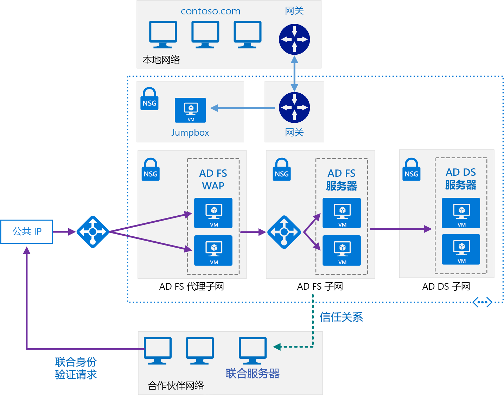

# <a name="extend-active-directory-federation-services-ad-fs-to-azure"></a>将 Active Directory 联合身份验证服务 (AD FS) 扩展到 Azure

此参考体系结构实现一个安全混合网络，该网络将本地网络扩展到 Azure，并使用 [Active Directory 联合身份验证服务 (AD FS)][active-directory-federation-services] 为 Azure 中运行的组件执行联合身份验证和授权。 [**部署此解决方案**](#deploy-the-solution)。



下载此体系结构的 [Visio 文件][visio-download]。

AD FS 可以在本地进行承载，但是如果应用程序是其中某些部分在 Azure 中实现的混合体，则在云中复制 AD FS 可能会更加高效。

该图显示以下方案：

- 来自合作伙伴组织的应用程序代码访问在 Azure VNet 中承载的 Web 应用程序。
- 凭据存储在 Active Directory 域服务 (DS) 中的外部已注册用户访问在 Azure VNet 中承载的 Web 应用程序。
- 使用授权设备连接到 VNet 的用户执行在 Azure VNet 中承载的 Web 应用程序。

此体系结构的典型用途包括：

- 在本地运行一部分工作负荷，在 Azure 中运行一部分工作负荷的混合应用程序。
- 使用联合授权向合作伙伴组织公开 Web 应用程序的解决方案。
- 支持从组织防火墙外部运行的 Web 浏览器进行访问的系统。
- 使用户可以通过从授权外部设备（如远程计算机、笔记本电脑和其他移动设备）进行连接来访问 Web 应用程序的系统。

此参考体系结构侧重于被动联合，其中由联合服务器决定如何以及何时对用户进行身份验证。 用户在启动应用程序时提供登录信息。 此机制最常由 Web 浏览器使用，涉及将浏览器重定向到对用户进行身份验证的站点的协议。 AD FS 还支持主动联合，其中应用程序负责提供凭据，无需进一步的用户交互，但是该方案不在此体系结构的范围内。

有关其他注意事项，请参阅[选择用于将本地 Active Directory 与 Azure 相集成的解决方案][considerations]。

## <a name="architecture"></a>体系结构

此体系结构扩展在[将 AD DS 扩展到 Azure][extending-ad-to-azure] 中介绍的实现。 它包含以下组件。

- **AD DS 子网**。 AD DS 服务器包含在其自己的子网中，具有充当防火墙的网络安全组 (NSG) 规则。

- **AD DS 服务器**。 作为 VM 在 Azure 中运行的域控制器。 这些服务器提供域中的本地标识的身份验证。

- **AD FS 子网**。 AD FS 服务器位于其自己的子网中，具有充当防火墙的 NSG 规则。

- **AD FS 服务器**。 AD FS 服务器提供联合授权和身份验证。 在此体系结构中，它们执行以下任务：

  - 代表合作伙伴用户接收包含由合作伙伴联合服务器发出的声明的安全令牌。 AD FS 先验证令牌是否有效，然后将声明传递给在 Azure 中运行的 Web 应用程序以对请求进行授权。

    在 Azure 中运行的应用程序是信赖方。 合作伙伴联合服务器必须发出由 Web 应用程序理解的声明。 合作伙伴联合服务器称为帐户伙伴，因为它们代表合作伙伴组织中经过身份验证的帐户提交访问请求。 AD FS 服务器称为资源伙伴，因为它们提供对资源（Web 应用程序）的访问。

  - 使用 AD DS 和 [Active Directory 设备注册服务][ADDRS]，对运行需要访问 Web 应用程序的 Web 浏览器或设备的外部用户发出的传入请求进行身份验证和授权。

  AD FS 服务器配置为通过 Azure 负载均衡器访问的场。 此实现可提高可用性和可伸缩性。 AD FS 服务器不直接向 Internet 公开。 所有 Internet 流量都通过 AD FS Web 应用程序代理服务器和 DMZ（也称为外围网络）进行筛选。

  有关 AD FS 工作原理的详细信息，请参阅 [Active Directory 联合身份验证服务概述][active-directory-federation-services-overview]。 此外，[Azure 中的 AD FS 部署][adfs-intro]一文包含实现的详细分步介绍。

- **AD FS 代理子网**。 AD FS 代理服务器可以包含在其自己的子网中，并具有提供保护的 NSG 规则。 此子网中的服务器通过在 Azure 虚拟网络与 Internet 之间提供防火墙的一组网络虚拟设备向 Internet 公开。

- **AD FS Web 应用程序代理 (WAP) 服务器**。 这些 VM 充当用于来自合作伙伴组织和外部设备的传入请求的 AD FS 服务器。 WAP 服务器充当筛选器，使得无法从 Internet 直接访问 AD FS 服务器。 与 AD FS 服务器一样，在具有负载均衡的场中部署 WAP 服务器可提供比部署独立服务器集合更高的可用性和可伸缩性。

  > [!NOTE]
  > 有关安装 WAP 服务器的详细信息，请参阅[安装和配置 Web 应用程序代理服务器][install_and_configure_the_web_application_proxy_server]
  >

- **合作伙伴组织**。 运行的 Web 应用程序请求访问在 Azure 中运行的 Web 应用程序的合作伙伴组织。 合作伙伴组织中的联合服务器在本地对请求进行身份验证，并将包含声明的安全令牌提交到在 Azure 中运行的 AD FS。 Azure 中的 AD FS 会验证安全令牌，如果有效，则可以将声明传递给在 Azure 中运行的 Web 应用程序以对它们进行授权。

  > [!NOTE]
  > 还可以使用 Azure 网关配置 VPN 隧道，以便为受信任合作伙伴提供对 AD FS 的直接访问。 从这些合作伙伴接收的请求不会经过 WAP 服务器。
  >

## <a name="recommendations"></a>建议

以下建议适用于大多数方案。 除非有优先于这些建议的特定要求，否则请遵循这些建议。

### <a name="networking-recommendations"></a>网络建议

使用静态专用 IP 地址为承载 AD FS 和 WAP 服务器的每个 VM 配置网络接口。

请勿向 AD FS VM 提供公共 IP 地址。 有关详细信息，请参阅[安全注意事项](#security-considerations)部分。

为每个 AD FS 和 WAP VM 的网络接口设置首选和辅助域名服务 (DNS) 服务器的 IP 地址，以引用 Active Directory DS VM。 Active Directory DS VM 应运行 DNS。 使每个 VM 可以加入域需要此步骤。

### <a name="ad-fs-installation"></a>AD FS 安装

文章[部署联合服务器场][Deploying_a_federation_server_farm]提供了有关安装和配置 AD FS 的详细说明。 在场中配置第一台 AD FS 服务器之前执行以下任务：

1. 获取用于执行服务器身份验证的公开受信任证书。 使用者名称必须包含客户端用于访问联合身份验证服务的名称。 这可以是为负载均衡器注册的 DNS 名称，例如 adfs.contoso.com（出于安全原因，请避免使用通配符名称，如 *.contoso.com）。 在所有 AD FS 服务器 VM 上使用相同证书。 可以从受信任证书颁发机构购买证书，但如果组织使用 Active Directory 证书服务，则可以创建自己的证书。

    使用者可选名称由设备注册服务 (DRS) 用于启用从外部设备进行的访问。 这应采用 enterpriseregistration.contoso.com 的形式。

    有关详细信息，请参阅[为 AD FS 获取并配置安全套接字层 (SSL) 证书][adfs_certificates]。

2. 在域控制器上，为密钥分发服务生成新的根密钥。 将有效时间设置为当前时间减 10 小时（此配置会减少在域中分发和同步密钥时可能发生的延迟）。 支持创建用于运行 AD FS 服务的组服务帐户需要此步骤。 以下 PowerShell 命令演示有关如何执行此操作的示例：

    ```powershell
    Add-KdsRootKey -EffectiveTime (Get-Date).AddHours(-10)
    ```

3. 将每个 AD FS 服务器 VM 添加到域。

> [!NOTE]
> 若要安装 AD FS，为域运行主域控制器 (PDC) 仿真器灵活单主机操作 (FSMO) 角色的域控制器必须正在运行并且可从 AD FS VM 进行访问。 <<RBC：是否可通过某种方法减少此内容的重复性？>>
>

### <a name="ad-fs-trust"></a>AD FS 信任

在 AD FS 安装与任何合作伙伴组织的联合服务器之间建立联合身份验证信任。 配置所需的任何声明筛选和映射。

- 每个合作伙伴组织的 DevOps 员工必须添加信赖方信任，以便可通过 AD FS 服务器访问 Web 应用程序。
- 组织中的 DevOps 员工必须配置声明提供方信任，以便使 AD FS 服务器可以信任合作伙伴组织提供的声明。
- 组织中的 DevOps 员工还必须配置 AD FS 以将声明传递给组织的 Web 应用程序。

有关详细信息，请参阅[建立联合身份验证信任][establishing-federation-trust]。

通过 WAP 服务器使用预身份验证发布组织的 Web 应用程序并将它们提供给外部合作伙伴。 有关详细信息，请参阅[使用 AD FS 预身份验证发布应用程序][publish_applications_using_AD_FS_preauthentication]

AD FS 支持令牌转换和扩大。 Azure Active Directory 不提供此功能。 借助 AD FS，在设置信任关系时可以：

- 为授权规则配置声明转换。 例如，可以将组安全性从非 Microsoft 合作伙伴组织使用的表示形式映射到 Active Directory DS 可以在组织中授权的某种内容。
- 将声明从一种格式转换为另一种格式。 例如，如果应用程序仅支持 SAML 1.1 声明，则可以从 SAML 2.0 映射到 SAML 1.1。

### <a name="ad-fs-monitoring"></a>AD FS 监视

[适用于 Active Directory 联合身份验证服务 2012 R2 的 Microsoft System Center 管理包][oms-adfs-pack]为联合服务器提供 AD FS 部署的主动和被动监视。 此管理包监视：

- AD FS 服务在其事件日志中记录的事件。
- AD FS 性能计数器收集的性能数据。
- AD FS 系统和 Web 应用程序（信赖方）的总体运行状况，提供针对关键问题和警告的警报。

## <a name="scalability-considerations"></a>可伸缩性注意事项

从文章[规划 AD FS 部署][plan-your-adfs-deployment]中汇总的以下注意事项为调整 AD FS 场规模提供了起点：

- 如果用户数少于 1000，请勿创建专用服务器，而是改为在云中的每台 Active Directory DS 服务器上安装 AD FS。 确保具有至少两台 Active Directory DS 服务器以保持可用性。 创建单台 WAP 服务器。
- 如果用户数介于 1000 与 15000 之间，请创建两台专用 AD FS 服务器和两台专用 WAP 服务器。
- 如果用户数介于 15000 与 60000 之间，请创建三到五台专用 AD FS 服务器和至少两台专用 WAP 服务器。

这些注意事项假设在 Azure 中使用双四核 VM（标准 D4_v2 或更好）大小。

如果使用 Windows 内部数据库存储 AD FS 配置数据，则场中仅限八台 AD FS 服务器。 如果预计在将来需要更多服务器，请使用 SQL Server。 有关详细信息，请参阅 [AD FS 配置数据库的角色][adfs-configuration-database]。

## <a name="availability-considerations"></a>可用性注意事项

创建具有至少两台服务器的 AD FS 场以提高服务的可用性。 为场中的每个 AD FS VM 使用不同的存储帐户。 此方法可帮助确保单个存储帐户中的故障不会使整个场不可访问。

为 AD FS 和 WAP VM 创建单独的 Azure 可用性集。 确保每个集中至少有两个 VM。 每个可用性集必须具有至少两个更新域和两个容错域。

按如下所示为 AD FS VM 和 WAP VM 配置负载均衡器：

- 使用 Azure 负载均衡器提供对 WAP VM 的外部访问，并使用内部负载均衡器在场中的 AD FS 服务器之间分布负载。
- 仅将在端口 443 (HTTPS) 上出现的流量传递给 AD FS/WAP 服务器。
- 为负载均衡器提供静态 IP 地址。
- 使用 HTTP 针对 `/adfs/probe` 创建运行状况探测。 有关详细信息，请参阅[硬件负载均衡器运行状况检查和 Web 应用程序代理/AD FS 2012 R2](https://blogs.technet.microsoft.com/applicationproxyblog/2014/10/17/hardware-load-balancer-health-checks-and-web-application-proxy-ad-fs-2012-r2/)。

  > [!NOTE]
  > AD FS 服务器使用服务器名称指示 (SNI) 协议，因此尝试从负载均衡器使用 HTTPS 终结点进行探测会失败。
  >

- 将 DNS A 记录添加到 AD FS 负载均衡器的域。 指定负载均衡器的 IP 地址，并为它提供域中的名称（例如 adfs.contoso.com）。 这是客户端和 WAP 服务器用于访问 AD FS 服务器场的名称。

可以使用 SQL Server 或 Windows 内部数据库保存 AD FS 配置信息。 Windows 内部数据库提供基本冗余。 更改仅仅直接写入 AD FS 群集中的一个 AD FS 数据库，而其他服务器使用请求复制使其数据库保持最新状态。 使用 SQL Server 可以提供完整数据库冗余和高可用性（使用故障转移群集或镜像）。

## <a name="manageability-considerations"></a>可管理性注意事项

DevOps 员工应准备好执行以下任务：

- 管理联合服务器，包括管理 AD FS 场、管理联合服务器上的信任策略以及管理联合身份验证服务使用的证书。
- 管理 WAP 服务器，包括管理 WAP 场和证书。
- 管理 Web 应用程序，包括配置信赖方、身份验证方法和声明映射。
- 备份 AD FS 组件。

## <a name="security-considerations"></a>安全注意事项

AD FS 使用 HTTPS，因此请确保包含 Web 层 VM 的子网的 NSG 规则允许 HTTPS 请求。 这些请求可能源自本地网络、包含 Web 层、业务层、数据层、专用外围网络、公共外围网络的子网以及包含 AD FS 服务器的子网。

阻止向 Internet 直接公开 AD FS 服务器。 AD FS 服务器是具有完整授权，可授予安全令牌的已加入域的计算机。 如果服务器受到损害，则恶意用户可以向所有 Web 应用程序并向 AD FS 保护的所有联合服务器颁发完全访问令牌。 如果系统必须处理不是从受信任合作伙伴站点连接的外部用户发出的请求，请使用 WAP 服务器处理这些请求。 有关详细信息，请参阅[放置联合服务器代理的位置][where-to-place-an-fs-proxy]。

将 AD FS 服务器和 WAP 服务器放置在具有自己的防火墙的单独子网中。 可以使用 NSG 规则定义防火墙规则。 所有防火墙都应允许端口 443 (HTTPS) 上的流量。

限制对 AD FS 和 WAP 服务器的直接登录访问。 只有 DevOps 员工才应能够连接。 请勿将 WAP 服务器加入域。

请考虑使用一组网络虚拟设备，它们记录有关遍历虚拟网络边缘的流量的详细信息以用于审核。

## <a name="deploy-the-solution"></a>部署解决方案

[GitHub][github] 上提供了此体系结构的部署。 请注意，整个部署最长可能需要花费两个小时，包括创建 VPN 网关和运行配置 Active Directory 和 AD FS 的脚本。

### <a name="prerequisites"></a>先决条件

1. 克隆、下载 [GitHub 存储库](https://github.com/mspnp/identity-reference-architectures)的 zip 文件或创建其分库。

1. 安装 [Azure CLI 2.0](/cli/azure/install-azure-cli?view=azure-cli-latest)。

1. 安装 [Azure 构建基块](https://github.com/mspnp/template-building-blocks/wiki/Install-Azure-Building-Blocks) npm 包。

   ```bash
   npm install -g @mspnp/azure-building-blocks
   ```

1. 在命令提示符、bash 提示符或 PowerShell 提示符下，按如下所示登录到你的 Azure 帐户：

   ```bash
   az login
   ```

### <a name="deploy-the-simulated-on-premises-datacenter"></a>部署模拟的本地数据中心

1. 导航到 GitHub 存储库的 `adfs` 文件夹。

1. 打开 `onprem.json` 文件。 搜索 `adminPassword`、`Password`、`SafeModeAdminPassword` 的实例并更新密码。

1. 运行以下命令，并等待部署完成：

    ```bash
    azbb -s <subscription_id> -g <resource group> -l <location> -p onprem.json --deploy
    ```

### <a name="deploy-the-azure-infrastructure"></a>部署 Azure 基础结构

1. 打开 `azure.json` 文件。  搜索 `adminPassword` 和 `Password` 的实例并添加密码值。

1. 运行以下命令，并等待部署完成：

    ```bash
    azbb -s <subscription_id> -g <resource group> -l <location> -p azure.json --deploy
    ```

### <a name="set-up-the-ad-fs-farm"></a>设置 AD FS 场

1. 打开 `adfs-farm-first.json` 文件。  搜索 `AdminPassword` 并替换默认密码。

1. 运行以下命令：

    ```bash
    azbb -s <subscription_id> -g <resource group> -l <location> -p adfs-farm-first.json --deploy
    ```

1. 打开 `adfs-farm-rest.json` 文件。  搜索 `AdminPassword` 并替换默认密码。

1. 运行以下命令，并等待部署完成：

    ```bash
    azbb -s <subscription_id> -g <resource group> -l <location> -p adfs-farm-rest.json --deploy
    ```

### <a name="configure-ad-fs-part-1"></a>配置 AD FS（第 1 部分）

1. 与名为 `ra-adfs-jb-vm1` 的 VM 建立远程桌面会话，该 VM 为 Jumpbox VM。 用户名为 `testuser`。

1. 通过 Jumpbox 与名为 `ra-adfs-proxy-vm1` 的 VM 建立远程桌面会话。 专用 IP 地址为 10.0.6.4。

1. 通过这个远程桌面会话运行 [PowerShell ISE](/powershell/scripting/components/ise/windows-powershell-integrated-scripting-environment--ise-)。

1. 在 PowerShell 中，导航到以下目录：

    ```powershell
    C:\Packages\Plugins\Microsoft.Powershell.DSC\2.77.0.0\DSCWork\adfs-v2.0
    ```

1. 将以下代码粘贴到脚本窗格中并运行它：

    ```powershell
    . .\adfs-webproxy.ps1
    $cd = @{
        AllNodes = @(
            @{
                NodeName = 'localhost'
                PSDscAllowPlainTextPassword = $true
                PSDscAllowDomainUser = $true
            }
        )
    }

    $c1 = Get-Credential -UserName testuser -Message "Enter password"
    InstallWebProxyApp -DomainName contoso.com -FederationName adfs.contoso.com -WebApplicationProxyName "Contoso App" -AdminCreds $c1 -ConfigurationData $cd
    Start-DscConfiguration .\InstallWebProxyApp
    ```

    出现 `Get-Credential` 提示时，输入在部署参数文件中指定的密码。

1. 运行以下命令，监视 [DSC](/powershell/dsc/overview/overview) 配置的进度：

    ```powershell
    Get-DscConfigurationStatus
    ```

    实现一致性可能需要数分钟。 在此期间，可能会看到命令中的错误。 如果配置成功，则输出应如下所示：

    ```powershell
    PS C:\Packages\Plugins\Microsoft.Powershell.DSC\2.77.0.0\DSCWork\adfs-v2.0> Get-DscConfigurationStatus

    Status     StartDate                 Type            Mode  RebootRequested      NumberOfResources
    ------     ---------                 ----            ----  ---------------      -----------------
    Success    12/17/2018 8:21:09 PM     Consistency     PUSH  True                 4
    ```

### <a name="configure-ad-fs-part-2"></a>配置 AD FS（第 2 部分）

1. 通过 Jumpbox 与名为 `ra-adfs-proxy-vm2` 的 VM 建立远程桌面会话。 专用 IP 地址为 10.0.6.5。

1. 通过这个远程桌面会话运行 [PowerShell ISE](/powershell/scripting/components/ise/windows-powershell-integrated-scripting-environment--ise-)。

1. 导航到以下目录：

    ```powershell
    C:\Packages\Plugins\Microsoft.Powershell.DSC\2.77.0.0\DSCWork\adfs-v2.0
    ```

1. 将以下内容粘贴到脚本窗格中并运行此脚本：

    ```powershell
    . .\adfs-webproxy-rest.ps1
    $cd = @{
        AllNodes = @(
            @{
                NodeName = 'localhost'
                PSDscAllowPlainTextPassword = $true
                PSDscAllowDomainUser = $true
            }
        )
    }

    $c1 = Get-Credential -UserName testuser -Message "Enter password"
    InstallWebProxy -DomainName contoso.com -FederationName adfs.contoso.com -WebApplicationProxyName "Contoso App" -AdminCreds $c1 -ConfigurationData $cd
    Start-DscConfiguration .\InstallWebProxy
    ```

    出现 `Get-Credential` 提示时，输入在部署参数文件中指定的密码。

1. 运行以下命令，监视 DSC 配置的进度：

    ```powershell
    Get-DscConfigurationStatus
    ```

    实现一致性可能需要数分钟。 在此期间，可能会看到命令中的错误。 如果配置成功，则输出应如下所示：

    ```powershell
    PS C:\Packages\Plugins\Microsoft.Powershell.DSC\2.77.0.0\DSCWork\adfs-v2.0> Get-DscConfigurationStatus

    Status     StartDate                 Type            Mode  RebootRequested      NumberOfResources
    ------     ---------                 ----            ----  ---------------      -----------------
    Success    12/17/2018 8:21:09 PM     Consistency     PUSH  True                 4
    ```

    有时候，此 DSC 会失败。 如果状态检查显示 `Status=Failure` 和 `Type=Consistency`，请尝试重新运行步骤 4。

### <a name="sign-into-ad-fs"></a>登录 AD FS

1. 通过 Jumpbox 与名为 `ra-adfs-adfs-vm1` 的 VM 建立远程桌面会话。 专用 IP 地址为 10.0.5.4。

1. 按照[启用 Idp 启动的登录页](/windows-server/identity/ad-fs/troubleshooting/ad-fs-tshoot-initiatedsignon#enable-the-idp-intiated-sign-on-page)中的步骤启用登录页。

1. 从 Jumpbox 浏览到 `https://adfs.contoso.com/adfs/ls/idpinitiatedsignon.htm`。 可能会收到证书警告，对于此测试，可以忽略它。

1. 验证 Contoso Corporation 登录页是否出现。 以 contoso\testuser 身份登录。

<!-- links -->
[extending-ad-to-azure]: adds-extend-domain.md

[vm-recommendations]: ../virtual-machines-windows/single-vm.md
[implementing-a-secure-hybrid-network-architecture]: ../dmz/secure-vnet-hybrid.md
[implementing-a-secure-hybrid-network-architecture-with-internet-access]: ../dmz/secure-vnet-dmz.md
[hybrid-azure-on-prem-vpn]: ../hybrid-networking/vpn.md

[azure-cli]: /azure/azure-resource-manager/xplat-cli-azure-resource-manager
[DRS]: https://technet.microsoft.com/library/dn280945.aspx
[where-to-place-an-fs-proxy]: https://technet.microsoft.com/library/dd807048.aspx
[ADDRS]: https://technet.microsoft.com/library/dn486831.aspx
[plan-your-adfs-deployment]: https://msdn.microsoft.com/library/azure/dn151324.aspx
[ad_network_recommendations]: #network_configuration_recommendations_for_AD_DS_VMs
[adfs_certificates]: https://technet.microsoft.com/library/dn781428(v=ws.11).aspx
[create_service_account_for_adfs_farm]: https://technet.microsoft.com/library/dd807078.aspx
[adfs-configuration-database]: https://technet.microsoft.com/library/ee913581(v=ws.11).aspx
[active-directory-federation-services]: /windows-server/identity/active-directory-federation-services
[security-considerations]: #security-considerations
[recommendations]: #recommendations
[active-directory-federation-services-overview]: https://technet.microsoft.com/library/hh831502(v=ws.11).aspx
[establishing-federation-trust]: https://blogs.msdn.microsoft.com/alextch/2011/06/27/establishing-federation-trust/
[Deploying_a_federation_server_farm]:  /windows-server/identity/ad-fs/deployment/deploying-a-federation-server-farm
[install_and_configure_the_web_application_proxy_server]: https://technet.microsoft.com/library/dn383662.aspx
[publish_applications_using_AD_FS_preauthentication]: https://technet.microsoft.com/library/dn383640.aspx
[managing-adfs-components]: https://technet.microsoft.com/library/cc759026.aspx
[oms-adfs-pack]: https://www.microsoft.com/download/details.aspx?id=41184
[azure-powershell-download]: /powershell/azure/overview
[aad]: /azure/active-directory/
[aadb2c]: /azure/active-directory-b2c/
[adfs-intro]: /azure/active-directory/hybrid/whatis-hybrid-identity
[github]: https://github.com/mspnp/identity-reference-architectures/tree/master/adfs
[adfs_certificates]: https://technet.microsoft.com/library/dn781428(v=ws.11).aspx
[considerations]: ./considerations.md
[visio-download]: https://archcenter.blob.core.windows.net/cdn/identity-architectures.vsdx
