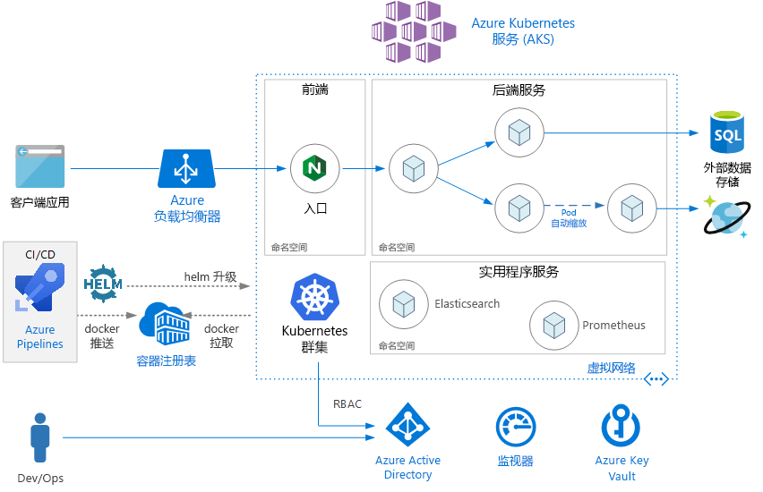
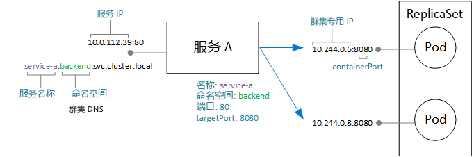
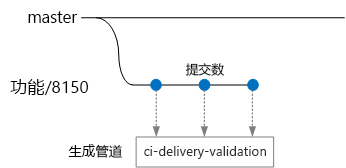
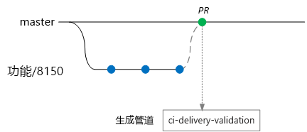
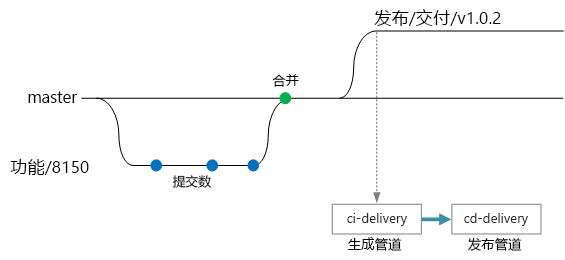

# <a name="microservices-architecture-on-azure-kubernetes-service-aks"></a>Azure Kubernetes 服务 (AKS) 中的微服务体系结构

本参考体系结构演示一个部署到 Azure Kubernetes 服务 (AKS) 中的微服务应用程序。 其中演示的基本 AKS 配置可用作大多数部署的起点。 更高级的选项（包括高级网络选项）将在单独的参考体系结构中予以介绍。

本文假设读者基本了解 Kubernetes。 本文侧重于有关在 AKS 中运行微服务体系结构的基础结构和 DevOps 注意事项。 有关如何从域驱动设计 (DDD) 立场设计微服务的指导，请参阅[在 Azure 中设计、构建和操作微服务](/azure/architecture/microservices)。

> [!NOTE]
> 我们目前正在制作本文随附的参考实现 (RI)，预计在 2019 年初期发布。 到时本文将会更新，以纳入该 RI 中的其他最佳做法。



## <a name="architecture"></a>体系结构

该体系结构包括以下组件。

**Azure Kubernetes 服务** (AKS)。 AKS 是可以部署 Kubernetes 托管群集的 Azure 服务。 

**Kubernetes 群集**。 AKS 负责部署 Kubernetes 群集和管理 Kubernetes 主节点。 你只需管理代理节点。

虚拟网络。 默认情况下，AKS 会创建一个要将代理节点部署到的虚拟网络。 对于更高级的方案，可以先创建虚拟网络，这样便可以控制子网的配置方式、本地连接和 IP 寻址等设置。 有关详细信息，请参阅[在 Azure Kubernetes 服务 (AKS) 中配置高级网络](/azure/aks/configure-advanced-networking)。

**入口**。 入口向群集中的服务公开 HTTP(S) 路由。 有关详细信息，请参阅下面的 [API 网关](#api-gateway)部分。

**外部数据存储**。 微服务通常是无状态的，会将状态写入 Azure SQL 数据库或 Cosmos DB 等外部数据存储。

**Azure Active Directory**。 AKS 使用 Azure Active Directory (Azure AD) 标识来创建和管理 Azure 负载均衡器等其他 Azure 资源。 对于客户端应用程序中的用户身份验证，也建议使用 Azure AD。

**Azure 容器注册表**。 使用容器注册表来存储部署到群集中的专用 Docker 映像。 AKS 可以使用 Azure AD 标识在容器注册表中进行身份验证。 请注意，AKS 不需要 Azure 容器注册表。 可以使用其他容器注册表，例如 Docker 中心。

**Azure Pipelines**。 管道是 Azure DevOps 服务的一部分，可运行自动化的生成、测试和部署。 也可以使用 Jenkins 等第三方 CI/CD 解决方案。 

**Helm**。 Helm 是 Kubernetes 的包管理器 &mdash; 使用它可将 Kubernetes 对象捆绑为单个可以发布、部署、进行版本控制和更新的单元。

**Azure Monitor**。 Azure Monitor 收集并存储指标和日志，包括解决方案中 Azure 服务的平台指标，以及应用程序遥测数据。 使用此数据可以监视应用程序、设置警报和仪表板，以及针对故障执行根本原因分析。 Azure Monitor 与 AKS 相集成，可以从控制器、节点和容器收集指标，并可以收集容器日志和主节点日志。

## <a name="design-considerations"></a>设计注意事项

本参考体系结构侧重于微服务体系结构，不过，许多建议的做法同样适用于 AKS 上运行的其他工作负荷。

### <a name="microservices"></a>微服务

Kubernetes 服务对象是为 Kubernetes 中的微服务建模的自然方式。 微服务是松散耦合的、可独立部署的代码单元。 微服务通常通过妥善定义的 API 进行通信，可以通过某种形式的服务发现来发现它们。 Kubernetes 服务对象提供一组符合以下要求的功能：

- IP 地址。 服务对象为一组 pod（副本集）提供静态内部 IP 地址。 创建或移动 pod 时，始终可以通过此内部 IP 地址访问服务。

- 负载均衡。 发送到服务 IP 地址的流量在 pod 中进行负载均衡。 

- 服务发现。 Kubernetes DNS 服务为服务分配内部 DNS 条目。 这意味着，API 网关可以使用 DNS 名称调用后端服务。 可以使用相同的机制进行服务间的通信。 DNS 条目按命名空间进行组织，因此，如果命名空间对应于边界上下文，则服务的 DNS 名称将以自然方式映射到应用程序域。

下图演示了服务与 pod 之间的概念关系。 到终结点 IP 地址和端口的实际映射由 Kubernetes 网络代理 kube-proxy 执行。



### <a name="api-gateway"></a>API Gateway

API 网关是位于外部客户端与微服务之间的网关。 它充当反向代理，将来自客户端的请求路由到微服务。 它还可以执行各种横切任务，例如身份验证、SSL 终止和速率限制。 

可按以下方式划分网关提供的功能：

- [网关路由](../../patterns/gateway-routing.md)：将客户端请求路由到适当的后端服务。 这样可为客户端提供单一终结点，帮助将客户端与服务分开。

- [网关聚合](../../patterns/gateway-aggregation.md)：将多个请求聚合成单个请求，以减少客户端与后端之间的通信频率。

- [网关卸载](../../patterns/gateway-offloading.md)。 网关可以分担后端服务的功能，例如 SSL 终止、身份验证、IP 允许列表或客户端速率限制（限制）。

API 网关是一种通用的[微服务设计模式](https://microservices.io/patterns/apigateway.html)。 可以使用多种不同的技术来实施 API 网关。 最常见的实施方案可能是在群集中部署边缘路由器或反向代理，例如 Nginx、HAProxy 或 Traefik。 

其他选项包括：

- Azure 应用程序网关和/或 Azure API 管理，两者都是群集外部的托管服务。 应用程序网关入口控制器目前为 beta 版。

- Azure Functions 代理。 代理可以修改请求和响应，并可基于 URL 路由请求。

Kubernetes **入口**资源类型可以抽象化代理服务器的配置设置。 它与入口控制器配合使用。入口控制器提供入口的底层实现。 Nginx、HAProxy、Traefik 和应用程序网关（预览版）等服务都有入口控制器。

入口控制器处理代理服务器的配置。 通常，这些服务需要复杂的配置文件，如果你不精通这些技术，则可能很难优化这些文件。因此，入口控制器是一种不错的抽象。 此外，入口控制器可以访问 Kubernetes API，因此，使用它可以在路由和负载均衡方面做出明智的决策。 例如，Nginx 入口控制器可绕过 kube-proxy 网络代理。

另一方面，如果你想要对设置拥有完全控制权，则可能需要绕过这种抽象，并手动配置代理服务器。 

反向代理服务器是潜在的瓶颈或单一故障点，因此，应至少部署两个副本以实现高可用性。

### <a name="data-storage"></a>数据存储

在微服务体系结构中，服务不应共享数据存储。 每个服务应在单独的逻辑存储中拥有自身的专用数据，以避免服务之间存在隐藏的依赖关系。 原因是避免服务之间出现意外耦合 - 如果服务共享相同的底层数据架构，就会发生这种情况。 此外，当服务管理自身的数据存储时，可以使用适当的数据存储来满足特定的要求。 有关详细信息，请参阅[设计微服务：数据注意事项](/azure/architecture/microservices/data-considerations)。

避免在本地群集存储中存储持久性数据，因为这会将数据绑定到节点。 应该 

- 使用 Azure SQL 数据库或 Cosmos DB 等外部服务，或者

- 使用 Azure 磁盘或 Azure 文件装载持久性卷。 如果同一个卷需要由多个 pod 共享，请使用 Azure 文件。

### <a name="namespaces"></a>命名空间

使用命名空间来组织群集中的服务。 Kubernetes 群集中的每个对象属于某个命名空间。 默认情况下，在创建新对象时，该对象将划归到 `default` 命名空间。 但是，良好的做法是创建更具描述性的命名空间，以帮助组织群集中的资源。

首先，命名空间有助于防止命名冲突。 如果多个团队将微服务（也许有数百个）部署到同一群集，而这些微服务都属于同一命名空间，则管理就会变得艰难。 此外，命名空间还允许：

- 将资源约束应用到命名空间，以避免分配到该命名空间的 pod 集总数超过该命名空间的资源配额。

- 在命名空间级别应用策略，包括 RBAC 和安全策略。

对于微服务体系结构，考虑将微服务组织成边界上下文，并为每个边界上下文创建命名空间。 例如，与“订单履行”边界上下文相关的所有微服务可以划归到同一命名空间。 或者，为每个开发团队创建一个命名空间。

将公用服务放入其自身的独立命名空间。 例如，可以部署 Elasticsearch 或 Prometheus 进行群集监视，或者为 Helm 部署 Tiller。

## <a name="scalability-considerations"></a>可伸缩性注意事项

Kubernetes 支持两个级别的横向扩展：

- 增加分配给部署的 pod 数。
- 扩展群集中的节点，以增加群集可用的计算资源总量。

尽管可以手动横向扩展 pod 和节点，但我们建议使用自动缩放，以尽量减少在负载较高的情况下，服务遇到资源严重不足的可能性。 自动缩放策略必须同时考虑到 pod 和节点。 如果只是横向扩展 pod，则最终会达到节点的资源限制。 

### <a name="pod-autoscaling"></a>Pod 自动缩放

Horizontal Pod Autoscaler (HPA) 可以根据观察到的 CPU、内存或自定义指标缩放 pod。 若要配置水平 pod 缩放，请指定目标指标（例如，70% 的 CPU），以及最小和最大副本数。 应该对服务进行负载测试，以派生这些数字。

自动缩放的负面影响是发生横向扩展和缩减事件时，会更频繁地创建或逐出 pod。 缓解这种影响的方法：

- 使用就绪情况探测来让 Kubernetes 知道新 pod 已准备好接受流量。
- 使用 pod 中断预算来限制每次可从服务中逐出的 pod 数。

### <a name="cluster-autoscaling"></a>群集自动缩放

群集自动缩放程序可以缩放节点数目。 如果由于资源约束而无法计划 pod，群集自动缩放程序将预配更多节点。  （注意：AKS 与群集自动缩放程序之间的集成目前以预览版提供。）

HPA 监视实际消耗的资源量以及正在运行的 pod 中的其他指标，而群集自动缩放程序是为尚未计划的 pod 预配节点。 因此，自动缩放程序将会监视部署的 Kubernetes pod 规范中指定的请求资源。 使用负载测试可以微调这些值。

创建群集后无法更改 VM 大小，因此，在创建群集时，应该进行某种形式的初始容量规划，以便为代理节点选择适当的 VM 大小。 

## <a name="availability-considerations"></a>可用性注意事项

### <a name="health-probes"></a>运行状况探测

Kubernetes 定义 pod 可以公开的两种类型的运行状况探测：

- 就绪情况探测：告知 Kubernetes pod 是否已准备好接受请求。

- 运行情况探测：告知 Kubernetes 是否应删除一个 pod 并启动新实例。

考虑探测的设置时，建议回顾 Kubernetes 中的服务工作原理。 服务提供与 pod 集（零个或多个）匹配的标签选择器。 Kubernetes 对发往匹配该选择器的 pod 的流量进行负载均衡。 只有成功启动且正常的 pod 才能收到流量。 如果某个容器崩溃，Kubernetes 会终止 pod，并计划替代的 pod。

有时，尽管某个 pod 已成功启动，但不一定已准备好接收流量。 例如，在执行初始化任务期间，容器中运行的应用程序会将内容载入内存或读取配置数据。 若要指示某个 pod 正常但尚未准备好接收流量，请定义就绪情况探测。 

运行情况探测可以处理 pod 仍在运行但不正常，应予以回收的情况。 例如，假设某个容器正在为 HTTP 请求提供服务，但出于某种原因而挂起。 该容器未崩溃，但已停止为任何请求提供服务。 如果定义了 HTTP 运行情况探测，则探测将停止响应，并告知 Kubernetes 重启 pod。

设计探测时请注意以下事项：

- 如果代码的启动时间较长，则可能存在以下风险：运行情况探测在启动完成之前报告故障。 为防止这种情况，请使用 initialDelaySeconds 设置来延迟探测的启动。

- 除非重启 pod 有可能会将其还原到正常状态，否则运行情况探测没有作用。 可以使用运行情况探测来防范内存泄漏或意外死锁，但是，没有必要重启立即会再发生故障的 pod。

- 有时，就绪情况探测可用于检查依赖服务。 例如，如果某个 pod 依赖于某个数据库，则运行情况探测可以检查数据库连接。 但是，此方法可能造成意外的问题。 外部服务可能出于某种原因而暂时不可用。 这会导致就绪情况探测无法针对服务中的所有 pod 运行，从而导致从负载均衡中删除所有这些 pod，进而又导致上游发生连锁故障。 更好的方法是在服务中实施重试处理，使服务能够从暂时性故障中正常恢复。

### <a name="resource-constraints"></a>资源约束

资源争用可能影响服务的可用性。 为容器定义资源约束，以避免单个容器占用过多的群集资源（内存和 CPU）。 对于非容器资源（例如线程或网络连接），请考虑使用[隔舱模式](/azure/architecture/patterns/bulkhead)来隔离资源。

使用资源配额限制允许命名空间使用的资源总量。 这样可以避免前端耗尽后端服务的资源，反之亦然。

## <a name="security-considerations"></a>安全注意事项

### <a name="role-based-access-control-rbac"></a>基于角色的访问控制 (RBAC)

Kubernetes 和 Azure 都提供基于角色的访问控制 (RBAC) 机制：

- Azure RBAC 控制对 Azure 中的资源的访问，还可以创建新的 Azure 资源。 可将权限分配给用户、组或服务主体。 （服务主体是应用程序使用的安全标识。）

- Kubernetes RBAC 控制 Kubernetes API 的权限。 例如，可以通过 RBAC 授权（或拒绝）用户执行创建 pod 和列出 pod 的操作。 若要将 Kubernetes 权限分配给用户，请创建角色和角色绑定：

  - 角色是在命名空间内部应用的一组权限。 权限定义为针对资源（pod、部署等）应用的谓词（获取、更新、创建、删除）。

  - 角色绑定将用户或组分配到角色。

  - 此外还有一个群集角色对象，该对象类似于角色，但会应用到整个群集中的所有命名空间。 若要将用户或组分配到群集角色，请创建群集角色绑定。

AKS 集成了这两种 RBAC 机制。 创建 AKS 群集时，可将其配置为使用 Azure AD 进行用户身份验证。 有关此设置的详细信息，请参阅[将 Azure Active Directory 与 Azure Kubernetes 服务集成](/azure/aks/aad-integration)。

完成此配置后，想要访问 Kubernetes API（例如，通过 kubectl）的用户必须使用其 Azure AD 凭据登录。

默认情况下，Azure AD 用户无权访问群集。 若要授予访问权限，群集管理员需创建引用 Azure AD 用户或组的角色绑定。 如果用户对特定的操作没有权限，则该操作将会失败。

如果用户默认没有访问权限，群集管理员最初又怎么有权创建角色绑定呢？ 实际上，AKS 群集提供两种类型的凭据来调用 Kubernetes API 服务器：群集用户和群集管理员凭据。群集管理员凭据授予群集的完全访问权限。 Azure CLI 命令 `az aks get-credentials --admin` 下载群集管理员凭据，并将其保存到 kubeconfig 文件中。 群集管理员可以使用此 kubeconfig 来创建角色和角色绑定。

由于群集管理员凭据的权限如此强大，因此需要使用 Azure RBAC 来限制其访问权限：

- “Azure Kubernetes 服务群集管理员角色”有权下载群集管理员凭据。 应该只将群集管理员分配到此角色。

- “Azure Kubernetes 服务群集用户角色”有权下载群集用户凭据。 可将非管理员用户分配到此角色。 此角色不会授予对群集中 Kubernetes 资源的任何特定权限 &mdash; 它只允许用户连接到 API 服务器。 

定义 RBAC 策略（Kubernetes 和 Azure）时，请考虑组织中的角色：

- 谁可以创建或删除 AKS 群集和下载管理员凭据？
- 谁可以管理群集？
- 谁可以创建或更新命名空间中的资源？

良好的做法是使用角色和角色绑定（而不是群集角色和群集角色绑定）按命名空间限定 Kubernetes RBAC 权限的范围。

最后还有这样一个问题：AKS 群集需要拥有哪些权限才能创建和管理负载均衡器、网络或存储等 Azure 资源。 若要使用 Azure API 对自身进行身份验证，群集可以使用 Azure AD 服务主体。 如果创建群集时未指定服务主体，则系统会自动创建一个服务主体。 但是，良好的安全做法是先创建服务主体，然后为其分配最少量的 RBAC 权限。 有关详细信息，请参阅 [Azure Kubernetes 服务中的服务主体](/azure/aks/kubernetes-service-principal)。

### <a name="secrets-management-and-application-credentials"></a>机密管理和应用程序凭据

应用程序和服务通常需要使用凭据连接到 Azure 存储或 SQL 数据库等外部服务。 此处的难题在于如何保护这些凭据的安全，避免将其透露。 

对于 Azure 资源，一种做法是使用托管标识。 托管标识的概念是指，应用程序或服务在 Azure AD 中存储一个标识，并使用此标识在 Azure 服务中进行身份验证。 在 Azure AD 中为应用程序或服务创建一个服务主体，应用程序或服务使用 OAuth 2.0 令牌进行身份验证。 正在执行的进程调用 localhost 地址来获取令牌。 这样，就不需要存储任何密码或连接字符串。 若要在 AKS 中使用托管标识，可以使用 [aad-pod-identity](https://github.com/Azure/aad-pod-identity) 项目将标识分配到单个 pod。

目前，并非所有 Azure 服务都支持使用托管标识进行身份验证。 有关列表，请参阅[支持 Azure AD 身份验证的 Azure 服务](/azure/active-directory/managed-identities-azure-resources/services-support-msi)。

即使使用托管标识，也可能需要存储某些凭据或其他应用程序机密，不管是对于不支持托管标识的 Azure 服务、第三方服务、API 密钥，还是其他服务。 下面是可安全存储机密的某些选项：

- Azure Key Vault。 在 AKS 中，可将 Key Vault 中的一个或多个机密装载为一个卷。 该卷从 Key Vault 读取机密。 然后，pod 可以像读取普通卷一样读取机密。 有关详细信息，请参阅 GitHub 中的 [Kubernetes-KeyVault-FlexVolume](https://github.com/Azure/kubernetes-keyvault-flexvol) 项目。

    pod 使用 pod 标识（如上所述）或者结合使用 Azure AD 服务主体和客户端机密对自身进行身份验证。 建议使用 pod 标识，因为这样就不需要客户端机密。 

- HashiCorp Vault。 Kubernetes 应用程序可以使用 Azure AD 托管标识在 HashiCorp Vault 中进行身份验证。 请参阅 [HashiCorp Vault 为 Azure Active Directory 代言](https://open.microsoft.com/2018/04/10/scaling-tips-hashicorp-vault-azure-active-directory/)。 可将 Vault 本身部署到 Kubernetes，但建议在不同于应用程序群集的单独专用群集中运行它。 

- Kubernetes 机密。 另一个选项是直接使用 Kubernetes 机密。 此选项最容易配置，但存在一些难题。 机密存储在分布式密钥-值存储 etcd 中。 AKS [静态加密 etcd](https://github.com/Azure/kubernetes-kms#azure-kubernetes-service-aks)。 Microsoft 管理加密密钥。

使用 HashiCorp Vault 或 Azure Key Vault 等系统可以获得多种优势，例如：

- 对机密进行集中控制。
- 确保所有机密静态加密。
- 集中式密钥管理。
- 对机密进行访问控制。
- 审核

### <a name="pod-and-container-security"></a>Pod 和容器安全性

当然，此列表并不详尽，不过，其中提供了有关保护 pod 和容器的一些建议做法： 

不要以特权模式运行容器。 特权模式可让容器访问主机上的所有设备。 可以设置 Pod 安全策略，以禁止容器以特权模式运行。 

如果可能，请避免以 root 身份在容器中运行进程。 从安全角度看，容器不能提供完全的隔离，因此，最好是以非特权用户的身份运行容器进程。 

将映像存储在受信任的专用注册表中，例如 Azure 容器注册表或 Docker 信任的注册表。 在 Kubernetes 中使用验证许可 Webhook，以确保 pod 只能从受信任的注册表提取映像。

使用 Azure 市场中提供的扫描解决方案（例如 Twistlock 和 Aqua）扫描映像中的已知漏洞。

使用 ACR 任务（Azure 容器注册表的一项功能）自动执行映像修补。 容器映像是在层中生成的。 基本层包括 OS 映像和应用程序框架映像，例如 ASP.NET Core 或 Node.js。 基本映像通常是由应用程序开发人员在上游创建的，由其他项目维护人员维护。 在上游修补这些映像时，必须更新、测试并重新部署自己的映像，以便不会留下任何已知的安全漏洞。 ACR 任务可以帮助将此过程自动化。

## <a name="deployment-cicd-considerations"></a>部署 (CI/CD) 注意事项

下面是微服务体系结构的可靠 CI/CD 过程的一些目标：

- 每个团队可以独立生成并部署自有的服务，而不影响或干扰其他团队。

- 新服务版本在部署到生产环境之前，会先部署到开发/测试/QA 环境进行验证。 在每个阶段强制实施质量控制。

- 新服务版本可以连同前一版本一起部署。

- 实施足够的访问控制策略。

- 可以信任部署到生产环境的容器映像。

### <a name="isolation-of-environments"></a>环境隔离

将在多个环境中部署服务，包括用于开发、版本验收测试、集成测试、负载测试和最终生产的环境。 这些环境需要某种程度的隔离。 在 Kubernetes 中，可以选择物理隔离或逻辑隔离。 物理隔离表示部署到独立的群集。 逻辑隔离利用前面所述的命名空间和策略。

我们建议创建专用的生产群集，并为开发/测试环境创建独立的群集。 使用逻辑隔离来隔离开发/测试群集中的环境。 部署到开发/测试群集的服务不得有权访问保存业务数据的数据存储。 

### <a name="helm"></a>Helm

考虑使用 Helm 来管理服务的生成和部署。 可帮助实现 CI/CD 的部分 Helm 功能包括：

- 将特定微服务的所有 Kubernetes 对象组织成单个 Helm 图表。
- 使用单个 Helm 命令而不是一系列 kubectl 命令部署该图表。
- 使用语义版本控制以及用于回滚到以前版本的功能来跟踪更新和修订。
- 使用模板来避免在多个文件之间复制标签和选择器等信息。
- 管理图表之间的依赖关系。
- 将图表发布到 Azure 容器注册表等 Helm 存储库，并将其与生成管道相集成。

有关将容器注册表用作 Helm 存储库的详细信息，请参阅[将 Azure 容器注册表用作应用程序图表的 Helm 存储库](/azure/container-registry/container-registry-helm-repos)。

### <a name="cicd-workflow"></a>CI/CD 工作流

在创建 CI/CD 工作流之前，必须了解如何对代码库进行结构设计和管理。

- 团队是在多个单独的存储库中工作，还是在一个 monorepo（单存储库）中工作？
- 什么是分库策略？
- 谁可以将代码推送到生产环境中？ 是否有发布经理角色？

首选单存储库方法，但二者各有优缺点。

| &nbsp; | 单存储库 | 多存储库 |
|--------|----------|----------------|
| **优点** | 代码共享<br/>更易于实现代码和工具的标准化<br/>更易于重构代码<br/>可发现性 - 代码的单一视图<br/> | 按团队清除所有权<br/>合并冲突可能会更少<br/>有助于强制分离微服务 |
| **挑战** | 对共享代码进行的更改可能影响多个微服务<br/>合并冲突可能会更多<br/>工具必须缩放成大型代码库<br/>访问控制<br/>部署过程更复杂 | 更难以共享代码<br/>更难以强制实施编码标准<br/>依赖项管理<br/>代码库分散，可发现性低<br/>缺少共享的基础架构

在此部分，我们根据以下假设演示可能的 CI/CD 工作流：

- 代码存储库为单存储库，文件夹按微服务进行组织。
- 团队的分库策略以[基于主库的开发](https://trunkbaseddevelopment.com/)为基础。
- 团队使用 [Azure Pipelines](/azure/devops/pipelines) 来运行 CI/CD 过程。
- 团队使用 Azure 容器注册表中的[命名空间](/azure/container-registry/container-registry-best-practices#repository-namespaces)将已获批在生产环境中使用的映像与仍在进行测试的映像隔离开来。

在此示例中，一位开发人员在名为“传送服务”的微服务上工作。 （此名称来自[此处](../../microservices/index.md#the-drone-delivery-application)所述的引用实现。）在开发新功能时，开发人员会将代码签入到某个功能分库中。



将提交内容推送到此分库会触发一个适用于微服务的 CI 生成。 根据约定，功能分库名为 `feature/*`。 [生成定义文件](/azure/devops/pipelines/yaml-schema)包括一个触发器，用于按分库名称和源路径进行筛选。 使用此方法，每个团队都可以有自己的生成管道。

```yaml
trigger:
  batch: true
  branches:
    include:
    - master
    - feature/*

    exclude:
    - feature/experimental/*

  paths:
     include:
     - /src/shipping/delivery/
```

在工作流中，CI 生成此时会运行某种最低程度的代码验证：

1. 生成代码
1. 运行单元测试

此处的理念是缩短生成时间，这样开发人员就可以获得快速反馈。 当此功能可以合并到主库中时，开发人员会打开一个 PR。 此时会触发另一个 CI 生成来执行一些其他的检查：

1. 生成代码
1. 运行单元测试
1. 生成运行时容器映像
1. 在映像上运行漏洞扫描



> [!NOTE]
> 在 Azure Repos 中，可以定义[策略](/azure/devops/repos/git/branch-policies)来保护分库。 例如，策略可以要求在合并到主库之前，必须成功完成 CI 生成并由审批人员签署同意书。

有时候，团队可以部署新版传送服务。 为此，发布经理会创建主库的分库，采用以下命名模式：`release/<microservice name>/<semver>`。 例如，`release/delivery/v1.0.2`。
这样就会触发一个完整的 CI 生成，该生成运行所有上述步骤并执行以下操作：

1. 向 Azure 容器注册表推送 Docker 映像。 该映像标记有版本号（取自分库名称）。
2. 运行 `helm package`，将 Helm 图表打包
3. 通过运行 `az acr helm push` 将 Helm 包推送到容器注册表。

假定此生成成功，它会使用 Azure Pipelines [发布管道](/azure/devops/pipelines/release/what-is-release-management)触发部署过程。 此管道

1. 通过运行 `helm upgrade` 将 Helm 图表部署到 QA 环境。
1. 审批者签署同意书，然后包就会转到生产环境。 请参阅[通过审批进行发布部署控制](/azure/devops/pipelines/release/approvals/approvals)。
1. 在 Azure 容器注册表中为生产命名空间重新标记 Docker 映像。 例如，如果当前标记为 `myrepo.azurecr.io/delivery:v1.0.2`，则生产标记为 `myrepo.azurecr.io/prod/delivery:v1.0.2`。
1. 通过运行 `helm upgrade` 将 Helm 图表部署到生产环境。



必须记住的是，即使在单存储库中，也可让这些任务的范围局限于单个微服务，这样团队就能快速进行部署。 此过程有一些手动步骤：审批 PR、创建发布分库，以及审批部署到生产群集中的内容。 根据策略，这些步骤是手动的 &mdash; 如果公司愿意，可以将其彻底变为自动。
