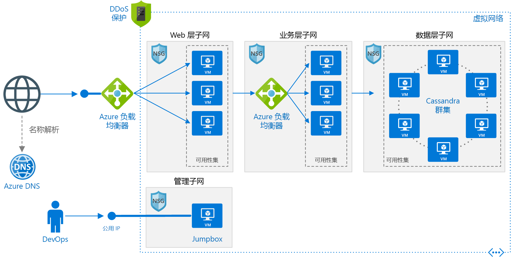

# <a name="linux-n-tier-application-in-azure-with-apache-cassandra"></a><span data-ttu-id="2eb35-103">Azure 中包含 Apache Cassandra 的 Linux N 层应用程序</span><span class="sxs-lookup"><span data-stu-id="2eb35-103">Linux N-tier application in Azure with Apache Cassandra</span></span>

<span data-ttu-id="2eb35-104">此参考体系结构演示如何使用 Linux 上适用于数据层的 Apache Cassandra 部署为 N 层应用程序配置的虚拟机 (VM) 和虚拟网络。</span><span class="sxs-lookup"><span data-stu-id="2eb35-104">This reference architecture shows how to deploy virtual machines (VMs) and a virtual network configured for an N-tier application, using Apache Cassandra on Linux for the data tier.</span></span> <span data-ttu-id="2eb35-105">[**部署此解决方案**](#deploy-the-solution)。</span><span class="sxs-lookup"><span data-stu-id="2eb35-105">[**Deploy this solution**](#deploy-the-solution).</span></span>



<span data-ttu-id="2eb35-107">下载此体系结构的 [Visio 文件][visio-download]。</span><span class="sxs-lookup"><span data-stu-id="2eb35-107">*Download a [Visio file][visio-download] of this architecture.*</span></span>

## <a name="architecture"></a><span data-ttu-id="2eb35-108">体系结构</span><span class="sxs-lookup"><span data-stu-id="2eb35-108">Architecture</span></span>

<span data-ttu-id="2eb35-109">此体系结构具有以下组件：</span><span class="sxs-lookup"><span data-stu-id="2eb35-109">The architecture has the following components:</span></span>

- <span data-ttu-id="2eb35-110">资源组。</span><span class="sxs-lookup"><span data-stu-id="2eb35-110">**Resource group**.</span></span> <span data-ttu-id="2eb35-111">[资源组][resource-manager-overview]用于对资源进行分组，以便可以按生存期、所有者或其他条件对其进行管理。</span><span class="sxs-lookup"><span data-stu-id="2eb35-111">[Resource groups][resource-manager-overview] are used to group resources so they can be managed by lifetime, owner, or other criteria.</span></span>

- <span data-ttu-id="2eb35-112">**虚拟网络 (VNet) 和子网**。</span><span class="sxs-lookup"><span data-stu-id="2eb35-112">**Virtual network (VNet) and subnets**.</span></span> <span data-ttu-id="2eb35-113">每个 Azure VM 都会部署到可细分为子网的 VNet 中。</span><span class="sxs-lookup"><span data-stu-id="2eb35-113">Every Azure VM is deployed into a VNet that can be segmented into subnets.</span></span> <span data-ttu-id="2eb35-114">为每个层创建一个单独的子网。</span><span class="sxs-lookup"><span data-stu-id="2eb35-114">Create a separate subnet for each tier.</span></span>

- <span data-ttu-id="2eb35-115">**NSG**。</span><span class="sxs-lookup"><span data-stu-id="2eb35-115">**NSGs**.</span></span> <span data-ttu-id="2eb35-116">使用[网络安全组][nsg] (NSG) 来限制 VNet 中的网络流量。</span><span class="sxs-lookup"><span data-stu-id="2eb35-116">Use [network security groups][nsg] (NSGs) to restrict network traffic within the VNet.</span></span> <span data-ttu-id="2eb35-117">例如，在此处显示的三层体系结构中，数据库层接受来自业务层和管理子网的流量，但不接受来自 Web 前端的流量。</span><span class="sxs-lookup"><span data-stu-id="2eb35-117">For example, in the three-tier architecture shown here, the database tier accepts traffic from the business tier and the management subnet, but not the web front end.</span></span>

- <span data-ttu-id="2eb35-118">**DDoS 防护**。</span><span class="sxs-lookup"><span data-stu-id="2eb35-118">**DDoS Protection**.</span></span> <span data-ttu-id="2eb35-119">尽管 Azure 平台提供基本的保护来防范分布式拒绝服务 (DDoS) 攻击，但我们建议使用 [DDoS 保护标准版][ddos]，它提供增强的 DDoS 缓解功能。</span><span class="sxs-lookup"><span data-stu-id="2eb35-119">Although the Azure platform provides basic protection against distributed denial of service (DDoS) attacks, we recommend using [DDoS Protection Standard][ddos], which has enhanced DDoS mitigation features.</span></span> <span data-ttu-id="2eb35-120">请参阅[安全注意事项](#security-considerations)。</span><span class="sxs-lookup"><span data-stu-id="2eb35-120">See [Security considerations](#security-considerations).</span></span>

- <span data-ttu-id="2eb35-121">**虚拟机**。</span><span class="sxs-lookup"><span data-stu-id="2eb35-121">**Virtual machines**.</span></span> <span data-ttu-id="2eb35-122">有关如何配置 VM 的建议，请参阅[在 Azure 上运行 Windows VM](./windows-vm.md) 和[在 Azure 上运行 Linux VM](./linux-vm.md)。</span><span class="sxs-lookup"><span data-stu-id="2eb35-122">For recommendations on configuring VMs, see [Run a Windows VM on Azure](./windows-vm.md) and [Run a Linux VM on Azure](./linux-vm.md).</span></span>

- <span data-ttu-id="2eb35-123">**可用性集**。</span><span class="sxs-lookup"><span data-stu-id="2eb35-123">**Availability sets**.</span></span> <span data-ttu-id="2eb35-124">为每个层创建[可用性集][azure-availability-sets]，并在每个层中至少预配两个 VM，使 VM 符合更高的[服务级别协议 (SLA)][vm-sla]。</span><span class="sxs-lookup"><span data-stu-id="2eb35-124">Create an [availability set][azure-availability-sets] for each tier, and provision at least two VMs in each tier, which makes the VMs eligible for a higher [service level agreement (SLA)][vm-sla].</span></span>

- <span data-ttu-id="2eb35-125">**Azure 负载均衡器**。</span><span class="sxs-lookup"><span data-stu-id="2eb35-125">**Azure load balancers**.</span></span> <span data-ttu-id="2eb35-126">[负载均衡器][load-balancer]将传入的 Internet 请求分配到 VM 实例。</span><span class="sxs-lookup"><span data-stu-id="2eb35-126">The [load balancers][load-balancer] distribute incoming Internet requests to the VM instances.</span></span> <span data-ttu-id="2eb35-127">使用[公共负载均衡器][load-balancer-external]将传入的 Internet 流量分配到 Web 层，使用[内部负载均衡器][load-balancer-internal]将来自 Web 层的网络流量分配到业务层。</span><span class="sxs-lookup"><span data-stu-id="2eb35-127">Use a [public load balancer][load-balancer-external] to distribute incoming Internet traffic to the web tier, and an [internal load balancer][load-balancer-internal] to distribute network traffic from the web tier to the business tier.</span></span>

- <span data-ttu-id="2eb35-128">**公共 IP 地址**。</span><span class="sxs-lookup"><span data-stu-id="2eb35-128">**Public IP address**.</span></span> <span data-ttu-id="2eb35-129">公共负载均衡器需要使用一个公共 IP 地址来接收 Internet 流量。</span><span class="sxs-lookup"><span data-stu-id="2eb35-129">A public IP address is needed for the public load balancer to receive Internet traffic.</span></span>

- <span data-ttu-id="2eb35-130">**Jumpbox**。</span><span class="sxs-lookup"><span data-stu-id="2eb35-130">**Jumpbox**.</span></span> <span data-ttu-id="2eb35-131">也称为[守护主机]。</span><span class="sxs-lookup"><span data-stu-id="2eb35-131">Also called a [bastion host].</span></span> <span data-ttu-id="2eb35-132">网络上的一个安全 VM，管理员使用它来连接到其他 VM。</span><span class="sxs-lookup"><span data-stu-id="2eb35-132">A secure VM on the network that administrators use to connect to the other VMs.</span></span> <span data-ttu-id="2eb35-133">Jumpbox 中的某个 NSG 只允许来自安全列表中的公共 IP 地址的远程流量。</span><span class="sxs-lookup"><span data-stu-id="2eb35-133">The jumpbox has an NSG that allows remote traffic only from public IP addresses on a safe list.</span></span> <span data-ttu-id="2eb35-134">NSG 应允许 SSH 流量。</span><span class="sxs-lookup"><span data-stu-id="2eb35-134">The NSG should allow ssh traffic.</span></span>

- <span data-ttu-id="2eb35-135">**Apache Cassandra 数据库**。</span><span class="sxs-lookup"><span data-stu-id="2eb35-135">**Apache Cassandra database**.</span></span> <span data-ttu-id="2eb35-136">通过启用复制和故障转移，在数据层提供高可用性。</span><span class="sxs-lookup"><span data-stu-id="2eb35-136">Provides high availability at the data tier, by enabling replication and failover.</span></span>

- <span data-ttu-id="2eb35-137">**Azure DNS**。</span><span class="sxs-lookup"><span data-stu-id="2eb35-137">**Azure DNS**.</span></span> <span data-ttu-id="2eb35-138">[Azure DNS][azure-dns] 是 DNS 域的托管服务。</span><span class="sxs-lookup"><span data-stu-id="2eb35-138">[Azure DNS][azure-dns] is a hosting service for DNS domains.</span></span> <span data-ttu-id="2eb35-139">它使用 Microsoft Azure 基础结构提供名称解析。</span><span class="sxs-lookup"><span data-stu-id="2eb35-139">It provides name resolution using Microsoft Azure infrastructure.</span></span> <span data-ttu-id="2eb35-140">通过在 Azure 中托管域，可以使用与其他 Azure 服务相同的凭据、API、工具和计费来管理 DNS 记录。</span><span class="sxs-lookup"><span data-stu-id="2eb35-140">By hosting your domains in Azure, you can manage your DNS records using the same credentials, APIs, tools, and billing as your other Azure services.</span></span>

## <a name="recommendations"></a><span data-ttu-id="2eb35-141">建议</span><span class="sxs-lookup"><span data-stu-id="2eb35-141">Recommendations</span></span>

<span data-ttu-id="2eb35-142">你的要求可能不同于此处描述的体系结构。</span><span class="sxs-lookup"><span data-stu-id="2eb35-142">Your requirements might differ from the architecture described here.</span></span> <span data-ttu-id="2eb35-143">请使用以下建议作为入手点。</span><span class="sxs-lookup"><span data-stu-id="2eb35-143">Use these recommendations as a starting point.</span></span>

### <a name="vnet--subnets"></a><span data-ttu-id="2eb35-144">VNet/子网</span><span class="sxs-lookup"><span data-stu-id="2eb35-144">VNet / Subnets</span></span>

<span data-ttu-id="2eb35-145">在创建 VNet 时，确定每个子网中的资源需要多少 IP 地址。</span><span class="sxs-lookup"><span data-stu-id="2eb35-145">When you create the VNet, determine how many IP addresses your resources in each subnet require.</span></span> <span data-ttu-id="2eb35-146">使用 [CIDR] 表示法为所需的 IP 地址指定子网掩码和足够大的 VNet 地址范围。</span><span class="sxs-lookup"><span data-stu-id="2eb35-146">Specify a subnet mask and a VNet address range large enough for the required IP addresses, using [CIDR] notation.</span></span> <span data-ttu-id="2eb35-147">使用标准[专用 IP 地址块][private-ip-space]内的一个地址空间，这些地址块为 10.0.0.0/8、172.16.0.0/12 和 192.168.0.0/16。</span><span class="sxs-lookup"><span data-stu-id="2eb35-147">Use an address space that falls within the standard [private IP address blocks][private-ip-space], which are 10.0.0.0/8, 172.16.0.0/12, and 192.168.0.0/16.</span></span>

<span data-ttu-id="2eb35-148">如果以后需要在 VNet 与本地网络之间设置一个网关，请选择一个不与本地网络重叠的地址范围。</span><span class="sxs-lookup"><span data-stu-id="2eb35-148">Choose an address range that doesn't overlap with your on-premises network, in case you need to set up a gateway between the VNet and your on-premise network later.</span></span> <span data-ttu-id="2eb35-149">在创建 VNet 后，将无法更改地址范围。</span><span class="sxs-lookup"><span data-stu-id="2eb35-149">Once you create the VNet, you can't change the address range.</span></span>

<span data-ttu-id="2eb35-150">在设计子网时一定要牢记功能和安全要求。</span><span class="sxs-lookup"><span data-stu-id="2eb35-150">Design subnets with functionality and security requirements in mind.</span></span> <span data-ttu-id="2eb35-151">同一层或同一角色中的所有 VM 应当置于同一子网，这可能是一个安全边界。</span><span class="sxs-lookup"><span data-stu-id="2eb35-151">All VMs within the same tier or role should go into the same subnet, which can be a security boundary.</span></span> <span data-ttu-id="2eb35-152">有关设计 VNet 和子网的详细信息，请参阅[规划和设计 Azure 虚拟网络][plan-network]。</span><span class="sxs-lookup"><span data-stu-id="2eb35-152">For more information about designing VNets and subnets, see [Plan and design Azure Virtual Networks][plan-network].</span></span>

### <a name="load-balancers"></a><span data-ttu-id="2eb35-153">负载均衡器</span><span class="sxs-lookup"><span data-stu-id="2eb35-153">Load balancers</span></span>

<span data-ttu-id="2eb35-154">不要直接向 Internet 公开 VM。</span><span class="sxs-lookup"><span data-stu-id="2eb35-154">Do not expose the VMs directly to the Internet.</span></span> <span data-ttu-id="2eb35-155">应该为每个 VM 提供专用 IP 地址。</span><span class="sxs-lookup"><span data-stu-id="2eb35-155">Instead, give each VM a private IP address.</span></span> <span data-ttu-id="2eb35-156">客户端使用公共负载均衡器的 IP 地址进行连接。</span><span class="sxs-lookup"><span data-stu-id="2eb35-156">Clients connect using the IP address of the public load balancer.</span></span>

<span data-ttu-id="2eb35-157">定义用于将网络流量定向到 VM 的负载均衡器规则。</span><span class="sxs-lookup"><span data-stu-id="2eb35-157">Define load balancer rules to direct network traffic to the VMs.</span></span> <span data-ttu-id="2eb35-158">例如，若要启用 HTTP 流量，请创建将前端配置中的端口 80 映射到后端地址池上的端口 80 的规则。</span><span class="sxs-lookup"><span data-stu-id="2eb35-158">For example, to enable HTTP traffic, create a rule that maps port 80 from the front-end configuration to port 80 on the back-end address pool.</span></span> <span data-ttu-id="2eb35-159">当客户端将 HTTP 请求发送到端口 80 时，负载均衡器会通过使用包括源 IP 地址的[哈希算法][load-balancer-hashing]选择后端 IP 地址。</span><span class="sxs-lookup"><span data-stu-id="2eb35-159">When a client sends an HTTP request to port 80, the load balancer selects a back-end IP address by using a [hashing algorithm][load-balancer-hashing] that includes the source IP address.</span></span> <span data-ttu-id="2eb35-160">客户端请求将在所有 VM 之间分配。</span><span class="sxs-lookup"><span data-stu-id="2eb35-160">Client requests are distributed across all the VMs.</span></span>

### <a name="network-security-groups"></a><span data-ttu-id="2eb35-161">网络安全组</span><span class="sxs-lookup"><span data-stu-id="2eb35-161">Network security groups</span></span>

<span data-ttu-id="2eb35-162">使用 NSG 规则限制各个层之间的流量。</span><span class="sxs-lookup"><span data-stu-id="2eb35-162">Use NSG rules to restrict traffic between tiers.</span></span> <span data-ttu-id="2eb35-163">例如，在上面显示的三层体系结构中，Web 层不直接与数据库层进行通信。</span><span class="sxs-lookup"><span data-stu-id="2eb35-163">For example, in the three-tier architecture shown above, the web tier does not communicate directly with the database tier.</span></span> <span data-ttu-id="2eb35-164">为强制实现此目的，数据库层应当阻止来自 Web 层子网的传入流量。</span><span class="sxs-lookup"><span data-stu-id="2eb35-164">To enforce this, the database tier should block incoming traffic from the web tier subnet.</span></span>

1. <span data-ttu-id="2eb35-165">拒绝来自 VNet 的所有入站流量。</span><span class="sxs-lookup"><span data-stu-id="2eb35-165">Deny all inbound traffic from the VNet.</span></span> <span data-ttu-id="2eb35-166">（在规则中使用 `VIRTUAL_NETWORK` 标记。）</span><span class="sxs-lookup"><span data-stu-id="2eb35-166">(Use the `VIRTUAL_NETWORK` tag in the rule.)</span></span>
2. <span data-ttu-id="2eb35-167">允许来自业务层子网的入站流量。</span><span class="sxs-lookup"><span data-stu-id="2eb35-167">Allow inbound traffic from the business tier subnet.</span></span>
3. <span data-ttu-id="2eb35-168">允许来自数据库层子网本身的入站流量。</span><span class="sxs-lookup"><span data-stu-id="2eb35-168">Allow inbound traffic from the database tier subnet itself.</span></span> <span data-ttu-id="2eb35-169">此规则允许在数据库 VM 之间通信，这是进行数据库复制和故障转移所必需的。</span><span class="sxs-lookup"><span data-stu-id="2eb35-169">This rule allows communication between the database VMs, which is needed for database replication and failover.</span></span>
4. <span data-ttu-id="2eb35-170">允许来自 Jumpbox 子网的 SSH 流量（端口 22）。</span><span class="sxs-lookup"><span data-stu-id="2eb35-170">Allow ssh traffic (port 22) from the jumpbox subnet.</span></span> <span data-ttu-id="2eb35-171">此规则允许管理员从 jumpbox 连接到数据库层。</span><span class="sxs-lookup"><span data-stu-id="2eb35-171">This rule lets administrators connect to the database tier from the jumpbox.</span></span>

<span data-ttu-id="2eb35-172">创建优先级比第一项规则更高的规则 2 &ndash; 4，以便替代第一项规则。</span><span class="sxs-lookup"><span data-stu-id="2eb35-172">Create rules 2 &ndash; 4 with higher priority than the first rule, so they override it.</span></span>

### <a name="cassandra"></a><span data-ttu-id="2eb35-173">Cassandra</span><span class="sxs-lookup"><span data-stu-id="2eb35-173">Cassandra</span></span>

<span data-ttu-id="2eb35-174">我们建议将 [DataStax Enterprise][datastax] 用于生产用途，但这些建议适用于任何 Cassandra 版本。</span><span class="sxs-lookup"><span data-stu-id="2eb35-174">We recommend [DataStax Enterprise][datastax] for production use, but these recommendations apply to any Cassandra edition.</span></span> <span data-ttu-id="2eb35-175">有关在 Azure 中运行 DataStax 的详细信息，请参阅[适用于 Azure 的 DataStax Enterprise 部署指南][cassandra-in-azure]。</span><span class="sxs-lookup"><span data-stu-id="2eb35-175">For more information on running DataStax in Azure, see [DataStax Enterprise Deployment Guide for Azure][cassandra-in-azure].</span></span>

<span data-ttu-id="2eb35-176">将 Cassandra 群集的 VM 放置在一个可用性集中，以确保 Cassandra 副本分布在多个容错域和升级域中。</span><span class="sxs-lookup"><span data-stu-id="2eb35-176">Put the VMs for a Cassandra cluster in an availability set to ensure that the Cassandra replicas are distributed across multiple fault domains and upgrade domains.</span></span> <span data-ttu-id="2eb35-177">有关容错域和升级域的详细信息，请参阅[管理虚拟机的可用性][azure-availability-sets]。</span><span class="sxs-lookup"><span data-stu-id="2eb35-177">For more information about fault domains and upgrade domains, see [Manage the availability of virtual machines][azure-availability-sets].</span></span>

<span data-ttu-id="2eb35-178">为每个可用性集配置三个容错域（最大数目），并且为每个可用性集配置 18 个升级域。</span><span class="sxs-lookup"><span data-stu-id="2eb35-178">Configure three fault domains (the maximum) per availability set and 18 upgrade domains per availability set.</span></span> <span data-ttu-id="2eb35-179">这提供了仍可均匀分布在容错域中的升级域的最大数量。</span><span class="sxs-lookup"><span data-stu-id="2eb35-179">This provides the maximum number of upgrade domains that can still be distributed evenly across the fault domains.</span></span>

<span data-ttu-id="2eb35-180">以机架感知模式配置节点。</span><span class="sxs-lookup"><span data-stu-id="2eb35-180">Configure nodes in rack-aware mode.</span></span> <span data-ttu-id="2eb35-181">将故障域映射到 `cassandra-rackdc.properties` 文件中的机架。</span><span class="sxs-lookup"><span data-stu-id="2eb35-181">Map fault domains to racks in the `cassandra-rackdc.properties` file.</span></span>

<span data-ttu-id="2eb35-182">群集前面不需要负载均衡器。</span><span class="sxs-lookup"><span data-stu-id="2eb35-182">You don't need a load balancer in front of the cluster.</span></span> <span data-ttu-id="2eb35-183">客户端会直接连接到群集中的节点。</span><span class="sxs-lookup"><span data-stu-id="2eb35-183">The client connects directly to a node in the cluster.</span></span>

<span data-ttu-id="2eb35-184">若要确保高可用性，请将 Cassandra 部署在多个 Azure 区域。</span><span class="sxs-lookup"><span data-stu-id="2eb35-184">For high availability, deploy Cassandra in more than one Azure region.</span></span> <span data-ttu-id="2eb35-185">每个区域中的节点采用机架感知模式并配置有容错域和升级域，以实现区域内的复原能力。</span><span class="sxs-lookup"><span data-stu-id="2eb35-185">Nodes within each region are configured in rack-aware mode with fault and upgrade domains, for resiliency inside the region.</span></span>

### <a name="jumpbox"></a><span data-ttu-id="2eb35-186">Jumpbox</span><span class="sxs-lookup"><span data-stu-id="2eb35-186">Jumpbox</span></span>

<span data-ttu-id="2eb35-187">不要允许从公共 Internet 对运行应用程序工作负荷的 VM 进行 SSH 访问。</span><span class="sxs-lookup"><span data-stu-id="2eb35-187">Don't allow ssh access from the public Internet to the VMs that run the application workload.</span></span> <span data-ttu-id="2eb35-188">相反，对这些 VM 的所有 SSH 访问都必须通过 Jumpbox 进行。</span><span class="sxs-lookup"><span data-stu-id="2eb35-188">Instead, all ssh access to these VMs must come through the jumpbox.</span></span> <span data-ttu-id="2eb35-189">管理员登录到 jumpbox，然后从 jumpbox 登录到其他 VM。</span><span class="sxs-lookup"><span data-stu-id="2eb35-189">An administrator logs into the jumpbox, and then logs into the other VM from the jumpbox.</span></span> <span data-ttu-id="2eb35-190">Jumpbox 允许来自 Internet 的 SSH 流量，但仅允许来自已知的安全 IP 地址的流量。</span><span class="sxs-lookup"><span data-stu-id="2eb35-190">The jumpbox allows ssh traffic from the Internet, but only from known, safe IP addresses.</span></span>

<span data-ttu-id="2eb35-191">Jumpbox 的性能要求非常低，因此请选择一个较小的 VM 大小。</span><span class="sxs-lookup"><span data-stu-id="2eb35-191">The jumpbox has minimal performance requirements, so select a small VM size.</span></span> <span data-ttu-id="2eb35-192">为 jumpbox 创建一个[公共 IP 地址]。</span><span class="sxs-lookup"><span data-stu-id="2eb35-192">Create a [public IP address] for the jumpbox.</span></span> <span data-ttu-id="2eb35-193">将 jumpbox 放置在与其他 VM 相同的 VNet 中，但将其置于一个单独的管理子网中。</span><span class="sxs-lookup"><span data-stu-id="2eb35-193">Place the jumpbox in the same VNet as the other VMs, but in a separate management subnet.</span></span>

<span data-ttu-id="2eb35-194">若要确保 Jumpbox 的安全，请添加一项 NSG 规则，仅允许来自一组安全的公共 IP 地址的 SSH 连接。</span><span class="sxs-lookup"><span data-stu-id="2eb35-194">To secure the jumpbox, add an NSG rule that allows ssh connections only from a safe set of public IP addresses.</span></span> <span data-ttu-id="2eb35-195">为其他子网配置 NSG，允许来自管理子网的 SSH 流量。</span><span class="sxs-lookup"><span data-stu-id="2eb35-195">Configure the NSGs for the other subnets to allow ssh traffic from the management subnet.</span></span>

## <a name="scalability-considerations"></a><span data-ttu-id="2eb35-196">可伸缩性注意事项</span><span class="sxs-lookup"><span data-stu-id="2eb35-196">Scalability considerations</span></span>

<span data-ttu-id="2eb35-197">对于 Web 和业务层，请考虑使用[虚拟机规模集][vmss]，而不要在可用性集中部署独立的 VM。</span><span class="sxs-lookup"><span data-stu-id="2eb35-197">For the web and business tiers, consider using [virtual machine scale sets][vmss], instead of deploying separate VMs into an availability set.</span></span> <span data-ttu-id="2eb35-198">使用规模集可以轻松部署和管理一组相同的 VM 并根据性能指标自动缩放 VM。</span><span class="sxs-lookup"><span data-stu-id="2eb35-198">A scale set makes it easy to deploy and manage a set of identical VMs, and autoscale the VMs based on performance metrics.</span></span> <span data-ttu-id="2eb35-199">VM 上的负载增加时，会自动向负载均衡器添加更多 VM。</span><span class="sxs-lookup"><span data-stu-id="2eb35-199">As the load on the VMs increases, additional VMs are automatically added to the load balancer.</span></span> <span data-ttu-id="2eb35-200">如果需要快速横向扩展 VM，或者需要进行自动缩放，请考虑规模集。</span><span class="sxs-lookup"><span data-stu-id="2eb35-200">Consider scale sets if you need to quickly scale out VMs, or need to autoscale.</span></span>

<span data-ttu-id="2eb35-201">有两种基本方法可用来配置规模集中部署的 VM：</span><span class="sxs-lookup"><span data-stu-id="2eb35-201">There are two basic ways to configure VMs deployed in a scale set:</span></span>

- <span data-ttu-id="2eb35-202">在部署 VM 后使用扩展对其进行配置。</span><span class="sxs-lookup"><span data-stu-id="2eb35-202">Use extensions to configure the VM after it's deployed.</span></span> <span data-ttu-id="2eb35-203">使用此方法时，启动新 VM 实例的所需时间可能会长于启动不带扩展的 VM 的所需时间。</span><span class="sxs-lookup"><span data-stu-id="2eb35-203">With this approach, new VM instances may take longer to start up than a VM with no extensions.</span></span>

- <span data-ttu-id="2eb35-204">使用自定义磁盘映像部署[托管磁盘](/azure/storage/storage-managed-disks-overview)。</span><span class="sxs-lookup"><span data-stu-id="2eb35-204">Deploy a [managed disk](/azure/storage/storage-managed-disks-overview) with a custom disk image.</span></span> <span data-ttu-id="2eb35-205">此选项的部署速度可能更快。</span><span class="sxs-lookup"><span data-stu-id="2eb35-205">This option may be quicker to deploy.</span></span> <span data-ttu-id="2eb35-206">但是，它要求将映像保持最新。</span><span class="sxs-lookup"><span data-stu-id="2eb35-206">However, it requires you to keep the image up-to-date.</span></span>

<span data-ttu-id="2eb35-207">有关详细信息，请参阅[规模集的设计注意事项][vmss-design]。</span><span class="sxs-lookup"><span data-stu-id="2eb35-207">For more information, see [Design considerations for scale sets][vmss-design].</span></span>

> [!TIP]
> <span data-ttu-id="2eb35-208">在使用任何自动缩放解决方案时，请早早提前使用生产级工作负荷测试它。</span><span class="sxs-lookup"><span data-stu-id="2eb35-208">When using any autoscale solution, test it with production-level workloads well in advance.</span></span>

<span data-ttu-id="2eb35-209">每个 Azure 订阅都有适用的默认限制，包括每个区域的最大 VM 数量。</span><span class="sxs-lookup"><span data-stu-id="2eb35-209">Each Azure subscription has default limits in place, including a maximum number of VMs per region.</span></span> <span data-ttu-id="2eb35-210">可以通过提出支持请求来提高上限。</span><span class="sxs-lookup"><span data-stu-id="2eb35-210">You can increase the limit by filing a support request.</span></span> <span data-ttu-id="2eb35-211">有关详细信息，请参阅 [Azure 订阅和服务限制、配额与约束][subscription-limits]。</span><span class="sxs-lookup"><span data-stu-id="2eb35-211">For more information, see [Azure subscription and service limits, quotas, and constraints][subscription-limits].</span></span>

## <a name="availability-considerations"></a><span data-ttu-id="2eb35-212">可用性注意事项</span><span class="sxs-lookup"><span data-stu-id="2eb35-212">Availability considerations</span></span>

<span data-ttu-id="2eb35-213">如果不使用虚拟机规模集，请将相同层的 VM 放入可用性集。</span><span class="sxs-lookup"><span data-stu-id="2eb35-213">If you don't use virtual machine scale sets, put VMs for the same tier into an availability set.</span></span> <span data-ttu-id="2eb35-214">请在可用性集中至少创建两个 VM 以支持 [Azure VM 的可用性 SLA][vm-sla]。</span><span class="sxs-lookup"><span data-stu-id="2eb35-214">Create at least two VMs in the availability set to support the [availability SLA for Azure VMs][vm-sla].</span></span> <span data-ttu-id="2eb35-215">有关详细信息，请参阅[管理虚拟机的可用性][availability-set]。</span><span class="sxs-lookup"><span data-stu-id="2eb35-215">For more information, see [Manage the availability of virtual machines][availability-set].</span></span> <span data-ttu-id="2eb35-216">规模集自动使用充当隐式可用性集的位置组。</span><span class="sxs-lookup"><span data-stu-id="2eb35-216">Scale sets automatically use *placement groups*, which act as an implicit availability set.</span></span>

<span data-ttu-id="2eb35-217">负载均衡器使用[运行状况探测][health-probes]监视 VM 实例的可用性。</span><span class="sxs-lookup"><span data-stu-id="2eb35-217">The load balancer uses [health probes][health-probes] to monitor the availability of VM instances.</span></span> <span data-ttu-id="2eb35-218">如果探测在超时期限内无法到达实例，负载均衡器会停止向该 VM 发送流量。</span><span class="sxs-lookup"><span data-stu-id="2eb35-218">If a probe can't reach an instance within a timeout period, the load balancer stops sending traffic to that VM.</span></span> <span data-ttu-id="2eb35-219">负载均衡器将继续探测，并且如果 VM 再次变得可用，负载均衡器会继续向该 VM 发送流量。</span><span class="sxs-lookup"><span data-stu-id="2eb35-219">The load balancer will continue to probe, and if the VM becomes available again, the load balancer resumes sending traffic to that VM.</span></span>

<span data-ttu-id="2eb35-220">下面是有关负载均衡器运行状况探测的一些建议：</span><span class="sxs-lookup"><span data-stu-id="2eb35-220">Here are some recommendations on load balancer health probes:</span></span>

- <span data-ttu-id="2eb35-221">探测可以测试 HTTP 或 TCP。</span><span class="sxs-lookup"><span data-stu-id="2eb35-221">Probes can test either HTTP or TCP.</span></span> <span data-ttu-id="2eb35-222">如果 VM 运行 HTTP 服务器，请创建 HTTP 探测。</span><span class="sxs-lookup"><span data-stu-id="2eb35-222">If your VMs run an HTTP server, create an HTTP probe.</span></span> <span data-ttu-id="2eb35-223">否则，请创建 TCP 探测。</span><span class="sxs-lookup"><span data-stu-id="2eb35-223">Otherwise create a TCP probe.</span></span>
- <span data-ttu-id="2eb35-224">对于 HTTP 探测，请指定指向 HTTP 终结点的路径。</span><span class="sxs-lookup"><span data-stu-id="2eb35-224">For an HTTP probe, specify the path to an HTTP endpoint.</span></span> <span data-ttu-id="2eb35-225">探测将检查是否有来自此路径的 HTTP 200 响应。</span><span class="sxs-lookup"><span data-stu-id="2eb35-225">The probe checks for an HTTP 200 response from this path.</span></span> <span data-ttu-id="2eb35-226">这可以是根路径 ("/")，也可以是一个运行状况监视终结点，该终结点实现某些自定义逻辑来检查应用程序运行状况。</span><span class="sxs-lookup"><span data-stu-id="2eb35-226">This can be the root path ("/"), or a health-monitoring endpoint that implements some custom logic to check the health of the application.</span></span> <span data-ttu-id="2eb35-227">终结点必须允许匿名 HTTP 请求。</span><span class="sxs-lookup"><span data-stu-id="2eb35-227">The endpoint must allow anonymous HTTP requests.</span></span>
- <span data-ttu-id="2eb35-228">探测发送自[已知 IP 地址][health-probe-ip] 168.63.129.16。</span><span class="sxs-lookup"><span data-stu-id="2eb35-228">The probe is sent from a [known IP address][health-probe-ip], 168.63.129.16.</span></span> <span data-ttu-id="2eb35-229">务必不要在任何防火墙策略或 NSG 规则中阻止与此 IP 地址相互传送的流量。</span><span class="sxs-lookup"><span data-stu-id="2eb35-229">Make sure you don't block traffic to or from this IP address in any firewall policies or NSG rules.</span></span>
- <span data-ttu-id="2eb35-230">使用[运行状况探测日志][health-probe-log]查看运行状况探测的状态。</span><span class="sxs-lookup"><span data-stu-id="2eb35-230">Use [health probe logs][health-probe-log] to view the status of the health probes.</span></span> <span data-ttu-id="2eb35-231">请在 Azure 门户中为每个负载均衡器启用日志记录。</span><span class="sxs-lookup"><span data-stu-id="2eb35-231">Enable logging in the Azure portal for each load balancer.</span></span> <span data-ttu-id="2eb35-232">日志将写入到 Azure Blob 存储。</span><span class="sxs-lookup"><span data-stu-id="2eb35-232">Logs are written to Azure Blob storage.</span></span> <span data-ttu-id="2eb35-233">这些日志显示有多少个 VM 由于探测响应失败而未收到网络流量。</span><span class="sxs-lookup"><span data-stu-id="2eb35-233">The logs show how many VMs aren't getting network traffic because of failed probe responses.</span></span>

<span data-ttu-id="2eb35-234">对于 Cassandra 群集，故障转移方案取决于应用程序使用的一致性级别以及副本数目。</span><span class="sxs-lookup"><span data-stu-id="2eb35-234">For the Cassandra cluster, the failover scenarios depend on the consistency levels used by the application and the number of replicas.</span></span> <span data-ttu-id="2eb35-235">有关 Cassandra 中的一致性级别和用法，请参阅[配置数据一致性][cassandra-consistency]和 [Cassandra：使用仲裁时要与多少个节点通信？][cassandra-consistency-usage]</span><span class="sxs-lookup"><span data-stu-id="2eb35-235">For consistency levels and usage in Cassandra, see [Configuring data consistency][cassandra-consistency] and [Cassandra: How many nodes are talked to with Quorum?][cassandra-consistency-usage]</span></span> <span data-ttu-id="2eb35-236">Cassandra 中的数据可用性取决于应用程序使用的一致性级别和复制机制。</span><span class="sxs-lookup"><span data-stu-id="2eb35-236">Data availability in Cassandra is determined by the consistency level used by the application and the replication mechanism.</span></span> <span data-ttu-id="2eb35-237">有关 Cassandra 中的复制，请参阅 [NoSQL 数据库的数据复制说明][cassandra-replication]。</span><span class="sxs-lookup"><span data-stu-id="2eb35-237">For replication in Cassandra, see [Data Replication in NoSQL Databases Explained][cassandra-replication].</span></span>

## <a name="security-considerations"></a><span data-ttu-id="2eb35-238">安全注意事项</span><span class="sxs-lookup"><span data-stu-id="2eb35-238">Security considerations</span></span>

<span data-ttu-id="2eb35-239">虚拟网络是 Azure 中的流量隔离边界。</span><span class="sxs-lookup"><span data-stu-id="2eb35-239">Virtual networks are a traffic isolation boundary in Azure.</span></span> <span data-ttu-id="2eb35-240">一个 VNet 中的 VM 无法直接与其他 VNet 中的 VM 通信。</span><span class="sxs-lookup"><span data-stu-id="2eb35-240">VMs in one VNet can't communicate directly with VMs in a different VNet.</span></span> <span data-ttu-id="2eb35-241">同一个 VNet 中的 VM 之间可以通信，除非你创建[网络安全组][nsg] (NSG) 来限制流量。</span><span class="sxs-lookup"><span data-stu-id="2eb35-241">VMs within the same VNet can communicate, unless you create [network security groups][nsg] (NSGs) to restrict traffic.</span></span> <span data-ttu-id="2eb35-242">有关详细信息，请参阅 [Microsoft 云服务和网络安全性][network-security]。</span><span class="sxs-lookup"><span data-stu-id="2eb35-242">For more information, see [Microsoft cloud services and network security][network-security].</span></span>

<span data-ttu-id="2eb35-243">对于传入 Internet 流量，负载均衡器规则定义哪些流量可以到达后端。</span><span class="sxs-lookup"><span data-stu-id="2eb35-243">For incoming Internet traffic, the load balancer rules define which traffic can reach the back end.</span></span> <span data-ttu-id="2eb35-244">但是，负载均衡器规则不支持 IP 安全列表，因此如果要将某些公共 IP 地址添加到安全列表，请将 NSG 添加到子网。</span><span class="sxs-lookup"><span data-stu-id="2eb35-244">However, load balancer rules don't support IP safe lists, so if you want to add certain public IP addresses to a safe list, add an NSG to the subnet.</span></span>

<span data-ttu-id="2eb35-245">**外围网络**。</span><span class="sxs-lookup"><span data-stu-id="2eb35-245">**DMZ**.</span></span> <span data-ttu-id="2eb35-246">请考虑添加一个网络虚拟设备 (NVA) 以在 Internet 与 Azure 虚拟网络之间创建一个外围网络。</span><span class="sxs-lookup"><span data-stu-id="2eb35-246">Consider adding a network virtual appliance (NVA) to create a DMZ between the Internet and the Azure virtual network.</span></span> <span data-ttu-id="2eb35-247">NVA 是虚拟设备的一个通用术语，可以执行与网络相关的任务，例如防火墙、包检查、审核和自定义路由。</span><span class="sxs-lookup"><span data-stu-id="2eb35-247">NVA is a generic term for a virtual appliance that can perform network-related tasks, such as firewall, packet inspection, auditing, and custom routing.</span></span> <span data-ttu-id="2eb35-248">有关详细信息，请参阅[在 Azure 与 Internet 之间实现外围网络][dmz]。</span><span class="sxs-lookup"><span data-stu-id="2eb35-248">For more information, see [Implementing a DMZ between Azure and the Internet][dmz].</span></span>

<span data-ttu-id="2eb35-249">**加密**。</span><span class="sxs-lookup"><span data-stu-id="2eb35-249">**Encryption**.</span></span> <span data-ttu-id="2eb35-250">加密静态的敏感数据并使用 [Azure Key Vault][azure-key-vault] 管理数据库加密密钥。</span><span class="sxs-lookup"><span data-stu-id="2eb35-250">Encrypt sensitive data at rest and use [Azure Key Vault][azure-key-vault] to manage the database encryption keys.</span></span> <span data-ttu-id="2eb35-251">Key Vault 可以将加密密钥存储在硬件安全模块 (HSM) 中。</span><span class="sxs-lookup"><span data-stu-id="2eb35-251">Key Vault can store encryption keys in hardware security modules (HSMs).</span></span> <span data-ttu-id="2eb35-252">另外，建议将应用程序机密（例如数据库连接字符串）也存储在 Key Vault 中。</span><span class="sxs-lookup"><span data-stu-id="2eb35-252">It's also recommended to store application secrets, such as database connection strings, in Key Vault.</span></span>

<span data-ttu-id="2eb35-253">**DDOS 防护**。</span><span class="sxs-lookup"><span data-stu-id="2eb35-253">**DDoS protection**.</span></span> <span data-ttu-id="2eb35-254">Azure 平台默认提供基本 DDoS 防护。</span><span class="sxs-lookup"><span data-stu-id="2eb35-254">The Azure platform provides basic DDoS protection by default.</span></span> <span data-ttu-id="2eb35-255">这种基本保护旨在将 Azure 基础结构作为一个整体进行保护。</span><span class="sxs-lookup"><span data-stu-id="2eb35-255">This basic protection is targeted at protecting the Azure infrastructure as a whole.</span></span> <span data-ttu-id="2eb35-256">尽管已自动启用基本 DDoS 防护，但我们建议使用 [DDoS 防护标准版][ddos]。</span><span class="sxs-lookup"><span data-stu-id="2eb35-256">Although basic DDoS protection is automatically enabled, we recommend using [DDoS Protection Standard][ddos].</span></span> <span data-ttu-id="2eb35-257">标准防护基于应用程序的网络流量模式使用自适应优化来检测威胁。</span><span class="sxs-lookup"><span data-stu-id="2eb35-257">Standard protection uses adaptive tuning, based on your application's network traffic patterns, to detect threats.</span></span> <span data-ttu-id="2eb35-258">这样，它便可以针对基础结构范围的 DDoS 策略忽略的 DDoS 攻击应用缓解措施。</span><span class="sxs-lookup"><span data-stu-id="2eb35-258">This allows it to apply mitigations against DDoS attacks that might go unnoticed by the infrastructure-wide DDoS policies.</span></span> <span data-ttu-id="2eb35-259">标准防护还通过 Azure Monitor 提供警报、遥测和分析。</span><span class="sxs-lookup"><span data-stu-id="2eb35-259">Standard protection also provides alerting, telemetry, and analytics through Azure Monitor.</span></span> <span data-ttu-id="2eb35-260">有关详细信息，请参阅 [Azure DDoS 防护：最佳做法和参考体系结构][ddos-best-practices]。</span><span class="sxs-lookup"><span data-stu-id="2eb35-260">For more information, see [Azure DDoS Protection: Best practices and reference architectures][ddos-best-practices].</span></span>

## <a name="deploy-the-solution"></a><span data-ttu-id="2eb35-261">部署解决方案</span><span class="sxs-lookup"><span data-stu-id="2eb35-261">Deploy the solution</span></span>

<span data-ttu-id="2eb35-262">[GitHub][github-folder] 中提供了此参考体系结构的部署。</span><span class="sxs-lookup"><span data-stu-id="2eb35-262">A deployment for this reference architecture is available on [GitHub][github-folder].</span></span>

### <a name="prerequisites"></a><span data-ttu-id="2eb35-263">先决条件</span><span class="sxs-lookup"><span data-stu-id="2eb35-263">Prerequisites</span></span>

[!INCLUDE [ref-arch-prerequisites.md](../../../includes/ref-arch-prerequisites.md)]

### <a name="deploy-the-solution-using-azbb"></a><span data-ttu-id="2eb35-264">使用 azbb 部署解决方案</span><span class="sxs-lookup"><span data-stu-id="2eb35-264">Deploy the solution using azbb</span></span>

<span data-ttu-id="2eb35-265">若要为 N 层应用程序参考体系结构部署 Linux VM，请执行以下步骤：</span><span class="sxs-lookup"><span data-stu-id="2eb35-265">To deploy the Linux VMs for an N-tier application reference architecture, follow these steps:</span></span>

1. <span data-ttu-id="2eb35-266">导航到在以上前决条件的第 1 步中克隆的存储库的 `virtual-machines\n-tier-linux` 文件夹。</span><span class="sxs-lookup"><span data-stu-id="2eb35-266">Navigate to the `virtual-machines\n-tier-linux` folder for the repository you cloned in step 1 of the pre-requisites above.</span></span>

2. <span data-ttu-id="2eb35-267">参数文件为部署中的每个 VM 指定默认管理员用户名称和密码。</span><span class="sxs-lookup"><span data-stu-id="2eb35-267">The parameter file specifies a default administrator user name and password for each VM in the deployment.</span></span> <span data-ttu-id="2eb35-268">请在部署参考体系结构之前更改这些凭据。</span><span class="sxs-lookup"><span data-stu-id="2eb35-268">Change these before you deploy the reference architecture.</span></span> <span data-ttu-id="2eb35-269">打开 `n-tier-linux.json` 文件，然后将每个“adminUsername”和“adminPassword”字段替换为新设置。</span><span class="sxs-lookup"><span data-stu-id="2eb35-269">Open the `n-tier-linux.json` file and replace each **adminUsername** and **adminPassword** field with your new settings.</span></span>   <span data-ttu-id="2eb35-270">保存文件。</span><span class="sxs-lookup"><span data-stu-id="2eb35-270">Save the file.</span></span>

3. <span data-ttu-id="2eb35-271">如下所示，使用 **azbb** 工具部署参考体系结构。</span><span class="sxs-lookup"><span data-stu-id="2eb35-271">Deploy the reference architecture using the **azbb** tool as shown below.</span></span>

   ```azurecli
   azbb -s <your subscription_id> -g <your resource_group_name> -l <azure region> -p n-tier-linux.json --deploy
   ```

<span data-ttu-id="2eb35-272">若要详细了解如何使用 Azure 构建基块部署此示例参考体系结构，请访问 [GitHub 存储库][git]。</span><span class="sxs-lookup"><span data-stu-id="2eb35-272">For more information on deploying this sample reference architecture using Azure Building Blocks, visit the [GitHub repository][git].</span></span>

<!-- links -->

[dmz]: ../dmz/secure-vnet-dmz.md
[multi-vm]: ./multi-vm.md
[naming conventions]: /azure/guidance/guidance-naming-conventions
[azure-availability-sets]: /azure/virtual-machines/virtual-machines-linux-manage-availability
[azure-dns]: /azure/dns/dns-overview
[azure-key-vault]: https://azure.microsoft.com/services/key-vault

[守护主机]: https://en.wikipedia.org/wiki/Bastion_host
[bastion host]: https://en.wikipedia.org/wiki/Bastion_host
[cassandra-in-azure]: https://academy.datastax.com/resources/deployment-guide-azure
[cassandra-consistency]: https://docs.datastax.com/en/cassandra/2.0/cassandra/dml/dml_config_consistency_c.html
[cassandra-replication]: https://academy.datastax.com/planet-cassandra/data-replication-in-nosql-databases-explained
[cassandra-consistency-usage]: https://medium.com/@foundev/cassandra-how-many-nodes-are-talked-to-with-quorum-also-should-i-use-it-98074e75d7d5#.b4pb4alb2

[cidr]: https://en.wikipedia.org/wiki/Classless_Inter-Domain_Routing
[datastax]: https://www.datastax.com/products/datastax-enterprise
[ddos]: /azure/virtual-network/ddos-protection-overview
[ddos-best-practices]: /azure/security/azure-ddos-best-practices
[git]: https://github.com/mspnp/template-building-blocks
[github-folder]: https://github.com/mspnp/reference-architectures/tree/master/virtual-machines/n-tier-linux
[load-balancer-external]: /azure/load-balancer/load-balancer-internet-overview
[load-balancer-internal]: /azure/load-balancer/load-balancer-internal-overview
[nsg]: /azure/virtual-network/virtual-networks-nsg
[nsg-rules]: /azure/azure-resource-manager/best-practices-resource-manager-security#network-security-groups
[plan-network]: /azure/virtual-network/virtual-network-vnet-plan-design-arm
[private-ip-space]: https://en.wikipedia.org/wiki/Private_network#Private_IPv4_address_spaces
[公共 IP 地址]: /azure/virtual-network/virtual-network-ip-addresses-overview-arm
[public IP address]: /azure/virtual-network/virtual-network-ip-addresses-overview-arm
[vm-sla]: https://azure.microsoft.com/support/legal/sla/virtual-machines
[visio-download]: https://archcenter.blob.core.windows.net/cdn/vm-reference-architectures.vsdx

[resource-manager-overview]: /azure/azure-resource-manager/resource-group-overview
[vmss]: /azure/virtual-machine-scale-sets/virtual-machine-scale-sets-overview
[load-balancer]: /azure/load-balancer/load-balancer-get-started-internet-arm-cli
[load-balancer-hashing]: /azure/load-balancer/load-balancer-overview#load-balancer-features
[vmss-design]: /azure/virtual-machine-scale-sets/virtual-machine-scale-sets-design-overview
[subscription-limits]: /azure/azure-subscription-service-limits
[availability-set]: /azure/virtual-machines/virtual-machines-windows-manage-availability
[health-probes]: /azure/load-balancer/load-balancer-overview#load-balancer-features
[health-probe-log]: /azure/load-balancer/load-balancer-monitor-log
[health-probe-ip]: /azure/virtual-network/virtual-networks-nsg#special-rules
[network-security]: /azure/best-practices-network-security
