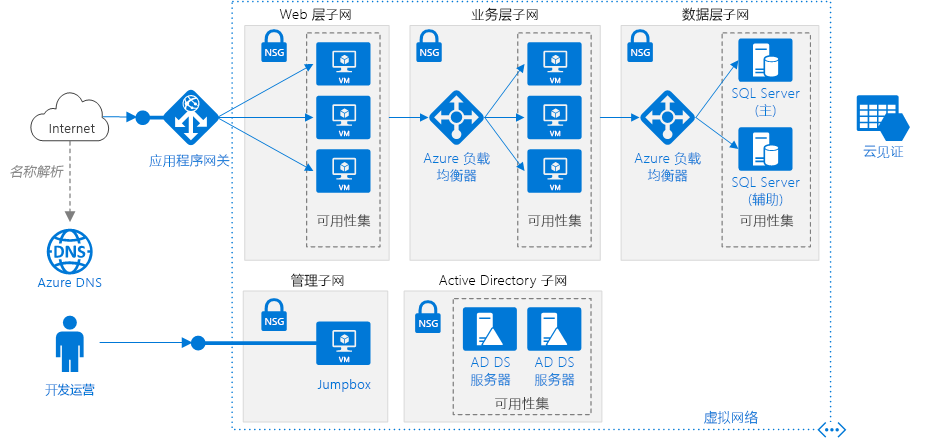

# <a name="windows-n-tier-application-on-azure-with-sql-server"></a>Azure 上包含 SQL Server 的 Windows N 层应用程序

此参考体系结构演示如何使用 Windows 上适用于数据层的 SQL Server 部署为 N 层应用程序配置的 VM 和虚拟网络。 [**部署此解决方案**](#deploy-the-solution)。



下载此体系结构的 [Visio 文件][visio-download]。

## <a name="architecture"></a>体系结构

此体系结构具有以下组件：

- 资源组。 [资源组][resource-manager-overview]用于对资源进行分组，以便可以按生存期、所有者或其他条件对其进行管理。

- **虚拟网络 (VNet) 和子网**。 每个 Azure VM 都会部署到可细分为子网的 VNet 中。 为每个层创建一个单独的子网。

- **应用程序网关**。 [Azure 应用程序网关](/azure/application-gateway/)是第 7 层负载均衡器。 在此体系结构中，它将 HTTP 请求路由到 Web 前端。 应用程序网关还提供一个 [Web 应用程序防火墙](/azure/application-gateway/waf-overview) (WAF)，出现常见的漏洞和攻击时，WAF 可以保护应用程序。

- **NSG**。 使用[网络安全组][nsg] (NSG) 来限制 VNet 中的网络流量。 例如，在此处显示的三层体系结构中，数据库层不接受来自 Web 前端的流量，仅接受来自业务层和管理子网的流量。

- **DDoS 防护**。 尽管 Azure 平台提供基本的保护来防范分布式拒绝服务 (DDoS) 攻击，但我们建议使用 [DDoS 保护标准版][ddos]，它提供增强的 DDoS 缓解功能。 请参阅[安全注意事项](#security-considerations)。

- **虚拟机**。 有关如何配置 VM 的建议，请参阅[在 Azure 上运行 Windows VM](./windows-vm.md) 和[在 Azure 上运行 Linux VM](./linux-vm.md)。

- **可用性集**。 为每个层创建[可用性集][azure-availability-sets]，并在每个层中至少预配两个 VM，使 VM 符合更高的[服务级别协议 (SLA)][vm-sla]。

- **负载均衡器**。 使用 [Azure 负载均衡器][load-balancer]可将网络流量从 Web 层分配到业务层，以及从业务层分配到 SQL Server。

- **公共 IP 地址**。 应用程序接收 Internet 流量时所需的公共 IP 地址。

- **Jumpbox**。 也称为[守护主机]。 网络上的一个安全 VM，管理员使用它来连接到其他 VM。 Jumpbox 中的某个 NSG 只允许来自安全列表中的公共 IP 地址的远程流量。 该 NSG 应允许远程桌面 (RDP) 流量。

- **SQL Server Always On 可用性组**。 通过启用复制和故障转移，在数据层提供高可用性。 它使用 Windows Server 故障转移群集 (WSFC) 技术进行故障转移。

- **Active Directory 域服务 (AD DS) 服务器**。 故障转移群集及其关联的群集角色的计算机对象在 Active Directory 域服务 (AD DS) 中创建。

- **云见证**。 故障转移群集要求其节点的半数以上处于运行状态，这称为“建立仲裁”。 如果群集只有两个节点，则网络分区之后，每个节点都会认为自己是主节点。 在这种情况下，需要使用见证来打破“僵持”局面，建立仲裁。 见证是一种可以充当僵持局面打破者并建立仲裁的资源，例如共享磁盘。 云见证是一种使用 Azure Blob 存储的见证。 若要详细了解仲裁的概念，请参阅[了解群集和池仲裁](/windows-server/storage/storage-spaces/understand-quorum)。 有关云见证的详细信息，请参阅[部署故障转移群集的云见证](/windows-server/failover-clustering/deploy-cloud-witness)。

- **Azure DNS**。 [Azure DNS][azure-dns] 是 DNS 域的托管服务。 它使用 Microsoft Azure 基础结构提供名称解析。 通过在 Azure 中托管域，可以使用与其他 Azure 服务相同的凭据、API、工具和计费来管理 DNS 记录。

## <a name="recommendations"></a>建议

你的要求可能不同于此处描述的体系结构。 请使用以下建议作为入手点。

### <a name="vnet--subnets"></a>VNet/子网

在创建 VNet 时，确定每个子网中的资源需要多少 IP 地址。 使用 [CIDR] 表示法为所需的 IP 地址指定子网掩码和足够大的 VNet 地址范围。 使用标准[专用 IP 地址块][private-ip-space]内的一个地址空间，这些地址块为 10.0.0.0/8、172.16.0.0/12 和 192.168.0.0/16。

如果以后需要在 VNet 与本地网络之间设置一个网关，请选择一个不与你的本地网络重叠的地址范围。 在创建 VNet 后，将无法更改地址范围。

在设计子网时一定要牢记功能和安全要求。 同一层或同一角色中的所有 VM 应当置于同一子网，这可能是一个安全边界。 有关设计 VNet 和子网的详细信息，请参阅[规划和设计 Azure 虚拟网络][plan-network]。

### <a name="load-balancers"></a>负载均衡器

不要将 VM 直接向 Internet 公开，而是改为给每个 VM 提供专用 IP 地址。 客户端使用与应用程序网关相关联的公共 IP 地址进行连接。

定义用于将网络流量定向到 VM 的负载均衡器规则。 例如，若要启用 HTTP 流量，请将前端配置中的端口 80 映射到后端地址池上的端口 80。 当客户端将 HTTP 请求发送到端口 80 时，负载均衡器会通过使用包括源 IP 地址的[哈希算法][load-balancer-hashing]选择后端 IP 地址。 客户端请求将在后端地址池中的所有 VM 之间分配。

### <a name="network-security-groups"></a>网络安全组

使用 NSG 规则限制各个层之间的流量。 在上面显示的三层体系结构中，Web 层不直接与数据库层进行通信。 为强制实现此目的，数据库层应当阻止来自 Web 层子网的传入流量。

1. 拒绝来自 VNet 的所有入站流量。 （在规则中使用 `VIRTUAL_NETWORK` 标记。）
2. 允许来自业务层子网的入站流量。
3. 允许来自数据库层子网本身的入站流量。 此规则允许在数据库 VM 之间通信，这是进行数据库复制和故障转移所必需的。
4. 允许来自 Jumpbox 子网的 RDP 流量（端口 3389）。 此规则允许管理员从 jumpbox 连接到数据库层。

创建优先级比第一项规则更高的规则 2 &ndash; 4，以便替代第一项规则。

### <a name="sql-server-always-on-availability-groups"></a>SQL Server Always On 可用性组

建议使用 [Always On 可用性组][sql-alwayson]以实现高可用性。 在 Windows Server 2016 之前，Always On 可用性组需要一个域控制器，并且可用性组中的所有节点必须在同一 AD 域中。

其他层通过[可用性组侦听程序][sql-alwayson-listeners]连接到数据库。 该侦听程序使得 SQL 客户端能够在不知道 SQL Server 物理实例名称的情况下进行连接。 访问数据库的 VM 必须加入域。 客户端（在本例中为另一个层）使用 DNS 将该侦听程序的虚拟网络名称解析为 IP 地址。

如下所述配置 SQL Server Always On 可用性组：

1. 创建一个 Windows Server 故障转移群集 (WSFC) 群集、一个 SQL Server Always On 可用性组和一个主要副本。 有关详细信息，请参阅 [Always On 可用性组入门 (SQL Server)][sql-alwayson-getting-started]。
2. 创建一个具有静态专用 IP 地址的内部负载均衡器。
3. 创建一个可用性组侦听程序，并将该侦听程序的 DNS 名称映射到一个内部负载均衡器的 IP 地址。
4. 为 SQL Server 侦听端口（默认情况下为 TCP 端口 1433）创建一个负载均衡器规则。 该负载均衡器规则必须启用*浮动 IP*，也称为“直接服务器返回”。 这将导致 VM 直接回复客户端，从而实现到主要副本的直接连接。

   > [!NOTE]
   > 当启用了浮动 IP 时，前端端口号必须与负载均衡器规则中的后端端口号相同。
   >

当 SQL 客户端尝试连接时，负载均衡器会将连接请求路由到主要副本。 如果发生到其他副本的故障转移，则负载均衡器会自动将新请求路由到新的主要副本。 有关详细信息，请参阅[Configure an ILB listener for SQL Server Always On Availability Groups][sql-alwayson-ilb]（为 SQL Server Always On 可用性组配置 ILB 侦听程序）。

在故障转移期间，现有的客户端连接将关闭。 在故障转移完成后，新连接将被路由到新的主要副本。

如果应用程序执行的读取操作显著多于写入操作，则可以将一些只读查询转移到次要副本。 请参阅[Using a Listener to Connect to a Read-Only Secondary Replica (Read-Only Routing)][sql-alwayson-read-only-routing]（使用侦听程序连接到只读次要副本（只读路由））。

通过执行可用性组的[强制手动故障转移][sql-alwayson-force-failover]来测试部署。

### <a name="jumpbox"></a>Jumpbox

不要允许通过公共 Internet 对运行应用程序工作负荷的 VM 进行 RDP 访问。 相反，对这些 VM 的所有 RDP 访问都必须通过 jumpbox 进行。 管理员登录到 jumpbox，然后从 jumpbox 登录到其他 VM。 Jumpbox 允许来自 Internet 的 RDP 流量，但仅允许来自已知的安全 IP 地址的流量。

Jumpbox 的性能要求非常低，因此请选择一个较小的 VM 大小。 为 jumpbox 创建一个[公共 IP 地址]。 将 jumpbox 放置在与其他 VM 相同的 VNet 中，但将其置于一个单独的管理子网中。

若要确保 Jumpbox 的安全，请添加一项 NSG 规则，仅允许来自一组安全的公共 IP 地址的 RDP 连接。 为其他子网配置 NSG 以允许来自管理子网的 RDP 流量。

## <a name="scalability-considerations"></a>可伸缩性注意事项

对于 Web 和业务层，请考虑使用[虚拟机规模集][vmss]，而不要在可用性集中部署独立的 VM。 使用规模集可以轻松部署和管理一组相同的 VM 并根据性能指标自动缩放 VM。 VM 上的负载增加时，会自动向负载均衡器添加更多 VM。 如果需要快速横向扩展 VM，或者需要进行自动缩放，请考虑规模集。

有两种基本方法可用来配置规模集中部署的 VM：

- 在部署 VM 后使用扩展对其进行配置。 使用此方法时，启动新 VM 实例的所需时间可能会长于启动不带扩展的 VM 的所需时间。

- 使用自定义磁盘映像部署[托管磁盘](/azure/storage/storage-managed-disks-overview)。 此选项的部署速度可能更快。 但是，它要求将映像保持最新。

有关详细信息，请参阅[规模集的设计注意事项][vmss-design]。

> [!TIP]
> 在使用任何自动缩放解决方案时，请早早提前使用生产级工作负荷测试它。

每个 Azure 订阅都有适用的默认限制，包括每个区域的最大 VM 数量。 可以通过提出支持请求来提高上限。 有关详细信息，请参阅 [Azure 订阅和服务限制、配额与约束][subscription-limits]。

## <a name="availability-considerations"></a>可用性注意事项

如果不使用虚拟机规模集，请将相同层的 VM 放入可用性集。 请在可用性集中至少创建两个 VM 以支持 [Azure VM 的可用性 SLA][vm-sla]。 有关详细信息，请参阅[管理虚拟机的可用性][availability-set]。 规模集自动使用充当隐式可用性集的位置组。

负载均衡器使用[运行状况探测][health-probes]监视 VM 实例的可用性。 如果探测在超时期限内无法到达实例，负载均衡器会停止向该 VM 发送流量。 但是，负载均衡器将继续探测，并且如果 VM 再次变得可用，负载均衡器会继续向该 VM 发送流量。

下面是有关负载均衡器运行状况探测的一些建议：

- 探测可以测试 HTTP 或 TCP。 如果 VM 运行 HTTP 服务器，请创建 HTTP 探测。 否则，请创建 TCP 探测。
- 对于 HTTP 探测，请指定指向 HTTP 终结点的路径。 探测将检查是否有来自此路径的 HTTP 200 响应。 此路径可以是根路径 ("/")，也可以是一个运行状况监视终结点，该终结点实现某些自定义逻辑来检查应用程序运行状况。 终结点必须允许匿名 HTTP 请求。
- 探测发送自[已知 IP 地址][health-probe-ip] 168.63.129.16。 不要在任何防火墙策略或 NSG 规则中阻止与此 IP 地址相互传送的流量。
- 使用[运行状况探测日志][health-probe-log]查看运行状况探测的状态。 请在 Azure 门户中为每个负载均衡器启用日志记录。 日志将写入到 Azure Blob 存储。 这些日志显示有多少个 VM 由于探测响应失败而未收到网络流量。

如果需要的可用性高于 [VM 的 Azure SLA][vm-sla] 提供的可用性，请考虑跨两个区域复制应用程序，使用 Azure 流量管理器进行故障转移。 有关详细信息，请参阅[通过多区域 N 层应用程序确保高可用性][multi-dc]。

## <a name="security-considerations"></a>安全注意事项

虚拟网络是 Azure 中的流量隔离边界。 一个 VNet 中的 VM 无法直接与其他 VNet 中的 VM 通信。 同一个 VNet 中的 VM 之间可以通信，除非你创建[网络安全组][nsg] (NSG) 来限制流量。 有关详细信息，请参阅 [Microsoft 云服务和网络安全性][network-security]。

**外围网络**。 请考虑添加一个网络虚拟设备 (NVA) 以在 Internet 与 Azure 虚拟网络之间创建一个外围网络。 NVA 是虚拟设备的一个通用术语，可以执行与网络相关的任务，例如防火墙、包检查、审核和自定义路由。 有关详细信息，请参阅[在 Azure 与 Internet 之间实现外围网络][dmz]。

**加密**。 加密静态的敏感数据并使用 [Azure Key Vault][azure-key-vault] 管理数据库加密密钥。 Key Vault 可以将加密密钥存储在硬件安全模块 (HSM) 中。 有关详细信息，请参阅[为 Azure VM 上的 SQL Server 配置 Azure Key Vault 集成][sql-keyvault]。 另外，建议将应用程序机密（例如数据库连接字符串）也存储在 Key Vault 中。

**DDOS 防护**。 Azure 平台默认提供基本 DDoS 防护。 这种基本保护旨在将 Azure 基础结构作为一个整体进行保护。 尽管已自动启用基本 DDoS 防护，但我们建议使用 [DDoS 防护标准版][ddos]。 标准防护基于应用程序的网络流量模式使用自适应优化来检测威胁。 这样，它便可以针对基础结构范围的 DDoS 策略忽略的 DDoS 攻击应用缓解措施。 标准防护还通过 Azure Monitor 提供警报、遥测和分析。 有关详细信息，请参阅 [Azure DDoS 防护：最佳做法和参考体系结构][ddos-best-practices]。

## <a name="deploy-the-solution"></a>部署解决方案

[GitHub][github-folder] 中提供了此参考体系结构的部署。 整个部署最长可能需要两小时的时间，包括运行相关脚本来配置 AD DS、Windows Server 故障转移群集以及 SQL Server 可用性组。

### <a name="prerequisites"></a>先决条件

[!INCLUDE [ref-arch-prerequisites.md](../../../includes/ref-arch-prerequisites.md)]

### <a name="deployment-steps"></a>部署步骤

1. 运行以下命令来创建资源组。

    ```azurecli
    az group create --location <location> --name <resource-group-name>
    ```

2. 运行以下命令来创建云见证的存储帐户。

    ```azurecli
    az storage account create --location <location> \
      --name <storage-account-name> \
      --resource-group <resource-group-name> \
      --sku Standard_LRS
    ```

3. 导航到参考体系结构 GitHub 存储库的 `virtual-machines\n-tier-windows` 文件夹。

4. 打开 `n-tier-windows.json` 文件。

5. 搜索“witnessStorageBlobEndPoint”的所有实例，将占位符文本替换为步骤 2 中的存储帐户的名称。

    ```json
    "witnessStorageBlobEndPoint": "https://[replace-with-storageaccountname].blob.core.windows.net",
    ```

6. 运行以下命令，列出存储帐户的帐户密钥。

    ```azurecli
    az storage account keys list \
      --account-name <storage-account-name> \
      --resource-group <resource-group-name>
    ```

    输出应如下所示。 复制 `key1` 的值。

    ```json
    [
    {
        "keyName": "key1",
        "permissions": "Full",
        "value": "..."
    },
    {
        "keyName": "key2",
        "permissions": "Full",
        "value": "..."
    }
    ]
    ```

7. 在 `n-tier-windows.json` 文件中，搜索“witnessStorageAccountKey”的所有实例，然后将帐户密钥粘贴进去。

    ```json
    "witnessStorageAccountKey": "[replace-with-storagekey]"
    ```

8. 在 `n-tier-windows.json` 文件中搜索 `[replace-with-password]` 和 `[replace-with-sql-password]` 的所有实例，并将其替换为强密码。 保存文件。

    > [!NOTE]
    > 如果更改管理员用户名，则还必须更新 JSON 文件中的 `extensions` 块。

9. 运行以下命令来部署体系结构。

    ```azurecli
    azbb -s <your subscription_id> -g <resource_group_name> -l <location> -p n-tier-windows.json --deploy
    ```

若要详细了解如何使用 Azure 构建基块部署此示例参考体系结构，请访问 [GitHub 存储库][git]。

<!-- links -->
[dmz]: ../dmz/secure-vnet-dmz.md
[multi-dc]: multi-region-sql-server.md
[n-tier]: n-tier.md
[azure-availability-sets]: /azure/virtual-machines/virtual-machines-windows-manage-availability#configure-each-application-tier-into-separate-availability-sets
[azure-dns]: /azure/dns/dns-overview
[azure-key-vault]: https://azure.microsoft.com/services/key-vault
[守护主机]: https://en.wikipedia.org/wiki/Bastion_host
[cidr]: https://en.wikipedia.org/wiki/Classless_Inter-Domain_Routing
[ddos]: /azure/virtual-network/ddos-protection-overview
[ddos-best-practices]: /azure/security/azure-ddos-best-practices
[git]: https://github.com/mspnp/template-building-blocks
[github-folder]: https://github.com/mspnp/reference-architectures/tree/master/virtual-machines/n-tier-windows
[nsg]: /azure/virtual-network/virtual-networks-nsg
[plan-network]: /azure/virtual-network/virtual-network-vnet-plan-design-arm
[private-ip-space]: https://en.wikipedia.org/wiki/Private_network#Private_IPv4_address_spaces
[公共 IP 地址]: /azure/virtual-network/virtual-network-ip-addresses-overview-arm
[sql-alwayson]: https://msdn.microsoft.com/library/hh510230.aspx
[sql-alwayson-force-failover]: https://msdn.microsoft.com/library/ff877957.aspx
[sql-alwayson-getting-started]: https://msdn.microsoft.com/library/gg509118.aspx
[sql-alwayson-ilb]: /azure/virtual-machines/windows/sql/virtual-machines-windows-portal-sql-alwayson-int-listener
[sql-alwayson-listeners]: https://msdn.microsoft.com/library/hh213417.aspx
[sql-alwayson-read-only-routing]: https://technet.microsoft.com/library/hh213417.aspx#ConnectToSecondary
[sql-keyvault]: /azure/virtual-machines/virtual-machines-windows-ps-sql-keyvault
[vm-sla]: https://azure.microsoft.com/support/legal/sla/virtual-machines
[vnet faq]: /azure/virtual-network/virtual-networks-faq
[wsfc-whats-new]: https://technet.microsoft.com/windows-server-docs/failover-clustering/whats-new-in-failover-clustering
[visio-download]: https://archcenter.blob.core.windows.net/cdn/vm-reference-architectures.vsdx
[resource-manager-overview]: /azure/azure-resource-manager/resource-group-overview
[vmss]: /azure/virtual-machine-scale-sets/virtual-machine-scale-sets-overview
[load-balancer]: /azure/load-balancer/
[load-balancer-hashing]: /azure/load-balancer/load-balancer-overview#load-balancer-features
[vmss-design]: /azure/virtual-machine-scale-sets/virtual-machine-scale-sets-design-overview
[subscription-limits]: /azure/azure-subscription-service-limits
[availability-set]: /azure/virtual-machines/virtual-machines-windows-manage-availability
[health-probes]: /azure/load-balancer/load-balancer-overview#load-balancer-features
[health-probe-log]: /azure/load-balancer/load-balancer-monitor-log
[health-probe-ip]: /azure/virtual-network/virtual-networks-nsg#special-rules
[network-security]: /azure/best-practices-network-security
