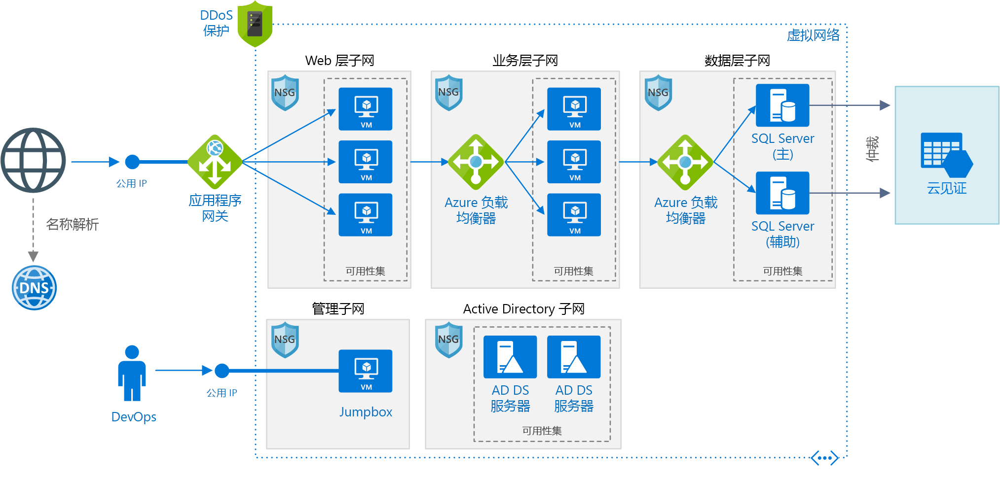

# <a name="windows-n-tier-application-on-azure-with-sql-server"></a><span data-ttu-id="34302-103">Azure 上包含 SQL Server 的 Windows N 层应用程序</span><span class="sxs-lookup"><span data-stu-id="34302-103">Windows N-tier application on Azure with SQL Server</span></span>

<span data-ttu-id="34302-104">此参考体系结构演示如何使用 Windows 上适用于数据层的 SQL Server 部署为 [N 层](../../guide/architecture-styles/n-tier.md)应用程序配置的 VM 和虚拟网络。</span><span class="sxs-lookup"><span data-stu-id="34302-104">This reference architecture shows how to deploy VMs and a virtual network configured for an [N-tier](../../guide/architecture-styles/n-tier.md) application, using SQL Server on Windows for the data tier.</span></span> <span data-ttu-id="34302-105">[**部署此解决方案**](#deploy-the-solution)。</span><span class="sxs-lookup"><span data-stu-id="34302-105">[**Deploy this solution**](#deploy-the-solution).</span></span>



<span data-ttu-id="34302-107">下载此体系结构的 [Visio 文件][visio-download]。</span><span class="sxs-lookup"><span data-stu-id="34302-107">*Download a [Visio file][visio-download] of this architecture.*</span></span>

## <a name="architecture"></a><span data-ttu-id="34302-108">体系结构</span><span class="sxs-lookup"><span data-stu-id="34302-108">Architecture</span></span>

<span data-ttu-id="34302-109">此体系结构具有以下组件：</span><span class="sxs-lookup"><span data-stu-id="34302-109">The architecture has the following components:</span></span>

- <span data-ttu-id="34302-110">资源组。</span><span class="sxs-lookup"><span data-stu-id="34302-110">**Resource group**.</span></span> <span data-ttu-id="34302-111">[资源组][resource-manager-overview]用于对资源进行分组，以便可以按生存期、所有者或其他条件对其进行管理。</span><span class="sxs-lookup"><span data-stu-id="34302-111">[Resource groups][resource-manager-overview] are used to group resources so they can be managed by lifetime, owner, or other criteria.</span></span>

- <span data-ttu-id="34302-112">**虚拟网络 (VNet) 和子网**。</span><span class="sxs-lookup"><span data-stu-id="34302-112">**Virtual network (VNet) and subnets**.</span></span> <span data-ttu-id="34302-113">每个 Azure VM 都会部署到可细分为子网的 VNet 中。</span><span class="sxs-lookup"><span data-stu-id="34302-113">Every Azure VM is deployed into a VNet that can be segmented into subnets.</span></span> <span data-ttu-id="34302-114">为每个层创建一个单独的子网。</span><span class="sxs-lookup"><span data-stu-id="34302-114">Create a separate subnet for each tier.</span></span>

- <span data-ttu-id="34302-115">**应用程序网关**。</span><span class="sxs-lookup"><span data-stu-id="34302-115">**Application gateway**.</span></span> <span data-ttu-id="34302-116">[Azure 应用程序网关](/azure/application-gateway/)是第 7 层负载均衡器。</span><span class="sxs-lookup"><span data-stu-id="34302-116">[Azure Application Gateway](/azure/application-gateway/) is a layer 7 load balancer.</span></span> <span data-ttu-id="34302-117">在此体系结构中，它将 HTTP 请求路由到 Web 前端。</span><span class="sxs-lookup"><span data-stu-id="34302-117">In this architecture, it routes HTTP requests to the web front end.</span></span> <span data-ttu-id="34302-118">应用程序网关还提供一个 [Web 应用程序防火墙](/azure/application-gateway/waf-overview) (WAF)，出现常见的漏洞和攻击时，WAF 可以保护应用程序。</span><span class="sxs-lookup"><span data-stu-id="34302-118">Application Gateway also provides a [web application firewall](/azure/application-gateway/waf-overview) (WAF) that protects the application from common exploits and vulnerabilities.</span></span>

- <span data-ttu-id="34302-119">**NSG**。</span><span class="sxs-lookup"><span data-stu-id="34302-119">**NSGs**.</span></span> <span data-ttu-id="34302-120">使用[网络安全组][nsg] (NSG) 来限制 VNet 中的网络流量。</span><span class="sxs-lookup"><span data-stu-id="34302-120">Use [network security groups][nsg] (NSGs) to restrict network traffic within the VNet.</span></span> <span data-ttu-id="34302-121">例如，在此处显示的三层体系结构中，数据库层不接受来自 Web 前端的流量，仅接受来自业务层和管理子网的流量。</span><span class="sxs-lookup"><span data-stu-id="34302-121">For example, in the three-tier architecture shown here, the database tier does not accept traffic from the web front end, only from the business tier and the management subnet.</span></span>

- <span data-ttu-id="34302-122">**DDoS 防护**。</span><span class="sxs-lookup"><span data-stu-id="34302-122">**DDoS Protection**.</span></span> <span data-ttu-id="34302-123">尽管 Azure 平台提供基本的保护来防范分布式拒绝服务 (DDoS) 攻击，但我们建议使用 [DDoS 保护标准版][ddos]，它提供增强的 DDoS 缓解功能。</span><span class="sxs-lookup"><span data-stu-id="34302-123">Although the Azure platform provides basic protection against distributed denial of service (DDoS) attacks, we recommend using [DDoS Protection Standard][ddos], which has enhanced DDoS mitigation features.</span></span> <span data-ttu-id="34302-124">请参阅[安全注意事项](#security-considerations)。</span><span class="sxs-lookup"><span data-stu-id="34302-124">See [Security considerations](#security-considerations).</span></span>

- <span data-ttu-id="34302-125">**虚拟机**。</span><span class="sxs-lookup"><span data-stu-id="34302-125">**Virtual machines**.</span></span> <span data-ttu-id="34302-126">有关如何配置 VM 的建议，请参阅[在 Azure 上运行 Windows VM](./windows-vm.md) 和[在 Azure 上运行 Linux VM](./linux-vm.md)。</span><span class="sxs-lookup"><span data-stu-id="34302-126">For recommendations on configuring VMs, see [Run a Windows VM on Azure](./windows-vm.md) and [Run a Linux VM on Azure](./linux-vm.md).</span></span>

- <span data-ttu-id="34302-127">**可用性集**。</span><span class="sxs-lookup"><span data-stu-id="34302-127">**Availability sets**.</span></span> <span data-ttu-id="34302-128">为每个层创建[可用性集][azure-availability-sets]，并在每个层中至少预配两个 VM，使 VM 符合更高的[服务级别协议 (SLA)][vm-sla]。</span><span class="sxs-lookup"><span data-stu-id="34302-128">Create an [availability set][azure-availability-sets] for each tier, and provision at least two VMs in each tier, which makes the VMs eligible for a higher [service level agreement (SLA)][vm-sla].</span></span>

- <span data-ttu-id="34302-129">**负载均衡器**。</span><span class="sxs-lookup"><span data-stu-id="34302-129">**Load balancers**.</span></span> <span data-ttu-id="34302-130">使用 [Azure 负载均衡器][load-balancer]可将网络流量从 Web 层分配到业务层，以及从业务层分配到 SQL Server。</span><span class="sxs-lookup"><span data-stu-id="34302-130">Use [Azure Load Balancer][load-balancer] to distribute network traffic from the web tier to the business tier, and from the business tier to SQL Server.</span></span>

- <span data-ttu-id="34302-131">**公共 IP 地址**。</span><span class="sxs-lookup"><span data-stu-id="34302-131">**Public IP address**.</span></span> <span data-ttu-id="34302-132">应用程序接收 Internet 流量时所需的公共 IP 地址。</span><span class="sxs-lookup"><span data-stu-id="34302-132">A public IP address is needed for the application to receive Internet traffic.</span></span>

- <span data-ttu-id="34302-133">**Jumpbox**。</span><span class="sxs-lookup"><span data-stu-id="34302-133">**Jumpbox**.</span></span> <span data-ttu-id="34302-134">也称为[守护主机]。</span><span class="sxs-lookup"><span data-stu-id="34302-134">Also called a [bastion host].</span></span> <span data-ttu-id="34302-135">网络上的一个安全 VM，管理员使用它来连接到其他 VM。</span><span class="sxs-lookup"><span data-stu-id="34302-135">A secure VM on the network that administrators use to connect to the other VMs.</span></span> <span data-ttu-id="34302-136">Jumpbox 中的某个 NSG 只允许来自安全列表中的公共 IP 地址的远程流量。</span><span class="sxs-lookup"><span data-stu-id="34302-136">The jumpbox has an NSG that allows remote traffic only from public IP addresses on a safe list.</span></span> <span data-ttu-id="34302-137">该 NSG 应允许远程桌面 (RDP) 流量。</span><span class="sxs-lookup"><span data-stu-id="34302-137">The NSG should permit remote desktop (RDP) traffic.</span></span>

- <span data-ttu-id="34302-138">**SQL Server Always On 可用性组**。</span><span class="sxs-lookup"><span data-stu-id="34302-138">**SQL Server Always On Availability Group**.</span></span> <span data-ttu-id="34302-139">通过启用复制和故障转移，在数据层提供高可用性。</span><span class="sxs-lookup"><span data-stu-id="34302-139">Provides high availability at the data tier, by enabling replication and failover.</span></span> <span data-ttu-id="34302-140">它使用 Windows Server 故障转移群集 (WSFC) 技术进行故障转移。</span><span class="sxs-lookup"><span data-stu-id="34302-140">It uses Windows Server Failover Cluster (WSFC) technology for failover.</span></span>

- <span data-ttu-id="34302-141">**Active Directory 域服务 (AD DS) 服务器**。</span><span class="sxs-lookup"><span data-stu-id="34302-141">**Active Directory Domain Services (AD DS) Servers**.</span></span> <span data-ttu-id="34302-142">故障转移群集及其关联的群集角色的计算机对象在 Active Directory 域服务 (AD DS) 中创建。</span><span class="sxs-lookup"><span data-stu-id="34302-142">The computer objects for the failover cluster and its associated clustered roles are created in Active Directory Domain Services (AD DS).</span></span>

- <span data-ttu-id="34302-143">**云见证**。</span><span class="sxs-lookup"><span data-stu-id="34302-143">**Cloud Witness**.</span></span> <span data-ttu-id="34302-144">故障转移群集要求其节点的半数以上处于运行状态，这称为“建立仲裁”。</span><span class="sxs-lookup"><span data-stu-id="34302-144">A failover cluster requires more than half of its nodes to be running, which is known as having quorum.</span></span> <span data-ttu-id="34302-145">如果群集只有两个节点，则网络分区之后，每个节点都会认为自己是主节点。</span><span class="sxs-lookup"><span data-stu-id="34302-145">If the cluster has just two nodes, a network partition could cause each node to think it's the master node.</span></span> <span data-ttu-id="34302-146">在这种情况下，需要使用见证来打破“僵持”局面，建立仲裁。</span><span class="sxs-lookup"><span data-stu-id="34302-146">In that case, you need a *witness* to break ties and establish quorum.</span></span> <span data-ttu-id="34302-147">见证是一种可以充当僵持局面打破者并建立仲裁的资源，例如共享磁盘。</span><span class="sxs-lookup"><span data-stu-id="34302-147">A witness is a resource such as a shared disk that can act as a tie breaker to establish quorum.</span></span> <span data-ttu-id="34302-148">云见证是一种使用 Azure Blob 存储的见证。</span><span class="sxs-lookup"><span data-stu-id="34302-148">Cloud Witness is a type of witness that uses Azure Blob Storage.</span></span> <span data-ttu-id="34302-149">若要详细了解仲裁的概念，请参阅[了解群集和池仲裁](/windows-server/storage/storage-spaces/understand-quorum)。</span><span class="sxs-lookup"><span data-stu-id="34302-149">To learn more about the concept of quorum, see [Understanding cluster and pool quorum](/windows-server/storage/storage-spaces/understand-quorum).</span></span> <span data-ttu-id="34302-150">有关云见证的详细信息，请参阅[部署故障转移群集的云见证](/windows-server/failover-clustering/deploy-cloud-witness)。</span><span class="sxs-lookup"><span data-stu-id="34302-150">For more information about Cloud Witness, see [Deploy a Cloud Witness for a Failover Cluster](/windows-server/failover-clustering/deploy-cloud-witness).</span></span>

- <span data-ttu-id="34302-151">**Azure DNS**。</span><span class="sxs-lookup"><span data-stu-id="34302-151">**Azure DNS**.</span></span> <span data-ttu-id="34302-152">[Azure DNS][azure-dns] 是 DNS 域的托管服务。</span><span class="sxs-lookup"><span data-stu-id="34302-152">[Azure DNS][azure-dns] is a hosting service for DNS domains.</span></span> <span data-ttu-id="34302-153">它使用 Microsoft Azure 基础结构提供名称解析。</span><span class="sxs-lookup"><span data-stu-id="34302-153">It provides name resolution using Microsoft Azure infrastructure.</span></span> <span data-ttu-id="34302-154">通过在 Azure 中托管域，可以使用与其他 Azure 服务相同的凭据、API、工具和计费来管理 DNS 记录。</span><span class="sxs-lookup"><span data-stu-id="34302-154">By hosting your domains in Azure, you can manage your DNS records using the same credentials, APIs, tools, and billing as your other Azure services.</span></span>

## <a name="recommendations"></a><span data-ttu-id="34302-155">建议</span><span class="sxs-lookup"><span data-stu-id="34302-155">Recommendations</span></span>

<span data-ttu-id="34302-156">你的要求可能不同于此处描述的体系结构。</span><span class="sxs-lookup"><span data-stu-id="34302-156">Your requirements might differ from the architecture described here.</span></span> <span data-ttu-id="34302-157">请使用以下建议作为入手点。</span><span class="sxs-lookup"><span data-stu-id="34302-157">Use these recommendations as a starting point.</span></span>

### <a name="vnet--subnets"></a><span data-ttu-id="34302-158">VNet/子网</span><span class="sxs-lookup"><span data-stu-id="34302-158">VNet / Subnets</span></span>

<span data-ttu-id="34302-159">在创建 VNet 时，确定每个子网中的资源需要多少 IP 地址。</span><span class="sxs-lookup"><span data-stu-id="34302-159">When you create the VNet, determine how many IP addresses your resources in each subnet require.</span></span> <span data-ttu-id="34302-160">使用 [CIDR] 表示法为所需的 IP 地址指定子网掩码和足够大的 VNet 地址范围。</span><span class="sxs-lookup"><span data-stu-id="34302-160">Specify a subnet mask and a VNet address range large enough for the required IP addresses, using [CIDR] notation.</span></span> <span data-ttu-id="34302-161">使用标准[专用 IP 地址块][private-ip-space]内的一个地址空间，这些地址块为 10.0.0.0/8、172.16.0.0/12 和 192.168.0.0/16。</span><span class="sxs-lookup"><span data-stu-id="34302-161">Use an address space that falls within the standard [private IP address blocks][private-ip-space], which are 10.0.0.0/8, 172.16.0.0/12, and 192.168.0.0/16.</span></span>

<span data-ttu-id="34302-162">如果以后需要在 VNet 与本地网络之间设置一个网关，请选择一个不与你的本地网络重叠的地址范围。</span><span class="sxs-lookup"><span data-stu-id="34302-162">Choose an address range that does not overlap with your on-premises network, in case you need to set up a gateway between the VNet and your on-premise network later.</span></span> <span data-ttu-id="34302-163">在创建 VNet 后，将无法更改地址范围。</span><span class="sxs-lookup"><span data-stu-id="34302-163">Once you create the VNet, you can't change the address range.</span></span>

<span data-ttu-id="34302-164">在设计子网时一定要牢记功能和安全要求。</span><span class="sxs-lookup"><span data-stu-id="34302-164">Design subnets with functionality and security requirements in mind.</span></span> <span data-ttu-id="34302-165">同一层或同一角色中的所有 VM 应当置于同一子网，这可能是一个安全边界。</span><span class="sxs-lookup"><span data-stu-id="34302-165">All VMs within the same tier or role should go into the same subnet, which can be a security boundary.</span></span> <span data-ttu-id="34302-166">有关设计 VNet 和子网的详细信息，请参阅[规划和设计 Azure 虚拟网络][plan-network]。</span><span class="sxs-lookup"><span data-stu-id="34302-166">For more information about designing VNets and subnets, see [Plan and design Azure Virtual Networks][plan-network].</span></span>

### <a name="load-balancers"></a><span data-ttu-id="34302-167">负载均衡器</span><span class="sxs-lookup"><span data-stu-id="34302-167">Load balancers</span></span>

<span data-ttu-id="34302-168">不要将 VM 直接向 Internet 公开，而是改为给每个 VM 提供专用 IP 地址。</span><span class="sxs-lookup"><span data-stu-id="34302-168">Don't expose the VMs directly to the Internet, but instead give each VM a private IP address.</span></span> <span data-ttu-id="34302-169">客户端使用与应用程序网关相关联的公共 IP 地址进行连接。</span><span class="sxs-lookup"><span data-stu-id="34302-169">Clients connect using the public IP address associated with the Application Gateway.</span></span>

<span data-ttu-id="34302-170">定义用于将网络流量定向到 VM 的负载均衡器规则。</span><span class="sxs-lookup"><span data-stu-id="34302-170">Define load balancer rules to direct network traffic to the VMs.</span></span> <span data-ttu-id="34302-171">例如，若要启用 HTTP 流量，请将前端配置中的端口 80 映射到后端地址池上的端口 80。</span><span class="sxs-lookup"><span data-stu-id="34302-171">For example, to enable HTTP traffic, map port 80 from the front-end configuration to port 80 on the back-end address pool.</span></span> <span data-ttu-id="34302-172">当客户端将 HTTP 请求发送到端口 80 时，负载均衡器会通过使用包括源 IP 地址的[哈希算法][load-balancer-hashing]选择后端 IP 地址。</span><span class="sxs-lookup"><span data-stu-id="34302-172">When a client sends an HTTP request to port 80, the load balancer selects a back-end IP address by using a [hashing algorithm][load-balancer-hashing] that includes the source IP address.</span></span> <span data-ttu-id="34302-173">客户端请求将在后端地址池中的所有 VM 之间分配。</span><span class="sxs-lookup"><span data-stu-id="34302-173">Client requests are distributed across all the VMs in the back-end address pool.</span></span>

### <a name="network-security-groups"></a><span data-ttu-id="34302-174">网络安全组</span><span class="sxs-lookup"><span data-stu-id="34302-174">Network security groups</span></span>

<span data-ttu-id="34302-175">使用 NSG 规则限制各个层之间的流量。</span><span class="sxs-lookup"><span data-stu-id="34302-175">Use NSG rules to restrict traffic between tiers.</span></span> <span data-ttu-id="34302-176">在上面显示的三层体系结构中，Web 层不直接与数据库层进行通信。</span><span class="sxs-lookup"><span data-stu-id="34302-176">In the three-tier architecture shown above, the web tier does not communicate directly with the database tier.</span></span> <span data-ttu-id="34302-177">为强制实现此目的，数据库层应当阻止来自 Web 层子网的传入流量。</span><span class="sxs-lookup"><span data-stu-id="34302-177">To enforce this, the database tier should block incoming traffic from the web tier subnet.</span></span>

1. <span data-ttu-id="34302-178">拒绝来自 VNet 的所有入站流量。</span><span class="sxs-lookup"><span data-stu-id="34302-178">Deny all inbound traffic from the VNet.</span></span> <span data-ttu-id="34302-179">（在规则中使用 `VIRTUAL_NETWORK` 标记。）</span><span class="sxs-lookup"><span data-stu-id="34302-179">(Use the `VIRTUAL_NETWORK` tag in the rule.)</span></span>
2. <span data-ttu-id="34302-180">允许来自业务层子网的入站流量。</span><span class="sxs-lookup"><span data-stu-id="34302-180">Allow inbound traffic from the business tier subnet.</span></span>
3. <span data-ttu-id="34302-181">允许来自数据库层子网本身的入站流量。</span><span class="sxs-lookup"><span data-stu-id="34302-181">Allow inbound traffic from the database tier subnet itself.</span></span> <span data-ttu-id="34302-182">此规则允许在数据库 VM 之间通信，这是进行数据库复制和故障转移所必需的。</span><span class="sxs-lookup"><span data-stu-id="34302-182">This rule allows communication between the database VMs, which is needed for database replication and failover.</span></span>
4. <span data-ttu-id="34302-183">允许来自 Jumpbox 子网的 RDP 流量（端口 3389）。</span><span class="sxs-lookup"><span data-stu-id="34302-183">Allow RDP traffic (port 3389) from the jumpbox subnet.</span></span> <span data-ttu-id="34302-184">此规则允许管理员从 jumpbox 连接到数据库层。</span><span class="sxs-lookup"><span data-stu-id="34302-184">This rule lets administrators connect to the database tier from the jumpbox.</span></span>

<span data-ttu-id="34302-185">创建优先级比第一项规则更高的规则 2 &ndash; 4，以便替代第一项规则。</span><span class="sxs-lookup"><span data-stu-id="34302-185">Create rules 2 &ndash; 4 with higher priority than the first rule, so they override it.</span></span>

### <a name="sql-server-always-on-availability-groups"></a><span data-ttu-id="34302-186">SQL Server Always On 可用性组</span><span class="sxs-lookup"><span data-stu-id="34302-186">SQL Server Always On Availability Groups</span></span>

<span data-ttu-id="34302-187">建议使用 [Always On 可用性组][sql-alwayson]以实现高可用性。</span><span class="sxs-lookup"><span data-stu-id="34302-187">We recommend [Always On Availability Groups][sql-alwayson] for SQL Server high availability.</span></span> <span data-ttu-id="34302-188">在 Windows Server 2016 之前，Always On 可用性组需要一个域控制器，并且可用性组中的所有节点必须在同一 AD 域中。</span><span class="sxs-lookup"><span data-stu-id="34302-188">Prior to Windows Server 2016, Always On Availability Groups require a domain controller, and all nodes in the availability group must be in the same AD domain.</span></span>

<span data-ttu-id="34302-189">其他层通过[可用性组侦听程序][sql-alwayson-listeners]连接到数据库。</span><span class="sxs-lookup"><span data-stu-id="34302-189">Other tiers connect to the database through an [availability group listener][sql-alwayson-listeners].</span></span> <span data-ttu-id="34302-190">该侦听程序使得 SQL 客户端能够在不知道 SQL Server 物理实例名称的情况下进行连接。</span><span class="sxs-lookup"><span data-stu-id="34302-190">The listener enables a SQL client to connect without knowing the name of the physical instance of SQL Server.</span></span> <span data-ttu-id="34302-191">访问数据库的 VM 必须加入域。</span><span class="sxs-lookup"><span data-stu-id="34302-191">VMs that access the database must be joined to the domain.</span></span> <span data-ttu-id="34302-192">客户端（在本例中为另一个层）使用 DNS 将该侦听程序的虚拟网络名称解析为 IP 地址。</span><span class="sxs-lookup"><span data-stu-id="34302-192">The client (in this case, another tier) uses DNS to resolve the listener's virtual network name into IP addresses.</span></span>

<span data-ttu-id="34302-193">如下所述配置 SQL Server Always On 可用性组：</span><span class="sxs-lookup"><span data-stu-id="34302-193">Configure the SQL Server Always On Availability Group as follows:</span></span>

1. <span data-ttu-id="34302-194">创建一个 Windows Server 故障转移群集 (WSFC) 群集、一个 SQL Server Always On 可用性组和一个主要副本。</span><span class="sxs-lookup"><span data-stu-id="34302-194">Create a Windows Server Failover Clustering (WSFC) cluster, a SQL Server Always On Availability Group, and a primary replica.</span></span> <span data-ttu-id="34302-195">有关详细信息，请参阅 [Always On 可用性组入门 (SQL Server)][sql-alwayson-getting-started]。</span><span class="sxs-lookup"><span data-stu-id="34302-195">For more information, see [Getting Started with Always On Availability Groups][sql-alwayson-getting-started].</span></span>
2. <span data-ttu-id="34302-196">创建一个具有静态专用 IP 地址的内部负载均衡器。</span><span class="sxs-lookup"><span data-stu-id="34302-196">Create an internal load balancer with a static private IP address.</span></span>
3. <span data-ttu-id="34302-197">创建一个可用性组侦听程序，并将该侦听程序的 DNS 名称映射到一个内部负载均衡器的 IP 地址。</span><span class="sxs-lookup"><span data-stu-id="34302-197">Create an availability group listener, and map the listener's DNS name to the IP address of an internal load balancer.</span></span>
4. <span data-ttu-id="34302-198">为 SQL Server 侦听端口（默认情况下为 TCP 端口 1433）创建一个负载均衡器规则。</span><span class="sxs-lookup"><span data-stu-id="34302-198">Create a load balancer rule for the SQL Server listening port (TCP port 1433 by default).</span></span> <span data-ttu-id="34302-199">该负载均衡器规则必须启用*浮动 IP*，也称为“直接服务器返回”。</span><span class="sxs-lookup"><span data-stu-id="34302-199">The load balancer rule must enable *floating IP*, also called Direct Server Return.</span></span> <span data-ttu-id="34302-200">这将导致 VM 直接回复客户端，从而实现到主要副本的直接连接。</span><span class="sxs-lookup"><span data-stu-id="34302-200">This causes the VM to reply directly to the client, which enables a direct connection to the primary replica.</span></span>

   > [!NOTE]
   > <span data-ttu-id="34302-201">当启用了浮动 IP 时，前端端口号必须与负载均衡器规则中的后端端口号相同。</span><span class="sxs-lookup"><span data-stu-id="34302-201">When floating IP is enabled, the front-end port number must be the same as the back-end port number in the load balancer rule.</span></span>
   >

<span data-ttu-id="34302-202">当 SQL 客户端尝试连接时，负载均衡器会将连接请求路由到主要副本。</span><span class="sxs-lookup"><span data-stu-id="34302-202">When a SQL client tries to connect, the load balancer routes the connection request to the primary replica.</span></span> <span data-ttu-id="34302-203">如果发生到其他副本的故障转移，则负载均衡器会自动将新请求路由到新的主要副本。</span><span class="sxs-lookup"><span data-stu-id="34302-203">If there is a failover to another replica, the load balancer automatically routes new requests to a new primary replica.</span></span> <span data-ttu-id="34302-204">有关详细信息，请参阅[Configure an ILB listener for SQL Server Always On Availability Groups][sql-alwayson-ilb]（为 SQL Server Always On 可用性组配置 ILB 侦听程序）。</span><span class="sxs-lookup"><span data-stu-id="34302-204">For more information, see [Configure an ILB listener for SQL Server Always On Availability Groups][sql-alwayson-ilb].</span></span>

<span data-ttu-id="34302-205">在故障转移期间，现有的客户端连接将关闭。</span><span class="sxs-lookup"><span data-stu-id="34302-205">During a failover, existing client connections are closed.</span></span> <span data-ttu-id="34302-206">在故障转移完成后，新连接将被路由到新的主要副本。</span><span class="sxs-lookup"><span data-stu-id="34302-206">After the failover completes, new connections will be routed to the new primary replica.</span></span>

<span data-ttu-id="34302-207">如果应用程序执行的读取操作显著多于写入操作，则可以将一些只读查询转移到次要副本。</span><span class="sxs-lookup"><span data-stu-id="34302-207">If your application makes significantly more reads than writes, you can offload some of the read-only queries to a secondary replica.</span></span> <span data-ttu-id="34302-208">请参阅[Using a Listener to Connect to a Read-Only Secondary Replica (Read-Only Routing)][sql-alwayson-read-only-routing]（使用侦听程序连接到只读次要副本（只读路由））。</span><span class="sxs-lookup"><span data-stu-id="34302-208">See [Using a Listener to Connect to a Read-Only Secondary Replica (Read-Only Routing)][sql-alwayson-read-only-routing].</span></span>

<span data-ttu-id="34302-209">通过执行可用性组的[强制手动故障转移][sql-alwayson-force-failover]来测试部署。</span><span class="sxs-lookup"><span data-stu-id="34302-209">Test your deployment by [forcing a manual failover][sql-alwayson-force-failover] of the availability group.</span></span>

### <a name="jumpbox"></a><span data-ttu-id="34302-210">Jumpbox</span><span class="sxs-lookup"><span data-stu-id="34302-210">Jumpbox</span></span>

<span data-ttu-id="34302-211">不要允许通过公共 Internet 对运行应用程序工作负荷的 VM 进行 RDP 访问。</span><span class="sxs-lookup"><span data-stu-id="34302-211">Don't allow RDP access from the public Internet to the VMs that run the application workload.</span></span> <span data-ttu-id="34302-212">相反，对这些 VM 的所有 RDP 访问都必须通过 jumpbox 进行。</span><span class="sxs-lookup"><span data-stu-id="34302-212">Instead, all RDP access to these VMs must come through the jumpbox.</span></span> <span data-ttu-id="34302-213">管理员登录到 jumpbox，然后从 jumpbox 登录到其他 VM。</span><span class="sxs-lookup"><span data-stu-id="34302-213">An administrator logs into the jumpbox, and then logs into the other VM from the jumpbox.</span></span> <span data-ttu-id="34302-214">Jumpbox 允许来自 Internet 的 RDP 流量，但仅允许来自已知的安全 IP 地址的流量。</span><span class="sxs-lookup"><span data-stu-id="34302-214">The jumpbox allows RDP traffic from the Internet, but only from known, safe IP addresses.</span></span>

<span data-ttu-id="34302-215">Jumpbox 的性能要求非常低，因此请选择一个较小的 VM 大小。</span><span class="sxs-lookup"><span data-stu-id="34302-215">The jumpbox has minimal performance requirements, so select a small VM size.</span></span> <span data-ttu-id="34302-216">为 jumpbox 创建一个[公共 IP 地址]。</span><span class="sxs-lookup"><span data-stu-id="34302-216">Create a [public IP address] for the jumpbox.</span></span> <span data-ttu-id="34302-217">将 jumpbox 放置在与其他 VM 相同的 VNet 中，但将其置于一个单独的管理子网中。</span><span class="sxs-lookup"><span data-stu-id="34302-217">Place the jumpbox in the same VNet as the other VMs, but in a separate management subnet.</span></span>

<span data-ttu-id="34302-218">若要确保 Jumpbox 的安全，请添加一项 NSG 规则，仅允许来自一组安全的公共 IP 地址的 RDP 连接。</span><span class="sxs-lookup"><span data-stu-id="34302-218">To secure the jumpbox, add an NSG rule that allows RDP connections only from a safe set of public IP addresses.</span></span> <span data-ttu-id="34302-219">为其他子网配置 NSG 以允许来自管理子网的 RDP 流量。</span><span class="sxs-lookup"><span data-stu-id="34302-219">Configure the NSGs for the other subnets to allow RDP traffic from the management subnet.</span></span>

## <a name="scalability-considerations"></a><span data-ttu-id="34302-220">可伸缩性注意事项</span><span class="sxs-lookup"><span data-stu-id="34302-220">Scalability considerations</span></span>

<span data-ttu-id="34302-221">对于 Web 和业务层，请考虑使用[虚拟机规模集][vmss]，而不要在可用性集中部署独立的 VM。</span><span class="sxs-lookup"><span data-stu-id="34302-221">For the web and business tiers, consider using [virtual machine scale sets][vmss], instead of deploying separate VMs into an availability set.</span></span> <span data-ttu-id="34302-222">使用规模集可以轻松部署和管理一组相同的 VM 并根据性能指标自动缩放 VM。</span><span class="sxs-lookup"><span data-stu-id="34302-222">A scale set makes it easy to deploy and manage a set of identical VMs, and autoscale the VMs based on performance metrics.</span></span> <span data-ttu-id="34302-223">VM 上的负载增加时，会自动向负载均衡器添加更多 VM。</span><span class="sxs-lookup"><span data-stu-id="34302-223">As the load on the VMs increases, additional VMs are automatically added to the load balancer.</span></span> <span data-ttu-id="34302-224">如果需要快速横向扩展 VM，或者需要进行自动缩放，请考虑规模集。</span><span class="sxs-lookup"><span data-stu-id="34302-224">Consider scale sets if you need to quickly scale out VMs, or need to autoscale.</span></span>

<span data-ttu-id="34302-225">有两种基本方法可用来配置规模集中部署的 VM：</span><span class="sxs-lookup"><span data-stu-id="34302-225">There are two basic ways to configure VMs deployed in a scale set:</span></span>

- <span data-ttu-id="34302-226">在部署 VM 后使用扩展对其进行配置。</span><span class="sxs-lookup"><span data-stu-id="34302-226">Use extensions to configure the VM after it's deployed.</span></span> <span data-ttu-id="34302-227">使用此方法时，启动新 VM 实例的所需时间可能会长于启动不带扩展的 VM 的所需时间。</span><span class="sxs-lookup"><span data-stu-id="34302-227">With this approach, new VM instances may take longer to start up than a VM with no extensions.</span></span>

- <span data-ttu-id="34302-228">使用自定义磁盘映像部署[托管磁盘](/azure/storage/storage-managed-disks-overview)。</span><span class="sxs-lookup"><span data-stu-id="34302-228">Deploy a [managed disk](/azure/storage/storage-managed-disks-overview) with a custom disk image.</span></span> <span data-ttu-id="34302-229">此选项的部署速度可能更快。</span><span class="sxs-lookup"><span data-stu-id="34302-229">This option may be quicker to deploy.</span></span> <span data-ttu-id="34302-230">但是，它要求将映像保持最新。</span><span class="sxs-lookup"><span data-stu-id="34302-230">However, it requires you to keep the image up-to-date.</span></span>

<span data-ttu-id="34302-231">有关详细信息，请参阅[规模集的设计注意事项][vmss-design]。</span><span class="sxs-lookup"><span data-stu-id="34302-231">For more information, see [Design considerations for scale sets][vmss-design].</span></span>

> [!TIP]
> <span data-ttu-id="34302-232">在使用任何自动缩放解决方案时，请早早提前使用生产级工作负荷测试它。</span><span class="sxs-lookup"><span data-stu-id="34302-232">When using any autoscale solution, test it with production-level workloads well in advance.</span></span>

<span data-ttu-id="34302-233">每个 Azure 订阅都有适用的默认限制，包括每个区域的最大 VM 数量。</span><span class="sxs-lookup"><span data-stu-id="34302-233">Each Azure subscription has default limits in place, including a maximum number of VMs per region.</span></span> <span data-ttu-id="34302-234">可以通过提出支持请求来提高上限。</span><span class="sxs-lookup"><span data-stu-id="34302-234">You can increase the limit by filing a support request.</span></span> <span data-ttu-id="34302-235">有关详细信息，请参阅 [Azure 订阅和服务限制、配额与约束][subscription-limits]。</span><span class="sxs-lookup"><span data-stu-id="34302-235">For more information, see [Azure subscription and service limits, quotas, and constraints][subscription-limits].</span></span>

## <a name="availability-considerations"></a><span data-ttu-id="34302-236">可用性注意事项</span><span class="sxs-lookup"><span data-stu-id="34302-236">Availability considerations</span></span>

<span data-ttu-id="34302-237">如果不使用虚拟机规模集，请将相同层的 VM 放入可用性集。</span><span class="sxs-lookup"><span data-stu-id="34302-237">If you don't use virtual machine scale sets, put VMs for the same tier into an availability set.</span></span> <span data-ttu-id="34302-238">请在可用性集中至少创建两个 VM 以支持 [Azure VM 的可用性 SLA][vm-sla]。</span><span class="sxs-lookup"><span data-stu-id="34302-238">Create at least two VMs in the availability set to support the [availability SLA for Azure VMs][vm-sla].</span></span> <span data-ttu-id="34302-239">有关详细信息，请参阅[管理虚拟机的可用性][availability-set]。</span><span class="sxs-lookup"><span data-stu-id="34302-239">For more information, see [Manage the availability of virtual machines][availability-set].</span></span> <span data-ttu-id="34302-240">规模集自动使用充当隐式可用性集的位置组。</span><span class="sxs-lookup"><span data-stu-id="34302-240">Scale sets automatically use *placement groups*, which act as an implicit availability set.</span></span>

<span data-ttu-id="34302-241">负载均衡器使用[运行状况探测][health-probes]监视 VM 实例的可用性。</span><span class="sxs-lookup"><span data-stu-id="34302-241">The load balancer uses [health probes][health-probes] to monitor the availability of VM instances.</span></span> <span data-ttu-id="34302-242">如果探测在超时期限内无法到达实例，负载均衡器会停止向该 VM 发送流量。</span><span class="sxs-lookup"><span data-stu-id="34302-242">If a probe can't reach an instance within a timeout period, the load balancer stops sending traffic to that VM.</span></span> <span data-ttu-id="34302-243">但是，负载均衡器将继续探测，并且如果 VM 再次变得可用，负载均衡器会继续向该 VM 发送流量。</span><span class="sxs-lookup"><span data-stu-id="34302-243">However, the load balancer will continue to probe, and if the VM becomes available again, the load balancer resumes sending traffic to that VM.</span></span>

<span data-ttu-id="34302-244">下面是有关负载均衡器运行状况探测的一些建议：</span><span class="sxs-lookup"><span data-stu-id="34302-244">Here are some recommendations on load balancer health probes:</span></span>

- <span data-ttu-id="34302-245">探测可以测试 HTTP 或 TCP。</span><span class="sxs-lookup"><span data-stu-id="34302-245">Probes can test either HTTP or TCP.</span></span> <span data-ttu-id="34302-246">如果 VM 运行 HTTP 服务器，请创建 HTTP 探测。</span><span class="sxs-lookup"><span data-stu-id="34302-246">If your VMs run an HTTP server, create an HTTP probe.</span></span> <span data-ttu-id="34302-247">否则，请创建 TCP 探测。</span><span class="sxs-lookup"><span data-stu-id="34302-247">Otherwise create a TCP probe.</span></span>
- <span data-ttu-id="34302-248">对于 HTTP 探测，请指定指向 HTTP 终结点的路径。</span><span class="sxs-lookup"><span data-stu-id="34302-248">For an HTTP probe, specify the path to an HTTP endpoint.</span></span> <span data-ttu-id="34302-249">探测将检查是否有来自此路径的 HTTP 200 响应。</span><span class="sxs-lookup"><span data-stu-id="34302-249">The probe checks for an HTTP 200 response from this path.</span></span> <span data-ttu-id="34302-250">此路径可以是根路径 ("/")，也可以是一个运行状况监视终结点，该终结点实现某些自定义逻辑来检查应用程序运行状况。</span><span class="sxs-lookup"><span data-stu-id="34302-250">This path can be the root path ("/"), or a health-monitoring endpoint that implements some custom logic to check the health of the application.</span></span> <span data-ttu-id="34302-251">终结点必须允许匿名 HTTP 请求。</span><span class="sxs-lookup"><span data-stu-id="34302-251">The endpoint must allow anonymous HTTP requests.</span></span>
- <span data-ttu-id="34302-252">探测发送自[已知 IP 地址][health-probe-ip] 168.63.129.16。</span><span class="sxs-lookup"><span data-stu-id="34302-252">The probe is sent from a [known IP address][health-probe-ip], 168.63.129.16.</span></span> <span data-ttu-id="34302-253">不要在任何防火墙策略或 NSG 规则中阻止与此 IP 地址相互传送的流量。</span><span class="sxs-lookup"><span data-stu-id="34302-253">Don't block traffic to or from this IP address in any firewall policies or NSG rules.</span></span>
- <span data-ttu-id="34302-254">使用[运行状况探测日志][health-probe-log]查看运行状况探测的状态。</span><span class="sxs-lookup"><span data-stu-id="34302-254">Use [health probe logs][health-probe-log] to view the status of the health probes.</span></span> <span data-ttu-id="34302-255">请在 Azure 门户中为每个负载均衡器启用日志记录。</span><span class="sxs-lookup"><span data-stu-id="34302-255">Enable logging in the Azure portal for each load balancer.</span></span> <span data-ttu-id="34302-256">日志将写入到 Azure Blob 存储。</span><span class="sxs-lookup"><span data-stu-id="34302-256">Logs are written to Azure Blob storage.</span></span> <span data-ttu-id="34302-257">这些日志显示有多少个 VM 由于探测响应失败而未收到网络流量。</span><span class="sxs-lookup"><span data-stu-id="34302-257">The logs show how many VMs aren't getting network traffic because of failed probe responses.</span></span>

<span data-ttu-id="34302-258">如果需要的可用性高于 [VM 的 Azure SLA][vm-sla] 提供的可用性，请考虑跨两个区域复制应用程序，使用 Azure 流量管理器进行故障转移。</span><span class="sxs-lookup"><span data-stu-id="34302-258">If you need higher availability than the [Azure SLA for VMs][vm-sla] provides, consider replication the application across two regions, using Azure Traffic Manager for failover.</span></span> <span data-ttu-id="34302-259">有关详细信息，请参阅[通过多区域 N 层应用程序确保高可用性][multi-dc]。</span><span class="sxs-lookup"><span data-stu-id="34302-259">For more information, see [Multi-region N-tier application for high availability][multi-dc].</span></span>

## <a name="security-considerations"></a><span data-ttu-id="34302-260">安全注意事项</span><span class="sxs-lookup"><span data-stu-id="34302-260">Security considerations</span></span>

<span data-ttu-id="34302-261">虚拟网络是 Azure 中的流量隔离边界。</span><span class="sxs-lookup"><span data-stu-id="34302-261">Virtual networks are a traffic isolation boundary in Azure.</span></span> <span data-ttu-id="34302-262">一个 VNet 中的 VM 无法直接与其他 VNet 中的 VM 通信。</span><span class="sxs-lookup"><span data-stu-id="34302-262">VMs in one VNet can't communicate directly with VMs in a different VNet.</span></span> <span data-ttu-id="34302-263">同一个 VNet 中的 VM 之间可以通信，除非你创建[网络安全组][nsg] (NSG) 来限制流量。</span><span class="sxs-lookup"><span data-stu-id="34302-263">VMs within the same VNet can communicate, unless you create [network security groups][nsg] (NSGs) to restrict traffic.</span></span> <span data-ttu-id="34302-264">有关详细信息，请参阅 [Microsoft 云服务和网络安全性][network-security]。</span><span class="sxs-lookup"><span data-stu-id="34302-264">For more information, see [Microsoft cloud services and network security][network-security].</span></span>

<span data-ttu-id="34302-265">**外围网络**。</span><span class="sxs-lookup"><span data-stu-id="34302-265">**DMZ**.</span></span> <span data-ttu-id="34302-266">请考虑添加一个网络虚拟设备 (NVA) 以在 Internet 与 Azure 虚拟网络之间创建一个外围网络。</span><span class="sxs-lookup"><span data-stu-id="34302-266">Consider adding a network virtual appliance (NVA) to create a DMZ between the Internet and the Azure virtual network.</span></span> <span data-ttu-id="34302-267">NVA 是虚拟设备的一个通用术语，可以执行与网络相关的任务，例如防火墙、包检查、审核和自定义路由。</span><span class="sxs-lookup"><span data-stu-id="34302-267">NVA is a generic term for a virtual appliance that can perform network-related tasks, such as firewall, packet inspection, auditing, and custom routing.</span></span> <span data-ttu-id="34302-268">有关详细信息，请参阅[在 Azure 与 Internet 之间实现外围网络][dmz]。</span><span class="sxs-lookup"><span data-stu-id="34302-268">For more information, see [Implementing a DMZ between Azure and the Internet][dmz].</span></span>

<span data-ttu-id="34302-269">**加密**。</span><span class="sxs-lookup"><span data-stu-id="34302-269">**Encryption**.</span></span> <span data-ttu-id="34302-270">加密静态的敏感数据并使用 [Azure Key Vault][azure-key-vault] 管理数据库加密密钥。</span><span class="sxs-lookup"><span data-stu-id="34302-270">Encrypt sensitive data at rest and use [Azure Key Vault][azure-key-vault] to manage the database encryption keys.</span></span> <span data-ttu-id="34302-271">Key Vault 可以将加密密钥存储在硬件安全模块 (HSM) 中。</span><span class="sxs-lookup"><span data-stu-id="34302-271">Key Vault can store encryption keys in hardware security modules (HSMs).</span></span> <span data-ttu-id="34302-272">有关详细信息，请参阅[为 Azure VM 上的 SQL Server 配置 Azure Key Vault 集成][sql-keyvault]。</span><span class="sxs-lookup"><span data-stu-id="34302-272">For more information, see [Configure Azure Key Vault Integration for SQL Server on Azure VMs][sql-keyvault].</span></span> <span data-ttu-id="34302-273">另外，建议将应用程序机密（例如数据库连接字符串）也存储在 Key Vault 中。</span><span class="sxs-lookup"><span data-stu-id="34302-273">It's also recommended to store application secrets, such as database connection strings, in Key Vault.</span></span>

<span data-ttu-id="34302-274">**DDOS 防护**。</span><span class="sxs-lookup"><span data-stu-id="34302-274">**DDoS protection**.</span></span> <span data-ttu-id="34302-275">Azure 平台默认提供基本 DDoS 防护。</span><span class="sxs-lookup"><span data-stu-id="34302-275">The Azure platform provides basic DDoS protection by default.</span></span> <span data-ttu-id="34302-276">这种基本保护旨在将 Azure 基础结构作为一个整体进行保护。</span><span class="sxs-lookup"><span data-stu-id="34302-276">This basic protection is targeted at protecting the Azure infrastructure as a whole.</span></span> <span data-ttu-id="34302-277">尽管已自动启用基本 DDoS 防护，但我们建议使用 [DDoS 防护标准版][ddos]。</span><span class="sxs-lookup"><span data-stu-id="34302-277">Although basic DDoS protection is automatically enabled, we recommend using [DDoS Protection Standard][ddos].</span></span> <span data-ttu-id="34302-278">标准防护基于应用程序的网络流量模式使用自适应优化来检测威胁。</span><span class="sxs-lookup"><span data-stu-id="34302-278">Standard protection uses adaptive tuning, based on your application's network traffic patterns, to detect threats.</span></span> <span data-ttu-id="34302-279">这样，它便可以针对基础结构范围的 DDoS 策略忽略的 DDoS 攻击应用缓解措施。</span><span class="sxs-lookup"><span data-stu-id="34302-279">This allows it to apply mitigations against DDoS attacks that might go unnoticed by the infrastructure-wide DDoS policies.</span></span> <span data-ttu-id="34302-280">标准防护还通过 Azure Monitor 提供警报、遥测和分析。</span><span class="sxs-lookup"><span data-stu-id="34302-280">Standard protection also provides alerting, telemetry, and analytics through Azure Monitor.</span></span> <span data-ttu-id="34302-281">有关详细信息，请参阅 [Azure DDoS 防护：最佳做法和参考体系结构][ddos-best-practices]。</span><span class="sxs-lookup"><span data-stu-id="34302-281">For more information, see [Azure DDoS Protection: Best practices and reference architectures][ddos-best-practices].</span></span>

## <a name="deploy-the-solution"></a><span data-ttu-id="34302-282">部署解决方案</span><span class="sxs-lookup"><span data-stu-id="34302-282">Deploy the solution</span></span>

<span data-ttu-id="34302-283">[GitHub][github-folder] 中提供了此参考体系结构的部署。</span><span class="sxs-lookup"><span data-stu-id="34302-283">A deployment for this reference architecture is available on [GitHub][github-folder].</span></span> <span data-ttu-id="34302-284">整个部署最长可能需要两小时的时间，包括运行相关脚本来配置 AD DS、Windows Server 故障转移群集以及 SQL Server 可用性组。</span><span class="sxs-lookup"><span data-stu-id="34302-284">The entire deployment can take up to two hours, which includes running the scripts to configure AD DS, the Windows Server failover cluster, and the SQL Server availability group.</span></span>

### <a name="prerequisites"></a><span data-ttu-id="34302-285">先决条件</span><span class="sxs-lookup"><span data-stu-id="34302-285">Prerequisites</span></span>

[!INCLUDE [ref-arch-prerequisites.md](../../../includes/ref-arch-prerequisites.md)]

### <a name="deployment-steps"></a><span data-ttu-id="34302-286">部署步骤</span><span class="sxs-lookup"><span data-stu-id="34302-286">Deployment steps</span></span>

1. <span data-ttu-id="34302-287">运行以下命令来创建资源组。</span><span class="sxs-lookup"><span data-stu-id="34302-287">Run the following command to create a resource group.</span></span>

    ```azurecli
    az group create --location <location> --name <resource-group-name>
    ```

2. <span data-ttu-id="34302-288">运行以下命令来创建云见证的存储帐户。</span><span class="sxs-lookup"><span data-stu-id="34302-288">Run the following command to create a Storage account for the Cloud Witness.</span></span>

    ```azurecli
    az storage account create --location <location> \
      --name <storage-account-name> \
      --resource-group <resource-group-name> \
      --sku Standard_LRS
    ```

3. <span data-ttu-id="34302-289">导航到参考体系结构 GitHub 存储库的 `virtual-machines\n-tier-windows` 文件夹。</span><span class="sxs-lookup"><span data-stu-id="34302-289">Navigate to the `virtual-machines\n-tier-windows` folder of the reference architectures GitHub repository.</span></span>

4. <span data-ttu-id="34302-290">打开 `n-tier-windows.json` 文件。</span><span class="sxs-lookup"><span data-stu-id="34302-290">Open the `n-tier-windows.json` file.</span></span>

5. <span data-ttu-id="34302-291">搜索“witnessStorageBlobEndPoint”的所有实例，将占位符文本替换为步骤 2 中的存储帐户的名称。</span><span class="sxs-lookup"><span data-stu-id="34302-291">Search for all instances of "witnessStorageBlobEndPoint" and replace the placeholder text with the name of the Storage account from step 2.</span></span>

    ```json
    "witnessStorageBlobEndPoint": "https://[replace-with-storageaccountname].blob.core.windows.net",
    ```

6. <span data-ttu-id="34302-292">运行以下命令，列出存储帐户的帐户密钥。</span><span class="sxs-lookup"><span data-stu-id="34302-292">Run the following command to list the account keys for the storage account.</span></span>

    ```azurecli
    az storage account keys list \
      --account-name <storage-account-name> \
      --resource-group <resource-group-name>
    ```

    <span data-ttu-id="34302-293">输出应如下所示。</span><span class="sxs-lookup"><span data-stu-id="34302-293">The output should look like the following.</span></span> <span data-ttu-id="34302-294">复制 `key1` 的值。</span><span class="sxs-lookup"><span data-stu-id="34302-294">Copy the value of `key1`.</span></span>

    ```json
    [
    {
        "keyName": "key1",
        "permissions": "Full",
        "value": "..."
    },
    {
        "keyName": "key2",
        "permissions": "Full",
        "value": "..."
    }
    ]
    ```

7. <span data-ttu-id="34302-295">在 `n-tier-windows.json` 文件中，搜索“witnessStorageAccountKey”的所有实例，然后将帐户密钥粘贴进去。</span><span class="sxs-lookup"><span data-stu-id="34302-295">In the `n-tier-windows.json` file, search for all instances of "witnessStorageAccountKey" and paste in the account key.</span></span>

    ```json
    "witnessStorageAccountKey": "[replace-with-storagekey]"
    ```

8. <span data-ttu-id="34302-296">在 `n-tier-windows.json` 文件中搜索 `[replace-with-password]` 和 `[replace-with-sql-password]` 的所有实例，并将其替换为强密码。</span><span class="sxs-lookup"><span data-stu-id="34302-296">In the `n-tier-windows.json` file, search for all instances of `[replace-with-password]` and `[replace-with-sql-password]` replace them with a strong password.</span></span> <span data-ttu-id="34302-297">保存文件。</span><span class="sxs-lookup"><span data-stu-id="34302-297">Save the file.</span></span>

    > [!NOTE]
    > <span data-ttu-id="34302-298">如果更改管理员用户名，则还必须更新 JSON 文件中的 `extensions` 块。</span><span class="sxs-lookup"><span data-stu-id="34302-298">If you change the adminstrator user name, you must also update the `extensions` blocks in the JSON file.</span></span>

9. <span data-ttu-id="34302-299">运行以下命令来部署体系结构。</span><span class="sxs-lookup"><span data-stu-id="34302-299">Run the following command to deploy the architecture.</span></span>

    ```azurecli
    azbb -s <your subscription_id> -g <resource_group_name> -l <location> -p n-tier-windows.json --deploy
    ```

<span data-ttu-id="34302-300">若要详细了解如何使用 Azure 构建基块部署此示例参考体系结构，请访问 [GitHub 存储库][git]。</span><span class="sxs-lookup"><span data-stu-id="34302-300">For more information on deploying this sample reference architecture using Azure Building Blocks, visit the [GitHub repository][git].</span></span>

## <a name="next-steps"></a><span data-ttu-id="34302-301">后续步骤</span><span class="sxs-lookup"><span data-stu-id="34302-301">Next steps</span></span>

- [<span data-ttu-id="34302-302">Microsoft Learn 模块：探索 N 层体系结构样式</span><span class="sxs-lookup"><span data-stu-id="34302-302">Microsoft Learn module: Tour the N-tier architecture style</span></span>](/learn/modules/n-tier-architecture/)

<!-- links -->
[dmz]: ../dmz/secure-vnet-dmz.md
[multi-dc]: multi-region-sql-server.md
[n-tier]: n-tier.md
[azure-availability-sets]: /azure/virtual-machines/virtual-machines-windows-manage-availability#configure-each-application-tier-into-separate-availability-sets
[azure-dns]: /azure/dns/dns-overview
[azure-key-vault]: https://azure.microsoft.com/services/key-vault
[守护主机]: https://en.wikipedia.org/wiki/Bastion_host
[bastion host]: https://en.wikipedia.org/wiki/Bastion_host
[cidr]: https://en.wikipedia.org/wiki/Classless_Inter-Domain_Routing
[ddos]: /azure/virtual-network/ddos-protection-overview
[ddos-best-practices]: /azure/security/azure-ddos-best-practices
[git]: https://github.com/mspnp/template-building-blocks
[github-folder]: https://github.com/mspnp/reference-architectures/tree/master/virtual-machines/n-tier-windows
[nsg]: /azure/virtual-network/virtual-networks-nsg
[plan-network]: /azure/virtual-network/virtual-network-vnet-plan-design-arm
[private-ip-space]: https://en.wikipedia.org/wiki/Private_network#Private_IPv4_address_spaces
[公共 IP 地址]: /azure/virtual-network/virtual-network-ip-addresses-overview-arm
[public IP address]: /azure/virtual-network/virtual-network-ip-addresses-overview-arm
[sql-alwayson]: https://msdn.microsoft.com/library/hh510230.aspx
[sql-alwayson-force-failover]: https://msdn.microsoft.com/library/ff877957.aspx
[sql-alwayson-getting-started]: https://msdn.microsoft.com/library/gg509118.aspx
[sql-alwayson-ilb]: /azure/virtual-machines/windows/sql/virtual-machines-windows-portal-sql-alwayson-int-listener
[sql-alwayson-listeners]: https://msdn.microsoft.com/library/hh213417.aspx
[sql-alwayson-read-only-routing]: https://technet.microsoft.com/library/hh213417.aspx#ConnectToSecondary
[sql-keyvault]: /azure/virtual-machines/virtual-machines-windows-ps-sql-keyvault
[vm-sla]: https://azure.microsoft.com/support/legal/sla/virtual-machines
[vnet faq]: /azure/virtual-network/virtual-networks-faq
[wsfc-whats-new]: https://technet.microsoft.com/windows-server-docs/failover-clustering/whats-new-in-failover-clustering
[visio-download]: https://archcenter.blob.core.windows.net/cdn/vm-reference-architectures.vsdx
[resource-manager-overview]: /azure/azure-resource-manager/resource-group-overview
[vmss]: /azure/virtual-machine-scale-sets/virtual-machine-scale-sets-overview
[load-balancer]: /azure/load-balancer/
[load-balancer-hashing]: /azure/load-balancer/load-balancer-overview#load-balancer-features
[vmss-design]: /azure/virtual-machine-scale-sets/virtual-machine-scale-sets-design-overview
[subscription-limits]: /azure/azure-subscription-service-limits
[availability-set]: /azure/virtual-machines/virtual-machines-windows-manage-availability
[health-probes]: /azure/load-balancer/load-balancer-overview#load-balancer-features
[health-probe-log]: /azure/load-balancer/load-balancer-monitor-log
[health-probe-ip]: /azure/virtual-network/virtual-networks-nsg#special-rules
[network-security]: /azure/best-practices-network-security
