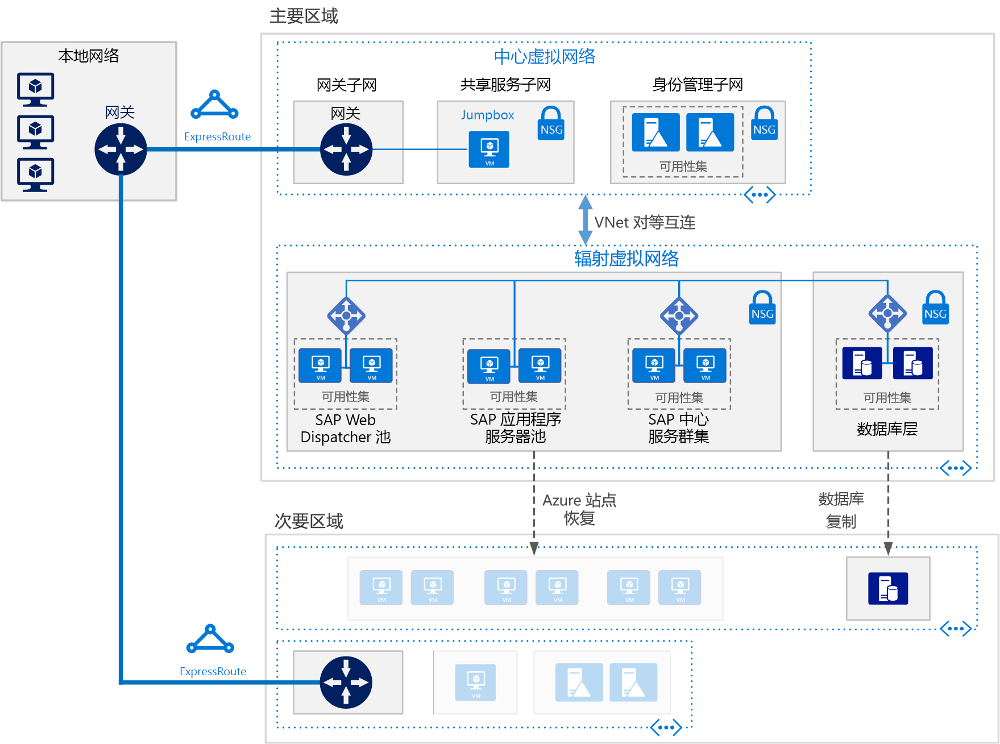

# 在 Azure 虚拟机上部署适用于 AnyDB 的 SAP NetWeaver (Windows)Deploy SAP NetWeaver (Windows) for AnyDB on Azure Virtual Machines

此参考体系结构演示有关在 Azure 上的高可用性 Windows 环境中运行 SAP NetWeaver 的一套成熟做法。This reference architecture shows a set of proven practices for running SAP NetWeaver in a Windows environment on Azure with high availability. 数据库为 AnyDB（除了 SAP HANA 之外，该 SAP 术语还指任何受支持的 DBMS）。The database is AnyDB, the SAP term for any supported DBMS besides SAP HANA. 将使用可根据组织需求更改的特定虚拟机 (VM) 大小部署此体系结构。This architecture is deployed with specific virtual machine (VM) sizes that can be changed to accommodate your organization's needs.

下载此体系结构的 [Visio 文件][visio-download]。*Download a [Visio file][visio-download] of this architecture.*

> [!NOTE] 
> 部署此参考体系结构需要获取 SAP 产品和其他非 Microsoft 技术的相应许可。Deploying this reference architecture requires appropriate licensing of SAP products and other non-Microsoft technologies.

## 体系结构Architecture
该体系结构包括以下基础结构和关键软件组件。The architecture consists of the following infrastructure and key software components.

虚拟网络。**Virtual network**. Azure 虚拟网络服务在 Azure 资源之间建立安全连接。The Azure Virtual Network service securely connects Azure resources to each other. 在此体系结构中，虚拟网络将通过[中心-分支型](../hybrid-networking/hub-spoke.md)拓扑的中心内部署的 VPN 网关连接到本地环境。In this architecture, the virtual network connects to an on-premises environment through a VPN gateway deployed in the hub of a [hub-spoke](../hybrid-networking/hub-spoke.md). 分支是用于 SAP 应用程序和数据库层的虚拟网络。The spoke is the virtual network used for the SAP applications and database tier.

**子网**。**Subnets**. 针对以下每个层将虚拟网络细分为单独的子网：应用 (SAP NetWeaver)、数据库、共享服务 (jumpbox) 和 Active Directory。The virtual network is subdivided into separate subnets for each tier: application (SAP NetWeaver), database, shared services (the jumpbox), and Active Directory.
    
**虚拟机**。**Virtual machines**. 此体系结构对应用层和数据库层使用虚拟机。这些层划分为：This architecture uses virtual machines for the application tier and database tier, grouped as follows:

- **SAP NetWeaver**。**SAP NetWeaver**. 应用层使用 Windows 虚拟机，并运行 SAP Central Services 和 SAP 应用程序服务器。The application tier uses Windows virtual machines and runs SAP Central Services and SAP application servers. 运行 Central Services 的 VM 配置为 SIOS DataKeeper Cluster Edition 支持的 Windows Server 故障转移群集，以实现高可用性。The VMs that run Central Services are configured as a Windows Server Failover Cluster for high availability, supported by SIOS DataKeeper Cluster Edition.
- **AnyDB**。**AnyDB**. 数据库层运行用作源数据库的 AnyDB，例如 Microsoft SQL Server、Oracle 或 IBM DB2。The database tier runs AnyDB as the source database, such as Microsoft SQL Server, Oracle, or IBM DB2.
- **Jumpbox**。**Jumpbox**. 也称为守护主机。Also called a bastion host. 这是网络中的一个安全虚拟机，管理员使用它来连接其他虚拟机。This is a secure virtual machine on the network that administrators use to connect to the other virtual machines.
- **Windows Server Active Directory 域控制器。****Windows Server Active Directory domain controllers**. 对域中的所有 VM 和用户使用域控制器。The domain controllers are used on all VMs and users in the domain.

**负载均衡器**。**Load balancers**. 使用内置的 SAP 负载均衡器和 [Azure 负载均衡器](/azure/load-balancer/load-balancer-overview)来实现高可用性。Both built-in SAP load balancers and [Azure Load Balancer](/azure/load-balancer/load-balancer-overview) are used to achieve HA. Azure 负载均衡器实例用于将流量分配到应用层子网中的虚拟机。Azure Load Balancer instances are used to distribute traffic to virtual machines in the application tier subnet.

**可用性集**。**Availability sets**. 用于 SAP Web 调度程序、SAP 应用程序服务器和 (A)SCS 角色的虚拟机已分组到单独的[可用性集](/azure/virtual-machines/windows/tutorial-availability-sets)，为每个角色至少预配两个虚拟机。Virtual machines for the SAP Web Dispatcher, SAP application server, and (A)SCS, roles are grouped into separate [availability sets](/azure/virtual-machines/windows/tutorial-availability-sets), and at least two virtual machines are provisioned per role. 这样，虚拟机便可以满足更高的[服务级别协议 (SLA)](https://azure.microsoft.com/support/legal/sla/virtual-machines)。This makes the virtual machines eligible for a higher [service level agreement](https://azure.microsoft.com/support/legal/sla/virtual-machines) (SLA).

**NIC**。**NICs**. [网络接口卡](/azure/virtual-network/virtual-network-network-interface) (NIC) 使虚拟网络中的虚拟机能够实现各种通信。[Network interface cards](/azure/virtual-network/virtual-network-network-interface) (NICs) enable all communication of virtual machines on a virtual network.

**网络安全组**。**Network security groups**. 若要限制虚拟网络中的传入、传出和子网内部流量，可以创建[网络安全组](/azure/virtual-network/virtual-networks-nsg) (NSG)。To restrict incoming, outgoing, and intra-subnet traffic in the virtual network, you can create [network security groups](/azure/virtual-network/virtual-networks-nsg) (NSGs).

**网关**。**Gateway**. 网关将本地网络扩展到 Azure 虚拟网络。A gateway extends your on-premises network to the Azure virtual network. 建议使用 [ExpressRoute](/azure/architecture/reference-architectures/hybrid-networking/expressroute) Azure 服务来创建不必经由公共 Internet 的专用连接，但也可以使用[站点到站点](/azure/vpn-gateway/vpn-gateway-howto-site-to-site-resource-manager-portal)连接。[ExpressRoute](/azure/architecture/reference-architectures/hybrid-networking/expressroute) is the recommended Azure service for creating private connections that do not go over the public Internet, but a [Site-to-Site](/azure/vpn-gateway/vpn-gateway-howto-site-to-site-resource-manager-portal) connection can also be used.

**Azure 存储**。**Azure Storage**. 若要提供虚拟机的虚拟硬盘 (VHD) 持久存储，必须使用 [Azure 存储](/azure/storage/storage-standard-storage)。To provide persistent storage of a virtual machine's virtual hard disk (VHD), [Azure Storage](/azure/storage/storage-standard-storage) is required. [云见证](/windows-server/failover-clustering/deploy-cloud-witness)也会使用 Azure 存储来实施故障转移群集操作。It is also used by [Cloud Witness](/windows-server/failover-clustering/deploy-cloud-witness) to implement a failover cluster operation. 

## 建议Recommendations
你的要求可能不同于此处描述的体系结构。Your requirements might differ from the architecture described here. 请使用以下建议作为入手点。Use these recommendations as a starting point.

### SAP Web 调度程序池SAP Web Dispatcher pool

Web 调度程序组件用作 SAP 应用程序服务器之间的 SAP 流量的负载均衡器。The Web Dispatcher component is used as a load balancer for SAP traffic among the SAP application servers. 若要实现 Web 调度程序组件的高可用性，需使用 Azure 负载均衡器来实施并行的 Web 调度程序设置。To achieve high availability for the Web Dispatcher component, Azure Load Balancer is used to implement the parallel Web Dispatcher setup. Web 调度程序使用轮循机制配置，在均衡器池中的可用 Web 调度程序之间分配 HTTP(S) 流量。Web Dispatcher uses in a round-robin configuration for HTTP(S) traffic distribution among the available Web Dispatchers in the balancers pool.

有关在 Azure VM 中运行 SAP NetWeaver 的详细信息，请参阅[适用于 SAP NetWeaver 的 Azure 虚拟机规划和实施](/azure/virtual-machines/workloads/sap/planning-guide)。For details about running SAP NetWeaver in Azure VMs, see [Azure Virtual Machines planning and implementation for SAP NetWeaver](/azure/virtual-machines/workloads/sap/planning-guide).

### 应用程序服务器池Application servers pool

若要管理 ABAP 应用程序服务器的登录组，需使用 SMLG 事务。To manage logon groups for ABAP application servers, the SMLG transaction is used. 该事务使用 Central Services 的消息服务器中的负载均衡功能，在 SAPGUI 的 SAP 应用程序服务器池之间分配工作负荷，以及分配 RFC 流量。It uses the load balancing function within the message server of the Central Services to distribute workload among SAP application servers pool for SAPGUIs and RFC traffic. 与高可用性 Central Services 的应用程序服务器连接通过群集虚拟网络名称来建立。The application server connection to the highly available Central Services is through the cluster virtual network name.

### SAP Central Services 群集SAP Central Services cluster

此参考体系结构在应用层中的 VM 上运行 Central Services。This reference architecture runs Central Services on VMs in the application tier. 如果将 Central Services 部署到单个 VM（高可用性不是一项要求时，通常采用这种部署方式），则它可能会成为潜在的单一故障点 (SPOF)。The Central Services is a potential single point of failure (SPOF) when deployed to a single VM—typical deployment when high availability is not a requirement. 若要实施高可用性解决方案，可以使用共享的磁盘群集或文件共享群集。To implement a high availability solution, either a shared disk cluster or a file share cluster can be used.

若要为共享磁盘群集配置 VM，请使用 [Windows Server 故障转移群集](https://blogs.sap.com/2018/01/25/how-to-create-sap-resources-in-windows-failover-cluster/)。To configure VMs for a shared disk cluster, use [Windows Server Failover Cluster](https://blogs.sap.com/2018/01/25/how-to-create-sap-resources-in-windows-failover-cluster/). 建议将[云见证](/windows-server/failover-clustering/deploy-cloud-witness)用作仲裁见证。[Cloud Witness](/windows-server/failover-clustering/deploy-cloud-witness) is recommended as a quorum witness. 为了支持故障转移群集环境，[SIOS DataKeeper Cluster Edition](https://azuremarketplace.microsoft.com/marketplace/apps/sios_datakeeper.sios-datakeeper-8) 会通过复制群集节点拥有的独立磁盘来执行群集共享卷功能。To support the failover cluster environment, [SIOS DataKeeper Cluster Edition](https://azuremarketplace.microsoft.com/marketplace/apps/sios_datakeeper.sios-datakeeper-8) performs the cluster shared volume function by replicating independent disks owned by the cluster nodes. Azure 原生并不支持共享磁盘，因此需要 SIOS 提供的解决方案。Azure does not natively support shared disks and therefore requires solutions provided by SIOS.

有关详细信息，请参阅For details, see "3. [在 Microsoft 平台上运行 SAP 应用程序](https://blogs.msdn.microsoft.com/saponsqlserver/2017/05/04/sap-on-azure-general-update-for-customers-partners-april-2017/)中的“3. 针对在 Azure 上的 SIOS 中运行 ASCS 的 SAP 客户的重要更新”。Important Update for SAP Customers Running ASCS on SIOS on Azure” at [Running SAP applications on the Microsoft platform](https://blogs.msdn.microsoft.com/saponsqlserver/2017/05/04/sap-on-azure-general-update-for-customers-partners-april-2017/).

处理群集的另一种方法是使用 Windows Server 故障转移群集实施文件共享群集。Another way to handle clustering is to implement a file share cluster using Windows Server Failover Cluster. [SAP](https://blogs.sap.com/2018/03/19/migration-from-a-shared-disk-cluster-to-a-file-share-cluster/) 最近修改了 Central Services 部署模式，以允许通过 UNC 路径访问 /sapmnt 全局目录。[SAP](https://blogs.sap.com/2018/03/19/migration-from-a-shared-disk-cluster-to-a-file-share-cluster/) recently modified the Central Services deployment pattern to access the /sapmnt global directories via a UNC path. 此项更改[消除了](https://blogs.msdn.microsoft.com/saponsqlserver/2017/08/10/high-available-ascs-for-windows-on-file-share-shared-disk-no-longer-required/)需要在 Central Services VM 上使用 SIOS 或其他共享磁盘解决方案的要求。This change [removes the requirement](https://blogs.msdn.microsoft.com/saponsqlserver/2017/08/10/high-available-ascs-for-windows-on-file-share-shared-disk-no-longer-required/) for SIOS or other shared disk solutions on the Central Services VMs. 我们仍然建议确保 /sapmnt UNC 共享具有[高可用性](https://blogs.sap.com/2017/07/21/how-to-create-a-high-available-sapmnt-share/)。It is still recommended to ensure that the /sapmnt UNC share is [highly available](https://blogs.sap.com/2017/07/21/how-to-create-a-high-available-sapmnt-share/). 可在 Central Services 实例上实现此目的：配合 Windows Server 2016 中的[横向扩展文件服务器](https://blogs.msdn.microsoft.com/saponsqlserver/2017/11/14/file-server-with-sofs-and-s2d-as-an-alternative-to-cluster-shared-disk-for-clustering-of-an-sap-ascs-instance-in-azure-is-generally-available/) (SOFS) 和[存储空间直通](https://blogs.sap.com/2018/03/07/your-sap-on-azure-part-5-ascs-high-availability-with-storage-spaces-direct/) (S2D) 功能使用 Windows Server 故障转移群集。This can be done on the Central Services instance by using Windows Server Failover Cluster with [Scale Out File Server](https://blogs.msdn.microsoft.com/saponsqlserver/2017/11/14/file-server-with-sofs-and-s2d-as-an-alternative-to-cluster-shared-disk-for-clustering-of-an-sap-ascs-instance-in-azure-is-generally-available/) (SOFS) and the [Storage Spaces Direct](https://blogs.sap.com/2018/03/07/your-sap-on-azure-part-5-ascs-high-availability-with-storage-spaces-direct/) (S2D) feature in Windows Server 2016. 

### 可用性集Availability sets

可用性集将服务器分配到不同的物理基础结构，并更新组以提高服务可用性。Availability sets distribute servers to different physical infrastructure and update groups to improve service availability. 将执行相同角色的虚拟机放入某个可用性集有助于避免 Azure 基础结构维护工作造成的停机，并有助于满足 [SLA](https://azure.microsoft.com/support/legal/sla/virtual-machines)。Put virtual machines that perform the same role into an availability sets to help guard against downtime caused by Azure infrastructure maintenance and to meet [SLAs](https://azure.microsoft.com/support/legal/sla/virtual-machines) (SLAs). 建议为每个可用性集配置两个或更多个虚拟机。Two or more virtual machines per availability set is recommended.

一个集内的所有虚拟机必须执行相同的角色。All virtual machines in a set must perform the same role. 不要在同一个可用性集中混合不同角色的服务器。Do not mix servers of different roles in the same availability set. 例如，不要将 Central Services 节点放到应用程序服务器所在的同一个可用性集中。For example, don't place a Central Services node in the same availability set with the application server.

### NICNICs

传统的本地 SAP 部署为每个计算机实施多个网络接口卡 (NIC)，以便将管理流量与业务流量相分离。Traditional on-premises SAP deployments implement multiple network interface cards (NICs) per machine to segregate administrative traffic from business traffic. 在 Azure 上，虚拟网络是软件定义的网络，它通过同一网络结构发送所有流量。On Azure, the virtual network is a software-defined network that sends all traffic through the same network fabric. 因此，没有必要使用多个 NIC。Therefore, the use of multiple NICs is unnecessary. 但是，如果组织需要分离流量，则可为每个 VM 部署多个 NIC，将每个 NIC 连接到不同的子网，然后使用 NSG 强制实施不同的访问控制策略。However, if your organization needs to segregate traffic, you can deploy multiple NICs per VM, connect each NIC to a different subnet, and then use NSGs to enforce different access control policies.

### 子网和 NSGSubnets and NSGs

此体系结构将虚拟网络地址空间划分为子网。This architecture subdivides the virtual network address space into subnets. 此参考体系结构主要侧重于应用层子网。This reference architecture focuses primarily on the application tier subnet. 每个子网可与定义子网访问策略的 NSG 相关联。Each subnet can be associated with a NSG that defines the access policies for the subnet. 请将应用程序服务器放在单独的子网中，以便可以通过管理子网安全策略而不是单个服务器，更轻松地为服务器提供保护。Place application servers on a separate subnet so you can secure them more easily by managing the subnet security policies, not the individual servers.

NSG 在与某个子网关联后，将应用到该子网中的所有服务器。When a NSG is associated with a subnet, it applies to all the servers within the subnet. 有关使用 NSG 对子网中的服务器进行精细控制的详细信息，请参阅[使用网络安全组筛选网络流量](https://azure.microsoft.com/en-us/blog/multiple-vm-nics-and-network-virtual-appliances-in-azure/)。For more information about using NSGs for fine-grained control over the servers in a subnet, see [Filter network traffic with network security groups](https://azure.microsoft.com/en-us/blog/multiple-vm-nics-and-network-virtual-appliances-in-azure/).

### 负载均衡器Load balancers

[SAP Web 调度程序](https://help.sap.com/doc/saphelp_nw73ehp1/7.31.19/en-US/48/8fe37933114e6fe10000000a421937/frameset.htm)处理对发往 SAP 应用程序服务器池的 HTTP(S) 流量的负载均衡。[SAP Web Dispatcher](https://help.sap.com/doc/saphelp_nw73ehp1/7.31.19/en-US/48/8fe37933114e6fe10000000a421937/frameset.htm) handles load balancing of HTTP(S) traffic to a pool of SAP application servers.

对于通过 DIAG 协议或远程函数调用 (RFC) 连接 SAP 服务器的 SAP GUI 客户端发出的流量，Central Services 消息服务器会通过 SAP 应用程序服务器[登录组](https://wiki.scn.sap.com/wiki/display/SI/ABAP+Logon+Group+based+Load+Balancing)进行负载均衡，因此，无需额外的负载均衡器。For traffic from SAP GUI clients connecting a SAP server via DIAG protocol or Remote Function Calls (RFC), the Central Services message server balances the load through SAP application server [logon groups](https://wiki.scn.sap.com/wiki/display/SI/ABAP+Logon+Group+based+Load+Balancing), so no additional load balancer is needed.

### Azure 存储Azure Storage

对于所有数据库服务器虚拟机，我们建议使用 Azure 高级存储，以保持一致的读/写延迟。For all database server virtual machines, we recommend using Azure Premium Storage for consistent read/write latency. 对于将高级存储用于所有操作系统磁盘和数据磁盘的任何单一实例虚拟机，请参阅[虚拟机的 SLA](https://azure.microsoft.com/support/legal/sla/virtual-machines)。For any single instance virtual machine using Premium Storage for all operating system disks and data disks, see [SLA for Virtual Machines](https://azure.microsoft.com/support/legal/sla/virtual-machines). 此外，对于 SAP 生产系统，我们建议在所有场合下都使用高级 [Azure 托管磁盘](/azure/storage/storage-managed-disks-overview)。Also, for production SAP systems, we recommend using Premium [Azure Managed Disks](/azure/storage/storage-managed-disks-overview) in all cases. 为提高可靠性，可使用托管磁盘来管理磁盘的 VHD 文件。For reliability, Managed Disks are used to manage the VHD files for the disks. 托管磁盘可确保隔离可用性集中虚拟机的磁盘，以避免单一故障点。Managed disks ensure that the disks for virtual machines within an availability set are isolated to avoid single points of failure.

对于 SAP 应用程序服务器，包括 Central Services 虚拟机，可以使用标准 Azure 存储来降低成本，因为应用程序执行在内存中发生，只将磁盘用于日志记录。For SAP application servers, including the Central Services virtual machines, you can use Azure Standard Storage to reduce cost, because application execution takes place in memory and disks are used for logging only. 但是，目前只有标准存储才通过了非托管存储的认证。However, at this time, Standard Storage is only certified for unmanaged storage. 由于应用程序服务器不会托管任何数据，因此你可以借助较小的 P4 和 P6 高级存储磁盘来尽量降低成本。Since application servers do not host any data, you can also use the smaller P4 and P6 Premium Storage disks to help minimize cost.

[云见证](/windows-server/failover-clustering/deploy-cloud-witness)也使用 Azure 存储来维护远程 Azure 区域（远离群集所在的主要区域）中设备的仲裁。Azure Storage is also used by [Cloud Witness](/windows-server/failover-clustering/deploy-cloud-witness) to maintain quorum with a device in a remote Azure region away from the primary region where the cluster resides.

对于备份数据存储，我们建议使用 Azure [冷访问层](/azure/storage/storage-blob-storage-tiers)和[存档访问层存储](/azure/storage/storage-blob-storage-tiers)。For the backup data store, we recommend using Azure [coolaccess tier](/azure/storage/storage-blob-storage-tiers) and [archive access tier storage](/azure/storage/storage-blob-storage-tiers). 这些存储层的性价比较高，适合用于存储不经常访问的长久留存数据。These storage tiers are cost-effective ways to store long-lived data that is infrequently accessed.

## 性能注意事项Performance considerations

SAP 应用程序服务器与数据库服务器不断通信。SAP application servers carry on constant communications with the database servers. 对于任何数据库平台上运行的性能关键型应用程序，包括 SAP HANA，请考虑启用[写入加速器](/azure/virtual-machines/linux/how-to-enable-write-accelerator)来改善日志写入延迟。For performance-critical applications running on any database platforms, including SAP HANA, consider enabling [Write Accelerator](/azure/virtual-machines/linux/how-to-enable-write-accelerator) to improve log write latency. 若要优化服务器间的通信，请使用[加速网络](https://azure.microsoft.com/blog/linux-and-windows-networking-performance-enhancements-accelerated-networking/)。To optimize inter-server communications, use the [Accelerated Network](https://azure.microsoft.com/blog/linux-and-windows-networking-performance-enhancements-accelerated-networking/). 请注意，这些加速器仅适用于某些 VM 系列。Note that these accelerators are available only for certain VM series.

若要实现较高的 IOPS 和磁盘带宽吞吐量，可向 Azure 存储布局应用[优化存储卷性能](/azure/virtual-machines/windows/premium-storage-performance)时采用的常见做法。To achieve high IOPS and disk bandwidth throughput, the common practices in storage volume [performance optimization](/azure/virtual-machines/windows/premium-storage-performance) apply to Azure storage layout. 例如，将多个磁盘合并在一起以创建条带化磁盘卷可以提高 IO 性能。For example, combining multiple disks together to create a striped disk volume improves IO performance. 针对不经常更改的存储内容启用读取缓存可增强数据检索的速度。Enabling the read cache on storage content that changes infrequently enhances the speed of data retrieval.

对于 SQL 上的 SAP，[Top 10 Key Considerations for Deploying SAP Applications on Azure](https://blogs.msdn.microsoft.com/saponsqlserver/2015/05/25/top-10-key-considerations-for-deploying-sap-applications-on-azure/)（有关在 Azure 上部署 SAP 应用程序的最关键 10 条注意事项）博客文章提供了有关在 SQL Server 上为 SAP 工作负荷优化 Azure 存储的极佳建议。For SAP on SQL, the [Top 10 Key Considerations for Deploying SAP Applications on Azure](https://blogs.msdn.microsoft.com/saponsqlserver/2015/05/25/top-10-key-considerations-for-deploying-sap-applications-on-azure/) blog offers excellent advice on optimizing Azure storage for SAP workloads on SQL Server.

## 可伸缩性注意事项Scalability considerations

在 SAP 应用程序层，Azure 提供多种虚拟机大小供纵向和横向扩展。有关详尽列表，请参阅 [SAP 说明 1928533](https://launchpad.support.sap.com/#/notes/1928533) - Azure 上的 SAP 应用程序：支持的产品和 Azure VM 类型。At the SAP application layer, Azure offers a wide range of virtual machine sizes for scaling up and scaling out. For an inclusive list, see [SAP note 1928533](https://launchpad.support.sap.com/#/notes/1928533) - SAP Applications on Azure: Supported Products and Azure VM Types. （需要创建 SAP Service Marketplace 帐户进行访问。）(SAP Service Marketplace account required for access). 可以纵向扩展/缩减 SAP 应用程序服务器和 Central Services 群集，或者通过添加更多的实例对其进行横向扩展。SAP application servers and the Central Services clusters can scale up/down or scale out by adding more instances. AnyDB 数据库可以纵向扩展/缩减，但不能横向扩展。AnyDB 的 SAP 数据库容器不支持分片。The AnyDB database can scale up/down but does not scale out. The SAP database container for AnyDB does not support sharding.

## 可用性注意事项Availability considerations

资源冗余是高可用性基础结构解决方案中的常见话题。Resource redundancy is the general theme in highly available infrastructure solutions. 对于 SLA 不太苛刻的组织而言，单一实例 Azure VM 可以保障运行时间 SLA。For enterprises that have a less stringent SLA, single-instance Azure VMs offer an uptime SLA. 有关详细信息，请参阅 [Azure 服务级别协议](https://azure.microsoft.com/support/legal/sla/)。For more information, see [Azure Service Level Agreement](https://azure.microsoft.com/support/legal/sla/).

在这种 SAP 应用程序分布式安装中，将会复制基本安装以实现高可用性。In this distributed installation of the SAP application, the base installation is replicated to achieve high availability. 对于体系结构的每个层，高可用性设计各不相同。For each layer of the architecture, the high availability design varies.

### 应用层Application tier

SAP Web 调度程序的高可用性是通过冗余实例实现的。High availability for SAP Web Dispatcher is achieved with redundant instances. 请参阅 SAP 文档中的 [SAP Web 调度程序](https://help.sap.com/doc/saphelp_nw70ehp2/7.02.16/en-us/48/8fe37933114e6fe10000000a421937/frameset.htm)。See [SAP Web Dispatcher](https://help.sap.com/doc/saphelp_nw70ehp2/7.02.16/en-us/48/8fe37933114e6fe10000000a421937/frameset.htm) in the SAP Documentation.

Central Services 的高可用性是通过 Windows Server 故障转移群集实现的。High availability of the Central Services is implemented with Windows Server Failover Cluster. 在 Azure 上部署群集后，可以使用两种方法来配置故障转移群集的群集存储：群集共享卷或文件共享。When deployed on Azure, the cluster storage for the failover cluster can be configured using two approaches: either a clustered shared volume or a file share.

由于 Azure 不支持共享磁盘，因此需使用 SIOS Datakeeper 来复制附加到群集节点的独立磁盘的内容，并将驱动器抽象化为群集管理器的群集共享卷。Since shared disks are not possible on Azure, SIOS Datakeeper is used to replicate the content of independent disks attached to the cluster nodes and to abstract the drives as a cluster shared volume for the cluster manager. 有关实施方式的详细信息，请参阅[在 Azure 上组建 SAP ASCS 群集](https://blogs.msdn.microsoft.com/saponsqlserver/2015/05/20/clustering-sap-ascs-instance-using-windows-server-failover-cluster-on-microsoft-azure-with-sios-datakeeper-and-azure-internal-load-balancer/)。For implementation details, see [Clustering SAP ASCS on Azure](https://blogs.msdn.microsoft.com/saponsqlserver/2015/05/20/clustering-sap-ascs-instance-using-windows-server-failover-cluster-on-microsoft-azure-with-sios-datakeeper-and-azure-internal-load-balancer/).

另一种做法是使用[横向扩展文件服务器](https://blogs.msdn.microsoft.com/saponsqlserver/2017/11/14/file-server-with-sofs-and-s2d-as-an-alternative-to-cluster-shared-disk-for-clustering-of-an-sap-ascs-instance-in-azure-is-generally-available/) (SOFS) 提供的文件共享。Another option is to use a file share served up by the [Scale Out Fileserver](https://blogs.msdn.microsoft.com/saponsqlserver/2017/11/14/file-server-with-sofs-and-s2d-as-an-alternative-to-cluster-shared-disk-for-clustering-of-an-sap-ascs-instance-in-azure-is-generally-available/) (SOFS). SOFS 提供弹性文件共享，可将其用作 Windows 群集的群集共享卷。SOFS offers resilient file shares you can use as a cluster shared volume for the Windows cluster. 可在多个 Central Services 节点之间共享 SOFS 群集。A SOFS cluster can be shared among multiple Central Services nodes. 截至本文编写之时，SOFS 仅适用于高可用性设计，因为 SOFS 群集不会跨区域扩展来提供灾难恢复支持。As of this writing, SOFS is used only for high availability design, because the SOFS cluster does not extend across regions to provide disaster recovery support.

SAP 应用程序服务器的高可用性是通过对应用程序服务器池中的流量进行负载均衡来实现的。High availability for the SAP application servers is achieved by load balancing traffic within a pool of application servers.
请参阅[在 Microsoft Azure 上运行的 SAP 认证和配置](/azure/virtual-machines/workloads/sap/sap-certifications)。See [SAP certifications and configurations running on Microsoft Azure](/azure/virtual-machines/workloads/sap/sap-certifications).

### 数据库层Database tier

此参考体系结构假设源数据库在 AnyDB（即，SQL Server、SAP ASE、IBM DB2 或 Oracle 等 DBMS）上运行。This reference architecture assumes the source database is running on AnyDB—that is, a DBMS such as SQL Server, SAP ASE, IBM DB2, or Oracle. 数据库层的本机复制功能在复制的节点之间提供手动或自动故障转移。The database tier's native replication feature provides either manual or automatic failover between replicated nodes.

有关特定数据库系统的实施方法详细信息，请参阅[适用于 SAP NetWeaver 的 Azure 虚拟机 DBMS 部署](/azure/virtual-machines/workloads/sap/dbms-guide)。For implementation details about specific database systems, see [Azure Virtual Machines DBMS deployment for SAP NetWeaver](/azure/virtual-machines/workloads/sap/dbms-guide).

## 灾难恢复注意事项Disaster recovery considerations

对于灾难恢复 (DR)，必须能够故障转移到次要区域。For disaster recovery (DR), you must be able to fail over to a secondary region. 每个层使用不同的策略提供灾难恢复 (DR) 保护。Each tier uses a different strategy to provide disaster recovery (DR) protection.

- **应用程序服务器层**。**Application servers tier**. SAP 应用程序服务器不包含业务数据。SAP application servers do not contain business data. 在 Azure 上，简单的 DR 策略是在次要区域中创建 SAP 应用程序服务器，然后关闭这些服务器。On Azure, a simple DR strategy is to create SAP application servers in the secondary region, then shut them down. 在主要应用程序服务器上进行任何配置更改或内核更新后，必须将相同的更改复制到次要区域中的虚拟机。Upon any configuration changes or kernel updates on the primary application server, the same changes must be copied to the virtual machines in the secondary region. 例如，将内核可执行文件复制到 DR 虚拟机。For example, the kernel executables copied to the DR virtual machines. 要将应用程序服务器自动复制到次要区域，建议使用 [Azure Site Recovery](/azure/site-recovery/site-recovery-overview) 解决方案。For automatic replication of application servers to a secondary region, [Azure Site Recovery](/azure/site-recovery/site-recovery-overview) is the recommended solution.

- **Central Services**。**Central Services**. SAP 应用程序堆栈的此组件也不会保存业务数据。This component of the SAP application stack also does not persist business data. 可以在灾难恢复区域中构建一个 VM 来运行 Central Services 角色。You can build a VM in the disaster recovery region to run the Central Services role. 在主要 Central Services 节点中，要同步的唯一内容是 /sapmnt 共享内容。The only content from the primary Central Services node to synchronize is the /sapmnt share content. 此外，如果主要 Central Services 服务器上发生配置更改或内核更新，必须在灾难恢复区域中运行 Central Services 的 VM 上重复这些操作。Also, if configuration changes or kernel updates take place on the primary Central Services servers, they must be repeated on the VM in the disaster recovery region running Central Services. 若要同步两个服务器，可以使用 Azure Site Recovery 复制群集节点，或只需使用定期计划的复制作业将 /sapmnt 复制到灾难恢复区域。To synchronize the two servers, you can use either Azure Site Recovery to replicate the cluster nodes or simply use a regularly scheduled copy job to copy /sapmnt to the disaster recovery region. 有关此简单复制方法的生成、复制和测试故障转移过程的详细信息，请下载[ SAP NetWeaver：生成基于 Hyper-V 和 Microsoft Azure 的灾难恢复解决方案](http://download.microsoft.com/download/9/5/6/956FEDC3-702D-4EFB-A7D3-2DB7505566B6/SAP%20NetWeaver%20-%20Building%20an%20Azure%20based%20Disaster%20Recovery%20Solution%20V1_5%20.docx)，并参阅“4.3.For details about this simple replication method's build, copy, and test failover process, download [SAP NetWeaver: Building a Hyper-V and Microsoft Azure–based Disaster Recovery Solution](http://download.microsoft.com/download/9/5/6/956FEDC3-702D-4EFB-A7D3-2DB7505566B6/SAP%20NetWeaver%20-%20Building%20an%20Azure%20based%20Disaster%20Recovery%20Solution%20V1_5%20.docx), and refer to "4.3. SAP SPOF 层 (ASCS)”。SAP SPOF layer (ASCS)."

- **数据库层**。**Database tier**. 最好是使用数据库本身的集成复制技术来实现 DR。DR is best implemented with the database's own integrated replication technology. 例如，对于 SQL Server，我们建议使用 AlwaysOn 可用性组在远程区域中建立副本，并通过手动故障转移以异步方式复制事务。In the case of SQL Server, for example, we recommend using AlwaysOn Availability Group to establish a replica in a remote region, replicating transactions asynchronously with manual failover. 异步复制可避免影响到主站点中交互式工作负荷的性能。Asynchronous replication avoids an impact to the performance of interactive workloads at the primary site. 用户可以借助手动故障转移来评估 DR 影响，并确定是否适合从 DR 站点操作。Manual failover offers the opportunity for a person to evaluate the DR impact and decide if operating from the DR site is justified.

若要使用 Azure Site Recovery 自动构建出原始站点的完整复制生产站点，必须运行自定义的[部署脚本](/azure/site-recovery/site-recovery-runbook-automation)。To use Azure Site Recovery to automatically build out a fully replicated production site of your original, you must run customized [deployment scripts](/azure/site-recovery/site-recovery-runbook-automation). Site Recovery 首先在可用性集中部署 VM，然后运行脚本来添加负载均衡器等资源。Site Recovery first deploys the VMs in availability sets, then runs scripts to add resources such as load balancers.

## 可管理性注意事项Manageability considerations

Azure 提供多种功能用于[监视和诊断](/azure/architecture/best-practices/monitoring)整个基础结构。Azure provides several functions for [monitoring and diagnostics](/azure/architecture/best-practices/monitoring) of the overall infrastructure. 此外，Azure Operations Management Suite (OMS) 可处理 Azure 虚拟机的增强型监视。Also, enhanced monitoring of Azure virtual machines is handled by Azure Operations Management Suite (OMS).

若要针对 SAP 基础结构的资源和服务性能提供基于 SAP 的监视，可使用 [Azure SAP 增强型监视](/azure/virtual-machines/workloads/sap/deployment-guide#detailed-tasks-for-sap-software-deployment)扩展。To provide SAP-based monitoring of resources and service performance of the SAP infrastructure, the [Azure SAP Enhanced Monitoring](/azure/virtual-machines/workloads/sap/deployment-guide#detailed-tasks-for-sap-software-deployment) extension is used. 此扩展会将 Azure 监视统计信息馈送到 SAP 应用程序，以执行操作系统监视和 DBA Cockpit 功能。This extension feeds Azure monitoring statistics into the SAP application for operating system monitoring and DBA Cockpit functions.

## 安全注意事项Security considerations

SAP 具有自身的用户管理引擎 (UME)，可在 SAP 应用程序中控制基于角色的访问和授权。SAP has its own Users Management Engine (UME) to control role-based access and authorization within the SAP application. 有关详细信息，请参阅[适用于 ABAP 的 SAP NetWeaver 应用程序服务器安全指南](https://help.sap.com/doc/7b932ef4728810148a4b1a83b0e91070/1610 001/en-US/frameset.htm?4dde53b3e9142e51e10000000a42189c.html)和 [SAP NetWeaver 应用程序服务器 Java 安全指南](https://help.sap.com/doc/saphelp_snc_uiaddon_10/1.0/en-US/57/d8bfcf38f66f48b95ce1f52b3f5184/frameset.htm)。For details, see [SAP NetWeaver Application Server for ABAP Security Guide](https://help.sap.com/doc/7b932ef4728810148a4b1a83b0e91070/1610 001/en-US/frameset.htm?4dde53b3e9142e51e10000000a42189c.html) and [SAP NetWeaver Application Server Java Security Guide](https://help.sap.com/doc/saphelp_snc_uiaddon_10/1.0/en-US/57/d8bfcf38f66f48b95ce1f52b3f5184/frameset.htm).

在其他网络安全性方面，请考虑实施[外围网络](../dmz/secure-vnet-hybrid.md)。外围网络使用网络虚拟设备在 Web 调度程序子网的前面创建防火墙。For additional network security, consider implementing a [network DMZ](../dmz/secure-vnet-hybrid.md), which uses a network virtual appliance to create a firewall in front of the subnet for Web Dispatcher.

在基础结构安全性方面，传输中数据和静态数据会加密。For infrastructure security, data is encrypted in transit and at rest. 可参考 [Azure 虚拟机 (VM) 上的 SAP NetWeaver - 规划和实施指南](/azure/virtual-machines/workloads/sap/planning-guide)的“安全注意事项”部分解决网络安全问题。The "Security considerations” section of the [SAP NetWeaver on Azure Virtual Machines (VMs) – Planning and Implementation Guide](/azure/virtual-machines/workloads/sap/planning-guide) begins to address network security. 该指南还指定了为使应用程序能够通信，而必须在防火墙中打开的网络端口。The guide also specifies the network ports you must open on the firewalls to allow application communication.

若要加密 Windows 虚拟机磁盘，可以使用 [Azure 磁盘加密](/azure/security/azure-security-disk-encryption)。To encrypt Windows virtual machine disks, you can use [Azure Disk Encryption](/azure/security/azure-security-disk-encryption). 磁盘加密使用 Windows 的 BitLocker 功能，为操作系统和数据磁盘提供卷加密。It uses the BitLocker feature of Windows to provide volume encryption for the operating system and the data disks. 该解决方案还可与 Azure Key Vault 配合工作，帮助管理 Key Vault 订阅中的磁盘加密密钥和机密。The solution also works with Azure Key Vault to help you control and manage the disk-encryption keys and secrets in your key vault subscription. 虚拟机磁盘上的数据将在 Azure 存储中静态加密。Data on the virtual machine disks are encrypted at rest in your Azure storage.

## 社区Communities

社区可以解答问题，并帮助设置成功的部署。Communities can answer questions and help you set up a successful deployment. 请注意以下几点：Consider the following:

- [在 Microsoft 平台上运行 SAP 应用程序（博客）Running SAP Applications on the Microsoft Platform Blog](https://blogs.msdn.microsoft.com/saponsqlserver/2017/05/04/sap-on-azure-general-update-for-customers-partners-april-2017/)
- [Azure 社区支持Azure Community Support](https://azure.microsoft.com/support/community/)
- [SAP 社区SAP Community](https://www.sap.com/community.html)
- [堆栈溢出Stack Overflow](https://stackoverflow.com/tags/sap/)

[visio-download]: https://archcenter.blob.core.windows.net/cdn/sap-reference-architectures.vsdx