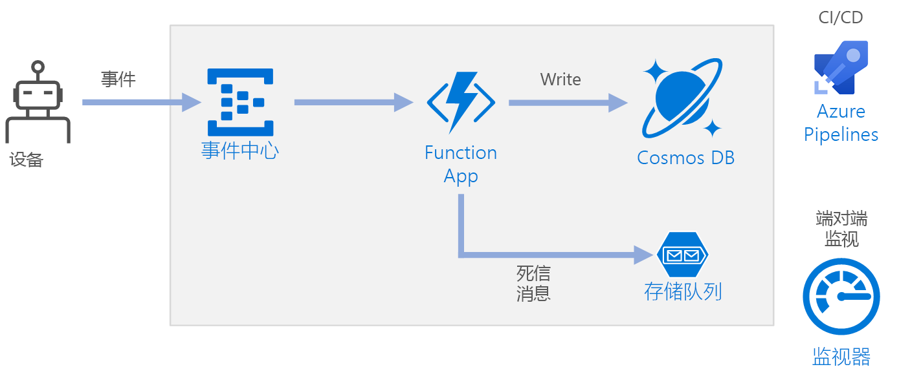

# <a name="serverless-event-processing-using-azure-functions"></a>使用 Azure Functions 进行无服务器事件处理

本参考体系结构演示一个可以引入数据流、处理数据，并将结果写入后端数据库的事件驱动式[无服务器](https://azure.microsoft.com/solutions/serverless/)体系结构。 [GitHub][github] 中提供了本体系结构的参考实现。



## <a name="architecture"></a>体系结构

**事件中心**引入数据流。 [事件中心][eh]面向高吞吐量数据流方案。

> [!NOTE]
> 对于 IoT 方案，我们建议使用 IoT 中心。 IoT 中心包含与 Azure 事件中心 API 兼容的内置终结点，因此，无需对后端处理进行重大更改，就能在本体系结构中使用任一服务。 有关详细信息，请参阅[将 IoT 设备连接到 Azure：IoT 中心和事件中心][iot]。

**函数应用**。 [Azure Functions][functions] 是一个无服务器计算选项。 它使用事件驱动的模型，其中的一段代码（“函数”）由触发器调用。 在本体系结构中，当事件抵达事件中心时，会触发一个函数，该函数处理事件并将结果写入存储。

函数应用适合用于处理来自事件中心的单个记录。 对于更复杂的流处理方案，请考虑结合 Azure Databricks 或 Azure 流分析使用 Apache Spark。

**Cosmos DB**。 [Cosmos DB][cosmosdb] 是一个多模型数据库服务。 对于此方案，事件处理函数将使用 Cosmos DB [SQL API][cosmosdb-sql] 存储 JSON 记录。

**队列存储**。 [队列存储][queue]用于将消息加入死信队列。 如果处理事件时出错，函数会将事件数据存储到死信队列供稍后处理。 有关详细信息，请参阅[复原注意事项](#resiliency-considerations)。

**Azure Monitor**。 [Monitor][monitor] 收集解决方案中部署的 Azure 服务的性能指标。 在仪表板中可视化这些指标可以洞察解决方案的运行状况。

**Azure Pipelines**。 [Pipelines][pipelines] 是用于生成、测试和部署应用程序的持续集成 (CI) 和持续交付 (CD) 服务。

## <a name="scalability-considerations"></a>可伸缩性注意事项

### <a name="event-hubs"></a>事件中心

事件中心的吞吐量容量以[吞吐量单位][eh-throughput]来度量。 可以通过启用[自动扩充][eh-autoscale]来自动缩放事件中心。自动扩充可以根据流量，最高将吞吐量单位自动扩展到配置的上限。

函数应用中的[事件中心触发器][eh-trigger]根据事件中心内的分区数进行缩放。 每次为每个分区分配一个函数实例。 若要最大程度地提高吞吐量，请分批接收事件，而不要逐个接收。

### <a name="cosmos-db"></a>Cosmos DB

Cosmos DB 的吞吐量容量以[请求单位][ru] (RU) 来度量。 若要将某个 Cosmos DB 容器扩展到超过 10,000 RU，必须在创建该容器时指定[分区键][partition-key]，并在创建的每个文档中包含该分区键。

下面是适当分区键的一些特征：

- 键值空间较大。
- 为每个键值平均分配读取/写入，避免出现热键。
- 为任何一个键值存储的数据上限不超过最大物理分区大小 (10 GB)。
- 文档的分区键不会更改。 无法更新现有文档中的分区键。

在本参考体系结构的方案中，函数针对发送数据的每个设备正好存储一个文档。 函数使用 upsert 操作持续以最新的设备状态更新文档。 设备 ID 非常适合在此方案中用作分区键，因为写入操作将在不同的键之间平均分配，并且每个分区的大小严格受限，因为每个键值对应单个文档。 有关分区键的详细信息，请参阅 [Azure Cosmos DB 中的分区和缩放][cosmosdb-scale]。

## <a name="resiliency-considerations"></a>复原注意事项

配合 Functions 使用事件中心触发器时，可以捕获处理循环中的异常。 如果发生未经处理的异常，Functions 运行时不会重试消息。 如果无法处理某个消息，会将该消息放入死信队列。 使用带外进程来检查消息并确定纠正措施。

以下代码演示引入函数如何捕获异常，并将未经处理的消息放入死信队列。

```csharp
[FunctionName("RawTelemetryFunction")]
[StorageAccount("DeadLetterStorage")]
public static async Task RunAsync(
    [EventHubTrigger("%EventHubName%", Connection = "EventHubConnection", ConsumerGroup ="%EventHubConsumerGroup%")]EventData[] messages,
    [Queue("deadletterqueue")] IAsyncCollector<DeadLetterMessage> deadLetterMessages,
    ILogger logger)
{
    foreach (var message in messages)
    {
        DeviceState deviceState = null;

        try
        {
            deviceState = telemetryProcessor.Deserialize(message.Body.Array, logger);
        }
        catch (Exception ex)
        {
            logger.LogError(ex, "Error deserializing message", message.SystemProperties.PartitionKey, message.SystemProperties.SequenceNumber);
            await deadLetterMessages.AddAsync(new DeadLetterMessage { Issue = ex.Message, EventData = message });
        }

        try
        {
            await stateChangeProcessor.UpdateState(deviceState, logger);
        }
        catch (Exception ex)
        {
            logger.LogError(ex, "Error updating status document", deviceState);
            await deadLetterMessages.AddAsync(new DeadLetterMessage { Issue = ex.Message, EventData = message, DeviceState = deviceState });
        }
    }
}
```

请注意，函数使用[队列存储输出绑定][queue-binding]将项放入队列。

上面所示的代码还会将异常记录到 Application Insights。 可以使用分区键和序号将死信消息与日志中的异常相关联。

死信队列中的消息应该包含足够的信息，使你能够了解错误的上下文。 在此示例中，`DeadLetterMessage` 类包含异常消息、原始事件数据，以及反序列化的事件消息（如果有）。

```csharp
public class DeadLetterMessage
{
    public string Issue { get; set; }
    public EventData EventData { get; set; }
    public DeviceState DeviceState { get; set; }
}
```

使用 [Azure Monitor][monitor] 监视事件中心。 如果显示了输入但未显示输出，则表示消息尚未处理。 在此情况下，请转到 [Log Analytics][log-analytics] 并查找异常或其他错误。

## <a name="disaster-recovery-considerations"></a>灾难恢复注意事项

下面所示的部署驻留在单个 Azure 区域中。 更具弹性的灾难恢复方法利用不同服务中的异地分发功能：

- **事件中心**。 创建两个事件中心命名空间：主要（主动）命名空间和次要（被动）命名空间。 除非故障转移到次要命名空间，否则消息将自动路由到主动命名空间。 有关详细信息，请参阅 [Azure 事件中心异地灾难恢复][eh-dr]。

- **函数应用**。 部署另一个函数应用，用于等待从次要事件中心命名空间读取数据。 此函数将数据写入死信队列的辅助存储帐户。

- **Cosmos DB**。 Cosmos DB 支持[多主数据库区域][cosmosdb-geo]，因此可以向添加到 Cosmos DB 帐户中的任何区域写入数据。 如果未启用多主数据库，仍可以故障转移主要写入区域。 Cosmos DB 客户端 SDK 和 Azure 函数绑定会自动处理故障转移，因此你无需更新任何应用程序配置设置。

- **Azure 存储**。 将 [RA-GRS][ra-grs] 存储用于死信队列。 这会在另一个区域中创建只读副本。 如果主要区域不可用，可以读取当前位于队列中的项。 此外，在次要区域中预配另一个存储帐户，在故障转移后，函数可将数据写入该存储帐户。

## <a name="deploy-the-solution"></a>部署解决方案

若要部署此参考体系结构，请查看 [GitHub 自述文件][readme]。

<!-- links -->

[cosmosdb]: /azure/cosmos-db/introduction
[cosmosdb-geo]: /azure/cosmos-db/distribute-data-globally
[cosmosdb-scale]: /azure/cosmos-db/partition-data
[cosmosdb-sql]: /azure/cosmos-db/sql-api-introduction
[eh]: /azure/event-hubs/
[eh-autoscale]: /azure/event-hubs/event-hubs-auto-inflate
[eh-dr]: /azure/event-hubs/event-hubs-geo-dr
[eh-throughput]: /azure/event-hubs/event-hubs-features#throughput-units
[eh-trigger]: /azure/azure-functions/functions-bindings-event-hubs
[functions]: /azure/azure-functions/functions-overview
[iot]: /azure/iot-hub/iot-hub-compare-event-hubs
[log-analytics]: /azure/log-analytics/log-analytics-queries
[monitor]: /azure/azure-monitor/overview
[partition-key]: /azure/cosmos-db/partition-data
[pipelines]: /azure/devops/pipelines/index
[queue]: /azure/storage/queues/storage-queues-introduction
[queue-binding]: /azure/azure-functions/functions-bindings-storage-queue#output
[ra-grs]: /azure/storage/common/storage-redundancy-grs
[ru]: /azure/cosmos-db/request-units

[github]: https://github.com/mspnp/serverless-reference-implementation
[readme]: https://github.com/mspnp/serverless-reference-implementation/blob/master/README.md
