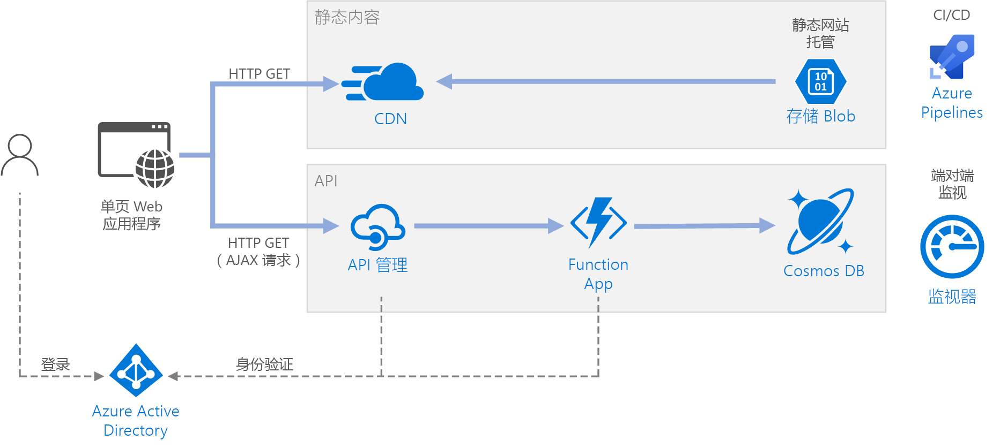

# <a name="serverless-web-application"></a><span data-ttu-id="f868e-103">无服务器 Web 应用程序</span><span class="sxs-lookup"><span data-stu-id="f868e-103">Serverless web application</span></span> 

<span data-ttu-id="f868e-104">本参考体系结构演示一个[无服务器](https://azure.microsoft.com/solutions/serverless/) Web 应用程序。</span><span class="sxs-lookup"><span data-stu-id="f868e-104">This reference architecture shows a [serverless](https://azure.microsoft.com/solutions/serverless/) web application.</span></span> <span data-ttu-id="f868e-105">该应用程序提供 Azure Blob 存储中的静态内容，并使用 Azure Functions 来实现一个 API。</span><span class="sxs-lookup"><span data-stu-id="f868e-105">The application serves static content from Azure Blob Storage, and implements an API using Azure Functions.</span></span> <span data-ttu-id="f868e-106">该 API 从 Cosmos DB 读取数据，并将结果返回到 Web 应用。</span><span class="sxs-lookup"><span data-stu-id="f868e-106">The API reads data from Cosmos DB and returns the results to the web app.</span></span> <span data-ttu-id="f868e-107">[GitHub][github] 中提供了本体系结构的参考实现。</span><span class="sxs-lookup"><span data-stu-id="f868e-107">A reference implementation for this architecture is available on [GitHub][github].</span></span>


 
<span data-ttu-id="f868e-108">术语“无服务器”有两种不同但相关的含义：</span><span class="sxs-lookup"><span data-stu-id="f868e-108">The term serverless has two distinct but related meanings:</span></span>

- <span data-ttu-id="f868e-109">**后端即服务** (BaaS)。</span><span class="sxs-lookup"><span data-stu-id="f868e-109">**Backend as a service** (BaaS).</span></span> <span data-ttu-id="f868e-110">后端云服务（例如数据库和存储）提供 API，使客户端应用程序能够直接连接到这些服务。</span><span class="sxs-lookup"><span data-stu-id="f868e-110">Backend cloud services, such as databases and storage, provide APIs that enable client applications to connect directly to these services.</span></span> 
- <span data-ttu-id="f868e-111">**函数即服务** (FaaS)。</span><span class="sxs-lookup"><span data-stu-id="f868e-111">**Functions as a service** (FaaS).</span></span> <span data-ttu-id="f868e-112">在此模型中，“函数”是部署到云的一段代码，在托管环境中运行，用于完全抽象化运行代码的服务器。</span><span class="sxs-lookup"><span data-stu-id="f868e-112">In this model, a "function" is a piece of code that is deployed to the cloud and runs inside a hosting environment that completely abstracts the servers that run the code.</span></span> 

<span data-ttu-id="f868e-113">这两个定义在概念上有共同之处，即，开发人员和 DevOps 人员无需部署、配置或管理服务器。</span><span class="sxs-lookup"><span data-stu-id="f868e-113">Both definitions have in common the idea that developers and DevOps personnel don't need to deploy, configure, or manage servers.</span></span> <span data-ttu-id="f868e-114">本参考体系结构侧重于使用 Azure Functions 的 FaaS，不过，由一个示例 BaaS 提供 Azure Blob 存储中的 Web 内容。</span><span class="sxs-lookup"><span data-stu-id="f868e-114">This reference architecture focuses on FaaS using Azure Functions, although serving web content from Azure Blob Storage is an example of BaaS.</span></span> <span data-ttu-id="f868e-115">FaaS 的部分重要特征包括：</span><span class="sxs-lookup"><span data-stu-id="f868e-115">Some important characteristics of FaaS are:</span></span>

1. <span data-ttu-id="f868e-116">计算资源由平台按需动态分配。</span><span class="sxs-lookup"><span data-stu-id="f868e-116">Compute resources are allocated dynamically as needed by the platform.</span></span>
1. <span data-ttu-id="f868e-117">基于消耗量的定价：你只需支付执行代码所用的计算资源的费用。</span><span class="sxs-lookup"><span data-stu-id="f868e-117">Consumption-based pricing: You are charged only for the compute resources used to execute your code.</span></span>
1. <span data-ttu-id="f868e-118">可根据流量按需缩放计算资源，开发人员无需执行任何配置。</span><span class="sxs-lookup"><span data-stu-id="f868e-118">The compute resources scale on demand based on traffic, without the developer needing to do any configuration.</span></span>

<span data-ttu-id="f868e-119">函数在激发外部触发器时执行，例如，当 HTTP 请求或消息抵达队列时。</span><span class="sxs-lookup"><span data-stu-id="f868e-119">Functions are executed when an external trigger occurs, such as an HTTP request or a message arriving on a queue.</span></span> <span data-ttu-id="f868e-120">这样可以得到一种[事件驱动的体系结构样式][event-driven]，即无服务器体系结构的原生样式。</span><span class="sxs-lookup"><span data-stu-id="f868e-120">This makes an [event-driven architecture style][event-driven] natural for serverless architectures.</span></span> <span data-ttu-id="f868e-121">若要协调体系结构中组件之间的工作，请考虑使用消息中转站或发布/订阅模式。</span><span class="sxs-lookup"><span data-stu-id="f868e-121">To coordinate work between components in the architecture, consider using message brokers or pub/sub patterns.</span></span> <span data-ttu-id="f868e-122">在选择 Azure 中的消息传送技术时如需帮助，请参阅[选择用于传送消息的 Azure 服务][azure-messaging]。</span><span class="sxs-lookup"><span data-stu-id="f868e-122">For help choosing between messaging technologies in Azure, see [Choose between Azure services that deliver messages][azure-messaging].</span></span>

## <a name="architecture"></a><span data-ttu-id="f868e-123">体系结构</span><span class="sxs-lookup"><span data-stu-id="f868e-123">Architecture</span></span>
<span data-ttu-id="f868e-124">该体系结构包括以下组件。</span><span class="sxs-lookup"><span data-stu-id="f868e-124">The architecture consists of the following components.</span></span>

<span data-ttu-id="f868e-125">**Blob 存储**。</span><span class="sxs-lookup"><span data-stu-id="f868e-125">**Blob Storage**.</span></span> <span data-ttu-id="f868e-126">静态 Web 内容（例如 HTML、CSS 和 JavaScript 文件）存储在 Azure Blob 存储中，并通过[静态网站托管][static-hosting]提供给客户端。</span><span class="sxs-lookup"><span data-stu-id="f868e-126">Static web content, such as HTML, CSS, and JavaScript files, are stored in Azure Blob Storage and served to clients by using [static website hosting][static-hosting].</span></span> <span data-ttu-id="f868e-127">所有动态交互通过调用后端 API 的 JavaScript 代码进行。</span><span class="sxs-lookup"><span data-stu-id="f868e-127">All dynamic interaction happens through JavaScript code making calls to the backend APIs.</span></span> <span data-ttu-id="f868e-128">没有任何服务器端代码可以呈现网页。</span><span class="sxs-lookup"><span data-stu-id="f868e-128">There is no server-side code to render the web page.</span></span> <span data-ttu-id="f868e-129">静态网站托管支持索引文档和自定义的 404 错误页。</span><span class="sxs-lookup"><span data-stu-id="f868e-129">Static website hosting supports index documents and custom 404 error pages.</span></span>

> [!NOTE]
> <span data-ttu-id="f868e-130">静态网站托管目前以[预览版][static-hosting-preview]提供。</span><span class="sxs-lookup"><span data-stu-id="f868e-130">Static website hosting is currently in [preview][static-hosting-preview].</span></span>

<span data-ttu-id="f868e-131">**CDN**。</span><span class="sxs-lookup"><span data-stu-id="f868e-131">**CDN**.</span></span> <span data-ttu-id="f868e-132">使用 [Azure 内容分发网络][cdn] (CDN) 缓存内容，以降低延迟和加快内容传送速度，并提供 HTTPS 终结点。</span><span class="sxs-lookup"><span data-stu-id="f868e-132">Use [Azure Content Delivery Network][cdn] (CDN) to cache content for lower latency and faster delivery of content, as well as providing an HTTPS endpoint.</span></span>

<span data-ttu-id="f868e-133">**函数应用**。</span><span class="sxs-lookup"><span data-stu-id="f868e-133">**Function Apps**.</span></span> <span data-ttu-id="f868e-134">[Azure Functions][functions] 是一个无服务器计算选项。</span><span class="sxs-lookup"><span data-stu-id="f868e-134">[Azure Functions][functions] is a serverless compute option.</span></span> <span data-ttu-id="f868e-135">它使用事件驱动的模型，其中的一段代码（“函数”）由触发器调用。</span><span class="sxs-lookup"><span data-stu-id="f868e-135">It uses an event-driven model, where a piece of code (a "function") is invoked by a trigger.</span></span> <span data-ttu-id="f868e-136">在此体系结构中，当客户端发出 HTTP 请求时，会调用函数。</span><span class="sxs-lookup"><span data-stu-id="f868e-136">In this architecture, the function is invoked when a client makes an HTTP request.</span></span> <span data-ttu-id="f868e-137">请求始终通过 API 网关路由，如下所述。</span><span class="sxs-lookup"><span data-stu-id="f868e-137">The request is always routed through an API gateway, described below.</span></span>

<span data-ttu-id="f868e-138">**API 管理**。</span><span class="sxs-lookup"><span data-stu-id="f868e-138">**API Management**.</span></span> <span data-ttu-id="f868e-139">[API 管理][apim]在 HTTP 函数的前面提供 API 网关。</span><span class="sxs-lookup"><span data-stu-id="f868e-139">[API Management][apim] provides a API gateway that sits in front of the HTTP function.</span></span> <span data-ttu-id="f868e-140">可以使用 API 管理来发布和管理客户端应用程序所用的 API。</span><span class="sxs-lookup"><span data-stu-id="f868e-140">You can use API Management to publish and manage APIs used by client applications.</span></span> <span data-ttu-id="f868e-141">使用网关有助于将前端应用程序与后端 API 分离。</span><span class="sxs-lookup"><span data-stu-id="f868e-141">Using a gateway helps to decouple the front-end application from the back-end APIs.</span></span> <span data-ttu-id="f868e-142">例如，API 管理可以重新编写 URL、在请求抵达后端之前转换请求、设置请求或响应标头，等等。</span><span class="sxs-lookup"><span data-stu-id="f868e-142">For example, API Management can rewrite URLs, transform requests before they reach the backend, set request or response headers, and so forth.</span></span>

<span data-ttu-id="f868e-143">API 管理还可用于实现横切任务，例如：</span><span class="sxs-lookup"><span data-stu-id="f868e-143">API Management can also be used to implement cross-cutting concerns such as:</span></span>

- <span data-ttu-id="f868e-144">强制实施用量配额和速率限制</span><span class="sxs-lookup"><span data-stu-id="f868e-144">Enforcing usage quotas and rate limits</span></span>
- <span data-ttu-id="f868e-145">验证 OAuth 身份验证令牌</span><span class="sxs-lookup"><span data-stu-id="f868e-145">Validating OAuth tokens for authentication</span></span>
- <span data-ttu-id="f868e-146">启用跨域请求 (CORS)</span><span class="sxs-lookup"><span data-stu-id="f868e-146">Enabling cross-origin requests (CORS)</span></span>
- <span data-ttu-id="f868e-147">缓存响应</span><span class="sxs-lookup"><span data-stu-id="f868e-147">Caching responses</span></span>
- <span data-ttu-id="f868e-148">监视和记录请求</span><span class="sxs-lookup"><span data-stu-id="f868e-148">Monitoring and logging requests</span></span>  

<span data-ttu-id="f868e-149">如果不需要 API 管理提供的所有功能，可以选择使用 [Functions 代理][functions-proxy]。</span><span class="sxs-lookup"><span data-stu-id="f868e-149">If you don't need all of the functionality provided by API Management, another option is to use [Functions Proxies][functions-proxy].</span></span> <span data-ttu-id="f868e-150">使用 Azure Functions 的此功能可以通过创建后端函数的路由，为多个函数应用定义单个 API 接口。</span><span class="sxs-lookup"><span data-stu-id="f868e-150">This feature of Azure Functions lets you define a single API surface for multiple function apps, by creating routes to back-end functions.</span></span> <span data-ttu-id="f868e-151">函数代理还可以针对 HTTP 请求和响应执行有限转换。</span><span class="sxs-lookup"><span data-stu-id="f868e-151">Function proxies can also perform limited transformations on the HTTP request and response.</span></span> <span data-ttu-id="f868e-152">但是，这些代理提供的基于策略的功能不如 API 管理那样丰富。</span><span class="sxs-lookup"><span data-stu-id="f868e-152">However, they don't provide the same rich policy-based capabilities of API Management.</span></span>

<span data-ttu-id="f868e-153">**Cosmos DB**。</span><span class="sxs-lookup"><span data-stu-id="f868e-153">**Cosmos DB**.</span></span> <span data-ttu-id="f868e-154">[Cosmos DB][cosmosdb] 是一个多模型数据库服务。</span><span class="sxs-lookup"><span data-stu-id="f868e-154">[Cosmos DB][cosmosdb] is a multi-model database  service.</span></span> <span data-ttu-id="f868e-155">在此方案中，函数应用程序将从 Cosmos DB 中提取文档，以响应客户端发出的 HTTP GET 请求。</span><span class="sxs-lookup"><span data-stu-id="f868e-155">For this scenario, the function application fetches documents from Cosmos DB in response to HTTP GET requests from the client.</span></span>

<span data-ttu-id="f868e-156">**Azure Active Directory** (Azure AD)。</span><span class="sxs-lookup"><span data-stu-id="f868e-156">**Azure Active Directory** (Azure AD).</span></span> <span data-ttu-id="f868e-157">用户使用其 Azure AD 凭据登录到 Web 应用程序。</span><span class="sxs-lookup"><span data-stu-id="f868e-157">Users sign into the web application by using their Azure AD credentials.</span></span> <span data-ttu-id="f868e-158">Azure AD 返回 API 的访问令牌，Web 应用程序使用该令牌对 API 请求进行身份验证（请参阅[身份验证](#authentication)）。</span><span class="sxs-lookup"><span data-stu-id="f868e-158">Azure AD returns an access token for the API, which the web application uses to authenticate API requests (see [Authentication](#authentication)).</span></span>

<span data-ttu-id="f868e-159">**Azure Monitor**。</span><span class="sxs-lookup"><span data-stu-id="f868e-159">**Azure Monitor**.</span></span> <span data-ttu-id="f868e-160">[Monitor][monitor] 收集解决方案中部署的 Azure 服务的性能指标。</span><span class="sxs-lookup"><span data-stu-id="f868e-160">[Monitor][monitor] collects performance metrics about the Azure services deployed in the solution.</span></span> <span data-ttu-id="f868e-161">在仪表板中可视化这些指标可以洞察解决方案的运行状况。</span><span class="sxs-lookup"><span data-stu-id="f868e-161">By visualizing these in a dashboard, you can get visibility into the health of the solution.</span></span> <span data-ttu-id="f868e-162">Monitor 还收集应用程序日志。</span><span class="sxs-lookup"><span data-stu-id="f868e-162">It also collected application logs.</span></span>

<span data-ttu-id="f868e-163">**Azure Pipelines**。</span><span class="sxs-lookup"><span data-stu-id="f868e-163">**Azure Pipelines**.</span></span> <span data-ttu-id="f868e-164">[Pipelines][pipelines] 是用于生成、测试和部署应用程序的持续集成 (CI) 和持续交付 (CD) 服务。</span><span class="sxs-lookup"><span data-stu-id="f868e-164">[Pipelines][pipelines] is a continuous integration (CI) and continuous delivery (CD) service that builds, tests, and deploys the application.</span></span>

## <a name="recommendations"></a><span data-ttu-id="f868e-165">建议</span><span class="sxs-lookup"><span data-stu-id="f868e-165">Recommendations</span></span>

### <a name="function-app-plans"></a><span data-ttu-id="f868e-166">函数应用计划</span><span class="sxs-lookup"><span data-stu-id="f868e-166">Function App plans</span></span>

<span data-ttu-id="f868e-167">Azure Functions 支持两种托管模型。</span><span class="sxs-lookup"><span data-stu-id="f868e-167">Azure Functions supports two hosting models.</span></span> <span data-ttu-id="f868e-168">**消耗量计划**：运行代码时自动分配计算能力。</span><span class="sxs-lookup"><span data-stu-id="f868e-168">With the **consumption plan**, compute power is automatically allocated when your code is running.</span></span>  <span data-ttu-id="f868e-169">**应用服务计划**：为代码分配一组 VM。</span><span class="sxs-lookup"><span data-stu-id="f868e-169">With the **App Service** plan, a set of VMs are allocated for your code.</span></span> <span data-ttu-id="f868e-170">应用服务计划定义 VM 数目和 VM 大小。</span><span class="sxs-lookup"><span data-stu-id="f868e-170">The App Service plan defines the number of VMs and the VM size.</span></span> 

<span data-ttu-id="f868e-171">请注意，根据上述定义，应用服务计划在严格意义上并非无服务器计划。</span><span class="sxs-lookup"><span data-stu-id="f868e-171">Note that the App Service plan is not strictly *serverless*, according to the definition given above.</span></span> <span data-ttu-id="f868e-172">编程模型相同，但是 &mdash; 相同的函数代码既可以在消耗量计划中运行，也可以在应用服务计划中运行。</span><span class="sxs-lookup"><span data-stu-id="f868e-172">The programming model is the same, however &mdash; the same function code can run in both a consumption plan and an App Service plan.</span></span>

<span data-ttu-id="f868e-173">下面是选择要使用的计划类型时要考虑的一些因素：</span><span class="sxs-lookup"><span data-stu-id="f868e-173">Here are some factors to consider when choosing which type of plan to use:</span></span>

- <span data-ttu-id="f868e-174">**冷启动**。</span><span class="sxs-lookup"><span data-stu-id="f868e-174">**Cold start**.</span></span> <span data-ttu-id="f868e-175">使用消耗量计划时，最近未调用过的函数将在下次运行时发生额外的延迟。</span><span class="sxs-lookup"><span data-stu-id="f868e-175">With the consumption plan, a function that hasn't been invoked recently will incur some additional latency the next time it runs.</span></span> <span data-ttu-id="f868e-176">发生此额外延迟的原因是需要分配和准备运行时环境。</span><span class="sxs-lookup"><span data-stu-id="f868e-176">This additional latency is due to allocating and preparing the runtime environment.</span></span> <span data-ttu-id="f868e-177">此延迟通常为几秒钟，具体时间取决于多种因素，包括需要加载的依赖项数目。</span><span class="sxs-lookup"><span data-stu-id="f868e-177">It is usually on the order of seconds but depends on several factors, including the number of dependencies that need to be loaded.</span></span> <span data-ttu-id="f868e-178">有关详细信息，请参阅[了解无服务器冷启动][functions-cold-start]。</span><span class="sxs-lookup"><span data-stu-id="f868e-178">For more information, see [Understanding Serverless Cold Start][functions-cold-start].</span></span> <span data-ttu-id="f868e-179">通常，冷启动主要与交互式工作负荷（HTTP 触发器）而不是异步消息驱动的工作负荷（队列或事件中心触发器）有关，因为用户可直接注意到额外的延迟。</span><span class="sxs-lookup"><span data-stu-id="f868e-179">Cold start is usually more of a concern for interactive workloads (HTTP triggers) than asynchronous message-driven workloads (queue or event hubs triggers), because the additional latency is directly observed by users.</span></span>
- <span data-ttu-id="f868e-180">**超时期限**。</span><span class="sxs-lookup"><span data-stu-id="f868e-180">**Timeout period**.</span></span>  <span data-ttu-id="f868e-181">在消耗量计划中，函数执行会在一段[可配置][functions-timeout]的时间（最多 10 分钟）后超时</span><span class="sxs-lookup"><span data-stu-id="f868e-181">In the consumption plan, a function execution times out after a [configurable][functions-timeout] period of time (to a maximum of 10 minutes)</span></span>
- <span data-ttu-id="f868e-182">**虚拟网络隔离**。</span><span class="sxs-lookup"><span data-stu-id="f868e-182">**Virtual network isolation**.</span></span> <span data-ttu-id="f868e-183">使用应用服务计划可让函数在[应用服务环境][ase]（专用的隔离托管环境）中运行。</span><span class="sxs-lookup"><span data-stu-id="f868e-183">Using an App Service plan allows functions to run inside of an [App Service Environment][ase], which is a dedicated and isolated hosting environment.</span></span>
- <span data-ttu-id="f868e-184">**定价模型**。</span><span class="sxs-lookup"><span data-stu-id="f868e-184">**Pricing model**.</span></span> <span data-ttu-id="f868e-185">消耗量计划根据运行次数和资源消耗量（内存 &times; 运行时间）计费。</span><span class="sxs-lookup"><span data-stu-id="f868e-185">The consumption plan is billed by the number of executions and resource consumption (memory &times; execution time).</span></span> <span data-ttu-id="f868e-186">应用服务计划根据 VM 实例 SKU 按小时计费。</span><span class="sxs-lookup"><span data-stu-id="f868e-186">The App Service plan is billed hourly based on VM instance SKU.</span></span> <span data-ttu-id="f868e-187">通常，消耗量计划比应用服务计划更便宜，因为你只需为所用的计算资源付费。</span><span class="sxs-lookup"><span data-stu-id="f868e-187">Often, the consumption plan can be cheaper than an App Service plan, because you pay only for the compute resources that you use.</span></span> <span data-ttu-id="f868e-188">流量会出现高峰和低谷时，这一优势更为明显。</span><span class="sxs-lookup"><span data-stu-id="f868e-188">This is especially true if your traffic experiences peaks and troughs.</span></span> <span data-ttu-id="f868e-189">但是，如果应用程序一贯遇到高吞吐量，则应用服务计划可能比消耗量计划更划算。</span><span class="sxs-lookup"><span data-stu-id="f868e-189">However, if an application experiences constant high-volume throughput, an App Service plan may cost less than the consumption plan.</span></span>
- <span data-ttu-id="f868e-190">**缩放**。</span><span class="sxs-lookup"><span data-stu-id="f868e-190">**Scaling**.</span></span> <span data-ttu-id="f868e-191">消耗量模型的一大优势在于，它可以根据传入流量按需动态缩放。</span><span class="sxs-lookup"><span data-stu-id="f868e-191">A big advantage of the consumption model is that it scales dynamically as needed, based on the incoming traffic.</span></span> <span data-ttu-id="f868e-192">尽管这种缩放可快速进行，但仍然存在一个负载攀升阶段。</span><span class="sxs-lookup"><span data-stu-id="f868e-192">While this scaling occurs quickly, there is still a ramp-up period.</span></span> <span data-ttu-id="f868e-193">对于某些工作负荷，你可能会有意过度预配 VM，以便能够应对流量突发，同时避免负载攀升。</span><span class="sxs-lookup"><span data-stu-id="f868e-193">For some workloads, you might want to deliberately overprovision the VMs, so that you can handle bursts of traffic with zero ramp-up time.</span></span> <span data-ttu-id="f868e-194">对于这种情况，请考虑使用应用服务计划。</span><span class="sxs-lookup"><span data-stu-id="f868e-194">In that case, consider an App Service plan.</span></span>

### <a name="function-app-boundaries"></a><span data-ttu-id="f868e-195">函数应用边界</span><span class="sxs-lookup"><span data-stu-id="f868e-195">Function App boundaries</span></span>

<span data-ttu-id="f868e-196">函数应用程序托管一个或多个函数的执行。</span><span class="sxs-lookup"><span data-stu-id="f868e-196">A *function app* hosts the execution of one or more *functions*.</span></span> <span data-ttu-id="f868e-197">可以使用函数应用将多个函数作为一个逻辑单元分组到一起。</span><span class="sxs-lookup"><span data-stu-id="f868e-197">You can use a function app to group several functions together as a logical unit.</span></span> <span data-ttu-id="f868e-198">在函数应用中，函数共享相同的应用程序设置、托管计划和部署生命周期。</span><span class="sxs-lookup"><span data-stu-id="f868e-198">Within a function app, the functions share the same application settings, hosting plan, and deployment lifecycle.</span></span> <span data-ttu-id="f868e-199">每个函数应用有自身的主机名。</span><span class="sxs-lookup"><span data-stu-id="f868e-199">Each function app has its own hostname.</span></span>  

<span data-ttu-id="f868e-200">使用函数应用将共享相同生命周期和设置的函数分组到一起。</span><span class="sxs-lookup"><span data-stu-id="f868e-200">Use function apps to group functions that share the same lifecycle and settings.</span></span> <span data-ttu-id="f868e-201">不共享相同生命周期的函数应该托管在不同的函数应用中。</span><span class="sxs-lookup"><span data-stu-id="f868e-201">Functions that don't share the same lifecycle should be hosted in different function apps.</span></span> 

<span data-ttu-id="f868e-202">考虑采用微服务方法。在这种情况下，每个函数应用代表一个可能包含多个相关函数的微服务。</span><span class="sxs-lookup"><span data-stu-id="f868e-202">Consider taking a microservices approach, where each function app represents one microservice, possibly consisting of several related functions.</span></span> <span data-ttu-id="f868e-203">在微服务体系结构中，服务应具有松散耦合和高功能内聚的特点。</span><span class="sxs-lookup"><span data-stu-id="f868e-203">In a microservices architecture, services should have loose coupling and high functional cohesion.</span></span> <span data-ttu-id="f868e-204">松散耦合意味着无需同时更新其他服务即可更改一个服务。</span><span class="sxs-lookup"><span data-stu-id="f868e-204">*Loosely* coupled means you can change one service without requiring other services to be updated at the same time.</span></span> <span data-ttu-id="f868e-205">内聚表示服务具有一种妥善定义的用途。</span><span class="sxs-lookup"><span data-stu-id="f868e-205">*Cohesive* means a service has a single, well-defined purpose.</span></span> <span data-ttu-id="f868e-206">有关这些概念的详细介绍，请参阅[设计微服务：域分析][microservices-domain-analysis]。</span><span class="sxs-lookup"><span data-stu-id="f868e-206">For more discussion of these ideas, see [Designing microservices: Domain analysis][microservices-domain-analysis].</span></span>

### <a name="function-bindings"></a><span data-ttu-id="f868e-207">函数绑定</span><span class="sxs-lookup"><span data-stu-id="f868e-207">Function bindings</span></span>

<span data-ttu-id="f868e-208">尽量使用函数[绑定][functions-bindings]。</span><span class="sxs-lookup"><span data-stu-id="f868e-208">Use Functions [bindings][functions-bindings] when possible.</span></span> <span data-ttu-id="f868e-209">绑定提供声明方式用于将代码连接到数据并与其他 Azure 服务集成。</span><span class="sxs-lookup"><span data-stu-id="f868e-209">Bindings provide a declarative way to connect your code to data and integrate with other Azure services.</span></span> <span data-ttu-id="f868e-210">输入绑定从外部数据源填充输入参数。</span><span class="sxs-lookup"><span data-stu-id="f868e-210">An input binding populates an input parameter from an external data source.</span></span> <span data-ttu-id="f868e-211">输出绑定将函数的返回值发送到队列或数据库等数据接收器。</span><span class="sxs-lookup"><span data-stu-id="f868e-211">An output binding sends the function's return value to a data sink, such as a queue or database.</span></span>

<span data-ttu-id="f868e-212">例如，参考实现中的 `GetStatus` 函数使用 Cosmos DB [输入绑定][cosmosdb-input-binding]。</span><span class="sxs-lookup"><span data-stu-id="f868e-212">For example, the `GetStatus` function in the reference implementation uses the Cosmos DB [input binding][cosmosdb-input-binding].</span></span> <span data-ttu-id="f868e-213">此绑定配置为使用取自 HTTP 请求中查询字符串的查询参数，在 Cosmos DB 中查找某个文档。</span><span class="sxs-lookup"><span data-stu-id="f868e-213">This binding is configured to look up a document in Cosmos DB, using query parameters that are taken from the query string in the HTTP request.</span></span> <span data-ttu-id="f868e-214">如果找到该文档，则将其作为参数传递给函数。</span><span class="sxs-lookup"><span data-stu-id="f868e-214">If the document is found, it is passed to the function as a parameter.</span></span>

```csharp
[FunctionName("GetStatusFunction")]
public static Task<IActionResult> Run(
    [HttpTrigger(AuthorizationLevel.Function, "get", Route = null)] HttpRequest req, 
    [CosmosDB(
        databaseName: "%COSMOSDB_DATABASE_NAME%",
        collectionName: "%COSMOSDB_DATABASE_COL%",
        ConnectionStringSetting = "COSMOSDB_CONNECTION_STRING",
        Id = "{Query.deviceId}",
        PartitionKey = "{Query.deviceId}")] dynamic deviceStatus, 
    ILogger log)
{
    ...
}
```

<span data-ttu-id="f868e-215">如果使用绑定，则无需编写直接与服务通信的代码，这可以简化函数代码，同时可以抽象化数据源或接收器的详细信息。</span><span class="sxs-lookup"><span data-stu-id="f868e-215">By using bindings, you don't need to write code that talks directly to the service, which makes the function code simpler and also abstracts the details of the data source or sink.</span></span> <span data-ttu-id="f868e-216">但在某些情况下，所需的逻辑可能比绑定提供的逻辑更复杂。</span><span class="sxs-lookup"><span data-stu-id="f868e-216">In some cases, however, you may need more complex logic than the binding provides.</span></span> <span data-ttu-id="f868e-217">对于这种情况，请直接使用 Azure 客户端 SDK。</span><span class="sxs-lookup"><span data-stu-id="f868e-217">In that case, use the Azure client SDKs directly.</span></span>

## <a name="scalability-considerations"></a><span data-ttu-id="f868e-218">可伸缩性注意事项</span><span class="sxs-lookup"><span data-stu-id="f868e-218">Scalability considerations</span></span>

<span data-ttu-id="f868e-219">**Functions**。</span><span class="sxs-lookup"><span data-stu-id="f868e-219">**Functions**.</span></span> <span data-ttu-id="f868e-220">对于消耗量计划，HTTP 触发器根据流量缩放。</span><span class="sxs-lookup"><span data-stu-id="f868e-220">For the consumption plan, the HTTP trigger scales based on the traffic.</span></span> <span data-ttu-id="f868e-221">并发函数实例数有限制，但每个实例一次可以处理多个请求。</span><span class="sxs-lookup"><span data-stu-id="f868e-221">There is a limit to the number of concurrent function instances, but each instance can process more than one request at a time.</span></span> <span data-ttu-id="f868e-222">对于应用服务计划，HTTP 触发器根据 VM 实例数缩放，该数目可以是固定值，也可以根据一组自动缩放规则自动缩放。</span><span class="sxs-lookup"><span data-stu-id="f868e-222">For an App Service plan, the HTTP trigger scales according to the number of VM instances, which can be a fixed value or can autoscale based on a set of autoscaling rules.</span></span> <span data-ttu-id="f868e-223">有关信息，请参阅 [Azure Functions 的缩放和托管][functions-scale]。</span><span class="sxs-lookup"><span data-stu-id="f868e-223">For information, see [Azure Functions scale and hosting][functions-scale].</span></span> 

<span data-ttu-id="f868e-224">**Cosmos DB**。</span><span class="sxs-lookup"><span data-stu-id="f868e-224">**Cosmos DB**.</span></span> <span data-ttu-id="f868e-225">Cosmos DB 的吞吐量容量以[请求单位][ru] (RU) 来度量。</span><span class="sxs-lookup"><span data-stu-id="f868e-225">Throughput capacity for Cosmos DB is measured in [Request Units][ru] (RU).</span></span> <span data-ttu-id="f868e-226">1-RU 吞吐量相当于获取 1KB 文档所需的吞吐量。</span><span class="sxs-lookup"><span data-stu-id="f868e-226">A 1-RU throughput corresponds to the throughput need to GET a 1KB document.</span></span> <span data-ttu-id="f868e-227">若要将某个 Cosmos DB 容器扩展到超过 10,000 RU，必须在创建该容器时指定[分区键][partition-key]，并在创建的每个文档中包含该分区键。</span><span class="sxs-lookup"><span data-stu-id="f868e-227">In order to scale a Cosmos DB container past 10,000 RU, you must specify a [partition key][partition-key] when you create the container and include the partition key in every document that you create.</span></span> <span data-ttu-id="f868e-228">有关分区键的详细信息，请参阅 [Azure Cosmos DB 中的分区和缩放][cosmosdb-scale]。</span><span class="sxs-lookup"><span data-stu-id="f868e-228">For more information about partition keys, see [Partition and scale in Azure Cosmos DB][cosmosdb-scale].</span></span>

<span data-ttu-id="f868e-229">**API 管理**。</span><span class="sxs-lookup"><span data-stu-id="f868e-229">**API Management**.</span></span> <span data-ttu-id="f868e-230">API 管理可横向扩展，并支持基于规则的自动缩放。</span><span class="sxs-lookup"><span data-stu-id="f868e-230">API Management can scale out and supports rule-based autoscaling.</span></span> <span data-ttu-id="f868e-231">请注意，缩放过程至少需要花费 20 分钟。</span><span class="sxs-lookup"><span data-stu-id="f868e-231">Note that the scaling process takes at least 20 minutes.</span></span> <span data-ttu-id="f868e-232">如果流量突发，应针对预期的最大突发流量进行预配。</span><span class="sxs-lookup"><span data-stu-id="f868e-232">If your traffic is bursty, you should provision for the maximum burst traffic that you expect.</span></span> <span data-ttu-id="f868e-233">但是，自动缩放可用于处理每小时或每日流量变化。</span><span class="sxs-lookup"><span data-stu-id="f868e-233">However, autoscaling is useful for handling hourly or daily variations in traffic.</span></span> <span data-ttu-id="f868e-234">有关详细信息，请参阅[自动缩放 Azure API 管理实例][apim-scale]。</span><span class="sxs-lookup"><span data-stu-id="f868e-234">For more information, see [Automatically scale an Azure API Management instance][apim-scale].</span></span>

## <a name="disaster-recovery-considerations"></a><span data-ttu-id="f868e-235">灾难恢复注意事项</span><span class="sxs-lookup"><span data-stu-id="f868e-235">Disaster recovery considerations</span></span>

<span data-ttu-id="f868e-236">下面所示的部署驻留在单个 Azure 区域中。</span><span class="sxs-lookup"><span data-stu-id="f868e-236">The deployment shown here resides in a single Azure region.</span></span> <span data-ttu-id="f868e-237">更具弹性的灾难恢复方法利用不同服务中的异地分发功能：</span><span class="sxs-lookup"><span data-stu-id="f868e-237">For a more resilient approach to disaster-recovery, take advantage of the geo-distribution features in the various services:</span></span>

- <span data-ttu-id="f868e-238">API 管理支持多区域部署，这种部署可用于在任意数量的 Azure 区域之间分发单个 API 管理实例。</span><span class="sxs-lookup"><span data-stu-id="f868e-238">API Management supports multi-region deployment, which can be used to distribute a single API Management instance across any number of Azure regions.</span></span> <span data-ttu-id="f868e-239">有关详细信息，请参阅[如何将 Azure API 管理服务实例部署到多个 Azure 区域][api-geo]。</span><span class="sxs-lookup"><span data-stu-id="f868e-239">For more information, see [How to deploy an Azure API Management service instance to multiple Azure regions][api-geo].</span></span>

- <span data-ttu-id="f868e-240">使用[流量管理器][tm]可将 HTTP 请求路由到主要区域。</span><span class="sxs-lookup"><span data-stu-id="f868e-240">Use [Traffic Manager][tm] to route HTTP requests to the primary region.</span></span> <span data-ttu-id="f868e-241">如果该区域中运行的函数应用不可用，则流量管理器可以故障转移到次要区域。</span><span class="sxs-lookup"><span data-stu-id="f868e-241">If the Function App running in that region becomes unavailable, Traffic Manager can fail over to a secondary region.</span></span>

- <span data-ttu-id="f868e-242">Cosmos DB 支持[多主数据库区域][cosmosdb-geo]，因此可以向添加到 Cosmos DB 帐户中的任何区域写入数据。</span><span class="sxs-lookup"><span data-stu-id="f868e-242">Cosmos DB supports [multiple master regions][cosmosdb-geo], which enables writes to any region that you add to your Cosmos DB account.</span></span> <span data-ttu-id="f868e-243">如果未启用多主数据库，仍可以故障转移主要写入区域。</span><span class="sxs-lookup"><span data-stu-id="f868e-243">If you don't enable multi-master, you can still fail over the primary write region.</span></span> <span data-ttu-id="f868e-244">Cosmos DB 客户端 SDK 和 Azure 函数绑定会自动处理故障转移，因此你无需更新任何应用程序配置设置。</span><span class="sxs-lookup"><span data-stu-id="f868e-244">The Cosmos DB client SDKs and the Azure Function bindings automatically handle the failover, so you don't need to update any application configuration settings.</span></span>

## <a name="security-considerations"></a><span data-ttu-id="f868e-245">安全注意事项</span><span class="sxs-lookup"><span data-stu-id="f868e-245">Security considerations</span></span>

### <a name="authentication"></a><span data-ttu-id="f868e-246">身份验证</span><span class="sxs-lookup"><span data-stu-id="f868e-246">Authentication</span></span>

<span data-ttu-id="f868e-247">参考实现中的 `GetStatus` API 使用 Azure AD 对请求进行身份验证。</span><span class="sxs-lookup"><span data-stu-id="f868e-247">The `GetStatus` API in the reference implementation uses Azure AD to authenticate requests.</span></span> <span data-ttu-id="f868e-248">Azure AD 支持 Open ID Connect 协议（基于 OAuth 2 协议生成的身份验证协议）。</span><span class="sxs-lookup"><span data-stu-id="f868e-248">Azure AD supports the Open ID Connect protocol, which is an authentication protocol built on top of the OAuth 2 protocol.</span></span>

<span data-ttu-id="f868e-249">在此体系结构中，客户端应用程序是在浏览器中运行的单页应用程序 (SPA)。</span><span class="sxs-lookup"><span data-stu-id="f868e-249">In this architecture, the client application is a single-page application (SPA) that runs in the browser.</span></span> <span data-ttu-id="f868e-250">此类客户端应用程序无法将客户端保密或者隐藏授权代码，因此，隐式授权流比较合适。</span><span class="sxs-lookup"><span data-stu-id="f868e-250">This type of client application cannot keep a client secret or an authorization code hidden, so the implicit grant flow is appropriate.</span></span> <span data-ttu-id="f868e-251">（请参阅[应使用哪种 OAuth 2.0 流程？][oauth-flow]）。</span><span class="sxs-lookup"><span data-stu-id="f868e-251">(See [Which OAuth 2.0 flow should I use?][oauth-flow]).</span></span> <span data-ttu-id="f868e-252">整体流如下所述：</span><span class="sxs-lookup"><span data-stu-id="f868e-252">Here's the overall flow:</span></span>

1. <span data-ttu-id="f868e-253">用户在 Web 应用程序中单击“登录”链接。</span><span class="sxs-lookup"><span data-stu-id="f868e-253">The user clicks the "Sign in" link in the web application.</span></span>
1. <span data-ttu-id="f868e-254">浏览器重定向到 Azure AD 登录页。</span><span class="sxs-lookup"><span data-stu-id="f868e-254">The browser is redirected the Azure AD sign in page.</span></span> 
1. <span data-ttu-id="f868e-255">用户登录。</span><span class="sxs-lookup"><span data-stu-id="f868e-255">The user signs in.</span></span>
1. <span data-ttu-id="f868e-256">Azure AD 重定向回到客户端应用程序，并在 URL 片段中包含访问令牌。</span><span class="sxs-lookup"><span data-stu-id="f868e-256">Azure AD redirects back to the client application, including an access token in the URL fragment.</span></span>
1. <span data-ttu-id="f868e-257">当 Web 应用程序调用 API 时，会在 Authentication 标头中包含访问令牌。</span><span class="sxs-lookup"><span data-stu-id="f868e-257">When the web application calls the API, it includes the access token in the Authentication header.</span></span> <span data-ttu-id="f868e-258">应用程序 ID 在访问令牌中作为受众（“aud”）声明发送。</span><span class="sxs-lookup"><span data-stu-id="f868e-258">The application ID is sent as the audience ('aud') claim in the access token.</span></span> 
1. <span data-ttu-id="f868e-259">后端 API 验证访问令牌。</span><span class="sxs-lookup"><span data-stu-id="f868e-259">The backend API validates the access token.</span></span>

<span data-ttu-id="f868e-260">配置身份验证：</span><span class="sxs-lookup"><span data-stu-id="f868e-260">To configure authentication:</span></span>

- <span data-ttu-id="f868e-261">在 Azure AD 租户中注册应用程序。</span><span class="sxs-lookup"><span data-stu-id="f868e-261">Register an application in your Azure AD tenant.</span></span> <span data-ttu-id="f868e-262">这会生成应用程序 ID，而客户端会将此 ID 与登录 URL 包含在一起。</span><span class="sxs-lookup"><span data-stu-id="f868e-262">This generates an application ID, which the client includes with the login URL.</span></span>

- <span data-ttu-id="f868e-263">在函数应用中启用 Azure AD 身份验证。</span><span class="sxs-lookup"><span data-stu-id="f868e-263">Enable Azure AD authentication inside the Function App.</span></span> <span data-ttu-id="f868e-264">有关详细信息，请参阅 [Azure 应用服务中的身份验证和授权][app-service-auth]。</span><span class="sxs-lookup"><span data-stu-id="f868e-264">For more information, see [Authentication and authorization in Azure App Service][app-service-auth].</span></span>

- <span data-ttu-id="f868e-265">将 [validate-jwt 策略][apim-validate-jwt]添加到 API 管理，通过验证访问令牌为请求预先授权。</span><span class="sxs-lookup"><span data-stu-id="f868e-265">Add the [validate-jwt policy][apim-validate-jwt] to API Management to pre-authorize the request by validating the access token.</span></span>

<span data-ttu-id="f868e-266">有关更多详细信息，请参阅 [GitHub 自述文件][readme]。</span><span class="sxs-lookup"><span data-stu-id="f868e-266">For more details, see the [GitHub readme][readme].</span></span>

<span data-ttu-id="f868e-267">建议在 Azure AD 中为客户端应用程序和后端 API 创建单独的应用注册。</span><span class="sxs-lookup"><span data-stu-id="f868e-267">It's recommended to create separate app registrations in Azure AD for the client application and the backend API.</span></span> <span data-ttu-id="f868e-268">授予客户端应用程序调用 API 的权限。</span><span class="sxs-lookup"><span data-stu-id="f868e-268">Grant the client application permission to call the API.</span></span> <span data-ttu-id="f868e-269">可以通过此方法灵活地定义多个 API 和客户端并控制其权限。</span><span class="sxs-lookup"><span data-stu-id="f868e-269">This approach gives you the flexibility to define multiple APIs and clients and control the permissions for each.</span></span> 

<span data-ttu-id="f868e-270">在 API 中，使用[范围][scopes]可以让应用程序对其从用户请求的具体权限进行精细的控制。</span><span class="sxs-lookup"><span data-stu-id="f868e-270">Within an API, use [scopes][scopes] to give applications fine-grained control over what permissions they request from a user.</span></span> <span data-ttu-id="f868e-271">例如，API 可能有 `Read` 和 `Write` 两个范围，而特定的客户端应用可能会要求用户仅授予 `Read` 权限。</span><span class="sxs-lookup"><span data-stu-id="f868e-271">For example, an API might have `Read` and `Write` scopes, and a particular client app might ask the user to authorize `Read` permissions only.</span></span>

### <a name="authorization"></a><span data-ttu-id="f868e-272">授权</span><span class="sxs-lookup"><span data-stu-id="f868e-272">Authorization</span></span>

<span data-ttu-id="f868e-273">在许多应用程序中，后端 API 必须检查用户是否有权执行给定的操作。</span><span class="sxs-lookup"><span data-stu-id="f868e-273">In many applications, the backend API must check whether a user has permission to perform a given action.</span></span> <span data-ttu-id="f868e-274">建议使用[基于声明的授权][claims]，其中，有关用户的信息将由标识提供者（在本例中为 Azure AD）传递，并用于做出授权决策。</span><span class="sxs-lookup"><span data-stu-id="f868e-274">It's recommended to use [claims-based authorization][claims], where information about the user is conveyed by the identity provider (in this case, Azure AD) and used to make authorization decisions.</span></span> 

<span data-ttu-id="f868e-275">某些声明在 Azure AD 返回给客户端的 ID 令牌中提供。</span><span class="sxs-lookup"><span data-stu-id="f868e-275">Some claims are provided inside the ID token that Azure AD returns to the client.</span></span> <span data-ttu-id="f868e-276">可以通过检查请求中的 X-MS-CLIENT-PRINCIPAL 标头，从函数应用内部获取这些声明。</span><span class="sxs-lookup"><span data-stu-id="f868e-276">You can get these claims from within the function app by examining the X-MS-CLIENT-PRINCIPAL header in the request.</span></span> <span data-ttu-id="f868e-277">对于其他声明，可使用 [Microsoft Graph][graph] 来查询 Azure AD（登录期间需要用户许可）。</span><span class="sxs-lookup"><span data-stu-id="f868e-277">For other claims, use [Microsoft Graph][graph] to query Azure AD (requires user consent during sign-in).</span></span> 

<span data-ttu-id="f868e-278">例如，在 Azure AD 中注册应用程序时，可在应用程序的注册清单中定义一组应用程序角色。</span><span class="sxs-lookup"><span data-stu-id="f868e-278">For example, when you register an application in Azure AD, you can define a set of application roles in the application's registration manifest.</span></span> <span data-ttu-id="f868e-279">当用户登录到应用程序时，Azure AD 会针对授予用户的每个角色（包括通过组成员身份继承的角色）包含一个“roles”声明。</span><span class="sxs-lookup"><span data-stu-id="f868e-279">When a user signs into the application, Azure AD includes a "roles" claim for each role that the user has been granted (including roles that are inherited through group membership).</span></span> 

<span data-ttu-id="f868e-280">在参考实现中，函数会检查经过身份验证的用户是否为 `GetStatus` 应用程序角色的成员。</span><span class="sxs-lookup"><span data-stu-id="f868e-280">In the reference implementation, the function checks whether the authenticated user is a member of the `GetStatus` application role.</span></span> <span data-ttu-id="f868e-281">如果不是，则函数会返回“HTTP 未授权”(401) 响应。</span><span class="sxs-lookup"><span data-stu-id="f868e-281">If not, the function returns an HTTP Unauthorized (401) response.</span></span> 

```csharp
[FunctionName("GetStatusFunction")]
public static Task<IActionResult> Run(
    [HttpTrigger(AuthorizationLevel.Function, "get", "post", Route = null)] HttpRequest req, 
    [CosmosDB(
        databaseName: "%COSMOSDB_DATABASE_NAME%",
        collectionName: "%COSMOSDB_DATABASE_COL%",
        ConnectionStringSetting = "COSMOSDB_CONNECTION_STRING",
        Id = "{Query.deviceId}",
        PartitionKey = "{Query.deviceId}")] dynamic deviceStatus, 
    ILogger log)
{
    log.LogInformation("Processing GetStatus request.");

    return req.HandleIfAuthorizedForRoles(new[] { GetDeviceStatusRoleName },
        async () =>
        {
            string deviceId = req.Query["deviceId"];
            if (deviceId == null)
            {
                return new BadRequestObjectResult("Missing DeviceId");
            }

            return await Task.FromResult<IActionResult>(deviceStatus != null
                    ? (ActionResult)new OkObjectResult(deviceStatus)
                    : new NotFoundResult());
        },
        log);
}
```

<span data-ttu-id="f868e-282">在此代码示例中，`HandleIfAuthorizedForRoles` 是一个扩展方法，用于检查角色声明并在找不到声明时返回 HTTP 401。</span><span class="sxs-lookup"><span data-stu-id="f868e-282">In this code example, `HandleIfAuthorizedForRoles` is an extension method that checks for the role claim and returns HTTP 401 if the claim isn't found.</span></span> <span data-ttu-id="f868e-283">可在[此处][HttpRequestAuthorizationExtensions]找到源代码。</span><span class="sxs-lookup"><span data-stu-id="f868e-283">You can find the source code [here][HttpRequestAuthorizationExtensions].</span></span> <span data-ttu-id="f868e-284">请注意，`HandleIfAuthorizedForRoles` 采用 `ILogger` 参数。</span><span class="sxs-lookup"><span data-stu-id="f868e-284">Notice that `HandleIfAuthorizedForRoles` takes an `ILogger` parameter.</span></span> <span data-ttu-id="f868e-285">应记录未授权的请求以获取审核线索，并可根据需要诊断问题。</span><span class="sxs-lookup"><span data-stu-id="f868e-285">You should log unauthorized requests so that you have an audit trail and can diagnose issues if needed.</span></span> <span data-ttu-id="f868e-286">同时，请避免泄露 HTTP 401 响应中的任何详细信息。</span><span class="sxs-lookup"><span data-stu-id="f868e-286">At the same time, avoid leaking any detailed information inside the HTTP 401 response.</span></span>

### <a name="cors"></a><span data-ttu-id="f868e-287">CORS</span><span class="sxs-lookup"><span data-stu-id="f868e-287">CORS</span></span>

<span data-ttu-id="f868e-288">在此参考体系结构中，Web 应用程序和 API 不共享相同的源。</span><span class="sxs-lookup"><span data-stu-id="f868e-288">In this reference architecture, the web application and the API do not share the same origin.</span></span> <span data-ttu-id="f868e-289">这意味着，应用程序调用 API 属于一个跨域请求。</span><span class="sxs-lookup"><span data-stu-id="f868e-289">That means when the application calls the API, it is a cross-origin request.</span></span> <span data-ttu-id="f868e-290">浏览器安全性将阻止网页向另一个域发出 AJAX 请求。</span><span class="sxs-lookup"><span data-stu-id="f868e-290">Browser security prevents a web page from making AJAX requests to another domain.</span></span> <span data-ttu-id="f868e-291">此限制称为“同域策略”，可防止恶意站点从另一站点读取敏感数据。</span><span class="sxs-lookup"><span data-stu-id="f868e-291">This restriction is called the *same-origin policy* and prevents a malicious site from reading sensitive data from another site.</span></span> <span data-ttu-id="f868e-292">若要启用跨域请求，请将跨域资源共享 (CORS) [策略][cors-policy]添加到 API 管理网关：</span><span class="sxs-lookup"><span data-stu-id="f868e-292">To enable a cross-origin request, add a Cross-Origin Resource Sharing (CORS) [policy][cors-policy] to the API Management gateway:</span></span>

```xml
<cors allow-credentials="true">
    <allowed-origins>
        <origin>[Website URL]</origin>
    </allowed-origins>
    <allowed-methods>
        <method>GET</method>
    </allowed-methods>
    <allowed-headers>
        <header>*</header>
    </allowed-headers>
</cors>
```

<span data-ttu-id="f868e-293">在此示例中，**allow-credentials** 属性为 **true**。</span><span class="sxs-lookup"><span data-stu-id="f868e-293">In this example, the **allow-credentials** attribute is **true**.</span></span> <span data-ttu-id="f868e-294">这会授权浏览器通过请求发送凭据（包括 Cookie）。</span><span class="sxs-lookup"><span data-stu-id="f868e-294">This authorizes the browser to send credentials (including cookies) with the request.</span></span> <span data-ttu-id="f868e-295">否则，浏览器默认不会通过跨域请求发送凭据。</span><span class="sxs-lookup"><span data-stu-id="f868e-295">Otherwise, by default the browser does not send credentials with a cross-origin request.</span></span>

> [!NOTE] 
> <span data-ttu-id="f868e-296">将 **allow-credentials** 设置为 **true** 时请小心，因为这意味着网站可以在用户不知情的情况下，代表用户将用户的凭据发送到 API。</span><span class="sxs-lookup"><span data-stu-id="f868e-296">Be very careful about setting **allow-credentials** to **true**, because it means a website can send the user's credentials to your API on the user's behalf, without the user being aware.</span></span> <span data-ttu-id="f868e-297">必须信任允许的源。</span><span class="sxs-lookup"><span data-stu-id="f868e-297">You must trust the allowed origin.</span></span>

### <a name="enforce-https"></a><span data-ttu-id="f868e-298">实施 HTTPS</span><span class="sxs-lookup"><span data-stu-id="f868e-298">Enforce HTTPS</span></span>

<span data-ttu-id="f868e-299">为获得最高安全性，必须在整个请求管道中使用 HTTPS：</span><span class="sxs-lookup"><span data-stu-id="f868e-299">For maximum security, require HTTPS throughout the request pipeline:</span></span>

- <span data-ttu-id="f868e-300">**CDN**。</span><span class="sxs-lookup"><span data-stu-id="f868e-300">**CDN**.</span></span> <span data-ttu-id="f868e-301">Azure CDN 默认支持在 `*.azureedge.net` 子域中使用 HTTPS。</span><span class="sxs-lookup"><span data-stu-id="f868e-301">Azure CDN supports HTTPS on the `*.azureedge.net` subdomain by default.</span></span> <span data-ttu-id="f868e-302">若要在 CDN 中为自定义域名启用 HTTPS，请参阅[教程：在 Azure CDN 自定义域中配置 HTTPS][cdn-https]。</span><span class="sxs-lookup"><span data-stu-id="f868e-302">To enable HTTPS in the CDN for custom domain names, see [Tutorial: Configure HTTPS on an Azure CDN custom domain][cdn-https].</span></span> 

- <span data-ttu-id="f868e-303">**静态网站托管**。</span><span class="sxs-lookup"><span data-stu-id="f868e-303">**Static website hosting**.</span></span> <span data-ttu-id="f868e-304">在存储帐户中启用“[需要安全传输][storage-https]”选项。</span><span class="sxs-lookup"><span data-stu-id="f868e-304">Enable the "[Secure transfer required][storage-https]" option on the Storage account.</span></span> <span data-ttu-id="f868e-305">启用此选项后，存储帐户只允许来自安全 HTTPS 连接的请求。</span><span class="sxs-lookup"><span data-stu-id="f868e-305">When this option is enabled, the storage account only allows requests from secure HTTPS connections.</span></span> 

- <span data-ttu-id="f868e-306">**API 管理**。</span><span class="sxs-lookup"><span data-stu-id="f868e-306">**API Management**.</span></span> <span data-ttu-id="f868e-307">将 API 配置为仅使用 HTTPS 协议。</span><span class="sxs-lookup"><span data-stu-id="f868e-307">Configure the APIs to use HTTPS protocol only.</span></span> <span data-ttu-id="f868e-308">可以通过 Azure 门户或资源管理器模板进行此配置：</span><span class="sxs-lookup"><span data-stu-id="f868e-308">You can configure this in the Azure portal or through a Resource Manager template:</span></span>

    ```json
    {
        "apiVersion": "2018-01-01",
        "type": "apis",
        "name": "dronedeliveryapi",
        "dependsOn": [
            "[concat('Microsoft.ApiManagement/service/', variables('apiManagementServiceName'))]"
        ],
        "properties": {
            "displayName": "Drone Delivery API",
            "description": "Drone Delivery API",
            "path": "api",
            "protocols": [ "HTTPS" ]
        },
        ...
    }
    ```

- <span data-ttu-id="f868e-309">**Azure Functions**。</span><span class="sxs-lookup"><span data-stu-id="f868e-309">**Azure Functions**.</span></span> <span data-ttu-id="f868e-310">启用“[仅限 HTTPS][functions-https]”设置。</span><span class="sxs-lookup"><span data-stu-id="f868e-310">Enable the "[HTTPS Only][functions-https]" setting.</span></span> 

### <a name="lock-down-the-function-app"></a><span data-ttu-id="f868e-311">锁定函数应用</span><span class="sxs-lookup"><span data-stu-id="f868e-311">Lock down the function app</span></span>

<span data-ttu-id="f868e-312">对函数的所有调用应通过 API 网关发出。</span><span class="sxs-lookup"><span data-stu-id="f868e-312">All calls to the function should go through the API gateway.</span></span> <span data-ttu-id="f868e-313">可按如下所述实现此目的：</span><span class="sxs-lookup"><span data-stu-id="f868e-313">You can achieve this as follows:</span></span>

- <span data-ttu-id="f868e-314">将函数应用配置为要求提供函数密钥。</span><span class="sxs-lookup"><span data-stu-id="f868e-314">Configure the function app to require a function key.</span></span> <span data-ttu-id="f868e-315">API 管理网关在调用函数应用时会包含函数密钥。</span><span class="sxs-lookup"><span data-stu-id="f868e-315">The API Management gateway will include the function key when it calls the function app.</span></span> <span data-ttu-id="f868e-316">这可以防止客户端绕过网关直接调用函数。</span><span class="sxs-lookup"><span data-stu-id="f868e-316">This prevents clients from calling the function directly, bypassing the gateway.</span></span> 

- <span data-ttu-id="f868e-317">API 管理网关采用一个[静态 IP 地址][apim-ip]。</span><span class="sxs-lookup"><span data-stu-id="f868e-317">The API Management gateway has a [static IP address][apim-ip].</span></span> <span data-ttu-id="f868e-318">将 Azure 函数限制为仅允许来自该静态 IP 地址的调用。</span><span class="sxs-lookup"><span data-stu-id="f868e-318">Restrict the Azure Function to allow only calls from that static IP address.</span></span> <span data-ttu-id="f868e-319">有关详细信息，请参阅 [Azure 应用服务静态 IP 限制][app-service-ip-restrictions]。</span><span class="sxs-lookup"><span data-stu-id="f868e-319">For more information, see [Azure App Service Static IP Restrictions][app-service-ip-restrictions].</span></span> <span data-ttu-id="f868e-320">（此功能仅适用于标准层服务。）</span><span class="sxs-lookup"><span data-stu-id="f868e-320">(This feature is available for Standard tier services only.)</span></span> 

### <a name="protect-application-secrets"></a><span data-ttu-id="f868e-321">保护应用程序机密</span><span class="sxs-lookup"><span data-stu-id="f868e-321">Protect application secrets</span></span>

<span data-ttu-id="f868e-322">不要在代码或配置文件中存储应用程序机密（例如数据库凭据）。</span><span class="sxs-lookup"><span data-stu-id="f868e-322">Don't store application secrets, such as database credentials, in your code or configuration files.</span></span> <span data-ttu-id="f868e-323">请改用 Azure 中加密存储的应用设置。</span><span class="sxs-lookup"><span data-stu-id="f868e-323">Instead, use App settings, which are stored encrypted in Azure.</span></span> <span data-ttu-id="f868e-324">有关详细信息，请参阅 [Azure 应用服务和 Azure Functions 中的安全性][app-service-security]。</span><span class="sxs-lookup"><span data-stu-id="f868e-324">For more information, see [Security in Azure App Service and Azure Functions][app-service-security].</span></span>

<span data-ttu-id="f868e-325">或者，可将应用程序机密存储在 Key Vault 中。</span><span class="sxs-lookup"><span data-stu-id="f868e-325">Alternatively, you can store application secrets in Key Vault.</span></span> <span data-ttu-id="f868e-326">这样，便可以集中存储机密、控制其分发，并监视何时以何种方式访问机密。</span><span class="sxs-lookup"><span data-stu-id="f868e-326">This allows you to centralize the storage of secrets, control their distribution, and monitor how and when secrets are being accessed.</span></span> <span data-ttu-id="f868e-327">有关详细信息，请参阅[将 Azure Web 应用程序配置为从 Key Vault 读取机密][key-vault-web-app]。</span><span class="sxs-lookup"><span data-stu-id="f868e-327">For more information, see [Configure an Azure web application to read a secret from Key Vault][key-vault-web-app].</span></span> <span data-ttu-id="f868e-328">但请注意，Functions 触发器和绑定从应用设置加载其配置设置。</span><span class="sxs-lookup"><span data-stu-id="f868e-328">However, note that Functions triggers and bindings load their configuration settings from app settings.</span></span> <span data-ttu-id="f868e-329">没有任何内置的方法可将触发器和绑定配置为使用 Key Vault 机密。</span><span class="sxs-lookup"><span data-stu-id="f868e-329">There is no built-in way to configure the triggers and bindings to use Key Vault secrets.</span></span>

## <a name="devops-considerations"></a><span data-ttu-id="f868e-330">DevOps 注意事项</span><span class="sxs-lookup"><span data-stu-id="f868e-330">DevOps considerations</span></span>

### <a name="deployment"></a><span data-ttu-id="f868e-331">部署</span><span class="sxs-lookup"><span data-stu-id="f868e-331">Deployment</span></span>

<span data-ttu-id="f868e-332">若要部署函数应用，建议使用[包文件][functions-run-from-package]（“从包运行”）。</span><span class="sxs-lookup"><span data-stu-id="f868e-332">To deploy the function app, we recommend using [package files][functions-run-from-package] ("Run from package").</span></span> <span data-ttu-id="f868e-333">使用此方法时，请将 zip 文件上传到 Blob 存储容器，然后 Functions 运行时就会将 zip 文件作为只读文件系统装载。</span><span class="sxs-lookup"><span data-stu-id="f868e-333">Using this approach, you upload a zip file to a Blob Storage container and the Functions runtime mounts the zip file as a read-only file system.</span></span> <span data-ttu-id="f868e-334">这是原子操作，可以减少因部署失败而导致应用程序处于不一致状态的情况。</span><span class="sxs-lookup"><span data-stu-id="f868e-334">This is an atomic operation, which reduces the chance that a failed deployment will leave the application in an inconsistent state.</span></span> <span data-ttu-id="f868e-335">该操作还可以缩短冷启动时间，尤其是对 Node.js 应用而言，因为所有文件都是一次性地进行交换。</span><span class="sxs-lookup"><span data-stu-id="f868e-335">It can also improve cold start times, especially for Node.js apps, because all of the files are swapped at once.</span></span>

### <a name="api-versioning"></a><span data-ttu-id="f868e-336">API 版本控制</span><span class="sxs-lookup"><span data-stu-id="f868e-336">API versioning</span></span>

<span data-ttu-id="f868e-337">API 是服务与客户端之间的协定。</span><span class="sxs-lookup"><span data-stu-id="f868e-337">An API is a contract between a service and clients.</span></span> <span data-ttu-id="f868e-338">在此体系结构中，API 协定在 API 管理层定义。</span><span class="sxs-lookup"><span data-stu-id="f868e-338">In this architecture, the API contract is defined at the API Management layer.</span></span> <span data-ttu-id="f868e-339">API 管理支持两个不同但互补的[版本控制概念][apim-versioning]：</span><span class="sxs-lookup"><span data-stu-id="f868e-339">API Management supports two distinct but complementary [versioning concepts][apim-versioning]:</span></span>

- <span data-ttu-id="f868e-340">版本：API 使用者可以根据需要选择 API 版本（例如 v1 或 v2）。</span><span class="sxs-lookup"><span data-stu-id="f868e-340">*Versions* allow API consumers to choose an API version based on their needs, such as v1 versus v2.</span></span> 

- <span data-ttu-id="f868e-341">修订版：API 管理员可以在 API 中进行非重大更改并部署这些更改。另外还可以提供更改日志，将所做的更改告知 API 使用者。</span><span class="sxs-lookup"><span data-stu-id="f868e-341">*Revisions* allow API administrators to make non-breaking changes in an API and deploy those changes, along with a change log to inform API consumers about the changes.</span></span>

<span data-ttu-id="f868e-342">如果在 API 中进行重大更改，请在 API 管理中发布新版本。</span><span class="sxs-lookup"><span data-stu-id="f868e-342">If you make a breaking change in an API, publish a new version in API Management.</span></span> <span data-ttu-id="f868e-343">在独立的函数应用中，连同原始版本一样部署新版本。</span><span class="sxs-lookup"><span data-stu-id="f868e-343">Deploy the new version side-by-side with the original version, in a separate Function App.</span></span> <span data-ttu-id="f868e-344">这样可将现有客户端迁移到新 API，且不中断客户端应用程序。</span><span class="sxs-lookup"><span data-stu-id="f868e-344">This lets you migrate existing clients to the new API without breaking client applications.</span></span> <span data-ttu-id="f868e-345">最终可以弃用旧版本。</span><span class="sxs-lookup"><span data-stu-id="f868e-345">Eventually, you can deprecate the previous version.</span></span> <span data-ttu-id="f868e-346">API 管理支持多种[版本控制方案][apim-versioning-schemes]：URL 路径、HTTP 标头或查询字符串。</span><span class="sxs-lookup"><span data-stu-id="f868e-346">API Management supports several [versioning schemes][apim-versioning-schemes]: URL path, HTTP header, or query string.</span></span> <span data-ttu-id="f868e-347">有关一般性的 API 版本控制的详细信息，请参阅[对 RESTful Web API 进行版本控制][api-versioning]。</span><span class="sxs-lookup"><span data-stu-id="f868e-347">For more information about API versioning in general, see [Versioning a RESTful web API][api-versioning].</span></span>

<span data-ttu-id="f868e-348">对于不属于重大 API 更改的更新，请将新版本部署到同一函数应用中的过渡槽。</span><span class="sxs-lookup"><span data-stu-id="f868e-348">For updates that are not breaking API changes, deploy the new version to a staging slot in the same Function App.</span></span> <span data-ttu-id="f868e-349">验证部署是否成功，然后将过渡版本交换为生产版本。</span><span class="sxs-lookup"><span data-stu-id="f868e-349">Verify the deployment succeeded and then swap the staged version with the production version.</span></span> <span data-ttu-id="f868e-350">在 API 管理中发布修订版。</span><span class="sxs-lookup"><span data-stu-id="f868e-350">Publish a revision in API Management.</span></span>

## <a name="deploy-the-solution"></a><span data-ttu-id="f868e-351">部署解决方案</span><span class="sxs-lookup"><span data-stu-id="f868e-351">Deploy the solution</span></span>

<span data-ttu-id="f868e-352">若要部署此参考体系结构，请查看 [GitHub 自述文件][readme]。</span><span class="sxs-lookup"><span data-stu-id="f868e-352">To deploy this reference architecture, view the [GitHub readme][readme].</span></span> 

<!-- links -->

[api-versioning]: ../../best-practices/api-design.md#versioning-a-restful-web-api
[apim]: /azure/api-management/api-management-key-concepts
[apim-ip]: /azure/api-management/api-management-faq#is-the-api-management-gateway-ip-address-constant-can-i-use-it-in-firewall-rules
[api-geo]: /azure/api-management/api-management-howto-deploy-multi-region
[apim-scale]: /azure/api-management/api-management-howto-autoscale
[apim-validate-jwt]: /azure/api-management/api-management-access-restriction-policies#ValidateJWT
[apim-versioning]: /azure/api-management/api-management-get-started-publish-versions
[apim-versioning-schemes]: /azure/api-management/api-management-get-started-publish-versions#choose-a-versioning-scheme
[app-service-auth]: /azure/app-service/app-service-authentication-overview
[app-service-ip-restrictions]: /azure/app-service/app-service-ip-restrictions
[app-service-security]: /azure/app-service/app-service-security
[ase]: /azure/app-service/environment/intro
[azure-messaging]: /azure/event-grid/compare-messaging-services
[claims]: https://en.wikipedia.org/wiki/Claims-based_identity
[cdn]: https://azure.microsoft.com/services/cdn/
[cdn-https]: /azure/cdn/cdn-custom-ssl
[cors-policy]: /azure/api-management/api-management-cross-domain-policies
[cosmosdb]: /azure/cosmos-db/introduction
[cosmosdb-geo]: /azure/cosmos-db/distribute-data-globally
[cosmosdb-input-binding]: /azure/azure-functions/functions-bindings-cosmosdb-v2#input
[cosmosdb-scale]: /azure/cosmos-db/partition-data
[event-driven]: ../../guide/architecture-styles/event-driven.md
[functions]: /azure/azure-functions/functions-overview
[functions-bindings]: /azure/azure-functions/functions-triggers-bindings
[functions-cold-start]: https://blogs.msdn.microsoft.com/appserviceteam/2018/02/07/understanding-serverless-cold-start/
[functions-https]: /azure/app-service/app-service-web-tutorial-custom-ssl#enforce-https
[functions-proxy]: /azure/azure-functions/functions-proxies
[functions-run-from-package]: /azure/azure-functions/run-functions-from-deployment-package
[functions-scale]: /azure/azure-functions/functions-scale
[functions-timeout]: /azure/azure-functions/functions-scale#consumption-plan
[functions-zip-deploy]: /azure/azure-functions/deployment-zip-push
[graph]: https://developer.microsoft.com/graph/docs/concepts/overview
[key-vault-web-app]: /azure/key-vault/tutorial-web-application-keyvault
[microservices-domain-analysis]: ../../microservices/domain-analysis.md
[monitor]: /azure/azure-monitor/overview
[oauth-flow]: https://auth0.com/docs/api-auth/which-oauth-flow-to-use
[partition-key]: /azure/cosmos-db/partition-data
[pipelines]: /azure/devops/pipelines/index
[ru]: /azure/cosmos-db/request-units
[scopes]: /azure/active-directory/develop/v2-permissions-and-consent
[static-hosting]: /azure/storage/blobs/storage-blob-static-website
[static-hosting-preview]: https://azure.microsoft.com/blog/azure-storage-static-web-hosting-public-preview/
[storage-https]: /azure/storage/common/storage-require-secure-transfer
[tm]: /azure/traffic-manager/traffic-manager-overview

[github]: https://github.com/mspnp/serverless-reference-implementation
[HttpRequestAuthorizationExtensions]: https://github.com/mspnp/serverless-reference-implementation/blob/master/src/DroneStatus/dotnet/DroneStatusFunctionApp/HttpRequestAuthorizationExtensions.cs
[readme]: https://github.com/mspnp/serverless-reference-implementation/blob/master/README.md
