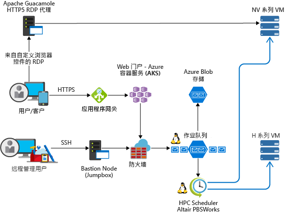

<!-- markdownlint-disable MD033 -->
<!-- markdownlint-disable MD026 -->

# Azure 上的高性能计算 (HPC)

## HPC 简介

<!-- markdownlint-disable MD034 -->

> [!VIDEO https://www.youtube.com/embed/rKURT32faJk]

<!-- markdownlint-enable MD034 -->

高性能计算 (HPC) 也称“大型计算”，使用大量基于 CPU 或 GPU 的计算机来解决复杂的数学任务。

许多行业使用 HPC 解决某些最困难的问题。  其中包括下述工作负荷：

- 基因组学
- 石油和天然气模拟
- 财务
- 半导体设计
- 工程
- 天气建模

### 云上的 HPC 有何不同？

本地和云中的 HPC 系统的一大区别是能否根据需要动态添加和删除资源。  动态缩放消除了计算容量这一瓶颈，允许客户根据作业要求调整其基础结构的大小。

以下文章更详细地介绍了此动态缩放功能。

- [大计算的体系结构样式](/azure/architecture/guide/architecture-styles/big-compute?context=/azure/architecture/topics/high-performance-computing/context/hpc-context)
- [有关自动缩放的最佳做法](/azure/architecture/best-practices/auto-scaling?context=/azure/architecture/topics/high-performance-computing/context/hpc-context)

## 实现清单

若要在 Azure 上实现自己的 HPC 解决方案，请确保参阅以下主题：

<!-- markdownlint-disable MD032 -->

> [!div class="checklist"]
> - 按要求选择相应的[体系结构](#infrastructure)
> - 了解适用于工作负荷的具体[计算](#compute)选项
> - 根据需求确定适当的[存储](#storage)解决方案
> - 确定如何[管理](#management)所有资源
> - 优化用于云的[应用程序](#hpc-applications)
> - [保护](#security)基础结构

<!-- markdownlint-enable MD032 -->

## 基础结构

有许多基础结构组件是构建 HPC 系统所必需的。  不管你选择如何管理 HPC 工作负荷，都需要使用计算、存储和网络基础组件。

### 示例 HPC 体系结构

可以通过许多不同的方式在 Azure 上设计和实现 HPC 体系结构。  HPC 应用程序可扩展到数千个计算核心，扩展本地群集或作为 100% 的云原生解决方案来运行。

以下方案概述了生成 HPC 解决方案的一些常见方式。

<ul class="columns is-multiline has-margin-left-none has-margin-bottom-none has-padding-top-medium">
    <li class="column is-one-third has-padding-top-small-mobile has-padding-bottom-small">
        <a class="is-undecorated is-full-height is-block"
            href="/azure/architecture/example-scenario/apps/hpc-saas?context=/azure/architecture/topics/high-performance-computing/context/hpc-context">
            <article class="card has-outline-hover is-relative is-fullheight">
                    <figure class="image has-margin-right-none has-margin-left-none has-margin-top-none has-margin-bottom-none">
                        
                    </figure>
                

                    

                        <h3 class="is-size-4 has-margin-top-none has-margin-bottom-none has-text-primary">Azure 上的计算机辅助工程服务</h3>
                    

                    

                        
为 Azure 上的计算机辅助工程 (CAE) 提供软件即服务 (SaaS) 平台。

                    

                

            </article>
        </a>
    </li>
    <li class="column is-one-third has-padding-top-small-mobile has-padding-bottom-small">
        <a class="is-undecorated is-full-height is-block"
            href="/azure/architecture/example-scenario/infrastructure/hpc-cfd?context=/azure/architecture/topics/high-performance-computing/context/hpc-context">
            <article class="card has-outline-hover is-relative is-fullheight">
                    <figure class="image has-margin-right-none has-margin-left-none has-margin-top-none has-margin-bottom-none">
                        
                    </figure>
                

                    

                        <h3 class="is-size-4 has-margin-top-none has-margin-bottom-none has-text-primary">Azure 上的计算流体动力学 (CFD) 模拟</h3>
                    

                    

                        
在 Azure 上执行计算流体动力学 (CFD) 模拟。

                    

                

            </article>
        </a>
    </li>
    <li class="column is-one-third has-padding-top-small-mobile has-padding-bottom-small">
        <a class="is-undecorated is-full-height is-block"
            href="/azure/architecture/example-scenario/infrastructure/video-rendering?context=/azure/architecture/topics/high-performance-computing/context/hpc-context">
            <article class="card has-outline-hover is-relative is-fullheight">
                    <figure class="image has-margin-right-none has-margin-left-none has-margin-top-none has-margin-bottom-none">
                        
                    </figure>
                

                    

                        <h3 class="is-size-4 has-margin-top-none has-margin-bottom-none has-text-primary">Azure 上的 3D 视频渲染</h3>
                    

                    

                        
使用 Azure Batch 服务在 Azure 中运行本机 HPC 工作负荷

                    

                

            </article>
        </a>
    </li>
</ul>

### 计算

Azure 提供一系列已针对 CPU 和 GPU 密集型工作负荷进行优化的虚拟机大小。

#### 基于 CPU 的虚拟机

- [Linux VM](/azure/virtual-machines/linux/sizes-hpc?context=/azure/architecture/topics/high-performance-computing/context/hpc-context)
- [Windows VM](/azure/virtual-machines/windows/sizes-hpc?context=/azure/architecture/topics/high-performance-computing/context/hpc-context) 的 VM
  
#### 支持 GPU 的虚拟机

N 系列的 VM 具备为计算密集型或图形密集型应用程序（包括人工智能 (AI) 学习和可视化）设计的 NVIDIA GPU。

- [Linux VM](/azure/virtual-machines/linux/sizes-gpu?context=/azure/architecture/topics/high-performance-computing/context/hpc-context)
- [Windows VM](/azure/virtual-machines/windows/sizes-gpu?context=/azure/architecture/topics/high-performance-computing/context/hpc-context)

### 存储

大规模的批处理和 HPC 工作负荷具有超过传统云文件系统功能的数据存储和访问需求。  可以通过许多解决方案来管理 Azure 上的 HPC 应用程序的速度和容量需求

- [Avere vFXT](https://azure.microsoft.com/services/storage/avere-vfxt/)：数据存储速度更快，访问更方便，适合在边缘设备上进行高性能计算
- [BeeGFS](https://azure.microsoft.com/resources/implement-glusterfs-on-azure/)
- [存储优化虚拟机](/azure/virtual-machines/windows/sizes-storage?context=/azure/architecture/topics/high-performance-computing/context/hpc-context)
- [Blob、表和队列存储](/azure/storage/storage-introduction?context=/azure/architecture/topics/high-performance-computing/context/hpc-context)
- [Azure SMB 文件存储](/azure/storage/files/storage-files-introduction?context=/azure/architecture/topics/high-performance-computing/context/hpc-context)
- [Intel Cloud Edition Lustre](https://azuremarketplace.microsoft.com/marketplace/apps/intel.intel-cloud-edition-gs)

若要详细了解 Azure 上的 Lustre、GlusterFS 和 BeeGFS 的比较结果，请参阅 [Parallel Files Systems on Azure eBook](https://blogs.msdn.microsoft.com/azurecat/2018/06/11/azurecat-ebook-parallel-virtual-file-systems-on-microsoft-azure/)（Azure 电子书上的并行文件系统）

### 网络

H16r、H16mr、A8、A9 VM 可以连接到高吞吐量后端 RDMA 网络。 此网络可以提高在 Microsoft MPI 或 Intel MPI 下运行的紧密耦合的并行应用程序的性能。

- [支持 RDMA 的实例](/azure/virtual-machines/windows/sizes-hpc?context=/azure/architecture/topics/high-performance-computing/context/hpc-context#rdma-capable-instances)
- [虚拟网络](/azure/virtual-network/virtual-networks-overview?context=/azure/architecture/topics/high-performance-computing/context/hpc-context)
- [ExpressRoute](/azure/expressroute/expressroute-introduction?context=/azure/architecture/topics/high-performance-computing/context/hpc-context)

## 管理

### DIY

在 Azure 上从头开头构建 HPC 系统可以为你带来极大的灵活性，但通常需要进行很密集的维护。  

1. 在 Azure 虚拟机或[虚拟机规模集](/azure/virtual-machine-scale-sets/overview?context=/azure/architecture/topics/high-performance-computing/context/hpc-context)中设置自己的群集环境。
2. 使用 Azure 资源管理器模板部署先进的[工作负荷管理器](#workload-managers)、基础结构和[应用程序](#hpc-applications)。
3. 选择包括 MPI 或 GPU 工作负荷专用硬件与网络连接的 HPC 和 GPU [VM 大小](#compute)。
4. 为 I/O 密集型工作负载添加[高性能存储](#storage)。

### 混合和云突发

若要将现有的本地 HPC 系统连接到 Azure，可以参考许多有用的资源。

首先，请参阅文档中的[将本地网络连接到 Azure 的选项](/azure/architecture/reference-architectures/hybrid-networking/?context=/azure/architecture/topics/high-performance-computing/context/hpc-context)一文。  可以在其中获取下述连接选项的相关信息：

<ul class="columns is-multiline has-margin-left-none has-margin-bottom-none has-padding-top-medium">
    <li class="column is-one-third has-padding-top-small-mobile has-padding-bottom-small">
        <a class="is-undecorated is-full-height is-block"
            href="/azure/architecture/reference-architectures/hybrid-networking/vpn?context=/azure/architecture/topics/high-performance-computing/context/hpc-context">
            <article class="card has-outline-hover is-relative is-fullheight">
                    <figure class="image has-margin-right-none has-margin-left-none has-margin-top-none has-margin-bottom-none">
                        
                    </figure>
                

                    

                        <h3 class="is-size-4 has-margin-top-none has-margin-bottom-none has-text-primary">使用 VPN 网关将本地网络连接到 Azure</h3>
                    

                    

                        
此参考体系结构演示如何使用站点到站点虚拟专用网络 (VPN) 将本地网络扩展到 Azure。

                    

                

            </article>
        </a>
    </li>
    <li class="column is-one-third has-padding-top-small-mobile has-padding-bottom-small">
        <a class="is-undecorated is-full-height is-block"
            href="/azure/architecture/reference-architectures/hybrid-networking/expressroute?context=/azure/architecture/topics/high-performance-computing/context/hpc-context">
            <article class="card has-outline-hover is-relative is-fullheight">
                    <figure class="image has-margin-right-none has-margin-left-none has-margin-top-none has-margin-bottom-none">
                        
                    </figure>
                

                    

                        <h3 class="is-size-4 has-margin-top-none has-margin-bottom-none has-text-primary">使用 ExpressRoute 将本地网络连接到 Azure</h3>
                    

                    

                        
ExpressRoute 连接通过第三方连接提供商使用私有的专用连接。 该专用连接将本地网络扩展到 Azure 中。

                    

                

            </article>
        </a>
    </li>
    <li class="column is-one-third has-padding-top-small-mobile has-padding-bottom-small">
        <a class="is-undecorated is-full-height is-block"
            href="/azure/architecture/reference-architectures/hybrid-networking/expressroute-vpn-failover?context=/azure/architecture/topics/high-performance-computing/context/hpc-context">
            <article class="card has-outline-hover is-relative is-fullheight">
                    <figure class="image has-margin-right-none has-margin-left-none has-margin-top-none has-margin-bottom-none">
                        
                    </figure>
                

                    

                        <h3 class="is-size-4 has-margin-top-none has-margin-bottom-none has-text-primary">使用 ExpressRoute 和 VPN 故障转移将本地网络连接到 Azure</h3>
                    

                    

                        
实施这样一个高度可用且安全的站点到站点网络体系结构：跨 Azure 虚拟网络，以及使用 ExpressRoute 和 VPN 网关故障转移建立连接的本地网络。

                    

                

            </article>
        </a>
    </li>
</ul>

安全地建立网络连接以后，即可通过现有[工作负荷管理器](#workload-managers)的突发功能根据需要使用云计算资源。

### 市场解决方案

[Azure 市场](https://azuremarketplace.microsoft.com/marketplace/)中提供许多工作负荷管理器。

- [RogueWave 的基于 CentOS 的 HPC](https://azuremarketplace.microsoft.com/marketplace/apps/RogueWave.CentOSbased73HPC?tab=Overview)
- [SUSE Linux Enterprise Server for HPC](https://azure.microsoft.com/marketplace/partners/suse/suselinuxenterpriseserver12optimizedforhighperformancecompute/)
- [TIBCO Grid Server Engine](https://azuremarketplace.microsoft.com/marketplace/apps/tibco-software.gridserverlinuxengine?tab=Overview)
- [适用于 Windows 和 Linux 的 Azure 数据科学 VM](/azure/machine-learning/data-science-virtual-machine/overview?context=/azure/architecture/topics/high-performance-computing/context/hpc-context)
- [D3View](https://azuremarketplace.microsoft.com/marketplace/apps/xfinityinc.d3view-v5?tab=Overview)
- [UberCloud](https://azure.microsoft.com/search/marketplace/?q=ubercloud)

### Azure 批处理

[Azure Batch](/azure/batch/batch-technical-overview?context=/azure/architecture/topics/high-performance-computing/context/hpc-context)是一个平台服务，适用于在云中有效运行大规模并行和高性能计算 (HPC) 应用程序。 Azure Batch 可以计划要在托管的虚拟机池上运行的计算密集型工作，并且可以自动缩放计算资源以符合作业的需求。

SaaS 提供商或开发商可以使用 Batch SDK 和工具将 HPC 应用程序或容器工作负荷与 Azure 集成，将数据暂存到 Azure，并生成作业执行管道。

### Azure CycleCloud

[Azure CycleCloud](/azure/cyclecloud/?context=/azure/architecture/topics/high-performance-computing/context/hpc-context) 提供的在 Azure 上使用任何计划程序（例如 Slurm、Grid Engine、HPC Pack、HTCondor、LSF、PBS Pro 或 Symphony）管理 HPC 工作负荷的方法是最简单的

CycleCloud 允许执行以下操作：

- 部署全部群集和其他资源，包括计划程序、计算 VM、存储、网络和缓存
- 协调作业、数据和云工作流
- 允许管理员完全控制运行作业的具体用户、位置和成本
- 通过高级策略和治理功能（例如成本控制、Active Directory 集成、监视和报告）自定义并优化群集
- 无需修改即可使用当前的作业计划程序和应用程序
- 利用内置的自动缩放和经过测试的引用体系结构处理广泛的 HPC 工作负荷和行业工作负荷

### 工作负荷管理器

下面是可在 Azure 基础结构中运行的群集和工作负荷管理器示例。 在 Azure VM 中创建独立的群集，或从本地群集迸发到 Azure VM。

- [Alces Flight Compute](https://azuremarketplace.microsoft.com/marketplace/apps/alces-flight-limited.alces-flight-compute-solo?tab=Overview)
- [TIBCO DataSynapse GridServer](https://azure.microsoft.com/blog/tibco-datasynapse-comes-to-the-azure-marketplace/)
- [Bright Cluster Manager](http://www.brightcomputing.com/technology-partners/microsoft)
- [IBM Spectrum Symphony 和 Symphony LSF](https://azure.microsoft.com/blog/ibm-and-microsoft-azure-support-spectrum-symphony-and-spectrum-lsf/)
- [PBS Pro](http://pbspro.org)
- [Altair](http://www.altair.com/)
- [Rescale](https://www.rescale.com/azure/)
- [Microsoft HPC Pack](https://technet.microsoft.com/library/mt744885.aspx)
  - [适用于 Windows 的 HPC Pack](/azure/virtual-machines/windows/hpcpack-cluster-options?context=/azure/architecture/topics/high-performance-computing/context/hpc-context)
  - [适用于 Linux 的 HPC Pack](/azure/virtual-machines/linux/hpcpack-cluster-options?context=/azure/architecture/topics/high-performance-computing/context/hpc-context)

#### 容器

也可使用容器来管理某些 HPC 工作负荷。  可以使用 Azure Kubernetes 服务 (AKS) 之类的服务在 Azure 中轻松地部署托管的 Kubernetes 群集。

- [Azure Kubernetes 服务 (AKS)](/azure/aks/intro-kubernetes?context=/azure/architecture/topics/high-performance-computing/context/hpc-context)
- [容器注册表](/azure/container-registry/container-registry-intro?context=/azure/architecture/topics/high-performance-computing/context/hpc-context)

## 成本管理

可以通过多种不同的方式管理 Azure 上的 HPC 成本。  确保已查看 [Azure 购买选项](https://azure.microsoft.com/pricing/purchase-options/)，找出最适合自己组织的方法。

[低优先级 VM](/azure/virtual-machine-scale-sets/virtual-machine-scale-sets-use-low-priority?context=/azure/architecture/topics/high-performance-computing/context/hpc-context) 可以利用未使用的容量，同时大幅降低成本。

## 安全

若要大致了解 Azure 上有关安全性的最佳做法，请参阅 [Azure 安全性文档](/azure/security/azure-security?context=/azure/architecture/topics/high-performance-computing/context/hpc-context)。  

除了[云突发](#hybrid-and-cloud-bursting)部分提供的网络配置，可能还需要实现一项中心辐射型配置，以便隔离计算资源：

<ul class="columns is-multiline has-margin-left-none has-margin-bottom-none has-padding-top-medium">
    <li class="column is-one-third has-padding-top-small-mobile has-padding-bottom-small">
        <a class="is-undecorated is-full-height is-block"
            href="/azure/architecture/reference-architectures/hybrid-networking/hub-spoke?context=/azure/architecture/topics/high-performance-computing/context/hpc-context">
            <article class="card has-outline-hover is-relative is-fullheight">
                    <figure class="image has-margin-right-none has-margin-left-none has-margin-top-none has-margin-bottom-none">
                        
                    </figure>
                

                    

                        <h3 class="is-size-4 has-margin-top-none has-margin-bottom-none has-text-primary">在 Azure 中实现中心辐射型网络拓扑</h3>
                    

                    

                        
中心是 Azure 中的一个虚拟网络 (VNet)，充当到本地网络的连接的中心点。 分支是与中心对等互连的 VNet，可用于隔离工作负荷。

                    

                

            </article>
        </a>
    </li>
    <li class="column is-one-third has-padding-top-small-mobile has-padding-bottom-small">
        <a class="is-undecorated is-full-height is-block"
            href="/azure/architecture/reference-architectures/hybrid-networking/shared-services?context=/azure/architecture/topics/high-performance-computing/context/hpc-context">
            <article class="card has-outline-hover is-relative is-fullheight">
                    <figure class="image has-margin-right-none has-margin-left-none has-margin-top-none has-margin-bottom-none">
                        
                    </figure>
                

                    

                        <h3 class="is-size-4 has-margin-top-none has-margin-bottom-none has-text-primary">在 Azure 中使用共享服务实现中心辐射型网络拓扑</h3>
                    

                    

                        
此参考体系结构在中心辐射型参考体系结构的基础上生成，在中心包括了可供所有分支使用的共享服务。

                    

                

            </article>
        </a>
    </li>
</ul>

## HPC 应用程序

在 Azure 中运行自定义 HPC 应用程序或商业 HPC 应用程序。 本部分中的几个示例已成为使用更多 VM 或计算核心高效进行缩放的基准。 请访问 [Azure 市场](https://azuremarketplace.microsoft.com/marketplace)获取随时可供部署的解决方案。

> [!NOTE]
> 请向商业应用程序的供应商咨询有关在云中运行的许可或其他限制。 并非所有供应商都提供即用即付许可。 可能需要云中有一个用于自己的解决方案的许可服务器，或连接到本地许可证服务器。

### 工程应用程序

- [Altair RADIOSS](https://azure.microsoft.com/blog/availability-of-altair-radioss-rdma-on-microsoft-azure/)
- [ANSYS CFD](https://azure.microsoft.com/blog/ansys-cfd-and-microsoft-azure-perform-the-best-hpc-scalability-in-the-cloud/)
- [MATLAB 分布式计算服务器](/azure/virtual-machines/windows/matlab-mdcs-cluster?context=/azure/architecture/topics/high-performance-computing/context/hpc-context)
- [StarCCM +](https://blogs.msdn.microsoft.com/azurecat/2017/07/07/run-star-ccm-in-an-azure-hpc-cluster/)
- [OpenFOAM](https://simulation.azure.com/casestudies/Team-182-ABB-UC-Final.pdf)

### 图形和渲染

- Azure Batch 上的 [Autodesk Maya、3ds Max 和 Arnold](/azure/batch/batch-rendering-service?context=/azure/architecture/topics/high-performance-computing/context/hpc-context)

### AI 和深度学习

- [Microsoft 认知工具包](/cognitive-toolkit/cntk-on-azure)
- [深度学习 VM](https://azuremarketplace.microsoft.com/marketplace/apps/microsoft-ads.dsvm-deep-learning)
- [用于深入学习的 Batch Shipyard 窍门](https://github.com/Azure/batch-shipyard/tree/master/recipes#deeplearning)

### MPI 提供程序

- [Microsoft MPI](/message-passing-interface/microsoft-mpi)

## 远程可视化

<ul class="columns is-multiline has-margin-left-none has-margin-bottom-none has-padding-top-medium">
    <li class="column is-one-third has-padding-top-small-mobile has-padding-bottom-small">
        <a class="is-undecorated is-full-height is-block"
            href="/azure/architecture/example-scenario/infrastructure/linux-vdi-citrix?context=/azure/architecture/topics/high-performance-computing/context/hpc-context">
            <article class="card has-outline-hover is-relative is-fullheight">
                    <figure class="image has-margin-right-none has-margin-left-none has-margin-top-none has-margin-bottom-none">
                        
                    </figure>
                

                    

                        <h3 class="is-size-4 has-margin-top-none has-margin-bottom-none has-text-primary">将 Citrix 用于 Linux 虚拟桌面</h3>
                    

                    

                        
在 Azure 上使用 Citrix 为 Linux 桌面构建 VDI 环境。

                    

                

            </article>
        </a>
    </li>
</ul>

## 性能基准测试

- [计算基准测试](/azure/virtual-machines/windows/compute-benchmark-scores?context=/azure/architecture/topics/high-performance-computing/context/hpc-context)

## 客户案例

许多客户在将 Azure 用于其 HPC 工作负荷时都很成功。  可以在下面找到多个这样的客户案例研究：

- [ANEO](https://customers.microsoft.com/story/it-provider-finds-highly-scalable-cloud-based-hpc-redu)
- [AXA Global P&C](https://customers.microsoft.com/story/axa-global-p-and-c)
- [Axioma](https://customers.microsoft.com/story/axioma-delivers-fintechs-first-born-in-the-cloud-multi-asset-class-enterprise-risk-solution)
- [d3View](https://customers.microsoft.com/story/big-data-solution-provider-adopts-new-cloud-gains-thou)
- [EFS](https://customers.microsoft.com/story/efs-professionalservices-azure)
- [Hymans Robertson](https://customers.microsoft.com/story/hymans-robertson)
- [MetLife](https://enterprise.microsoft.com/customer-story/industries/insurance/metlife/)
- [Microsoft Research](https://customers.microsoft.com/doclink/fast-lmm-and-windows-azure-put-genetics-research-on-fa)
- [Milliman](https://customers.microsoft.com/story/actuarial-firm-works-to-transform-insurance-industry-w)
- [Mitsubishi UFJ Securities International](https://customers.microsoft.com/story/powering-risk-compute-grids-in-the-cloud)
- [NeuroInitiative](https://customers.microsoft.com/story/neuroinitiative-health-provider-azure)
- [Schlumberger](https://azure.microsoft.com/blog/big-compute-for-large-engineering-simulations)
- [Towers Watson](https://customers.microsoft.com/story/insurance-tech-provider-delivers-disruptive-solutions)

## 其他重要信息

- 确保在尝试运行大规模工作负荷之前已提高 [vCPU 配额](/azure/virtual-machines/linux/quotas?context=/azure/architecture/topics/high-performance-computing/context/hpc-context)。

## 后续步骤

有关最新公告，请参阅：

- [Microsoft HPC 和 Batch 团队博客](http://blogs.technet.com/b/windowshpc/)
- 访问 [Azure 博客](https://azure.microsoft.com/blog/tag/hpc/)。

### Microsoft Batch 示例

这些教程将详细介绍如何在 Microsoft Batch 上运行应用程序

- [开始使用 Batch 进行开发](/azure/batch/quick-run-dotnet?context=/azure/architecture/topics/high-performance-computing/context/hpc-context)
- [使用 Azure Batch 代码示例](https://github.com/Azure/azure-batch-samples)
- [将低优先级 VM 与 Batch 配合使用](/azure/batch/batch-low-pri-vms?context=/azure/architecture/topics/high-performance-computing/context/hpc-context)
- [使用 Batch Shipyard 运行容器化的 HPC 工作负荷](https://github.com/Azure/batch-shipyard)
- [在 Batch 上运行并行 R 工作负荷](https://github.com/Azure/doAzureParallel)
- [在 Batch 上运行按需 Spark 作业](https://github.com/Azure/aztk)
- [使用 Batch 池中的计算密集型 VM](/azure/batch/batch-pool-compute-intensive-sizes?context=/azure/architecture/topics/high-performance-computing/context/hpc-context)